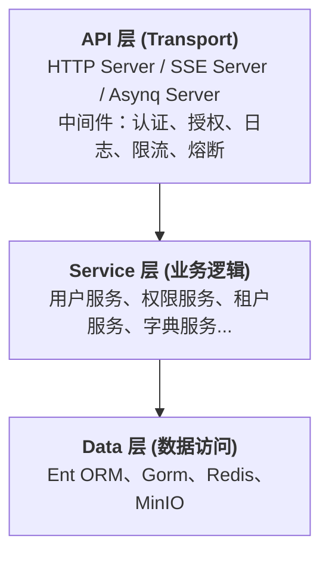

# 后端架构总览

GoWind Admin 后端采用 Go 语言开发，基于 [go-kratos](https://go-kratos.dev/) 微服务框架构建，融合 Ent ORM、Wire 依赖注入、Protobuf API 定义等现代化工程实践，提供高性能、易扩展的企业级后端服务。

## 一、技术栈概览

| 类别     | 技术                      | 说明                                  |
|--------|-------------------------|-------------------------------------|
| 语言     | Go 1.18+                | 高性能编译型语言，天然支持高并发                    |
| 微服务框架  | go-kratos v2            | 字节跳动开源的 Go 微服务框架，提供 HTTP/gRPC 双协议支持 |
| 依赖注入   | Wire                    | Google 出品的编译时依赖注入工具，消除运行时反射开销       |
| ORM    | Ent / Gorm              | Ent 用于核心业务实体（自动生成、类型安全），Gorm 用于辅助查询 |
| 数据库    | PostgreSQL（默认）/ MySQL   | 通过配置切换，Ent/Gorm 均支持多数据库适配           |
| 缓存     | Redis                   | 用于令牌缓存、会话管理、验证码存储等                  |
| 对象存储   | MinIO                   | S3 兼容的对象存储服务，用于文件上传管理               |
| API 定义 | Protobuf + Buf          | 标准化的接口定义语言，自动生成 Go/TypeScript 代码    |
| 任务调度   | Asynq                   | 基于 Redis 的分布式任务队列，支持定时任务和异步任务       |
| 实时推送   | SSE（Server-Sent Events） | 服务端向客户端推送实时消息                       |
| 权限控制   | Casbin / OPA / Zanzibar | 多种策略引擎可选，支持 RBAC、ABAC 等权限模型         |
| 容器化    | Docker + Docker Compose | 一键部署所有依赖服务及应用本身                     |

## 二、架构设计

### 1. 整体分层架构

后端服务遵循经典的 **三层架构** 设计：



- **API 层**：负责接收外部请求，通过 Protobuf 生成的 HTTP Handler 暴露 RESTful 接口。中间件层处理认证（JWT）、授权（Casbin/OPA）、API 审计日志等横切关注点。
- **Service 层**：核心业务逻辑的实现层，每个业务模块对应一个 Service，通过依赖注入获取 Data 层的 Repo 实例。
- **Data 层**：数据持久化与外部服务交互层，封装数据库操作（Ent/Gorm）、缓存操作（Redis）、文件存储（MinIO）等。

### 2. 服务组成

Admin 后端服务由三个 Transport Server 组成：

| 服务           | 端口       | 说明                       |
|--------------|----------|--------------------------|
| REST Server  | `:7788`  | 主要的 HTTP API 服务，处理所有业务请求 |
| SSE Server   | `:7789`  | 服务器推送服务，用于实时消息通知         |
| Asynq Server | 通过 Redis | 异步任务调度服务，处理定时任务和后台任务     |

### 3. 启动流程

后端服务的启动入口位于 `app/admin/service/cmd/server/main.go`，启动流程如下：

1. 创建应用上下文（`bootstrap.Context`），包含项目名、服务 ID、版本号
2. 通过 Wire 依赖注入（`wire.go` → `wire_gen.go`）自动组装所有依赖
3. 初始化 REST Server、SSE Server、Asynq Server
4. 注册所有业务 Service 的 HTTP Handler
5. 注册 Swagger UI（开发环境）
6. 初始化权限策略
7. 启动 Kratos 应用，开始监听请求

## 三、项目目录结构

```
backend/
├── api/                        # API 定义与代码生成
│   ├── protos/                 # Protobuf 原始定义文件
│   │   ├── admin/service/v1/   # Admin 服务接口定义
│   │   ├── audit/              # 审计相关定义
│   │   ├── authentication/     # 认证相关定义
│   │   ├── dict/               # 字典相关定义
│   │   ├── identity/           # 身份管理相关定义
│   │   ├── internal_message/   # 站内信相关定义
│   │   ├── permission/         # 权限相关定义
│   │   ├── storage/            # 存储相关定义
│   │   └── task/               # 任务调度相关定义
│   ├── gen/                    # 自动生成的代码
│   │   └── go/                 # 生成的 Go 代码
│   ├── buf.yaml                # Buf 配置
│   └── buf.gen.yaml            # 代码生成配置
│
├── app/                        # 应用服务代码
│   └── admin/service/          # Admin 核心服务
│       ├── cmd/server/         # 服务启动入口
│       │   ├── main.go         # 主程序入口
│       │   ├── wire.go         # Wire 依赖注入定义
│       │   ├── wire_gen.go     # Wire 自动生成的代码
│       │   └── assets/         # 静态资源（OpenAPI 文档等）
│       ├── configs/            # 配置文件
│       │   ├── server.yaml     # 服务器配置
│       │   ├── data.yaml       # 数据源配置
│       │   ├── auth.yaml       # 认证授权配置
│       │   ├── client.yaml     # 客户端配置
│       │   ├── oss.yaml        # 对象存储配置
│       │   └── logger.yaml     # 日志配置
│       └── internal/           # 内部实现（不对外暴露）
│           ├── data/           # 数据访问层（Repo 实现）
│           ├── server/         # 服务器与中间件配置
│           └── service/        # 业务逻辑层（Service 实现）
│
├── pkg/                        # 通用工具包
│   ├── authorizer/             # 权限控制引擎封装
│   ├── constants/              # 全局常量定义
│   ├── crypto/                 # 加密工具（AES-GCM）
│   ├── entgo/                  # Ent ORM 扩展
│   ├── eventbus/               # 事件总线
│   ├── jwt/                    # JWT 令牌载荷解析
│   ├── lua/                    # Lua 脚本引擎
│   │   ├── api/                # Lua API 模块
│   │   ├── hook/               # Lua 钩子机制
│   │   └── engine.go           # Lua 引擎核心
│   ├── middleware/             # 自定义中间件
│   │   ├── auth/               # 认证中间件
│   │   ├── ent/                # Ent 上下文中间件
│   │   └── logging/            # 审计日志中间件
│   ├── oss/                    # 对象存储客户端
│   ├── serviceid/              # 服务标识常量
│   ├── task/                   # 任务定义
│   └── utils/                  # 通用工具函数
│
├── scripts/                    # 构建/部署脚本
│   ├── docker/                 # Docker 部署脚本
│   ├── deploy/                 # 生产部署脚本
│   └── env/                    # 环境初始化脚本
│
├── sql/                        # 数据库初始化脚本
├── Makefile                    # 自动化构建指令
├── Dockerfile                  # Docker 镜像构建文件
├── docker-compose.yaml         # 全服务部署编排
└── docker-compose.libs.yaml    # 仅依赖服务编排
```

## 四、分层设计：Service 与 Data 的交互模式

GoWind Admin 的分层设计中，Service 层与 Data 层的耦合程度是架构的**关键胜负手**。框架根据模块复杂度，灵活采用三种交互模式，在「快速落地」与「企业级扩展」之间取得动态平衡。

### 1. 模式一：Service 直连 Data Repo（简单直接）

Data 层直接实现 Repo 结构体（无接口），Service 层直接导入 Data 包引用 Repo 实例：

```go
// Data 层：直接实现 Repo
package data

type DepartmentRepo struct {
    client *ent.Client
}

func (r *DepartmentRepo) GetByID(ctx context.Context, id uint32) (*ent.Department, error) {
    return r.client.Department.Query().Where(department.ID(id)).Only(ctx)
}
```

```go
// Service 层：直接依赖 Data 层的具体实现
package service

type DepartmentService struct {
    deptRepo *data.DepartmentRepo  // 直接依赖具体类型
}

func (s *DepartmentService) GetDepartmentInfo(ctx context.Context, id uint32) (*dto.DepartmentVO, error) {
    deptEnt, err := s.deptRepo.GetByID(ctx, id)  // 直接调用
    // ...业务逻辑处理 + 数据组装
}
```

**适用场景**：轻量模块（日志、配置、系统公告）、MVP 验证、1-3 人小团队

| 优点 | 缺点 |
|------|------|
| 开发效率极高，无需定义接口 | Service 与 Data 强耦合，替换 ORM 需改所有调用处 |
| 架构极简，新人上手门槛低 | 可测试性差，单元测试需依赖真实数据库 |
| 调试链路清晰 | 扩展性缺失，不支持多存储适配 |

### 2. 模式二：依赖倒置接口解耦（推荐）

由 Service 层定义 Repo 接口（明确「需要什么」），Data 层实现接口（明确「如何实现」），通过 Wire 依赖注入组装：

```go
// Service 层：定义抽象接口
package service

type DepartmentRepo interface {
    GetByID(ctx context.Context, id uint32) (*DepartmentEntity, error)
    ListByOrgID(ctx context.Context, orgID uint32) ([]*DepartmentEntity, error)
}

type DepartmentService struct {
    deptRepo DepartmentRepo  // 依赖抽象接口
}
```

```go
// Data 层：实现 Service 层定义的接口
package data

type DepartmentRepoImpl struct {
    entClient *ent.Client
    cache     *redis.Client
}

func NewDepartmentRepoImpl(entClient *ent.Client, cache *redis.Client) service.DepartmentRepo {
    return &DepartmentRepoImpl{entClient: entClient, cache: cache}
}

func (r *DepartmentRepoImpl) GetByID(ctx context.Context, id uint32) (*service.DepartmentEntity, error) {
    // 可自由组合 Ent + Redis 缓存，Service 层无感知
}
```

```go
// Wire 依赖注入：绑定接口与实现
var ServiceProviderSet = wire.NewSet(
    service.NewDepartmentService,
    data.NewDepartmentRepoImpl,  // 绑定
)
```

**适用场景**：用户管理、权限控制、多租户等核心模块，3-10 人团队

| 优点 | 缺点 |
|------|------|
| 彻底解耦，修改 Data 不影响 Service | 初期代码量增加 30%-50% |
| 可通过 Mock 工具实现单元测试 | 需理解依赖倒置和 Wire |
| 支持多存储适配（MySQL/PostgreSQL/Redis） | 调试链路变长 |

### 3. 模式三：新增 Biz 层（超大型项目）

对于跨聚合根、复杂状态流转、强事务一致性的场景，可引入 Biz 层形成四层架构：

```
API 层（协议处理） → Service 层（服务契约） → Biz 层（核心业务逻辑） → Data 层（数据访问）
```

```go
// Biz 层：核心业务编排
package biz

type UserBiz struct {
    userRepo    UserRepo
    roleRepo    RoleRepo
    messageRepo MessageRepo
}

func (b *UserBiz) CreateUserInTenant(ctx context.Context, tenantID uint32, req *CreateUserReq) (*User, error) {
    // 1. 校验用户名唯一
    // 2. 创建用户
    // 3. 分配角色（跨聚合）
    // 4. 发送欢迎消息（可降级）
}
```

**适用场景**：订单、支付等超复杂模块，10+ 人团队，具备领域建模意识

### 4. 分层决策指南

| 项目特征 | 推荐方案 | 典型模块 |
|---------|---------|---------|
| MVP / 单表 CRUD / 内部工具 | 模式一（直连） | 系统公告、日志、字典 |
| 多人协作 / 需单元测试 / 多存储 | 模式二（接口解耦） | 用户、权限、租户 |
| 跨聚合 / 状态机 / 强事务 | 模式三（Biz 层） | 订单、支付 |

> GoWind Admin 默认生成的模块多采用**模式一**（便于新手快速上手），而用户、租户、权限等核心模块已按**模式二**实现，可直接参考源码。

## 五、依赖注入（Wire）

项目使用 Google Wire 实现编译时依赖注入，通过 `ProviderSet` 将 Data、Service、Server 三层的依赖关系自动编排：

```go
// wire.go
func initApp(*bootstrap.Context) (*kratos.App, func(), error) {
    panic(wire.Build(
        serverProviders.ProviderSet,   // 服务器层
        serviceProviders.ProviderSet,  // 业务逻辑层
        dataProviders.ProviderSet,     // 数据访问层
        newApp,
    ))
}
```

## 六、代码生成驱动

通过 Protobuf + Buf 自动生成：
- Go HTTP Server/Client 代码
- TypeScript 前端请求代码
- OpenAPI v3 文档
- 错误码定义

## 七、多租户支持

后端内置多租户能力，支持两种用户-租户关系模型：
- **一对一**：一个用户只属于一个租户
- **一对多**：一个用户可以属于多个租户

通过 `constants.DefaultUserTenantRelationType` 配置切换。

## 八、相关文档

- [后端核心模块详解](./backend-modules.md)
- [后端 API 与 Protobuf 定义](./backend-api.md)
- [后端配置与部署](./backend-config-deploy.md)
- [后端扩展开发](./backend-extension.md)
