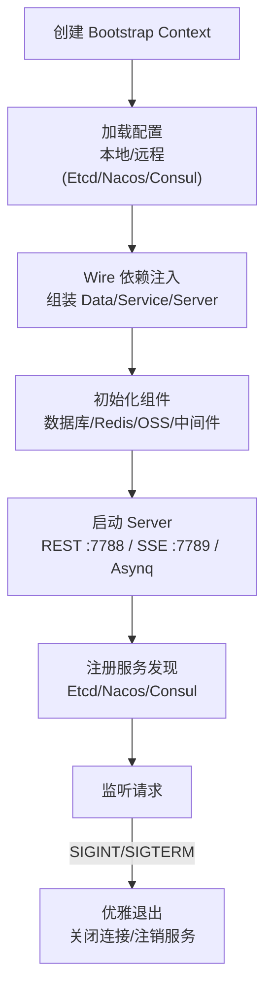

# 后端配置与部署

本文档详细说明 GoWind Admin 后端的所有配置项以及开发/生产环境的部署方式。

## 一、配置文件体系

后端配置文件位于 `app/admin/service/configs/` 目录，采用 YAML 格式，按功能域划分：

```
configs/
├── server.yaml     # 服务器配置（REST、Asynq、SSE）
├── data.yaml       # 数据源配置（数据库、Redis）
├── auth.yaml       # 认证与授权配置
├── client.yaml     # 客户端配置
├── oss.yaml        # 对象存储配置
└── logger.yaml     # 日志配置
```

### 1. 服务器配置（server.yaml）

```yaml
server:
  rest:
    addr: ":7788"               # REST API 监听地址
    timeout: 10s                # 请求超时时间
    enable_swagger: true        # 是否启用 Swagger UI
    enable_pprof: true          # 是否启用 pprof 性能分析
    cors:                       # 跨域配置
      headers:
        - "X-Requested-With"
        - "X-Request-ID"
        - "Content-Type"
        - "Authorization"
      methods:
        - "GET"
        - "POST"
        - "PUT"
        - "DELETE"
      origins:
        - "*"
    middleware:                  # 中间件开关
      enable_logging: true      # 请求日志
      enable_recovery: true     # 异常恢复
      enable_tracing: true      # 链路追踪
      enable_validate: true     # 参数校验
      enable_circuit_breaker: true  # 熔断器
      enable_metadata: true     # 元数据传递

  asynq:                        # Asynq 异步任务配置
    uri: "redis://:*Abcd123456@redis:6379/1"
    codec: "json"
    concurrency: 10             # 并发worker数量
    shutdown_timeout: 10s
    queues:                     # 队列优先级配置
      critical: 10
      default: 5
      low: 1

  sse:                          # SSE 推送服务配置
    addr: ":7789"
    codec: "json"
    path: "/events"
    auto_stream: true
    auto_reply: false
```

### 2. 数据源配置（data.yaml）

```yaml
data:
  database:
    driver: "postgres"          # 数据库驱动：postgres / mysql
    source: "host=postgres port=5432 user=postgres password=*Abcd123456 dbname=gwa sslmode=disable"
    # MySQL 配置示例：
    # driver: "mysql"
    # source: "root:*Abcd123456@tcp(localhost:3306)/gwa?parseTime=true&charset=utf8mb4&loc=Asia%2FShanghai"
    migrate: true               # 是否自动执行数据库迁移
    debug: false                # 是否启用 SQL 调试日志
    enable_trace: false         # 是否启用数据库链路追踪
    max_idle_connections: 25    # 最大空闲连接数
    max_open_connections: 25    # 最大打开连接数
    connection_max_lifetime: 300s  # 连接最大生命周期

  redis:
    addr: "redis:6379"
    password: "*Abcd123456"
    dial_timeout: 10s
    read_timeout: 0.4s
    write_timeout: 0.6s
```

### 3. 认证与授权配置（auth.yaml）

```yaml
authn:
  type: "jwt"                  # 认证方式：jwt / oidc / preshared_key
  jwt:
    method: "HS256"             # JWT 签名算法
    key: "some_api_key"         # JWT 签名密钥

authz:
  type: "noop"                  # 授权引擎：casbin / opa / zanzibar / noop
  casbin:                       # Casbin 配置（当 type=casbin 时生效）
  opa:                          # OPA 配置（当 type=opa 时生效）
  zanzibar:                     # Zanzibar 配置（当 type=zanzibar 时生效）
    type: "keto"                # keto / open_fga
    keto:
      write_url: "http://keto:4466"
      read_url: "http://keto:4466"
      use_grpc: true
```

### 4. 对象存储配置（oss.yaml）

```yaml
oss:
  minio:
    endpoint: "minio:9000"
    upload_host: "minio:9000"
    download_host: "minio:9000"
    access_key: "root"
    secret_key: "*Abcd123456"
    token: ""
    use_ssl: false
```

### 5. 日志配置（logger.yaml）

```yaml
logger:
  type: std                     # 日志类型：std / file / fluent / zap / logrus / aliyun / tencent
  zap:
    level: "debug"
    filename: "./logs/info.log"
    max_size: 1                 # 单个日志文件最大 MB
    max_age: 30                 # 日志保留天数
    max_backups: 5              # 最多保留文件数
```

## 二、启动流程

后端服务基于 `kratos-bootstrap` 框架启动，遵循标准化的生命周期：



### 1. 启动入口

```go
// cmd/server/main.go
func runApp() error {
    ctx := bootstrap.NewContext(
        context.Background(),
        &conf.AppInfo{
            Project: service.Project,
            AppId:   service.AdminService,
            Version: version,
        },
    )
    return bootstrap.RunApp(ctx, initApp)
}
```

### 2. 命令行参数

通过命令行参数覆盖配置，方便在不同环境切换：

| 参数名 | 缩写 | 默认值 | 说明 |
|--------|------|--------|------|
| `--conf` | `-c` | `../../configs` | 配置文件目录 |
| `--env` | `-e` | `dev` | 运行环境（dev/test/prod） |
| `--chost` | `-s` | `127.0.0.1:8500` | 远程配置中心地址 |
| `--ctype` | `-t` | `consul` | 配置中心类型（etcd/nacos/consul） |
| `--daemon` | `-d` | `false` | 是否以守护进程运行 |

```shell
# 生产环境启动，使用 Etcd 配置中心
go run main.go -e prod -c ./configs/prod -t etcd -s 192.168.1.100:2379
```

### 3. 配置优先级

配置按以下优先级加载（高优先级覆盖低优先级）：

```
远程配置中心 > 命令行参数 > 环境变量 > 本地配置文件
```

### 4. 远程配置中心

支持 Etcd / Nacos / Consul / Apollo / Polaris 等配置中心，通过「导入即启用」方式激活：

```go
import (
    _ "github.com/tx7do/kratos-bootstrap/config/etcd"  // 启用 Etcd
)
```

配置示例：

```yaml
config:
  type: "etcd"
  etcd:
    endpoints: ["127.0.0.1:2379"]
    path: "/go-wind-admin/configs"
```

## 三、环境变量

项目根目录的 `.env` 文件用于配置 Makefile 和脚本使用的环境变量。

## 四、Docker 部署

### 1. Docker Compose 编排

项目提供两个 Docker Compose 文件：

| 文件                         | 说明               |
|----------------------------|------------------|
| `docker-compose.yaml`      | 完整部署（中间件 + 应用服务） |
| `docker-compose.libs.yaml` | 仅部署中间件依赖         |

### 2. 中间件服务

| 服务         | 镜像                                | 端口        | 说明    |
|------------|-----------------------------------|-----------|-------|
| PostgreSQL | `bitnami/postgresql:latest`       | 5432      | 主数据库  |
| MySQL（可选）  | `mariadb:latest`                  | 3306      | 备选数据库 |
| Redis      | `bitnami/redis:latest`            | 6379      | 缓存/队列 |
| MinIO      | `minio/minio:latest`              | 9000/9001 | 对象存储  |
| Jaeger（可选） | `jaegertracing/all-in-one:latest` | 16686     | 链路追踪  |

### 3. 部署脚本

所有部署脚本位于 `scripts/` 目录：

#### 环境初始化脚本

| 脚本                                    | 说明                 |
|---------------------------------------|--------------------|
| `scripts/env/install_unix_dev.sh`     | Linux/macOS 开发环境安装 |
| `scripts/env/install_unix_prod.sh`    | Linux/macOS 生产环境安装 |
| `scripts/env/install_windows_dev.ps1` | Windows 开发环境安装     |

#### Docker 部署脚本

| 脚本                               | 说明                     |
|----------------------------------|------------------------|
| `scripts/docker/full_deploy.sh`  | 完整 Docker 部署（中间件 + 应用） |
| `scripts/docker/full_deploy.ps1` | 完整 Docker 部署（Windows）  |
| `scripts/docker/libs_only.sh`    | 仅启动中间件依赖（推荐开发使用）       |
| `scripts/docker/libs_only.ps1`   | 仅启动中间件依赖（Windows）      |

#### 生产部署脚本

| 脚本                              | 说明         |
|---------------------------------|------------|
| `scripts/deploy/pm2_service.sh` | PM2 进程管理部署 |

## 五、开发环境部署

### 方式一：仅启动中间件（推荐）

适合日常开发调试，应用在本地 IDE 运行：

```shell
# Linux / macOS
./scripts/docker/libs_only.sh
gow run admin

# Windows（PowerShell 管理员）
.\scripts\docker\libs_only.ps1
gow run admin
```

### 方式二：完整 Docker 启动

适合快速体验或 CI 环境：

```shell
# Linux / macOS
./scripts/docker/full_deploy.sh

# Windows
.\scripts\docker\full_deploy.ps1
```

## 六、生产环境部署

### 方式一：全 Docker 部署

所有服务（中间件 + 应用）运行在 Docker 容器中：

```shell
./scripts/docker/full_deploy.sh
```

### 方式二：混合部署

中间件运行在 Docker，应用运行在宿主机（通过 PM2 管理）：

```shell
# 启动中间件
./scripts/docker/libs_only.sh

# 使用 PM2 托管应用
./scripts/deploy/pm2_service.sh
```

### 方式三：手动构建部署

```shell
# 构建
make build

# 输出二进制文件位于 app/admin/service/ 目录下
# 将二进制文件和 configs/ 目录一起部署到服务器
```

## 七、Makefile 命令详解

GoWind Admin 采用「根目录 Makefile + app.mk + 服务目录 Makefile」的分层设计：

```
backend/
├── Makefile              # 全局命令（init/build/gen/docker...）
├── app.mk                # 单服务命令模板（run/api/ent/wire...）
└── app/admin/service/
    └── Makefile           # include ../../../app.mk
```

### 1. 全局命令（根目录）

| 命令 | 说明 | 适用场景 |
|------|------|----------|
| `make init` | 安装 Protobuf 插件 + CLI 工具 | 首次拉取项目 |
| `make gen` | 批量生成所有服务代码（Ent + Wire + API） | 全量更新 |
| `make build` | 构建所有服务可执行文件 | 打包部署 |
| `make docker` | 为所有服务构建 Docker 镜像 | 容器化部署 |
| `make test` | 运行所有单元测试 | 提交前验证 |
| `make lint` | golangci-lint 代码检查 | 代码规范 |
| `make docker-up` | 启动所有服务+中间件 | 全 Docker 部署 |
| `make docker-libs` | 仅启动中间件 | 日常开发 |
| `make docker-down` | 停止所有 Docker 服务 | 清理环境 |
| `make pm2-deploy` | PM2 部署微服务 | 混合部署 |

### 2. 服务级命令（app/admin/service/ 目录）

| 命令 | 说明 | 适用场景 |
|------|------|----------|
| `make run` | 启动当前服务（本地调试） | 开发调试 |
| `make api` | 生成当前服务 Go API 代码 | 接口变更后 |
| `make ent` | 生成当前服务 Ent ORM 代码 | 表结构变更后 |
| `make wire` | 生成当前服务依赖注入代码 | 依赖关系变更后 |
| `make openapi` | 生成当前服务 OpenAPI 文档 | 更新接口文档 |
| `make ts` | 生成当前服务 TypeScript 代码 | 前后端同步 |
| `make build` | 构建当前服务可执行文件 | 单服务部署 |

### 3. 实战场景

```shell
# 场景1：首次初始化并启动
make init && make docker-libs && make gen
make run

# 场景2：修改 API 后更新
cd app/admin/service
make api && make openapi && make run

# 场景3：构建 Docker 镜像并部署
cd ../..
make gen && make docker && make docker-up
```

## 八、Hosts 配置

在本地开发时，由于 Docker 容器之间通过服务名通信，需要在宿主机的 hosts 文件中添加域名映射：

```ini
# Linux/MacOS: /etc/hosts
# Windows: C:\Windows\System32\drivers\etc\hosts
127.0.0.1 postgres
127.0.0.1 redis
127.0.0.1 minio
```

## 九、Dockerfile 说明

后端 Dockerfile 支持多阶段构建：

```dockerfile
# 通过构建参数指定服务名称
ARG SERVICE_NAME=admin
ARG APP_VERSION=1.0.0
```

构建镜像：

```shell
docker build --build-arg SERVICE_NAME=admin --build-arg APP_VERSION=1.0.0 -t go-wind-admin/admin-service .
```

## 十、数据库初始化

数据库初始化脚本位于 `sql/` 目录。

当 `data.yaml` 中 `migrate: true` 时，Ent 会自动执行数据库迁移（创建表结构）。如需手动初始化，可执行 SQL 脚本。

## 十一、相关文档

- [后端架构总览](./backend-architecture.md)
- [后端核心模块详解](./backend-modules.md)
- [后端 API 与 Protobuf 定义](./backend-api.md)
- [后端扩展开发](./backend-extension.md)
