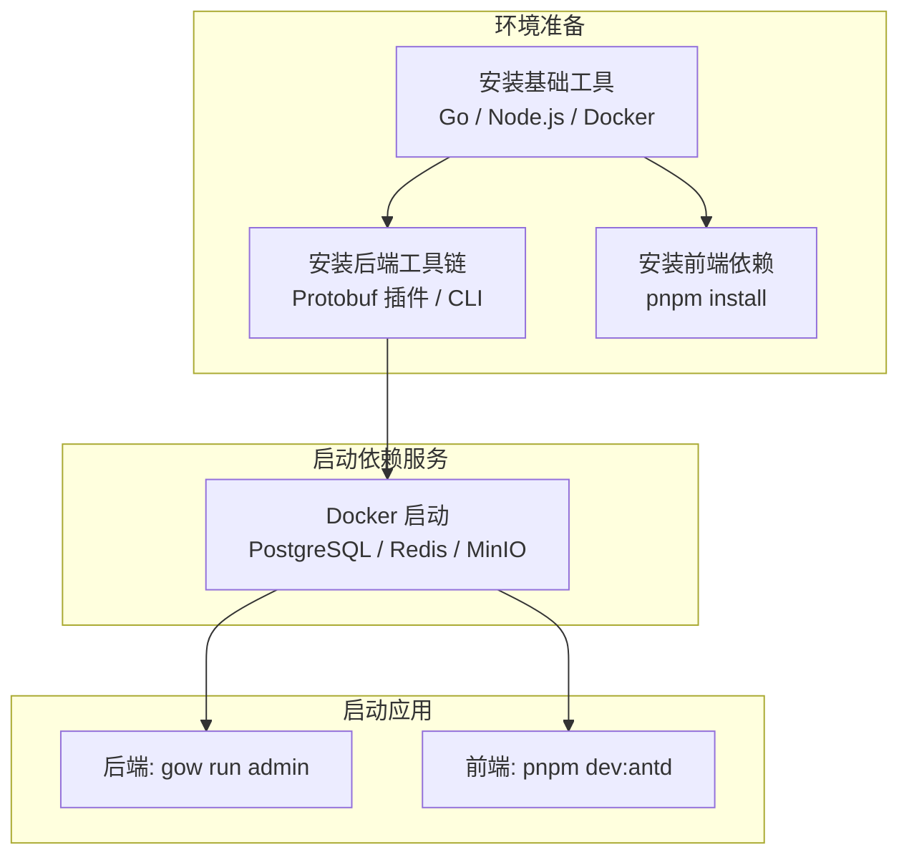
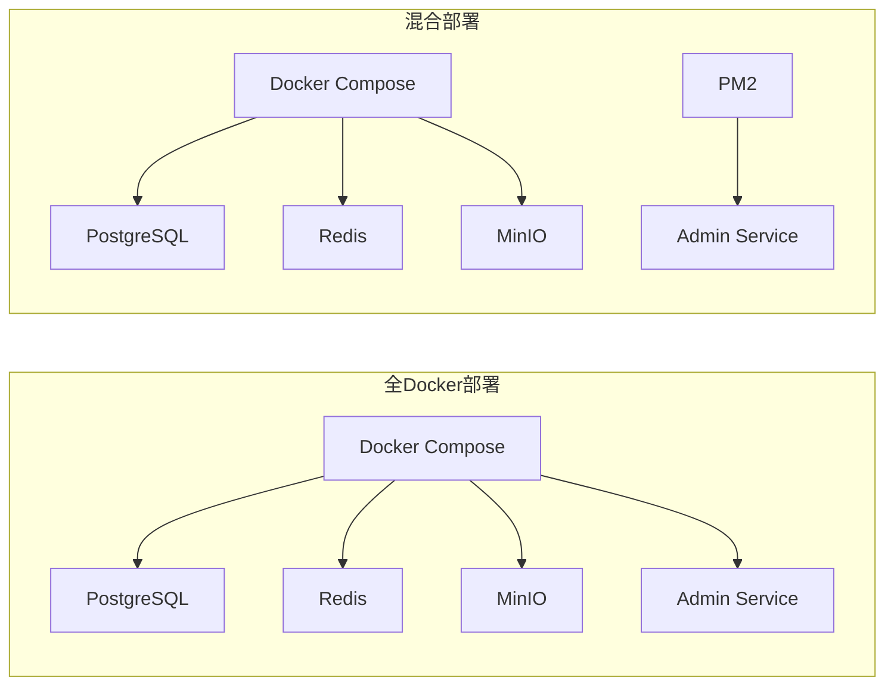

# GoWind Admin 安装指南

本文档详细介绍 GoWind Admin 的完整安装流程，涵盖开发环境（本地调试）和生产环境（线上部署）两种场景，支持 Windows / macOS / Linux 主流操作系统。



## 一、环境准备

### 1. 基础依赖说明

| 环境类型 | 核心依赖                     | 最低版本                | 用途说明         |
|------|--------------------------|---------------------|--------------|
| 后端   | Go、Docker、Docker Compose | Go 1.22+            | 微服务编译、依赖服务管理 |
| 后端   | Buf、Protoc、Make          |                     | API 代码生成、构建  |
| 前端   | Node.js、pnpm             | Node.js 16+、pnpm 8+ | 前端工程构建、依赖安装  |

### 2. 项目目录结构

```
go-wind-admin/
├── backend/                    # 后端项目
│   ├── scripts/                # 自动化脚本
│   │   ├── env/                # 环境安装脚本
│   │   ├── docker/             # Docker 部署脚本
│   │   └── deploy/             # PM2 部署脚本
│   ├── app/admin/service/      # Admin 服务
│   ├── api/                    # Protobuf API 定义
│   ├── sql/                    # 数据库初始化脚本
│   ├── docker-compose.yaml     # 全量部署（应用 + 依赖）
│   ├── docker-compose.libs.yaml # 仅依赖服务
│   ├── Makefile                # 后端构建命令
│   └── Dockerfile              # Docker 镜像构建
└── frontend/admin/             # 前端项目
    ├── vue-vben/               # Vue Vben 版（Ant Design Vue）
    ├── vue-element/            # Vue Element 版（Element Plus）
    └── react/                  # React 版（Ant Design）
```

## 二、开发环境安装（本地调试）

### 2.1 后端开发环境

#### 方式一：自动安装脚本（推荐）

项目提供了自动化的环境安装脚本，自动检测操作系统并安装所需工具。

##### Windows

```powershell
# 以管理员身份运行 PowerShell
cd go-wind-admin/backend

# 执行开发环境安装脚本
powershell -ExecutionPolicy Bypass -File scripts/env/install_windows_dev.ps1
```

脚本会自动完成以下工作：
- 安装 [Scoop](https://scoop.sh/) 包管理器（如未安装）
- 通过 Scoop 安装 Git、Go、Make、Node.js 等基础工具
- 安装 Docker Desktop
- 配置 Go 环境变量（`GOPROXY` 等）
- 安装 Protobuf 插件和 CLI 工具
- 配置 hosts 文件

##### macOS / Linux

```shell
cd go-wind-admin/backend

# macOS / Ubuntu / CentOS / Rocky 均可使用
bash scripts/env/install_unix_dev.sh
```

脚本会自动完成以下工作：
- 检测操作系统和包管理器（brew / apt / yum / dnf）
- 安装基础工具（Git、curl、jq 等）
- 安装 Docker
- 安装 Go 运行时
- 配置 Go 环境变量（`GOPROXY=https://goproxy.io,direct`）
- 安装 Protobuf 插件和 CLI 工具
- 安装 protoc 编译器

#### 方式二：手动安装

如果希望自行控制安装过程，可以按以下步骤操作。

##### 步骤 1：安装基础工具

**Windows（Scoop）**

```powershell
# 安装 Scoop
Set-ExecutionPolicy RemoteSigned -Scope CurrentUser
irm get.scoop.sh | iex

# 安装工具
scoop bucket add extras
scoop install git go make nodejs
```

**macOS（Homebrew）**

```shell
brew install git go protobuf make node
```

**Ubuntu / Debian**

```shell
sudo apt-get update
sudo apt-get install -y git make protobuf-compiler
curl -fsSL https://deb.nodesource.com/setup_22.x | sudo bash -
sudo apt-get install -y nodejs
```

**CentOS / Rocky**

```shell
sudo dnf install -y git make protobuf-compiler
```

##### 步骤 2：安装 Docker

请参考 [Docker 官方文档](https://docs.docker.com/get-docker/) 安装 Docker Desktop（Windows/macOS）或 Docker Engine（Linux）。

##### 步骤 3：安装 Protobuf 插件

后端依赖 Protobuf 相关插件生成 API 代码，可手动安装或通过 Makefile 一键安装：

```shell
cd go-wind-admin/backend

# 手动安装
go install google.golang.org/protobuf/cmd/protoc-gen-go@latest
go install google.golang.org/grpc/cmd/protoc-gen-go-grpc@latest
go install github.com/go-kratos/kratos/cmd/protoc-gen-go-http/v2@latest
go install github.com/go-kratos/kratos/cmd/protoc-gen-go-errors/v2@latest
go install github.com/google/gnostic/cmd/protoc-gen-openapi@latest
go install github.com/envoyproxy/protoc-gen-validate@latest
go install github.com/menta2k/protoc-gen-redact/v3@latest
go install github.com/go-kratos/protoc-gen-typescript-http@latest

# 一键安装（推荐）
make plugin
```

##### 步骤 4：安装 CLI 工具

```shell
cd go-wind-admin/backend

# 手动安装
go install github.com/go-kratos/kratos/cmd/kratos/v2@latest
go install github.com/google/gnostic@latest
go install github.com/bufbuild/buf/cmd/buf@latest
go install entgo.io/ent/cmd/ent@latest
go install github.com/golangci/golangci-lint/v2/cmd/golangci-lint@latest
go install github.com/tx7do/go-wind-toolkit/gowind/cmd/gow@latest

# 一键安装（推荐）
make cli
```

##### 步骤 5：配置 Go 代理（国内用户）

```shell
go env -w GOPROXY=https://goproxy.io,direct
go env -w GO111MODULE=on
```

#### 初始化项目

首次开发前，需安装依赖并初始化工具：

```shell
cd go-wind-admin/backend

# 安装 Go 依赖
go mod download

# 一键初始化（安装插件 + CLI 工具）
make init
```

### 2.2 前端开发环境

GoWind Admin 提供三套前端实现，均位于 `frontend/admin/` 目录下：

| 前端版本 | 目录 | UI 框架 | 开发端口 |
|------|------|------|------|
| Vue Vben | `vue-vben/` | Ant Design Vue | 5666 |
| Vue Element | `vue-element/` | Element Plus | 3000 |
| React | `react/` | Ant Design | 7000 |

#### 步骤 1：安装 pnpm

```shell
# 通过 npm 安装
npm install -g pnpm

# 或通过 corepack（Node.js 16.13+）
corepack enable
corepack prepare pnpm@latest --activate
```

#### 步骤 2：切换国内镜像源（可选）

```shell
# 使用 nrm 管理源
npm install -g nrm
nrm use taobao

# 或直接修改 pnpm 源
pnpm config set registry https://registry.npmmirror.com
```

#### 步骤 3：安装前端依赖

```shell
cd go-wind-admin/frontend/admin

# Vue Vben 版本（Monorepo，含多个子包）
cd vue-vben
pnpm install

# Vue Element 版本
cd ../vue-element
pnpm install

# React 版本
cd ../react
pnpm install
```

### 2.3 启动依赖服务

后端依赖 PostgreSQL、Redis、MinIO 等中间件服务，通过 Docker Compose 启动。

#### 方式一：使用项目脚本（推荐）

```shell
cd go-wind-admin/backend

# Windows
make docker-libs
# 或直接执行脚本
powershell -ExecutionPolicy Bypass -File scripts/docker/libs_only.ps1

# macOS / Linux
make docker-libs
# 或直接执行脚本
bash scripts/docker/libs_only.sh
```

#### 方式二：手动 Docker Compose

```shell
cd go-wind-admin/backend

docker compose -f docker-compose.libs.yaml up -d
```

启动的服务：

| 服务 | 端口 | 说明 |
|------|------|------|
| PostgreSQL | 5432 | 主数据库（默认库名：`gwa`） |
| Redis | 6379 | 缓存 / 消息队列 |
| MinIO | 9000 / 9001 | 对象存储（API 端口 9000，控制台 9001） |

> **注意**：数据库密码等配置见 `docker-compose.libs.yaml`，生产环境请务必修改默认密码。

#### 配置 hosts

开发环境需要配置 hosts 以解析服务域名：

```ini
# Linux/macOS: /etc/hosts
# Windows: C:\Windows\System32\drivers\etc\hosts
127.0.0.1 postgres
127.0.0.1 redis
127.0.0.1 minio
```

> 自动安装脚本会自动配置 hosts。Windows 脚本需以管理员身份运行，Linux/macOS 脚本需设置 `AUTO_INIT_HOSTS=true`。

### 2.4 启动开发服务

#### 后端启动

```shell
cd go-wind-admin/backend

# 使用 gow CLI 启动（推荐）
gow run admin

# 或使用 Make
make run
# 等效于
cd app/admin/service
make run
```

#### 前端启动

```shell
cd go-wind-admin/frontend/admin

# Vue Vben 版本（Ant Design Vue）
cd vue-vben
pnpm dev:antd

# Vue Element 版本
cd ../vue-element
pnpm dev

# React 版本
cd ../react
pnpm dev
```

#### 验证访问

| 服务 | 地址 |
|------|------|
| Vue Vben 前端 | <http://localhost:5666> |
| Vue Element 前端 | <http://localhost:3000> |
| React 前端 | <http://localhost:7000> |
| 后端 REST API | <http://localhost:7788> |
| 后端 Swagger 文档 | <http://localhost:7788/docs/> |
| 后端 SSE 服务 | <http://localhost:7789/events> |
| MinIO 控制台 | <http://localhost:9001> |

## 三、生产环境部署

### 3.1 环境准备

#### 方式一：自动安装脚本（推荐）

```shell
cd go-wind-admin/backend

# macOS / Linux（自动检测系统并安装 Docker / Node.js / PM2 / Go）
bash scripts/env/install_unix_prod.sh
```

脚本会自动完成以下工作：
- 检测操作系统并使用对应包管理器
- 安装基础工具（Git、curl、jq 等）
- 安装 Node.js 和 PM2
- 安装 Docker 和 Docker Compose
- 安装 Go 运行时
- 清理包管理器缓存

> Windows 生产环境建议使用 Docker 部署方式，无需手动安装 Go 运行时。

#### 方式二：手动准备

确保服务器已安装：
- Docker + Docker Compose（全 Docker 部署）
- 或 Go + PM2（混合部署）

#### 配置 hosts

```ini
# Linux/macOS: /etc/hosts
# Windows: C:\Windows\System32\drivers\etc\hosts
127.0.0.1 postgres
127.0.0.1 redis
127.0.0.1 minio
127.0.0.1 jaeger
```

### 3.2 部署方式

GoWind Admin 提供两种生产部署方式：



#### 方式一：全 Docker 部署（推荐）

三方中间件和微服务均运行在 Docker 容器中：

```shell
cd go-wind-admin/backend

# Windows
make docker-up
# 或
powershell -ExecutionPolicy Bypass -File scripts/docker/full_deploy.ps1

# macOS / Linux
make docker-up
# 或
bash scripts/docker/full_deploy.sh
```

该命令会启动以下服务（定义在 `docker-compose.yaml`）：

| 服务 | 镜像 | 端口 |
|------|------|------|
| PostgreSQL | `bitnami/postgresql:latest` | 5432 |
| Redis | `bitnami/redis:latest` | 6379 |
| MinIO | `minio/minio:latest` | 9000 / 9001 |
| Admin Service | 本地构建 | 7788 / 7789 |

> Admin Service 镜像通过项目根目录的 `Dockerfile` 自动构建，采用多阶段构建（Go 编译 + Alpine 运行时）。

#### 方式二：混合部署

三方中间件运行在 Docker，微服务通过 PM2 管理运行在宿主机：

```shell
cd go-wind-admin/backend

# 步骤 1：仅启动 Docker 依赖中间件
# Windows
make docker-libs
# macOS / Linux
make docker-libs

# 步骤 2：构建并安装微服务到宿主机
# 需要先确保 PM2 已安装：npm install -g pm2
bash scripts/deploy/pm2_service.sh
```

PM2 部署脚本会自动：
1. 执行 `make build_only` 编译 Go 二进制文件
2. 将二进制和配置文件安装到 `~/app/go-wind-admin/` 目录
3. 通过 PM2 注册并启动服务

管理命令：

```shell
# 查看服务状态
pm2 list

# 查看日志
pm2 logs go-wind-admin-admin

# 重启服务
pm2 restart go-wind-admin-admin

# 停止服务
pm2 stop go-wind-admin-admin
```

### 3.3 前端生产部署

#### 方式一：Docker 镜像部署（Vue Vben 版）

```shell
cd go-wind-admin/frontend/admin/vue-vben/scripts/deploy

# 构建镜像
bash build-local-docker-image.sh

# 启动容器
docker run -d -p 8010:8080 --name vben-admin-local vben-admin-local
```

访问 <http://服务器IP:8010>。

#### 方式二：静态资源部署

```shell
cd go-wind-admin/frontend/admin

# Vue Vben 版本
cd vue-vben
pnpm build:antd

# Vue Element 版本
cd ../vue-element
pnpm build

# React 版本
cd ../react
pnpm build
```

构建产物在各自项目的 `dist/` 目录，部署到 Nginx / Apache 等 Web 服务器即可。

#### Nginx 配置示例

```nginx
server {
    listen 80;
    server_name admin.example.com;

    root /usr/share/nginx/html;
    index index.html;

    location / {
        try_files $uri $uri/ /index.html;
    }

    # API 反向代理
    location /api/ {
        proxy_pass http://127.0.0.1:7788/;
        proxy_set_header Host $host;
        proxy_set_header X-Real-IP $remote_addr;
    }
}
```

## 四、数据库初始化

项目提供 PostgreSQL 和 MySQL 的初始化脚本，位于 `backend/sql/` 目录：

| 文件 | 说明 |
|------|------|
| `postgresql-default-data.sql` | PostgreSQL 基础数据 |
| `postgresql-demo-data.sql` | PostgreSQL 演示数据 |
| `mysql-default-data.sql` | MySQL 基础数据 |
| `mysql-demo-data.sql` | MySQL 演示数据 |

> 当配置文件中 `data.database.migrate` 设置为 `true` 时，服务启动时会自动执行数据库迁移（Ent Auto Migration）。如需手动导入初始数据，可执行对应 SQL 文件。

## 五、常用 Makefile 命令

| 命令 | 说明 |
|------|------|
| `make init` | 初始化开发环境（安装插件 + CLI 工具） |
| `make plugin` | 安装 Protobuf 编译器插件 |
| `make cli` | 安装 CLI 脚手架工具 |
| `make dep` | 下载 Go 模块依赖 |
| `make gen` | 生成所有代码（Ent + Wire + API + OpenAPI） |
| `make build` | 编译所有服务 |
| `make api` | 生成 Protobuf Go 代码 |
| `make openapi` | 生成 OpenAPI 文档 |
| `make ts` | 生成 TypeScript 客户端代码 |
| `make docker-up` | Docker Compose 全量启动 |
| `make docker-libs` | Docker Compose 仅启动依赖 |
| `make docker-down` | 停止所有 Docker 服务 |
| `make install-dev` | Unix/macOS 开发环境安装 |
| `make install-prod` | Unix/macOS 生产环境安装 |
| `make pm2-deploy` | PM2 部署微服务 |
| `make lint` | 运行代码检查 |
| `make test` | 运行测试 |

## 六、常见问题

### Q1: 脚本执行权限不足（Linux/macOS）

```shell
chmod +x scripts/**/*.sh
```

### Q2: Docker Compose 命令不存在

确保已安装 Docker Compose V2（作为 Docker CLI 插件）或独立的 `docker-compose` 命令。项目脚本会自动检测两种方式。

### Q3: 前端依赖安装缓慢或失败

1. 切换国内镜像源（参考 [2.2 步骤 2](#_2-2-前端开发环境)）
2. 清除缓存重新安装：`pnpm store prune && pnpm install`

### Q4: Go 模块下载失败

配置 Go 代理：

```shell
go env -w GOPROXY=https://goproxy.io,direct
go env -w GOSUMDB=off
```

### Q5: 端口被占用

修改各服务的配置文件：

- 后端 HTTP 端口：`backend/app/admin/service/configs/server.yaml` → `server.rest.addr`
- 后端 SSE 端口：同文件 → `server.sse.addr`
- 前端端口：各前端项目的 `.env.development` 文件
- Docker 端口：`docker-compose.yaml` 或 `docker-compose.libs.yaml` 中的 `ports` 配置

### Q6: 数据库连接失败

1. 确认 Docker 中的 PostgreSQL 已启动：`docker ps | grep postgres`
2. 确认 hosts 已配置 `127.0.0.1 postgres`
3. 检查数据库连接配置：`backend/app/admin/service/configs/data.yaml`
4. 默认密码为 `*Abcd123456`，生产环境请务必修改

## 七、相关文档

- [项目介绍](./intro.md)
- [后端架构设计](./backend-architecture.md)
- [后端配置与部署](./backend-config-deploy.md)
