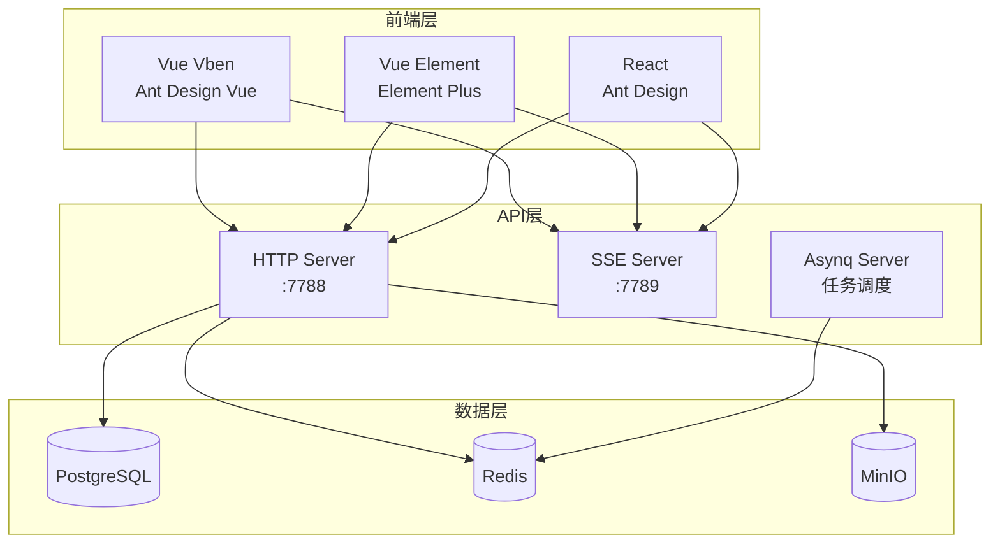
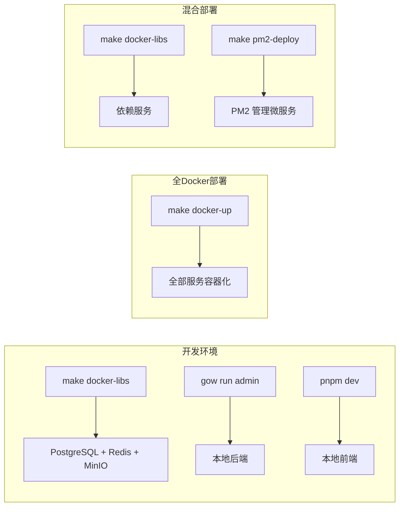

# GoWind Admin 产品介绍

GoWind Admin 是一套面向中大型项目的企业级中后台解决方案，基于 Go 微服务生态（Kratos）与多套现代前端框架构建，提供开箱即用的后台管理能力、完善的多租户权限体系、丰富的组件库及可扩展的插件机制，旨在降低中后台系统的开发成本，提升交付效率。

## 一、核心特性

### 1. 技术栈

| 维度   | 核心技术                                                                | 优势说明                             |
|------|---------------------------------------------------------------------|----------------------------------|
| 后端   | Go、Kratos 微服务框架、Ent ORM、Protobuf + Buf                              | 高性能微服务架构，标准化 API 定义与代码生成，适配云原生部署 |
| 前端   | Vue3 + Ant Design Vue (Vben)、Vue3 + Element Plus、React + Ant Design | 三套前端实现，覆盖主流 UI 框架，支持主题定制、响应式布局   |
| 存储   | PostgreSQL / MySQL、Redis、MinIO                                      | 关系型数据库 + 缓存 + 对象存储，完整的存储方案       |
| 任务调度 | Asynq                                                               | 基于 Redis 的分布式任务队列，支持定时/延迟/异步任务   |
| 权限   | Casbin + OPA、JWT 认证                                                 | 双引擎权限校验，细粒度角色权限控制，多租户数据隔离        |
| 工程化  | Makefile、Docker Compose、Buf 代码生成、ESLint/Prettier                    | 全流程工程化管控，一键构建部署                  |
| 扩展能力 | Lua / JavaScript 脚本引擎、自定义 API 模块、EventBus 事件总线                                   | 灵活扩展业务逻辑，无需修改核心代码                |

### 2. 核心功能

- **多租户支持**：支持一对一/一对多两种租户关系模型，基于 Ent Viewer 机制实现应用级数据隔离
- **完善的权限体系**：后端基于 Casbin/OPA 双引擎实现接口级权限校验，前端适配路由/组件/菜单级权限控制
- **三套前端实现**：Vue Vben (Ant Design Vue)、Vue Element (Element Plus)、React (Ant Design)，按需选择
- **标准化 API 体系**：基于 Protobuf 定义接口，自动生成 Go/TypeScript 代码及 OpenAPI 文档
- **分布式任务调度**：基于 Asynq 实现定时任务、延迟任务和异步任务，支持优先级队列和重试策略
- **文件存储服务**：集成 MinIO 对象存储，支持文件上传、下载和管理
- **脚本引擎扩展**：内置 Lua/JavaScript 脚本引擎和 EventBus，支持自定义 API 模块开发
- **富文本编辑器**：集成 TipTap 富文本编辑器，支持表格、代码块、图片上传等
- **多环境适配**：开发/测试/生产环境配置隔离，Docker Compose 一键启动依赖服务

## 二、架构设计

### 1. 整体架构

GoWind Admin 采用前后端分离架构，核心分为三层：



- **前端层**：三套独立前端实现（Vue Vben / Vue Element / React），按需选择
- **API 层**：基于 Kratos 实现的微服务接口，支持 HTTP REST + SSE 推送 + Asynq 任务调度
- **数据层**：PostgreSQL/MySQL 主数据库 + Redis 缓存/消息队列 + MinIO 对象存储

### 2. 后端项目结构

```
backend/
├── api/                    # Protobuf API 定义与自动生成代码
│   └── gen/                # 自动生成的 Go / TypeScript 代码
├── app/                    # 应用服务代码
│   └── admin/service/      # Admin 服务
│       ├── cmd/server/     # 服务入口
│       ├── configs/        # 服务配置（数据库、Redis、OSS、服务器等）
│       └── internal/       # 内部逻辑（data/ent/schema、service、server）
├── pkg/                    # 通用工具包
│   ├── authorizer/         # Casbin/OPA 权限引擎
│   ├── constants/          # 常量（权限、角色、租户类型）
│   ├── crypto/             # 加密工具（AES-GCM）
│   ├── entgo/              # Ent ORM 扩展
│   ├── eventbus/           # 事件总线
│   ├── jwt/                # JWT 工具
│   ├── lua/                # Lua 脚本引擎
│   ├── middleware/         # 中间件（auth、ent viewer）
│   ├── oss/                # 对象存储（MinIO）
│   └── task/               # 任务类型定义
├── scripts/                # 自动化脚本
│   ├── env/                # 环境安装脚本（Windows/Unix）
│   ├── docker/             # Docker 部署脚本
│   └── deploy/             # PM2 部署脚本
├── sql/                    # 数据库初始化脚本
├── docker-compose.yaml     # 全量部署（应用 + 依赖）
├── docker-compose.libs.yaml # 仅依赖服务
├── Makefile                # 自动化构建指令
└── Dockerfile              # Docker 镜像构建（多阶段）
```

### 3. 前端项目结构

GoWind Admin 提供三套前端实现，均位于 `frontend/admin/` 目录：

| 前端版本        | 目录             | UI 框架          | 开发端口 |
|-------------|----------------|----------------|------|
| Vue Vben    | `vue-vben/`    | Ant Design Vue | 5666 |
| Vue Element | `vue-element/` | Element Plus   | 3000 |
| React       | `react/`       | Ant Design     | 7000 |

```
frontend/admin/
├── vue-vben/               # Vue Vben 版（Monorepo）
│   ├── apps/admin/         # 管理端应用
│   ├── packages/           # 通用包（组件库、工具、国际化）
│   └── scripts/deploy/     # Docker 部署脚本
├── vue-element/            # Vue Element 版
│   ├── src/pages/          # 业务页面
│   ├── src/core/           # 核心逻辑（偏好、i18n、路由）
│   └── src/utils/          # 工具函数
└── react/                  # React 版
    ├── src/pages/          # 业务页面
    ├── src/core/           # 核心逻辑（偏好、i18n）
    └── src/locales/        # 国际化资源
```

## 三、快速体验

### 1. 环境准备

- **后端**：安装 Go、Docker、Buf、Make
- **前端**：安装 Node.js 16+、pnpm

详细安装步骤请参考 [安装指南](./installation.md)。

### 2. 在线演示

无需部署，直接体验完整功能：

- **前端管理页面**：<https://demo.admin.gowind.cloud>
- **后端 API 文档（Swagger）**：<https://api.demo.admin.gowind.cloud/docs/>
- **默认账号密码**：`admin` / `admin`

### 3. 一键启动

#### 后端启动

```shell
git clone https://github.com/tx7do/go-wind-admin.git

cd go-wind-admin/backend

# 安装依赖插件和 CLI 工具
make init

# 启动依赖服务（PostgreSQL / Redis / MinIO）
make docker-libs

# 启动后端服务
gow run admin
```

#### 前端启动

```shell
cd go-wind-admin/frontend/admin

# Vue Vben 版本

cd vue-vben
pnpm install
pnpm dev:antd

# Vue Element 版本
cd ../vue-element
pnpm install
pnpm dev

# React 版本
cd ../react
pnpm install
pnpm dev
```

### 4. 访问地址

| 服务             | 地址                             |
|----------------|--------------------------------|
| Vue Vben 前端    | <http://localhost:5666>        |
| Vue Element 前端 | <http://localhost:3000>        |
| React 前端       | <http://localhost:7000>        |
| 后端 REST API    | <http://localhost:7788>        |
| 后端 Swagger 文档  | <http://localhost:7788/docs/>  |
| 后端 SSE 服务      | <http://localhost:7789/events> |
| MinIO 控制台      | <http://localhost:9001>        |

## 四、核心能力详解

### 1. 多租户与权限体系

GoWind Admin 内置多租户支持，提供两种租户关系模型：

- **一对一**：每个用户只属于一个租户，通过 `user_role` 关联角色
- **一对多**：每个用户可属于多个租户，通过 `membership` 表管理身份

权限体系基于双引擎架构：

- **认证（Authentication）**：JWT Token 内嵌用户 ID、租户 ID、角色、数据权限范围
- **授权（Authorization）**：Casbin + OPA 双引擎，支持 RBAC / ABAC 权限模型
- **数据隔离**：通过 Ent Viewer 机制自动注入租户过滤，无需手动添加 WHERE 条件
- **前端适配**：路由守卫、组件级权限、菜单可见性控制

详见 [权限系统深度解析](./tutorial-permission-system.md) 和 [多租户架构实战](./tutorial-multi-tenancy.md)。

### 2. 标准化 API 开发

基于 Protobuf 定义接口，通过 Buf 自动生成：

```shell
# 生成 Go 服务端代码
make api

# 生成 OpenAPI 文档
make openapi

# 生成 TypeScript 前端请求代码
make ts

# 一键生成所有（Ent + Wire + API + OpenAPI）
make gen
```

### 3. 任务调度

基于 Asynq 实现分布式任务队列：

- **立即任务**：发送邮件、短信通知
- **延迟任务**：订单超时自动取消
- **定时任务**：每日数据报表、定期数据清理
- 支持优先级队列（critical / default / low）和自动重试
- 提供 Asynqmon Web UI 监控任务状态

详见 [任务调度与异步处理教程](./tutorial-task-scheduling.md)。

### 4. 扩展开发

#### 后端扩展（脚本引擎）

内置 Lua/JavaScript 脚本引擎和 EventBus 事件总线，支持无需编译的业务逻辑扩展：

```lua
-- 监听用户创建事件，自动投递欢迎邮件任务
eventbus.subscribe("user.created", function(event)
    task.enqueue("send_welcome_email", {
        user_id = event.user_id,
        email = event.email
    })
end)
```

详见 [Lua 脚本扩展实战](./tutorial-lua-extension.md) 和 [事件总线架构](./tutorial-eventbus-architecture.md)。

#### 前端扩展（组件开发）

复用通用组件库快速开发业务页面，三套前端均支持自定义组件扩展。

### 5. 文件存储

集成 MinIO 对象存储服务，支持文件上传、下载和管理，配置化的存储桶策略。

详见 [文件存储服务教程](./tutorial-file-storage.md)。

### 6. 富文本编辑器

Vue Element 和 React 版本集成 TipTap 富文本编辑器，支持：

- 格式化文本、表格、代码块、公式
- 图片上传
- 颜色、高亮、标题等富文本样式

## 五、工程化与规范

### 1. 代码规范

- **后端**：Go 代码遵循 golangci-lint 规范，通过 `make lint` 自动校验
- **前端**：ESLint + Prettier 规范，保障代码风格一致
- **API 定义**：Protobuf 接口定义标准化，Buf 格式化和 lint 检查

### 2. 构建与部署



- **全 Docker 部署**：`make docker-up`，三方中间件和微服务均运行在 Docker 容器中
- **混合部署**：Docker 运行中间件 + PM2 管理宿主机微服务
- **前端部署**：静态资源构建（`pnpm build`）或 Docker 镜像

详见 [安装指南](./installation.md)。

## 六、开源协议与生态

GoWind Admin 基于 MIT 协议开源，可自由用于商业项目。

核心生态依赖：

- **后端框架**：[Kratos](https://go-kratos.dev/docs/) 微服务框架、[Ent](https://entgo.io/) ORM、[Buf](https://buf.build/) 工具链
- **前端框架**：[Vben Admin](https://doc.vben.pro)、[Ant Design Vue](https://antdv.com/)、[Element Plus](https://element-plus.org/)、[Ant Design](https://ant.design/)
- **基础设施**：[Asynq](https://github.com/hibiken/asynq) 任务队列、[Casbin](https://casbin.org/) 权限引擎、[MinIO](https://min.io/) 对象存储

## 七、适用场景

- 企业级中后台系统开发
- SaaS 多租户平台建设
- 微服务架构的管理平台
- 需要快速交付、易扩展的后台项目
- 对权限管控、工程化有高要求的团队

## 八、相关资源

- 源码仓库：[GitHub](https://github.com/tx7do/go-wind-admin)、[Gitee](https://gitee.com/tx7do/go-wind-admin)
- 技术站点：<https://www.gowind.cloud>
- [安装指南](./installation.md)
- [后端架构设计](./backend-architecture.md)
- [前端架构设计](./frontend-architecture.md)
