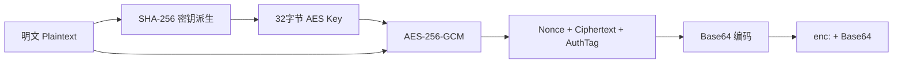

# 加密工具实战

GoWind Admin 提供了 `pkg/crypto` 加密工具包，基于 **AES-256-GCM** 算法，用于敏感数据加密存储、任务配置加密等场景。本章详细介绍加密工具的设计、使用方法和二开实战。

## 一、加密工具架构

### 1.1 核心特性

| 特性 | 说明 |
|------|------|
| 加密算法 | AES-256-GCM（认证加密） |
| 密钥派生 | SHA-256（任意长度输入 → 32 字节密钥） |
| 编码格式 | Base64 + `enc:` 前缀 |
| 向后兼容 | 自动识别未加密数据，透明处理 |
| 全局实例 | 单例模式，支持启用/禁用开关 |
| Payload 加密 | 支持整块 Map 数据加密存储 |

### 1.2 包结构

```
pkg/crypto/
├── aes_gcm.go          # AES-256-GCM 加密/解密核心实现
├── encryptor.go        # 全局加密器实例管理
├── payload.go          # Map Payload 加密/解密（用于任务配置等）
├── aes_gcm_test.go     # 单元测试
├── payload_test.go     # Payload 测试
├── example_test.go     # 使用示例
└── README.md           # 包说明文档
```

### 1.3 适用场景

- 数据库中敏感字段加密存储（手机号、身份证号等）
- Asynq 任务配置加密（数据库密码、API Key 等）
- 任何需要在服务端安全存储的敏感配置

## 二、核心 API

### 2.1 Encryptor — 加密器

`Encryptor` 是加密工具的核心结构体：

```go
type Encryptor struct {
    key []byte
}
```

**创建加密器**：

```go
// 使用密钥字符串创建加密器
// 内部通过 SHA-256 将任意长度密钥转换为 32 字节
encryptor, err := crypto.NewEncryptor("my-secret-key")
if err != nil {
    log.Fatal(err)
}
```

**加密**：

```go
// 加密明文，返回带 "enc:" 前缀的 Base64 字符串
encrypted, err := encryptor.Encrypt("敏感数据")
// 结果示例: "enc:YWJjZGVmZ2hpamtsbW5vcA=="
```

**解密**：

```go
// 解密密文，自动识别 "enc:" 前缀
decrypted, err := encryptor.Decrypt(encrypted)
// 结果: "敏感数据"
```

**判断是否已加密**：

```go
crypto.IsEncrypted("enc:abc123")      // true
crypto.IsEncrypted("plain text")      // false
```

### 2.2 全局加密器

`encryptor.go` 提供全局单例加密器，适合在应用启动时初始化：

```go
// 初始化全局加密器（通常在 main 或 wire 中调用）
err := crypto.InitGlobalEncryptor("production-secret-key", true)
// 参数二: enabled — false 时创建无操作加密器（加密/解密直接返回原文）

// 使用全局函数（无需持有 Encryptor 实例）
encrypted, err := crypto.EncryptIfNeeded("敏感数据")
decrypted, err := crypto.DecryptIfNeeded(encrypted)
```

**启用/禁用开关**：

```go
// 禁用加密（开发环境或不需要加密的场景）
crypto.InitGlobalEncryptor("", false)

// 此时 EncryptIfNeeded 直接返回原文
encrypted, _ := crypto.EncryptIfNeeded("hello")  // "hello"（未加密）
```

### 2.3 Payload 加密

`payload.go` 提供针对 `map[string]interface{}` 的整体加密，常用于 Asynq 任务配置的安全存储：

```go
// 任务配置（包含敏感信息）
taskConfig := map[string]interface{}{
    "task_id":   "task-001",
    "task_type": "email_sync",
    "host":      "imap.gmail.com",
    "port":      993,
    "username":  "user@example.com",
    "password":  "super-secret-password",
}

// 加密整个 Payload
encryptedPayload, err := crypto.EncryptPayload(taskConfig)
// 结果:
// {
//   "_encrypted_config": "enc:...",     // 加密后的完整 JSON
//   "_is_encrypted": true,
//   "task_id": "task-001",              // 保留路由字段
//   "task_type": "email_sync"           // 保留路由字段
// }

// 解密 Payload
decryptedPayload, err := crypto.DecryptPayload(encryptedPayload)
// 恢复为原始 map
```

**Payload 加密策略**：

- `task_id` 和 `task_type` 不会被加密（用于 Asynq 路由和调度）
- 其余所有字段整体加密为一个 `_encrypted_config`
- `_is_encrypted` 标记用于兼容未加密的旧数据

### 2.4 工具函数

```go
// 强制加密/解密（出错时 panic，适合测试）
encrypted := encryptor.MustEncrypt("test data")
decrypted := encryptor.MustDecrypt(encrypted)

// 强制 Payload 加密/解密
encryptedPayload := crypto.MustEncryptPayload(payload)
decryptedPayload := crypto.MustDecryptPayload(encryptedPayload)

// 检查 Payload 是否加密
isEncrypted := crypto.HasEncryptedPayload(payload)
```

## 三、加密流程详解

### 3.1 加密流程



**详细步骤**：

1. **密钥派生**：使用 SHA-256 将任意长度密钥转为 32 字节
2. **创建 AES Block**：使用 32 字节密钥创建 AES-256 cipher block
3. **创建 GCM**：基于 cipher block 创建 GCM 模式
4. **生成 Nonce**：使用 `crypto/rand` 生成随机 12 字节 Nonce
5. **加密**：`gcm.Seal(nonce, nonce, plaintext, nil)` — 输出格式为 `Nonce || Ciphertext || AuthTag`
6. **编码**：Base64 编码 + `enc:` 前缀

### 3.2 解密流程

```go
func (e *Encryptor) Decrypt(ciphertext string) (string, error) {
    // 1. 空字符串直接返回
    if ciphertext == "" { return "", nil }

    // 2. 检查 "enc:" 前缀（向后兼容）
    if !strings.HasPrefix(ciphertext, EncryptedPrefix) {
        return ciphertext, nil  // 未加密数据直接返回
    }

    // 3. 去除前缀，Base64 解码
    data, _ := base64.StdEncoding.DecodeString(encoded)

    // 4. 分离 Nonce 和密文
    nonce, cipherData := data[:nonceSize], data[nonceSize:]

    // 5. GCM 解密（同时验证认证标签）
    plaintext, _ := gcm.Open(nil, nonce, cipherData, nil)

    return string(plaintext), nil
}
```

## 四、二开实战

### 4.1 场景一：敏感字段加密存储

**需求**：用户表中手机号字段需要加密存储。

**步骤一：初始化加密器**

在应用启动时初始化全局加密器（`cmd/server/wire.go` 或 `main.go`）：

```go
func main() {
    // 从配置读取密钥
    encryptKey := cfg.Encryption.Key      // 例如从 server.yaml 中读取
    encryptEnabled := cfg.Encryption.Enabled

    // 初始化全局加密器
    if err := crypto.InitGlobalEncryptor(encryptKey, encryptEnabled); err != nil {
        log.Fatalf("初始化加密器失败: %v", err)
    }

    // 启动应用...
}
```

**步骤二：在 Service 层加密/解密**

```go
func (s *UserService) CreateUser(ctx context.Context, req *identityV1.CreateUserRequest) (*identityV1.User, error) {
    // 加密手机号
    if req.Data.Phone != nil {
        encrypted, err := crypto.EncryptIfNeeded(req.Data.GetPhone())
        if err != nil {
            return nil, err
        }
        req.Data.Phone = trans.Ptr(encrypted)
    }
    return s.userRepo.Create(ctx, req)
}

func (s *UserService) GetUser(ctx context.Context, req *identityV1.GetUserRequest) (*identityV1.User, error) {
    user, err := s.userRepo.Get(ctx, req)
    if err != nil {
        return nil, err
    }

    // 解密手机号（如果已加密）
    if user.Phone != nil && crypto.IsEncrypted(user.GetPhone()) {
        decrypted, err := crypto.DecryptIfNeeded(user.GetPhone())
        if err != nil {
            return nil, err
        }
        user.Phone = trans.Ptr(decrypted)
    }
    return user, nil
}
```

**步骤三：脱敏展示**

```go
// 脱敏函数：138****8000
func maskPhone(phone string) string {
    if len(phone) < 7 {
        return "****"
    }
    return phone[:3] + "****" + phone[len(phone)-4:]
}

// 在 API 返回时脱敏
user.Phone = trans.Ptr(maskPhone(user.GetPhone()))
```

### 4.2 场景二：任务配置加密

**需求**：Asynq 任务中包含数据库连接密码，需要在 Redis 中加密存储。

**写入时加密**：

```go
func (s *TaskService) CreateEmailSyncTask(ctx context.Context, req *CreateEmailSyncRequest) error {
    taskConfig := map[string]interface{}{
        "task_id":   id.NewGUIDv4(false),
        "task_type": "email_sync",
        "host":      req.Host,
        "port":      req.Port,
        "username":  req.Username,
        "password":  req.Password,    // 敏感信息
        "tls":       req.TLS,
    }

    // 加密 Payload
    encryptedConfig, err := crypto.EncryptPayload(taskConfig)
    if err != nil {
        return err
    }

    // 投递到 Asynq 队列
    payload, _ := json.Marshal(encryptedConfig)
    task := asynq.NewTask("email_sync", payload)
    _, err = s.asynqClient.Enqueue(task)
    return err
}
```

**读取时解密**：

```go
func HandleEmailSyncTask(ctx context.Context, t *asynq.Task) error {
    var encryptedPayload map[string]interface{}
    json.Unmarshal(t.Payload(), &encryptedPayload)

    // 解密 Payload
    config, err := crypto.DecryptPayload(encryptedPayload)
    if err != nil {
        return fmt.Errorf("解密任务配置失败: %w", err)
    }

    // 使用解密后的配置
    host := config["host"].(string)
    password := config["password"].(string)
    // ... 执行邮件同步

    return nil
}
```

### 4.3 场景三：Lua 脚本中使用加密

在 Lua 脚本引擎中，可以通过预注册 Go 函数的方式使用加密能力：

```go
// 注册加密函数到 Lua VM
func registerCryptoFunctions(L *lua.LState) {
    // 加密函数
    L.SetGlobal("encrypt", L.NewFunction(func(L *lua.LState) int {
        plaintext := L.CheckString(1)
        encrypted, err := crypto.EncryptIfNeeded(plaintext)
        if err != nil {
            L.RaiseError(err.Error())
        }
        L.Push(lua.LString(encrypted))
        return 1
    }))

    // 解密函数
    L.SetGlobal("decrypt", L.NewFunction(func(L *lua.LState) int {
        ciphertext := L.CheckString(1)
        decrypted, err := crypto.DecryptIfNeeded(ciphertext)
        if err != nil {
            L.RaiseError(err.Error())
        }
        L.Push(lua.LString(decrypted))
        return 1
    }))
}
```

Lua 脚本中使用：

```lua
local encrypted = encrypt("敏感数据")
logger.info("加密结果: %s", encrypted)

local decrypted = decrypt(encrypted)
logger.info("解密结果: %s", decrypted)
```

## 五、向后兼容设计

加密工具的设计充分考虑了向后兼容性：

### 5.1 数据格式识别

通过 `enc:` 前缀区分加密数据和未加密数据：

```go
func IsEncrypted(data string) bool {
    return strings.HasPrefix(data, EncryptedPrefix)
}
```

### 5.2 透明解密

`Decrypt` 方法对未加密数据直接返回原文：

```go
func (e *Encryptor) Decrypt(ciphertext string) (string, error) {
    if !strings.HasPrefix(ciphertext, EncryptedPrefix) {
        return ciphertext, nil  // 未加密数据，直接返回
    }
    // ... 正常解密流程
}
```

### 5.3 可切换开关

通过 `InitGlobalEncryptor(key, enabled)` 控制是否启用加密：

```go
// 开发环境：禁用加密
crypto.InitGlobalEncryptor("", false)
// EncryptIfNeeded → 返回原文
// DecryptIfNeeded → 返回原文

// 生产环境：启用加密
crypto.InitGlobalEncryptor("strong-key", true)
// EncryptIfNeeded → 返回密文
// DecryptIfNeeded → 返回明文
```

这意味着：
- 已有数据库中的未加密数据不需要迁移
- 可以随时启用加密，新旧数据可以共存
- 开发环境可以禁用加密方便调试

## 六、安全建议

### 6.1 密钥管理

- 密钥长度至少 32 字节
- 不要将密钥硬编码在代码中，使用环境变量或密钥管理服务
- 不同环境（开发/测试/生产）使用不同密钥
- 定期轮换密钥（注意：轮换后旧数据需要重新加密）

### 6.2 AES-256-GCM 优势

| 特性 | 说明 |
|------|------|
| 认证加密 | 同时提供加密和完整性验证 |
| 防篡改 | 任何对密文的修改都会在解密时被检测到 |
| 无需 IV 管理 | GCM 内部管理计数器 |
| 性能 | 硬件加速支持（AES-NI），性能优秀 |

### 6.3 生产环境清单

- [ ] 修改默认加密密钥
- [ ] 密钥通过环境变量注入，不写入配置文件
- [ ] 启用加密（`enabled: true`）
- [ ] 数据库连接使用 SSL/TLS
- [ ] Redis 连接使用密码认证
- [ ] 定期备份加密密钥

---

**相关文档**：

- [后端扩展](/admin/backend-extension.md)
- [任务调度](/admin/tutorial-task-scheduling.md)
- [Lua 脚本扩展](/admin/tutorial-lua-extension.md)
- [登录策略与安全](/admin/tutorial-login-security.md)
