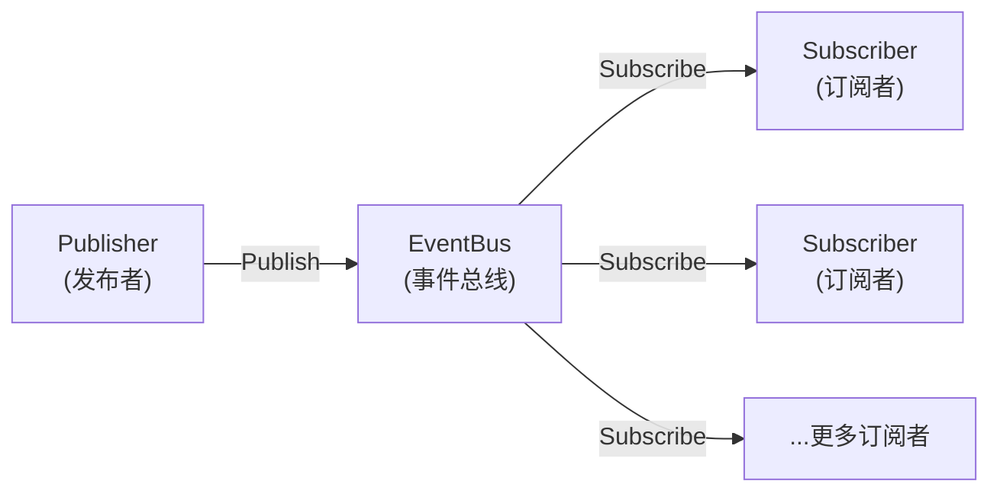

# 事件总线与解耦架构教程

GoWind Admin 内置事件总线（EventBus），提供发布/订阅模式的事件驱动机制，实现模块间的松耦合。本教程深入讲解 EventBus 的架构设计、使用方法和实战场景。

## 一、事件驱动架构

### 1.1 核心概念



| 概念 | 说明 | 示例 |
|------|------|------|
| **Event** | 事件，包含类型和载荷 | `user.created`、`order.paid` |
| **Publisher** | 事件发布者，触发事件 | 用户服务创建用户后发布事件 |
| **Subscriber** | 事件订阅者，处理事件 | 邮件服务订阅用户创建事件 |
| **Handler** | 事件处理器，执行业务逻辑 | 发送欢迎邮件 |
| **Middleware** | 事件中间件，横切关注点 | 日志记录、错误重试 |

### 1.2 优势

- **解耦**：发布者无需知道订阅者是谁
- **扩展性**：新增功能只需添加订阅者，无需修改发布者
- **异步处理**：事件可以异步处理，提升响应速度
- **可测试性**：各模块独立测试

## 二、EventBus 核心 API

### 2.1 定义事件

```go
// pkg/eventbus/event.go
type Event struct {
    Type      string                 // 事件类型
    Payload   map[string]interface{} // 事件载荷
    Timestamp time.Time              // 时间戳
    ID        string                 // 事件ID（UUID）
}

// 创建事件
func NewEvent(eventType string, payload map[string]interface{}) *Event {
    return &Event{
        Type:      eventType,
        Payload:   payload,
        Timestamp: time.Now(),
        ID:        uuid.New().String(),
    }
}
```

### 2.2 发布事件

```go
// pkg/eventbus/eventbus.go
var bus = NewEventBus()

// 发布事件
func Publish(event *Event) error {
    return bus.Publish(context.Background(), event)
}

// 使用示例
Publish(NewEvent("user.created", map[string]interface{}{
    "user_id":  123,
    "username": "john",
    "email":    "john@example.com",
}))
```

### 2.3 订阅事件

```go
// 订阅事件
func Subscribe(eventType string, handler Handler) {
    bus.Subscribe(eventType, handler)
}

// 定义处理器
type Handler func(ctx context.Context, event *Event) error

// 使用示例
Subscribe("user.created", func(ctx context.Context, event *Event) error {
    userID := event.Payload["user_id"].(uint32)
    email := event.Payload["email"].(string)
    
    log.Infof("new user created: id=%d, email=%s", userID, email)
    
    // 发送欢迎邮件
    return sendWelcomeEmail(email)
})
```

### 2.4 取消订阅

```go
// 取消订阅
func Unsubscribe(eventType string, handler Handler) {
    bus.Unsubscribe(eventType, handler)
}
```

## 三、事件中间件

### 3.1 日志中间件

记录所有事件的执行日志：

```go
// pkg/eventbus/middleware.go
func LoggingMiddleware() Middleware {
    return func(next Handler) Handler {
        return func(ctx context.Context, event *Event) error {
            startTime := time.Now()
            
            log.Infof("[event:%s] processing started", event.Type)
            
            err := next(ctx, event)
            
            elapsed := time.Since(startTime)
            if err != nil {
                log.Errorf("[event:%s] failed after %v: %v", 
                    event.Type, elapsed, err)
            } else {
                log.Infof("[event:%s] completed in %v", 
                    event.Type, elapsed)
            }
            
            return err
        }
    }
}

// 注册中间件
bus.Use(LoggingMiddleware())
```

### 3.2 重试中间件

失败时自动重试：

```go
func RetryMiddleware(maxRetries int, delay time.Duration) Middleware {
    return func(next Handler) Handler {
        return func(ctx context.Context, event *Event) error {
            var lastErr error
            
            for i := 0; i <= maxRetries; i++ {
                err := next(ctx, event)
                if err == nil {
                    return nil
                }
                
                lastErr = err
                log.Warnf("[event:%s] retry %d/%d after error: %v", 
                    event.Type, i+1, maxRetries, err)
                
                if i < maxRetries {
                    time.Sleep(delay)
                }
            }
            
            return lastErr
        }
    }
}

// 使用：最多重试 3 次，每次间隔 1 秒
bus.Use(RetryMiddleware(3, 1*time.Second))
```

### 3.3 限流中间件

限制事件处理频率：

```go
import "golang.org/x/time/rate"

func RateLimitMiddleware(limit rate.Limit, burst int) Middleware {
    limiter := rate.NewLimiter(limit, burst)
    
    return func(next Handler) Handler {
        return func(ctx context.Context, event *Event) error {
            // 等待令牌
            err := limiter.Wait(ctx)
            if err != nil {
                return err
            }
            
            return next(ctx, event)
        }
    }
}

// 使用：每秒最多处理 10 个事件
bus.Use(RateLimitMiddleware(10, 20))
```

### 3.4 链路追踪中间件

集成 OpenTelemetry 进行链路追踪：

```go
import "go.opentelemetry.io/otel/trace"

func TracingMiddleware(tracer trace.Tracer) Middleware {
    return func(next Handler) Handler {
        return func(ctx context.Context, event *Event) error {
            ctx, span := tracer.Start(ctx, fmt.Sprintf("event.%s", event.Type))
            defer span.End()
            
            // 将 Span ID 注入事件
            event.Payload["trace_id"] = span.SpanContext().TraceID().String()
            
            return next(ctx, event)
        }
    }
}
```

## 四、内置事件列表

GoWind Admin 预定义了以下事件：

| 事件类型 | 触发时机 | 载荷字段 |
|----------|----------|----------|
| `user.created` | 用户创建后 | `user_id`, `username`, `email` |
| `user.updated` | 用户更新后 | `user_id`, `changes` |
| `user.deleted` | 用户删除后 | `user_id` |
| `login.success` | 登录成功后 | `user_id`, `ip`, `device` |
| `login.failed` | 登录失败后 | `username`, `ip`, `reason` |
| `order.created` | 订单创建后 | `order_id`, `user_id`, `amount` |
| `order.paid` | 订单支付后 | `order_id`, `payment_method` |
| `file.uploaded` | 文件上传后 | `file_id`, `uploader_id`, `size` |
| `permission.changed` | 权限变更后 | `role_id`, `action` |

## 五、实战场景

### 5.1 场景一：用户注册后多操作

**需求**：用户注册成功后，需要：
1. 发送欢迎邮件
2. 初始化用户默认设置
3. 记录注册日志
4. 推送新用户通知给管理员

**传统做法（耦合）**：

```go
func (s *UserService) Register(ctx context.Context, req *RegisterRequest) error {
    // 1. 创建用户
    user, _ := s.userRepo.Create(ctx, req)
    
    // 2. 发送欢迎邮件（耦合）
    emailService.SendWelcomeEmail(user.Email)
    
    // 3. 初始化设置（耦合）
    settingsService.InitDefaultSettings(user.ID)
    
    // 4. 记录日志（耦合）
    auditLogRepo.Create(...)
    
    // 5. 通知管理员（耦合）
    notificationService.NotifyAdmin("New user registered")
    
    return nil
}
```

**问题**：
- UserService 依赖多个服务
- 新增操作需要修改 UserService
- 难以单独测试各个操作

**事件驱动做法（解耦）**：

```go
func (s *UserService) Register(ctx context.Context, req *RegisterRequest) error {
    // 1. 创建用户
    user, _ := s.userRepo.Create(ctx, req)
    
    // 2. 发布事件（解耦）
    eventbus.Publish(eventbus.NewEvent("user.created", map[string]interface{}{
        "user_id":  user.ID,
        "username": user.Username,
        "email":    user.Email,
    }))
    
    return nil
}

// 订阅者 1：发送欢迎邮件
eventbus.Subscribe("user.created", func(ctx context.Context, event *Event) error {
    email := event.Payload["email"].(string)
    return emailService.SendWelcomeEmail(email)
})

// 订阅者 2：初始化设置
eventbus.Subscribe("user.created", func(ctx context.Context, event *Event) error {
    userID := event.Payload["user_id"].(uint32)
    return settingsService.InitDefaultSettings(userID)
})

// 订阅者 3：记录日志
eventbus.Subscribe("user.created", func(ctx context.Context, event *Event) error {
    return auditLogRepo.Create(...)
})

// 订阅者 4：通知管理员
eventbus.Subscribe("user.created", func(ctx context.Context, event *Event) error {
    username := event.Payload["username"].(string)
    return notificationService.NotifyAdmin(fmt.Sprintf("New user: %s", username))
})
```

**优势**：
- UserService 只负责创建用户
- 新增操作只需添加订阅者
- 各订阅者独立测试

---

### 5.2 场景二：订单支付后业务流程

**需求**：订单支付成功后，需要：
1. 扣减库存
2. 生成发票
3. 发送支付成功通知
4. 更新用户积分

**实现**：

```go
// 发布者：订单服务
func (s *OrderService) Pay(ctx context.Context, orderID uint32) error {
    // 1. 更新订单状态
    s.orderRepo.UpdateStatus(ctx, orderID, Order_PAID)
    
    // 2. 发布事件
    eventbus.Publish(eventbus.NewEvent("order.paid", map[string]interface{}{
        "order_id":       orderID,
        "user_id":        order.UserID,
        "amount":         order.Amount,
        "payment_method": order.PaymentMethod,
        "items":          order.Items,
    }))
    
    return nil
}

// 订阅者 1：扣减库存
eventbus.Subscribe("order.paid", func(ctx context.Context, event *Event) error {
    items := event.Payload["items"].([]OrderItem)
    
    for _, item := range items {
        stockService.Decrease(item.ProductID, item.Quantity)
    }
    
    return nil
})

// 订阅者 2：生成发票
eventbus.Subscribe("order.paid", func(ctx context.Context, event *Event) error {
    orderID := event.Payload["order_id"].(uint32)
    return invoiceService.Generate(orderID)
})

// 订阅者 3：发送通知
eventbus.Subscribe("order.paid", func(ctx context.Context, event *Event) error {
    userID := event.Payload["user_id"].(uint32)
    amount := event.Payload["amount"].(float64)
    
    user, _ := userService.Get(userID)
    return notificationService.Send(user.Email, 
        fmt.Sprintf("Payment successful: $%.2f", amount))
})

// 订阅者 4：更新积分
eventbus.Subscribe("order.paid", func(ctx context.Context, event *Event) error {
    userID := event.Payload["user_id"].(uint32)
    amount := event.Payload["amount"].(float64)
    
    points := int(amount * 10)  // 每消费 1 元获得 10 积分
    return pointsService.Add(userID, points)
})
```

---

### 5.3 场景三：文件上传后处理

**需求**：文件上传后，根据文件类型进行不同处理：
- 图片：生成缩略图
- 文档：提取文本用于搜索
- 视频：转码为多种格式

**实现**：

```go
// 发布者：文件服务
func (s *FileService) Upload(ctx context.Context, file *FileUpload) error {
    // 1. 上传到 MinIO
    url, _ := s.ossClient.UploadFile(file.Bucket, file.Key, file.Content)
    
    // 2. 记录元数据
    fileRecord, _ := s.fileRepo.Create(ctx, file)
    
    // 3. 发布事件
    eventbus.Publish(eventbus.NewEvent("file.uploaded", map[string]interface{}{
        "file_id":      fileRecord.ID,
        "content_type": file.ContentType,
        "size":         file.Size,
        "uploader_id":  auth.GetUserID(ctx),
    }))
    
    return nil
}

// 订阅者 1：图片处理
eventbus.Subscribe("file.uploaded", func(ctx context.Context, event *Event) error {
    contentType := event.Payload["content_type"].(string)
    
    if !strings.HasPrefix(contentType, "image/") {
        return nil  // 非图片文件，跳过
    }
    
    fileID := event.Payload["file_id"].(uint32)
    return imageService.GenerateThumbnails(fileID)
})

// 订阅者 2：文档索引
eventbus.Subscribe("file.uploaded", func(ctx context.Context, event *Event) error {
    contentType := event.Payload["content_type"].(string)
    
    if !isDocument(contentType) {
        return nil
    }
    
    fileID := event.Payload["file_id"].(uint32)
    return searchService.IndexDocument(fileID)
})

// 订阅者 3：视频转码
eventbus.Subscribe("file.uploaded", func(ctx context.Context, event *Event) error {
    contentType := event.Payload["content_type"].(string)
    
    if !strings.HasPrefix(contentType, "video/") {
        return nil
    }
    
    fileID := event.Payload["file_id"].(uint32)
    
    // 异步转码（避免阻塞）
    task.Enqueue("transcode_video", map[string]interface{}{
        "file_id": fileID,
    })
    
    return nil
})
```

---

### 5.4 场景四：权限变更审计

**需求**：每次权限变更都记录审计日志并通知安全团队。

**实现**：

```go
// 发布者：角色服务
func (s *RoleService) AddPermissions(ctx context.Context, req *AddPermissionsRequest) error {
    // 1. 添加权限
    s.roleRepo.AddPermissions(ctx, req.RoleId, req.PermissionIds)
    
    // 2. 发布事件
    eventbus.Publish(eventbus.NewEvent("permission.changed", map[string]interface{}{
        "role_id":        req.RoleId,
        "permission_ids": req.PermissionIds,
        "action":         "add",
        "operator_id":    auth.GetUserID(ctx),
    }))
    
    return nil
}

// 订阅者 1：记录审计日志
eventbus.Subscribe("permission.changed", func(ctx context.Context, event *Event) error {
    return auditLogRepo.Create(&PermissionAuditLog{
        Action:        event.Payload["action"].(string),
        RoleID:        event.Payload["role_id"].(uint32),
        OperatorID:    event.Payload["operator_id"].(uint32),
        CreatedAt:     time.Now(),
    })
})

// 订阅者 2：安全告警
eventbus.Subscribe("permission.changed", func(ctx context.Context, event *Event) error {
    roleID := event.Payload["role_id"].(uint32)
    operatorID := event.Payload["operator_id"].(uint32)
    
    // 如果是敏感权限变更，发送告警
    if isSensitivePermissionChange(event) {
        return alertService.SendSecurityAlert(fmt.Sprintf(
            "User %d changed permissions for role %d", 
            operatorID, roleID))
    }
    
    return nil
})
```

## 六、Lua 脚本中的事件

在 Lua 脚本中可以方便地订阅和发布事件：

```lua
-- scripts/user_events.lua

-- 订阅用户创建事件
eventbus.subscribe("user.created", function(event)
    local user_id = event.user_id
    local email = event.email
    
    logger.info("新用户注册: %d, %s", user_id, email)
    
    -- 发送欢迎邮件
    task.enqueue("send_welcome_email", {
        email = email
    })
end)

-- 订阅登录失败事件
eventbus.subscribe("login.failed", function(event)
    local username = event.username
    local ip = event.ip
    
    logger.warn("登录失败: %s, IP: %s", username, ip)
    
    -- 检查是否需要锁定账号
    check_login_failures(username, ip)
end)
```

## 七、异步 vs 同步事件

### 7.1 同步事件

事件处理器立即执行，阻塞发布者：

```go
// 同步发布
err := eventbus.PublishSync(event)
if err != nil {
    log.Errorf("event handling failed: %v", err)
    // 可以选择回滚操作
}
```

**适用场景**：
- 必须保证事件处理成功
- 处理器执行速度快
- 需要立即得到处理结果

### 7.2 异步事件

事件处理器在后台执行，不阻塞发布者：

```go
// 异步发布（默认）
go func() {
    err := eventbus.Publish(event)
    if err != nil {
        log.Errorf("async event handling failed: %v", err)
    }
}()
```

**适用场景**：
- 处理器执行耗时较长
- 不需要立即得到结果
- 可以容忍短暂延迟

### 7.3 混合模式

关键操作同步，非关键操作异步：

```go
func (s *OrderService) Pay(ctx context.Context, orderID uint32) error {
    // 1. 更新订单状态
    s.orderRepo.UpdateStatus(ctx, orderID, Order_PAID)
    
    // 2. 同步事件：扣减库存（必须成功）
    err := eventbus.PublishSync(eventbus.NewEvent("order.stock.decrease", ...))
    if err != nil {
        // 库存扣减失败，回滚订单
        s.orderRepo.UpdateStatus(ctx, orderID, Order_PENDING)
        return err
    }
    
    // 3. 异步事件：发送通知（可以延迟）
    go func() {
        eventbus.Publish(eventbus.NewEvent("order.notification", ...))
    }()
    
    return nil
}
```

## 八、事件持久化

### 8.1 事件存储

将事件持久化到数据库，用于审计和重放：

```sql
CREATE TABLE events (
    id VARCHAR(36) PRIMARY KEY,
    type VARCHAR(100),
    payload JSONB,
    created_at TIMESTAMP DEFAULT NOW(),
    processed BOOLEAN DEFAULT FALSE,
    error TEXT
);
```

```go
func (b *EventBus) Publish(ctx context.Context, event *Event) error {
    // 1. 持久化事件
    b.eventRepo.Save(ctx, event)
    
    // 2. 发布到订阅者
    return b.dispatch(event)
}
```

### 8.2 事件重放

重新处理历史事件：

```go
func ReplayEvents(eventType string, fromTime time.Time) error {
    events, _ := eventRepo.QueryByTypeAndTime(eventType, fromTime)
    
    for _, event := range events {
        err := eventbus.Publish(event)
        if err != nil {
            log.Errorf("replay event failed: %v", err)
        }
    }
    
    return nil
}

// 使用：重放过去 24 小时的用户创建事件
ReplayEvents("user.created", time.Now().Add(-24*time.Hour))
```

## 九、性能优化

### 9.1 批量发布

避免循环发布单个事件：

```go
// ❌ 错误做法
for _, user := range users {
    eventbus.Publish(NewEvent("user.created", ...))
}

// ✅ 正确做法
var events []*Event
for _, user := range users {
    events = append(events, NewEvent("user.created", ...))
}
eventbus.PublishBatch(events)
```

### 9.2 事件过滤

订阅者只处理感兴趣的事件：

```go
eventbus.Subscribe("user.created", func(ctx context.Context, event *Event) error {
    // 只处理 VIP 用户
    if event.Payload["user_type"] != "vip" {
        return nil
    }
    
    return handleVIPUser(event)
})
```

### 9.3 并发处理

使用 worker pool 并发处理事件：

```go
func (b *EventBus) StartWorkers(concurrency int) {
    for i := 0; i < concurrency; i++ {
        go func() {
            for event := range b.eventQueue {
                b.handleEvent(event)
            }
        }()
    }
}
```

## 十、常见问题

### Q1: 事件处理失败怎么办？

1. 使用重试中间件自动重试
2. 记录失败事件到死信队列
3. 手动重放失败事件

### Q2: 如何保证事件不丢失？

1. 事件持久化到数据库
2. 使用事务确保原子性
3. 定期备份事件日志

### Q3: 如何处理事件顺序？

同一类型的事件按发布顺序处理：

```go
// 使用有序队列
queue := NewOrderedQueue()
queue.Push(event1)
queue.Push(event2)

// 按顺序处理
for event := range queue.Pop() {
    handleEvent(event)
}
```

### Q4: 如何监控事件处理？

1. 使用链路追踪中间件
2. 记录事件处理耗时
3. 监控失败率和重试次数

## 十一、相关文档

- [后端扩展开发](./backend-extension.md)
- [任务调度与异步处理](./tutorial-task-scheduling.md)
- [Lua 脚本扩展实战](./tutorial-lua-extension.md)
