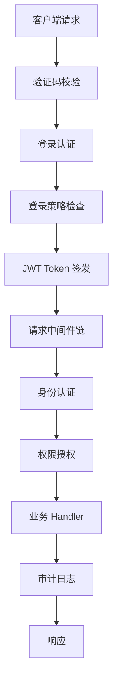
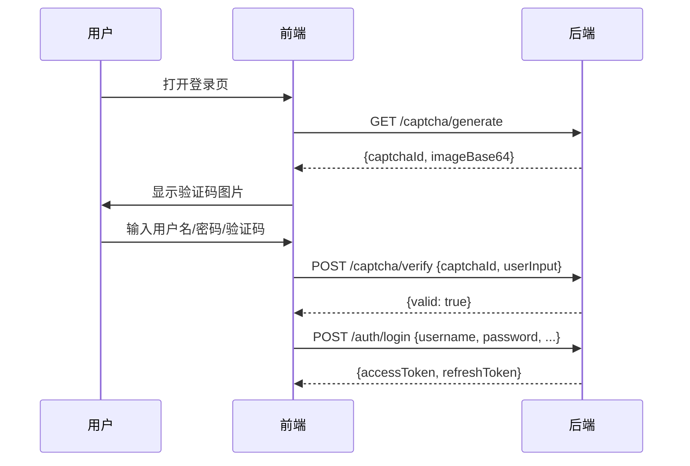

# 登录策略与安全加固

GoWind Admin 提供了完整的身份认证与安全管控体系，涵盖登录策略、Token 管理、验证码、审计日志等多个安全层。本章详细介绍各安全机制的设计与使用。

## 一、安全架构概览

### 1.1 安全层级

GoWind Admin 的安全体系采用多层防护设计：



### 1.2 安全组件一览

| 组件 | 路径 | 职责 |
|------|------|------|
| AuthenticationService | `internal/service/authentication_service.go` | 登录/登出/刷新/验证码 |
| Authenticator | `internal/data/authenticator.go` | Token 创建/验证/撤销/封禁 |
| UserTokenCache | `internal/data/user_token_cache.go` | Token 缓存与黑名单管理 |
| LoginPolicyRepo | `internal/data/login_policy_repo.go` | 登录策略数据持久化 |
| LoginPolicyService | `internal/service/login_policy_service.go` | 登录策略 CRUD |
| Auth Middleware | `pkg/middleware/auth/` | 请求级别身份认证 |
| Authorizer | `pkg/authorizer/` | 权限授权引擎 |

## 二、登录认证流程

### 2.1 支持的授权类型

GoWind Admin 支持以下 OAuth 2.0 风格的授权类型（Grant Type）：

| Grant Type | 说明 | 使用场景 |
|------------|------|----------|
| `password` | 用户名密码登录 | 管理后台登录 |
| `refresh_token` | 刷新令牌 | Token 过期后无感刷新 |
| `client_credentials` | 客户端凭据 | 预留，暂未实现 |

### 2.2 密码登录流程

```go
func (s *AuthenticationService) doGrantTypePassword(
    ctx context.Context, req *authenticationV1.LoginRequest,
) (*authenticationV1.LoginResponse, error) {
    // 1. 重置上下文（绕过隐私保护和权限检查）
    ctx = s.resetContextForLogin(ctx)

    // 2. 验证用户凭证
    _, err := s.userCredentialRepo.VerifyCredential(ctx, &authenticationV1.VerifyCredentialRequest{
        IdentityType: authenticationV1.UserCredential_USERNAME,
        Identifier:   req.GetUsername(),
        Credential:   req.GetPassword(),
        NeedDecrypt:  true,
    })

    // 3. 获取用户信息
    user, err := s.userRepo.Get(ctx, &identityV1.GetUserRequest{
        QueryBy: &identityV1.GetUserRequest_Username{Username: req.GetUsername()},
    })

    // 4. 构造 Token Payload
    tokenPayload := &authenticationV1.UserTokenPayload{
        UserId:   user.GetId(),
        TenantId: user.TenantId,
        Username: user.Username,
        ClientId: req.ClientId,
        DeviceId: req.DeviceId,
    }

    // 5. 解析用户权限信息
    err = s.resolveUserAuthority(ctx, user, tokenPayload)

    // 6. 生成令牌对
    accessToken, refreshToken, err := s.authenticator.CreateUserToken(ctx, req.GetClientType(), tokenPayload)

    return &authenticationV1.LoginResponse{
        TokenType:        authenticationV1.TokenType_bearer,
        AccessToken:      accessToken,
        RefreshToken:     trans.Ptr(refreshToken),
        ExpiresIn:        int64(s.authenticator.GetAccessTokenExpires(req.GetClientType()).Seconds()),
        RefreshExpiresIn: trans.Ptr(int64(s.authenticator.GetRefreshTokenExpires(req.GetClientType()).Seconds())),
    }, nil
}
```

**关键步骤说明**：

1. **重置上下文**：登录时没有用户身份信息，需要绕过 Ent 的隐私保护中间件和 Viewer 机制
2. **凭证验证**：支持用户名/密码校验，密码使用哈希比对
3. **权限解析**：根据用户-租户关系模型（一对一/一对多），收集角色和权限
4. **令牌签发**：生成 Access Token (JWT) + Refresh Token

### 2.3 Token 刷新流程

```go
func (s *AuthenticationService) doGrantTypeRefreshToken(ctx context.Context, req *authenticationV1.LoginRequest) (*authenticationV1.LoginResponse, error) {
    // 1. 从当前 Token 中获取操作人信息
    operator, _ := auth.FromContext(ctx)

    // 2. 获取用户信息并重新解析权限
    user, _ := s.userRepo.Get(ctx, ...)
    tokenPayload := ...
    s.resolveUserAuthority(ctx, user, tokenPayload)

    // 3. 验证 Refresh Token
    s.authenticator.VerifyRefreshToken(ctx, req.GetClientType(), req.GetUserId(), operator.GetJti(), req.GetRefreshToken())

    // 4. 签发新的令牌对
    accessToken, refreshToken, _ := s.authenticator.CreateUserToken(ctx, req.GetClientType(), tokenPayload)

    return &authenticationV1.LoginResponse{...}, nil
}
```

**刷新机制**：
- Refresh Token 使用后立即失效（一次性）
- 签发新令牌对时，会重新解析用户权限（权限变更实时生效）
- 旧 Access Token 通过 JTI 关联被撤销

## 三、Token 管理

### 3.1 Token 类型与过期时间

| Token 类型 | 过期时间 | 存储位置 |
|------------|----------|----------|
| Access Token | 15 分钟 | Redis |
| Refresh Token | 7 天 | Redis |
| Token 黑名单 | 可配置时长 | Redis |

过期时间定义在 `internal/data/authenticator.go`：

```go
const (
    DefaultAccessTokenExpires  = time.Minute * 15
    DefaultRefreshTokenExpires = time.Hour * 24 * 7
)
```

### 3.2 Token 验证流程

每次 API 请求都经过以下 Token 验证链：

```go
func (a *Authenticator) Authenticate(ctx context.Context, req *authenticationV1.ValidateTokenRequest) (*authenticationV1.ValidateTokenResponse, error) {
    // 1. JWT 签名验证
    claims, err := authenticator.AuthenticateToken(req.GetToken())

    // 2. 过期时间检查
    if jwt.IsTokenExpired(claims) { ... }

    // 3. 解析 Token Payload
    payload, err := jwt.NewUserTokenPayloadWithClaims(claims)

    // 4. Redis 缓存验证（Token 是否存在且匹配）
    valid, err := a.userTokenCache.IsValidAccessToken(ctx, ...)

    // 5. 黑名单检查
    if a.userTokenCache.IsBlockedAccessToken(ctx, payload.GetJti()) { ... }

    return &authenticationV1.ValidateTokenResponse{IsValid: true, Payload: payload}, nil
}
```

**五重验证**：
1. JWT 签名验证（防篡改）
2. 过期时间检查（时效性）
3. Payload 解析（数据完整性）
4. Redis 缓存匹配（防伪造）
5. 黑名单检查（即时封禁）

### 3.3 Token 封禁与解封

管理员可以封禁指定用户的 Token：

```go
// 封禁 Token
func (a *Authenticator) BlockToken(ctx context.Context, req *authenticationV1.BlockTokenRequest) error {
    // 支持两种定位方式：
    // - 通过 Token 值定位
    // - 通过 JTI (JWT ID) 定位

    // 添加到黑名单，支持设置封禁时长
    return a.userTokenCache.AddBlockedAccessToken(ctx, jti, req.GetReason(), req.GetDuration().AsDuration())
}

// 解封 Token
func (a *Authenticator) UnblockToken(ctx context.Context, req *authenticationV1.UnblockTokenRequest) error {
    return a.userTokenCache.RevokeTokenByJti(ctx, req.GetClientType(), req.GetUserId(), jti)
}
```

### 3.4 多设备登录

系统支持多设备同时登录，通过 Redis 管理用户的多个 Token：

```go
// 获取用户所有在线的 Access Token（用于 SSE 推送等场景）
func (a *Authenticator) GetAccessTokens(ctx context.Context, clientType authenticationV1.ClientType, userId uint32) []string {
    return a.userTokenCache.GetAccessTokens(ctx, clientType, userId)
}
```

### 3.5 登出流程

```go
func (s *AuthenticationService) Logout(ctx context.Context, _ *emptypb.Empty) (*emptypb.Empty, error) {
    operator, _ := auth.FromContext(ctx)
    // 撤销该用户的所有 Token
    s.authenticator.RevokeUserToken(ctx, s.clientType, operator.GetUserId())
    return &emptypb.Empty{}, nil
}
```

## 四、登录策略

### 4.1 策略模型

LoginPolicy（登录策略）用于控制用户的登录行为，数据模型包含以下字段：

| 字段 | 类型 | 说明 |
|------|------|------|
| `tenant_id` | uint32 | 租户 ID（多租户隔离） |
| `target_id` | uint32 | 目标 ID（用户 ID 或 IP 地址） |
| `type` | enum | 策略类型 |
| `method` | enum | 策略方法（允许/拒绝） |
| `value` | string | 策略值 |
| `reason` | string | 原因说明 |

### 4.2 策略类型与方法

**策略类型 (Type)**：
- 基于 IP 地址的访问控制
- 基于用户的访问控制
- 基于时间段的访问控制

**策略方法 (Method)**：
- **允许** (Allow)：白名单模式
- **拒绝** (Deny)：黑名单模式

### 4.3 策略 CRUD

LoginPolicyService 提供标准的 CRUD API：

```go
type LoginPolicyService struct {
    adminV1.LoginPolicyServiceHTTPServer
    log  *log.Helper
    repo *data.LoginPolicyRepo
}

// 创建策略
func (s *LoginPolicyService) Create(ctx context.Context, req *authenticationV1.CreateLoginPolicyRequest) (*emptypb.Empty, error) {
    // 自动填充操作人信息
    operator, _ := auth.FromContext(ctx)
    req.Data.CreatedBy = trans.Ptr(operator.UserId)
    return &emptypb.Empty{}, s.repo.Create(ctx, req)
}

// 更新策略（支持 Upsert）
func (s *LoginPolicyService) Update(ctx context.Context, req *authenticationV1.UpdateLoginPolicyRequest) (*emptypb.Empty, error)) {
    // 如果设置了 AllowMissing 且记录不存在，则自动创建
    if req.GetAllowMissing() {
        exist, _ := r.IsExist(ctx, req.GetId())
        if !exist {
            return r.Create(ctx, &authenticationV1.CreateLoginPolicyRequest{Data: req.Data})
        }
    }
    // ...
}
```

### 4.4 使用场景示例

**场景一：IP 黑名单**

禁止特定 IP 地址登录管理后台：

```json
{
  "target_id": 0,
  "type": "IP_BLACKLIST",
  "method": "DENY",
  "value": "192.168.1.100",
  "reason": "疑似恶意登录"
}
```

**场景二：IP 白名单**

仅允许公司内网 IP 登录：

```json
{
  "target_id": 0,
  "type": "IP_WHITELIST",
  "method": "ALLOW",
  "value": "10.0.0.0/8",
  "reason": "仅允许内网访问"
}
```

**场景三：用户封禁**

封禁特定用户：

```json
{
  "target_id": 12345,
  "type": "USER_BAN",
  "method": "DENY",
  "value": "永久封禁",
  "reason": "违反平台使用规范"
}
```

## 五、验证码机制

### 5.1 验证码生成

```go
func (s *AuthenticationService) GenerateCaptcha(_ context.Context, _ *emptypb.Empty) (*authenticationV1.GenerateCaptchaResponse, error) {
    captchaId, captchaValue, _, err := s.captchaClient.Generate()
    return &authenticationV1.GenerateCaptchaResponse{
        CaptchaId:   captchaId,
        ImageBase64: captchaValue,
    }, nil
}
```

### 5.2 验证码校验

```go
func (s *AuthenticationService) VerifyCaptcha(ctx context.Context, req *authenticationV1.VerifyCaptchaRequest) (*authenticationV1.VerifyCaptchaResponse, error) {
    ok, err := s.captchaClient.Verify(ctx, req.GetCaptchaId(), req.GetUserInput())
    return &authenticationV1.VerifyCaptchaResponse{Valid: ok}, nil
}
```

### 5.3 前端集成流程



::: tip
验证码校验和登录是两个独立的 API 调用。前端先调用验证码校验接口，通过后再发起登录请求。
:::

## 六、审计日志

### 6.1 审计日志类型

GoWind Admin 记录了多种类型的审计日志：

| 日志类型 | Service | 说明 |
|----------|---------|------|
| API 审计日志 | `ApiAuditLogService` | 记录所有 API 请求 |
| 登录审计日志 | `LoginAuditLogService` | 记录登录/登出事件 |
| 操作审计日志 | `OperationAuditLogService` | 记录数据变更操作 |
| 权限审计日志 | `PermissionAuditLogService` | 记录权限策略变更 |
| 数据访问审计 | `DataAccessAuditLogService` | 记录敏感数据访问 |
| 策略评估日志 | `PolicyEvaluationLogService` | 记录权限评估结果 |

### 6.2 审计日志写入

审计日志通过中间件自动写入，在 `rest_server.go` 中配置：

```go
func NewRestMiddleware(
    ctx *bootstrap.Context,
    accessTokenChecker auth.AccessTokenChecker,
    authorizer *authorizer.Authorizer,
    apiAuditLogRepo *data.ApiAuditLogRepo,
    loginLogRepo *data.LoginAuditLogRepo,
) []middleware.Middleware {
    ms = append(ms, applogging.Server(
        applogging.WithWriteApiLogFunc(func(ctx context.Context, data *auditV1.ApiAuditLog) error {
            return apiAuditLogRepo.Create(ctx, &auditV1.CreateApiAuditLogRequest{Data: data})
        }),
        applogging.WithWriteLoginLogFunc(func(ctx context.Context, data *auditV1.LoginAuditLog) error {
            return loginLogRepo.Create(ctx, &auditV1.CreateLoginAuditLogRequest{Data: data})
        }),
    ))
    // ...
}
```

::: tip
审计日志目前采用同步写入数据库。如果系统负载较大，建议改为异步方式（通过 Asynq 任务队列投递）。
:::

## 七、中间件安全链

### 7.1 REST 中间件顺序

```go
// 1. Kratos 内置日志中间件
ms = append(ms, logging.Server(ctx.GetLogger()))

// 2. 自定义审计日志中间件（API 日志 + 登录日志）
ms = append(ms, applogging.Server(...))

// 3. 身份认证 + 权限授权（白名单机制）
ms = append(ms, selector.Server(
    auth.Server(                           // JWT Token 验证
        auth.WithAccessTokenChecker(accessTokenChecker),
        auth.WithInjectMetadata(false),
        auth.WithInjectEnt(true),
    ),
    authz.Server(authorizer.Engine()),    // Casbin/OPA 权限检查
).Match(rpc.NewRestWhiteListMatcher()).Build())
```

### 7.2 白名单机制

登录和验证码等接口不需要 Token 认证，通过白名单配置：

```go
rpc.AddWhiteList(
    adminV1.OperationAuthenticationServiceLogin,            // 登录
    adminV1.OperationAuthenticationServiceGenerateCaptcha,  // 生成验证码
    adminV1.OperationAuthenticationServiceVerifyCaptcha,    // 校验验证码
)
```

### 7.3 隐私保护

登录流程需要绕过 Ent 的隐私保护中间件：

```go
func (s *AuthenticationService) resetContextForLogin(ctx context.Context) context.Context {
    // 使用空的 NoopContext（无 Viewer 信息）
    ctx = viewer.WithContext(ctx, viewer.NewNoopContext())
    // 绕过隐私保护
    ctx = privacy.DecisionContext(ctx, privacy.Allow)
    return ctx
}
```

## 八、最佳实践

### 8.1 Token 安全

- **短期 Token**：Access Token 有效期仅 15 分钟，减少被盗用的风险窗口
- **Refresh Token 一次性使用**：每次刷新后旧 Refresh Token 立即失效
- **多维度验证**：JWT 签名 + Redis 缓存 + 黑名单，三重保障
- **即时封禁**：通过 `BlockToken` 可立即封禁指定用户的 Token

### 8.2 密码安全

- 密码使用哈希存储（`CredentialType: PASSWORD_HASH`）
- 传输时使用 HTTPS 加密
- 支持 `NeedDecrypt` 参数控制是否需要解密前端传来的密码

### 8.3 生产环境建议

- 修改 JWT 密钥（`authn.jwt.key`），使用高强度随机密钥
- 根据实际需求调整 Token 过期时间
- 启用验证码防止暴力破解
- 配置登录策略限制 IP 访问范围
- 定期审查审计日志

---

**相关文档**：

- [权限系统](/admin/tutorial-permission-system.md)
- [多租户](/admin/tutorial-multi-tenancy.md)
- [后端架构](/admin/backend-architecture.md)
- [SSE 实时推送](/admin/tutorial-sse-push.md)
