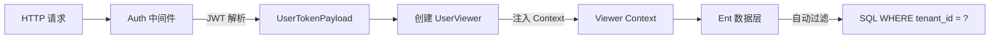

# 多租户架构实战教程

GoWind Admin 内置多租户支持，适用于 SaaS 平台开发。本教程深入讲解多租户架构设计、数据隔离策略和实战场景。

## 一、多租户模型

### 1.1 两种租户关系模型

GoWind Admin 支持两种用户-租户关系：

| 模型      | 说明           | 适用场景              | 常量值 |
|---------|--------------|-------------------|------|
| **未启用** | 不启用多租户       | 单租户模式、独立部署        | `UserTenantRelationNone` |
| **一对一** | 一个用户只属于一个租户  | 企业内部系统、独立 SaaS 客户 | `UserTenantRelationOneToOne` |
| **一对多** | 一个用户可以属于多个租户 | 跨组织协作、顾问角色、多公司管理  | `UserTenantRelationOneToMany` |

在 `pkg/constants/tenant.go` 中配置：

```go
// UserTenantRelationType 用户-租户关系类型
type UserTenantRelationType int

const (
    UserTenantRelationNone     UserTenantRelationType = iota // 未启用多租户
    UserTenantRelationOneToOne                                 // 一对一
    UserTenantRelationOneToMany                                // 一对多
)

const (
    // 默认一对一模式
    DefaultUserTenantRelationType = UserTenantRelationOneToOne
    // 是否启用租户模式（None 时为 false）
    IsTenantModeEnabled = DefaultUserTenantRelationType == UserTenantRelationOneToOne ||
                          DefaultUserTenantRelationType == UserTenantRelationOneToMany
)
```

### 1.2 数据库表结构

> **注意**：以下为 Ent Schema 定义的核心字段，实际表名有 `sys_` 前缀（如 `sys_tenants`、`sys_users`、`sys_memberships`），由 Ent 的 `entsql.Annotation` 指定。

```sql
-- 租户表 (sys_tenants)
-- 核心字段：
--   id, name(唯一), code(唯一), logo_url, domain, industry,
--   admin_user_id, status(ON/OFF/EXPIRED/FREEZE),
--   type(TRIAL/PAID/INTERNAL/PARTNER/CUSTOM),
--   audit_status(PENDING/APPROVED/REJECTED),
--   subscription_at, unsubscribe_at, subscription_plan, expired_at

-- 用户表 (sys_users)
-- 核心字段：
--   id, username, nickname, realname, email, mobile,
--   avatar, gender, status(NORMAL/DISABLED/PENDING/LOCKED/EXPIRED/CLOSED)
-- 注意：tenant_id 通过 mixin.TenantID 自动注入，在租户范围内 username 唯一

-- 成员关联表 (sys_memberships) —— 一对多模型的核心
-- 核心字段：
--   id, user_id, tenant_id(通过 mixin 注入),
--   org_unit_id, position_id, role_id (冗余单一场景字段，
--   与独立关联表 membership_role/membership_org_unit/membership_position 互斥),
--   is_primary(是否主身份),
--   start_at, end_at, assigned_at, assigned_by, joined_at,
--   status(ACTIVE/DISABLED/PENDING/INVITED/EXPIRED/REJECTED)
-- 注意：tenant_id + user_id 联合唯一
```

> **关于角色关联**：一对一模型通过 `user_role` 表关联，一对多模型通过 `membership_role` 表关联。角色代码有前缀约定：平台角色 `platform:xxx`，租户角色 `tenant:xxx`，模板角色 `template:xxx`。

## 二、一对一租户模型

### 2.1 配置

在 `pkg/constants/tenant.go` 中设置：

```go
const DefaultUserTenantRelationType = UserTenantRelationOneToOne
```

### 2.2 登录流程

一对一模型的登录授权逻辑在 `authorizeAndEnrichUserTokenPayloadUserTenantRelationOneToOne` 方法中：

```go
func (s *AuthenticationService) authorizeAndEnrichUserTokenPayloadUserTenantRelationOneToOne(
    ctx context.Context, userID, tenantID uint32,
    tokenPayload *authenticationV1.UserTokenPayload,
) error {
    // 1. 检查租户状态（仅当 tenantID > 0 时）
    if tenantID > 0 {
        tenant, _ := s.tenantRepo.Get(ctx, &identityV1.GetTenantRequest{
            QueryBy: &identityV1.GetTenantRequest_Id{Id: tenantID},
        })
        if tenant == nil || tenant.GetStatus() != identityV1.Tenant_ON {
            return authenticationV1.ErrorForbidden("insufficient authority")
        }
    }

    // 2. 通过 user_role 表获取角色 ID 列表
    roleIDs, err := s.userRepo.ListRoleIDsByUserID(ctx, userID)
    if err != nil || len(roleIDs) == 0 {
        return authenticationV1.ErrorForbidden("insufficient authority")
    }

    // 3. 通过 role_permission 表获取权限 ID 列表
    permissionIDs, err := s.roleRepo.ListPermissionIDsByRoleIDs(ctx, roleIDs)
    // ...获取权限代码列表
    permissionCodes, _ := s.permissionRepo.GetPermissionCodesByIDs(ctx, permissionIDs)

    // 4. 检查是否有后台访问权限 (sys:access_backend)
    if !containsPermission(permissionCodes, constants.SystemAccessBackendPermissionCode) {
        return authenticationV1.ErrorForbidden("insufficient authority")
    }

    // 5. 获取角色代码列表并写入 Token
    roleCodes, _ := s.roleRepo.ListRoleCodesByRoleIds(ctx, roleIDs)
    tokenPayload.Roles = roleCodes

    return nil
}
```

实际登录入口 `doGrantTypePassword` 的完整流程：

```go
func (s *AuthenticationService) doGrantTypePassword(
    ctx context.Context, req *authenticationV1.LoginRequest,
) (*authenticationV1.LoginResponse, error) {
    // 1. 重置 Context（绕过隐私保护和 Viewer）
    ctx = s.resetContextForLogin(ctx)

    // 2. 验证用户凭证（用户名+密码）
    _, err := s.userCredentialRepo.VerifyCredential(ctx, &authenticationV1.VerifyCredentialRequest{
        IdentityType: authenticationV1.UserCredential_USERNAME,
        Identifier:   req.GetUsername(),
        Credential:   req.GetPassword(),
        NeedDecrypt:  true,
    })

    // 3. 获取用户信息
    user, _ := s.userRepo.Get(ctx, &identityV1.GetUserRequest{
        QueryBy: &identityV1.GetUserRequest_Username{Username: req.GetUsername()},
    })

    // 4. 构建令牌载荷
    tokenPayload := &authenticationV1.UserTokenPayload{
        UserId:   user.GetId(),
        TenantId: user.TenantId,
        Username: user.Username,
        ClientId: req.ClientId,
        DeviceId: req.DeviceId,
    }

    // 5. 解析用户权限信息（根据租户关系类型分发）
    s.resolveUserAuthority(ctx, user, tokenPayload)

    // 6. 生成访问令牌和刷新令牌
    accessToken, refreshToken, _ := s.authenticator.CreateUserToken(ctx, req.GetClientType(), tokenPayload)

    return &authenticationV1.LoginResponse{
        TokenType:    authenticationV1.TokenType_bearer,
        AccessToken:  accessToken,
        RefreshToken: &refreshToken,
    }, nil
}
```

### 2.3 数据隔离

数据隔离通过 **Ent Viewer 机制** 实现，而非手动添加 `Where` 条件：

**中间件层**：Auth 中间件在每次请求时自动将 `UserViewer` 注入 Context：

```go
// pkg/middleware/auth/auth.go
// 在认证成功后，创建 UserViewer 并注入 Context
userViewer := appViewer.NewUserViewer(
    uint64(tokenPayload.GetUserId()),
    uint64(tokenPayload.GetTenantId()),  // 租户 ID 来自 JWT Token
    uint64(tokenPayload.GetOrgUnitId()),
    traceID,
    tokenPayload.GetDataScope(),         // 数据权限范围
)
ctx = viewer.WithContext(ctx, userViewer)
```

**Viewer 层**：`UserViewer` 提供租户 ID 和数据权限范围：

```go
// pkg/entgo/viewer/user_viewer.go
type UserViewer struct {
    uid        uint64              // 用户 ID
    tid        uint64              // 租户 ID
    ouid       uint64              // 组织单元 ID
    dataScopes []viewer.DataScope  // 数据权限范围
}

// IsPlatformContext 平台视图（tenant_id == 0）
func (v UserViewer) IsPlatformContext() bool { return v.tid == 0 }

// IsTenantContext 租户视图（tenant_id > 0）
func (v UserViewer) IsTenantContext() bool { return v.tid > 0 }
```

**数据权限范围 (DataScope)**：

| 值 | 说明 |
|------|------|
| `SELF` | 仅本人数据 |
| `UNIT_ONLY` | 本部门 |
| `UNIT_AND_CHILD` | 本部门及子部门 |
| `SELECTED_UNITS` | 指定部门 |
| `ALL` | 全部数据 |

go-crud 的 Ent 集成层会自动从 Viewer 中提取 `tenant_id`，在所有查询和写入中添加租户过滤。

## 三、一对多租户模型

### 3.1 配置

```go
const DefaultUserTenantRelationType = UserTenantRelationOneToMany
```

### 3.2 Membership 表设计

`sys_memberships` 表是核心，记录用户在每个租户中的身份：

```go
// Ent Schema 定义（仅核心字段）
func (Membership) Fields() []ent.Field {
    return []ent.Field{
        field.Uint32("user_id"),           // 用户 ID
        // tenant_id 通过 mixin.TenantID[uint32]{} 自动注入

        // 冗余单一场景字段（与独立关联表互斥，二选一）
        field.Uint32("org_unit_id").Optional().Nillable(),    // 组织架构 ID
        field.Uint32("position_id").Optional().Nillable(),   // 职位 ID
        field.Uint32("role_id").Optional().Nillable(),        // 角色 ID

        field.Bool("is_primary").Default(false).Nillable(),  // 是否主身份
        field.Enum("status").Default("ACTIVE").               // 状态
            NamedValues("Active", "ACTIVE", "Disabled", "DISABLED",
                       "Pending", "PENDING", "Invited", "INVITED",
                       "Expired", "EXPIRED", "Rejected", "REJECTED"),
    }
}

// 联合唯一索引
index.Fields("tenant_id", "user_id").Unique()
// 每个租户内用户只有一个主身份
index.Fields("tenant_id", "user_id", "is_primary").Unique()
```

> **注意**：`org_unit_id`/`position_id`/`role_id` 是冗余的单一场景字段。对于多角色/多部门的复杂场景，使用独立的关联表 `membership_role`、`membership_org_unit`、`membership_position`。

### 3.3 登录流程

一对多模型的授权逻辑在 `authorizeAndEnrichUserTokenPayloadUserTenantRelationOneToMany` 方法中：

```go
func (s *AuthenticationService) authorizeAndEnrichUserTokenPayloadUserTenantRelationOneToMany(
    ctx context.Context, userID, tenantID uint32,
    tokenPayload *authenticationV1.UserTokenPayload,
) error {
    // 1. 获取成员身份
    var memberships []*identityV1.Membership
    if tenantID > 0 {
        // 指定租户登录
        membership, err := s.membershipRepo.GetMembershipByUserTenant(ctx, userID)
        memberships = []*identityV1.Membership{membership}
    } else {
        // 获取所有活跃的成员身份
        memberships, err = s.membershipRepo.GetUserActiveMemberships(ctx, userID)
    }

    // 2. 遍历成员身份，收集有效角色和权限
    hasBackendAccess := false
    var validRoleIDs []uint32
    for _, m := range memberships {
        // 检查租户状态
        tenant, _ := s.tenantRepo.Get(ctx, ...)
        if tenant == nil || tenant.GetStatus() != identityV1.Tenant_ON {
            continue
        }

        // 通过 membership_role 获取角色
        roleIDs, _ := s.membershipRepo.GetRoleIDsByMembership(ctx, m.GetId())
        // 通过 role_permission 获取权限
        permissionIDs, _ := s.roleRepo.ListPermissionIDsByRoleIDs(ctx, roleIDs)
        permissionCodes, _ := s.permissionRepo.GetPermissionCodesByIDs(ctx, permissionIDs)

        // 检查是否有后台访问权限
        if containsPermission(permissionCodes, constants.SystemAccessBackendPermissionCode) {
            hasBackendAccess = true
            validRoleIDs = append(validRoleIDs, roleIDs...)
        }
    }

    // 3. 授权决策
    if !hasBackendAccess {
        return authenticationV1.ErrorForbidden("insufficient authority")
    }

    // 4. 写入角色代码到 Token
    roleCodes, _ := s.roleRepo.ListRoleCodesByRoleIds(ctx, validRoleIDs)
    tokenPayload.Roles = roleCodes
    return nil
}
```

### 3.4 切换租户

一对多模型下，用户需要能够在多个租户之间切换。切换流程：

1. 前端调用后端 API 传入目标 `tenant_id`
2. 后端验证用户是否拥有该租户的 Membership
3. 重新生成 JWT Token（包含新的 `tenant_id` 和对应角色权限）
4. 前端使用新 Token 刷新数据

## 四、数据隔离策略

### 4.1 Viewer 机制（核心隔离方案）

GoWind Admin 通过 **go-crud 的 Ent Viewer + Privacy** 机制实现应用级数据隔离，而非手动添加 `Where` 条件。

**工作原理**：



**中间件自动注入**（`pkg/middleware/auth/auth.go`）：

```go
// Auth 中间件在认证成功后自动创建 UserViewer
userViewer := appViewer.NewUserViewer(
    uint64(tokenPayload.GetUserId()),
    uint64(tokenPayload.GetTenantId()),  // 租户 ID 从 JWT Token 获取
    uint64(tokenPayload.GetOrgUnitId()),
    traceID,
    tokenPayload.GetDataScope(),
)
ctx = viewer.WithContext(ctx, userViewer)
```

**Ent Privacy 策略**：通过 Ent 的 Privacy 框架定义租户访问规则，确保数据在 ORM 层面自动隔离。

**平台视图 vs 租户视图**：

```go
// UserViewer 提供上下文判断
func (v UserViewer) IsPlatformContext() bool { return v.tid == 0 }  // 平台管理员
func (v UserViewer) IsTenantContext() bool   { return v.tid > 0 }  // 租户用户
```

### 4.2 Schema 层面

所有需要多租户隔离的 Ent Schema 都通过 `mixin.TenantID[uint32]{}` 混入 `tenant_id` 字段：

```go
// 例如 User Schema
func (User) Mixin() []ent.Mixin {
    return []ent.Mixin{
        mixin.AutoIncrementId{},
        mixin.TimeAt{},
        mixin.OperatorID{},
        mixin.TenantID[uint32]{},  // 自动添加 tenant_id 字段
    }
}

// 索引也在租户范围内：
index.Fields("tenant_id", "username").Unique()  // 租户内用户名唯一
```

同理，`Membership`、`Role`、`Permission` 等表也都混入了 `TenantID`。

### 4.3 数据库级隔离

如果需要更强的物理隔离，可使用 PostgreSQL Schema 进行数据库级隔离：

```sql
-- 为每个租户创建独立的 Schema
CREATE SCHEMA tenant_1;
CREATE SCHEMA tenant_2;

-- 切换 Schema
SET search_path TO tenant_1;
```

**优点**：完全隔离，安全性高
**缺点**：维护成本高，跨租户查询困难，Schema 迁移复杂

> GoWind Admin 当前版本使用应用级隔离（Viewer 机制），数据库级隔离需要自行扩展 Ent 的数据库连接层。

## 五、租户初始化

### 5.1 创建租户的完整流程

通过 `TenantService.CreateTenantWithAdminUser` 方法一次性创建租户和管理员，整个过程在事务中执行：

```go
func (s *TenantService) CreateTenantWithAdminUser(
    ctx context.Context,
    req *identityV1.CreateTenantWithAdminUserRequest,
) (*emptypb.Empty, error) {
    // 1. 检查租户编码/名称是否已存在
    s.tenantRepo.TenantExists(ctx, &identityV1.TenantExistsRequest{
        Code: req.GetTenant().GetCode(),
        Name: req.GetTenant().GetName(),
    })

    // 2. 检查管理员用户名是否已存在
    s.userRepo.UserExists(ctx, &identityV1.UserExistsRequest{
        QueryBy: &identityV1.UserExistsRequest_Username{
            Username: req.GetUser().GetUsername(),
        },
    })

    // 3. 开启事务
    tx, cleanup, _ := s.tenantRepo.BeginTx(ctx)
    defer func() {
        cleanup()
        if err == nil {
            s.authorizer.ResetPolicies(ctx)  // 重置权限策略缓存
        }
    }()

    // 4. 创建租户记录
    tenant, _ := s.tenantRepo.CreateWithTx(ctx, tx, req.Tenant)
    req.User.TenantId = tenant.Id

    // 5. 从模板角色创建租户管理员角色
    role, _ := s.roleRepo.CreateTenantRoleFromTemplate(
        ctx, tx, tenant.GetId(), operator.GetUserId(),
    )

    // 6. 创建管理员用户（带角色 ID）
    req.User.RoleId = role.Id
    adminUser, _ := s.userRepo.CreateWithTx(ctx, tx, req.User)

    // 7. 创建用户凭证（密码）
    s.userCredentialsRepo.CreateWithTx(ctx, tx, &authenticationV1.UserCredential{
        UserId:         adminUser.Id,
        TenantId:       tenant.Id,
        IdentityType:   authenticationV1.UserCredential_USERNAME.Enum(),
        Identifier:     adminUser.Username,
        CredentialType: authenticationV1.UserCredential_PASSWORD_HASH.Enum(),
        Credential:     trans.Ptr(req.GetPassword()),
        IsPrimary:      trans.Ptr(true),
        Status:         authenticationV1.UserCredential_ENABLED.Enum(),
    })

    // 8. 将管理员用户 ID 绑定到租户
    s.tenantRepo.AssignTenantAdmin(ctx, tx, *tenant.Id, *adminUser.Id)

    return &emptypb.Empty{}, nil
}
```

**关键设计要点**：
- 事务保证原子性：租户、角色、用户、凭证要么全部成功，要么全部回滚
- 从模板角色复制：`CreateTenantRoleFromTemplate` 从 `template:tenant:manager` 模板角色复制权限到新租户
- 权限策略刷新：事务成功后自动重置 Casbin 权限策略缓存

### 5.2 权限体系

租户相关的系统权限代码定义在 `pkg/constants/permission.go`：

```go
const (
    // 系统权限前缀
    SystemPermissionCodePrefix = "sys:"

    // 访问后台权限
    SystemAccessBackendPermissionCode = "sys:access_backend"
    // 管理租户权限
    SystemManageTenantsPermissionCode = "sys:manage_tenants"
    // 审计日志权限
    SystemAuditLogsPermissionCode     = "sys:audit_logs"
    // 平台管理员权限
    SystemPlatformAdminPermissionCode = "sys:platform_admin"
    // 租户管理员权限
    SystemTenantManagerPermissionCode = "sys:tenant_manager"
)
```

角色代码前缀约定：

```go
const (
    PlatformRoleCodePrefix = "platform:"    // 平台角色
    TenantRoleCodePrefix   = "tenant:"      // 租户角色
    TemplateRoleCodePrefix = "template:"    // 模板角色（用于初始化）

    PlatformAdminRoleCode = "platform:admin"          // 平台管理员
    TenantAdminRoleCode   = "tenant:manager"           // 租户管理员
)
```

## 六、跨租户数据共享

### 6.1 场景

某些场景需要跨租户共享数据，如：
- 平台管理员查看所有租户数据（`sys:manage_tenants` 权限）
- 公共字典数据

### 6.2 实现方案

**方案 1：平台视图（推荐）**

当 `tenant_id == 0` 时为平台视图，`UserViewer.IsPlatformContext()` 返回 `true`，此时 Viewer 不添加租户过滤条件：

```go
// 平台管理员登录后 tenant_id = 0
// Viewer 不添加租户过滤，可以查看所有数据
if userViewer.IsPlatformContext() {
    // 不添加 WHERE tenant_id = ? 条件
}
```

**方案 2：共享标记**

在需要共享的表上添加 `is_shared` 字段：

```sql
ALTER TABLE dict_entries ADD COLUMN is_shared BOOLEAN DEFAULT FALSE;

-- 查询时
SELECT * FROM dict_entries
WHERE (tenant_id = :current_tenant OR is_shared = TRUE);
```

**方案 3：关联表**

```sql
CREATE TABLE shared_resources (
    resource_type VARCHAR(50),
    resource_id INTEGER,
    from_tenant_id INTEGER,
    to_tenant_id INTEGER,
    permission_level VARCHAR(20),  -- READ/WRITE
    ...
);
```

## 七、前端多租户适配

### 7.1 租户选择器

登录时显示租户选择（一对多模型）：

```vue
<template>
  <Select v-model:value="selectedTenant" placeholder="选择租户">
    <Select.Option
      v-for="tenant in availableTenants"
      :key="tenant.id"
      :value="tenant.id"
    >
      {{ tenant.name }}
    </Select.Option>
  </Select>
</template>
```

### 7.2 租户信息展示

在顶部导航栏显示当前租户：

```vue
<template>
  <div class="tenant-info">
    <span>当前租户：{{ currentTenant.name }}</span>
    <Dropdown @click="handleSwitchTenant">
      <Icon icon="mdi:swap-horizontal" />
    </Dropdown>
  </div>
</template>
```

### 7.3 租户信息传递机制

> **重要**：GoWind Admin 的租户信息 **不是通过 HTTP Header 传递**，而是 **内嵌在 JWT Token 中**。

实际流程：
1. 登录时，后端将 `tenant_id` 写入 `UserTokenPayload`
2. `authenticator.CreateUserToken()` 将其编码进 JWT Token
3. 每次请求携带 `Authorization: Bearer <token>`
4. Auth 中间件解析 Token，提取 `tenant_id`
5. 创建 `UserViewer` 并注入 Context

```go
// JWT Token 中的 UserTokenPayload 包含以下字段：
type UserTokenPayload struct {
    UserId    uint32
    TenantId  uint32    // 租户 ID
    Username  string
    Roles     []string  // 角色代码列表
    OrgUnitId uint32    // 组织单元 ID
    DataScope DataScope // 数据权限范围
    ClientId  string
    DeviceId  string
}
```

## 八、性能优化

### 8.1 缓存租户配置

利用 Redis 缓存租户信息和权限策略：

```go
// Casbin 权限策略在租户创建/更新后自动重置
s.authorizer.ResetPolicies(ctx)
```

### 8.2 索引优化

Ent Schema 已内置多租户相关索引：

```go
// User Schema 索引
index.Fields("tenant_id", "username").Unique()          // 租户内用户名唯一
index.Fields("tenant_id", "email").Unique()             // 租户内邮箱唯一
index.Fields("tenant_id", "mobile")                     // 租户+手机号查询
index.Fields("tenant_id", "created_at")                 // 租户范围分页

// Membership Schema 索引
index.Fields("tenant_id", "user_id").Unique()           // 租户+用户唯一
index.Fields("tenant_id", "user_id", "is_primary").Unique() // 租户内单主身份

// Tenant Schema 索引
index.Fields("name").Unique()                           // 租户名唯一
index.Fields("code").Unique()                           // 租户编码唯一
index.Fields("status", "audit_status")                  // 状态联合过滤
```

### 8.3 批量操作

避免循环查询，使用批量操作：

```go
// ❌ 错误做法
for _, tenantID := range tenantIDs {
    users := queryUsersByTenant(tenantID)
}

// ✅ 正确做法
users := queryUsersByTenants(tenantIDs)  // WHERE tenant_id IN (...)
```

### 8.4 DataScope 优化

登录时合并多个角色的 DataScope，取最大权限，避免运行时重复计算：

```go
// mergeDataScopes 合并角色数据权限，取最高优先级
func (s *AuthenticationService) mergeDataScopes(
    dataScopes []identityV1.DataScope,
) identityV1.DataScope {
    // DataScope_ALL > UNIT_AND_CHILD > UNIT_ONLY > SELF
    // 优先级从高到低，遇到 ALL 直接返回
}
```

## 九、常见问题

### Q1: 如何选择一对一还是一对多模型？

- **一对一（默认）**：适合企业内部系统、独立 SaaS 客户，实现简单，用户通过 `user_role` 关联角色
- **一对多**：适合跨组织协作、顾问角色、多公司管理，用户通过 `membership_role` 关联角色
- **未启用（None）**：单租户模式，不进行租户隔离

### Q2: 如何处理租户删除？

通过更新租户状态实现软删除：

```go
// 将租户状态设置为 OFF
s.tenantRepo.Update(ctx, &identityV1.UpdateTenantRequest{
    Data: &identityV1.Tenant{Status: identityV1.Tenant_OFF.Enum()},
})
```

租户被禁用后，该租户下的所有用户将无法登录（登录时会检查租户状态）。

### Q3: 如何添加自定义权限？

权限代码格式为 `<模块>:<操作>`，系统权限使用 `sys:` 前缀，业务权限使用 `biz:` 前缀：

```go
const (
    SystemPermissionModule = "sys"          // 系统模块
    DefaultBizPermissionModule = "biz"      // 业务模块
)
```

### Q4: 多租户下的国际化如何处理？

GoWind Admin 内置语言管理（`sys_languages` 表），支持多语言字典。每个租户可以使用独立的字典数据。

## 十、相关文档

- [后端架构设计](./backend-architecture.md)
- [权限系统深度解析](./tutorial-permission-system.md)
- [后端核心模块详解](./backend-modules.md)
