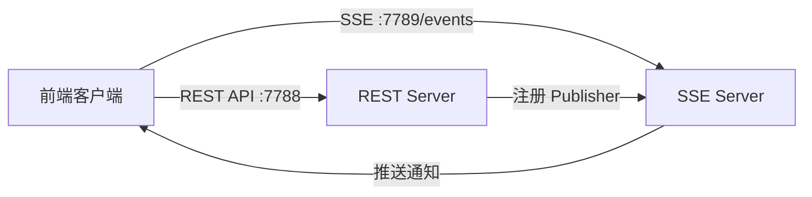

# SSE 实时推送

GoWind Admin 内置了基于 **Server-Sent Events (SSE)** 的实时推送服务，用于站内信即时通知等场景。本章将详细介绍 SSE 服务的架构设计、配置方法和二开实战。

## 一、SSE 架构概览

### 1.1 什么是 SSE

Server-Sent Events (SSE) 是一种基于 HTTP 的服务端推送技术，与 WebSocket 相比：

| 特性   | SSE           | WebSocket     |
|------|---------------|---------------|
| 协议   | HTTP/1.1+     | 独立协议 (ws/wss) |
| 方向   | 服务端 → 客户端（单向） | 双向            |
| 重连   | 浏览器自动重连       | 需手动实现         |
| 数据格式 | 纯文本           | 文本/二进制        |
| 兼容性  | 所有现代浏览器       | 所有现代浏览器       |

SSE 非常适合**服务端主动向客户端推送通知**的场景，且实现简单、天然支持断线重连。

### 1.2 GoWind Admin 中的 SSE 服务

GoWind Admin 的后端运行了两个 HTTP 服务器：



- **REST Server** (`:7788`)：处理所有 CRUD 请求
- **SSE Server** (`:7789`)：独立的 SSE 推送服务器

### 1.3 核心组件

SSE 服务涉及以下核心组件：

| 组件                     | 路径                                             | 职责                  |
|------------------------|------------------------------------------------|---------------------|
| SSE Server             | `internal/server/sse_server.go`                | 创建和配置 SSE 服务器       |
| InternalMessageService | `internal/service/internal_message_service.go` | 消息管理 + SSE 订阅/授权/推送 |
| kratos-transport SSE   | 第三方库 `github.com/tx7do/kratos-transport`       | SSE Transport 实现    |

## 二、服务端实现

### 2.1 SSE Server 创建

在 `internal/server/sse_server.go` 中，SSE 服务器通过 Wire 注入：

```go
func NewSseServer(
    ctx *bootstrap.Context,
    internalMessageService *service.InternalMessageService,
) *sseServer.Server {
    cfg := ctx.GetConfig()

    if cfg == nil || cfg.Server == nil || cfg.Server.Sse == nil {
        return nil
    }

    srv := sse.NewSseServer(cfg.Server.Sse,
        sseServer.WithSubscriberFunction(internalMessageService.HandleSubscribe),
        sseServer.WithAuthorizeFunc(internalMessageService.HandleAuthorize),
    )

    internalMessageService.RegisterInternalMessagePublisher(srv)

    return srv
}
```

**关键设计**：

- 当配置中未启用 SSE（`cfg.Server.Sse == nil`）时，返回 `nil`，服务器不会被创建
- SSE Server 只注册了两个回调：**授权函数** 和 **订阅函数**
- 通过 `RegisterInternalMessagePublisher` 将 SSE 发布能力注入到消息服务中

### 2.2 客户端授权

SSE 连接需要通过 JWT Token 进行授权，在 `HandleAuthorize` 中实现：

```go
func (s *InternalMessageService) HandleAuthorize(_ *http.Request, token string) error {
    resp, err := s.authenticator.Authenticate(context.Background(), &authenticationV1.ValidateTokenRequest{
        ClientType:    s.clientType,
        Token:         token,
        TokenCategory: authenticationV1.TokenCategory_ACCESS,
    })
    if err != nil {
        return err
    }

    if resp.GetIsBlocked() {
        return authenticationV1.ErrorForbidden("token is blocked")
    }
    if !resp.GetIsValid() {
        return authenticationV1.ErrorUnauthorized("invalid token")
    }

    return nil
}
```

**授权流程**：
1. 从请求中提取 Access Token
2. 调用 `Authenticator.Authenticate` 验证 Token 有效性
3. 检查 Token 是否被拉黑（`IsBlocked`）
4. 检查 Token 是否有效（`IsValid`）
5. 全部通过后，允许建立 SSE 连接

### 2.3 消息订阅

客户端建立连接时触发 `HandleSubscribe` 回调：

```go
func (s *InternalMessageService) HandleSubscribe(streamID sse.StreamID, _ *sse.Subscriber) {
    s.log.Infof("subscriber [%s] connected", streamID)
}
```

SSE 服务使用 `streamID` 标识每个客户端连接，通常对应用户的 Access Token 值。

### 2.4 消息推送

消息推送的核心逻辑在 `sendNotification` 方法中：

```go
func (s *InternalMessageService) sendNotification(
    ctx context.Context, messageId uint32, recipientUserId uint32,
    senderUserId uint32, now *time.Time, title, content string,
) error {
    // 1. 创建收件记录
    recipient := &internalMessageV1.InternalMessageRecipient{
        MessageId:       trans.Ptr(messageId),
        RecipientUserId: trans.Ptr(recipientUserId),
        Status:          trans.Ptr(internalMessageV1.InternalMessageRecipient_SENT),
        Title:           trans.Ptr(title),
        Content:         trans.Ptr(content),
        // ...
    }

    entity, err := s.internalMessageRecipientRepo.Create(ctx, recipient)
    if err != nil {
        return err
    }

    // 2. 序列化消息为 JSON
    recipientJson, _ := json.Marshal(recipient)

    // 3. 查找该用户的所有在线 SSE 连接
    recipientStreamIds := s.authenticator.GetAccessTokens(ctx, s.clientType, recipientUserId)

    // 4. 向所有连接推送通知
    for _, streamId := range recipientStreamIds {
        s.internalMessagePublisher.Publish(ctx, sse.StreamID(streamId), &sse.Event{
            ID:    []byte(id.NewGUIDv4(false)),
            Data:  recipientJson,
            Event: []byte("notification"),
        })
    }

    return nil
}
```

**推送流程**：

1. 在数据库中创建收件记录（`InternalMessageRecipient`）
2. 将收件信息序列化为 JSON
3. 通过 `GetAccessTokens` 查找该用户的所有在线连接（支持多设备登录）
4. 遍历所有连接，通过 SSE 推送 `notification` 事件

### 2.5 发送消息入口

`SendMessage` 是发送站内信的 API 入口：

```go
func (s *InternalMessageService) SendMessage(
    ctx context.Context, req *internalMessageV1.SendMessageRequest,
) (*internalMessageV1.SendMessageResponse, error) {
    // 创建消息记录
    msg, err := s.internalMessageRepo.Create(ctx, &internalMessageV1.CreateInternalMessageRequest{
        Data: &internalMessageV1.InternalMessage{
            Title:      req.Title,
            Content:    trans.Ptr(req.GetContent()),
            Status:     trans.Ptr(internalMessageV1.InternalMessage_PUBLISHED),
            Type:       trans.Ptr(req.GetType()),
            CategoryId: req.CategoryId,
            // ...
        },
    })

    // 根据目标类型推送
    if req.GetTargetAll() {
        // 全员推送
        users, _ := s.userRepo.List(ctx, &paginationV1.PagingRequest{NoPaging: trans.Ptr(true)})
        for _, user := range users.Items {
            s.sendNotification(ctx, msg.GetId(), user.GetId(), ...)
        }
    } else if req.RecipientUserId != nil {
        // 单人推送
        s.sendNotification(ctx, msg.GetId(), req.GetRecipientUserId(), ...)
    } else if len(req.TargetUserIds) != 0 {
        // 多人推送
        for _, uid := range req.TargetUserIds {
            s.sendNotification(ctx, msg.GetId(), uid, ...)
        }
    }

    return &internalMessageV1.SendMessageResponse{MessageId: msg.GetId()}, nil
}
```

支持三种推送模式：
- **全员推送**（`TargetAll`）：向所有用户发送
- **单人推送**（`RecipientUserId`）：向指定用户发送
- **多人推送**（`TargetUserIds`）：向多个用户发送

## 三、配置说明

### 3.1 SSE 配置项

在 `configs/server.yaml` 中配置 SSE 服务：

```yaml
server:
  sse:
    addr: ":7789"        # SSE 监听地址
    codec: "json"        # 编解码格式
    path: "/events"      # SSE 端点路径
    auto_stream: true    # 自动创建 Stream
    auto_reply: false    # 自动回复（调试用）
```

| 配置项           | 说明                | 默认值       |
|---------------|-------------------|-----------|
| `addr`        | SSE 服务监听地址        | `:7789`   |
| `codec`       | 消息编解码格式           | `json`    |
| `path`        | SSE 订阅端点路径        | `/events` |
| `auto_stream` | 自动为每个订阅者创建 Stream | `true`    |
| `auto_reply`  | 收到消息后自动回复确认       | `false`   |

### 3.2 禁用 SSE

如果不使用 SSE 功能，只需将 `server.yaml` 中的 `sse` 节点删除或注释即可：

```yaml
server:
  rest:
    addr: ":7788"
    # ...
  # sse:                    # 注释掉 SSE 配置
  #   addr: ":7789"
  #   ...
```

此时 `NewSseServer` 会返回 `nil`，SSE 服务器不会被启动。

### 3.3 CORS 注意事项

由于 SSE Server 运行在独立端口（`:7789`），前端访问时需要注意跨域配置。前端开发环境中通常通过 Vite 的 Proxy 配置来解决。

## 四、前端对接

### 4.1 连接 SSE 服务

前端使用浏览器原生 `EventSource` API 连接 SSE：

```typescript
// 建立 SSE 连接（需要携带 Access Token）
const token = localStorage.getItem('access_token')
const eventSource = new EventSource(`http://localhost:7789/events?token=${token}`)

// 监听 notification 事件
eventSource.addEventListener('notification', (event) => {
  const message = JSON.parse(event.data)
  console.log('收到新通知:', message)

  // 更新 UI 通知气泡
  notificationStore.addNotification(message)
})

// 监听连接状态
eventSource.onopen = () => {
  console.log('SSE 连接已建立')
}

eventSource.onerror = (error) => {
  console.error('SSE 连接错误:', error)
  // 浏览器会自动重连
}
```

### 4.2 EventSource 封装建议

在生产环境中，建议封装一个 SSE 客户端类：

```typescript
class SseClient {
  private eventSource: EventSource | null = null
  private reconnectTimer: number | null = null

  connect(url: string, token: string) {
    this.disconnect()

    this.eventSource = new EventSource(`${url}?token=${token}`)

    this.eventSource.addEventListener('notification', (event) => {
      const data = JSON.parse(event.data)
      this.onMessage(data)
    })

    this.eventSource.onerror = () => {
      // SSE 自动重连失败后，手动延迟重连
      this.eventSource?.close()
      this.reconnectTimer = window.setTimeout(() => {
        this.connect(url, token)
      }, 5000)
    }
  }

  disconnect() {
    if (this.reconnectTimer) {
      clearTimeout(this.reconnectTimer)
    }
    this.eventSource?.close()
    this.eventSource = null
  }

  private onMessage(data: any) {
    // 处理消息，更新状态管理
  }
}
```

### 4.3 Vite Proxy 配置

开发环境下，可以在 `vite.config.ts` 中配置代理以解决跨域问题：

```typescript
export default defineConfig({
  server: {
    proxy: {
      '/events': {
        target: 'http://localhost:7789',
        changeOrigin: true,
        ws: false,  // SSE 不是 WebSocket
      },
    },
  },
})
```

## 五、数据模型

### 5.1 站内信相关表

SSE 推送的站内信涉及以下数据表：

| 表                             | 说明                |
|-------------------------------|-------------------|
| `internal_messages`           | 消息主表（标题、内容、类型、状态） |
| `internal_message_categories` | 消息分类              |
| `internal_message_recipients` | 收件记录（关联用户和消息）     |

### 5.2 SSE Event 数据结构

前端收到的 SSE 事件数据格式为 `InternalMessageRecipient` 的 JSON：

```json
{
  "id": 123,
  "messageId": 456,
  "recipientUserId": 1,
  "status": "SENT",
  "title": "系统通知",
  "content": "您有一条新消息",
  "createdBy": 2,
  "createdAt": "2026-01-15T10:30:00Z"
}
```

## 六、二开实战：自定义 SSE 事件类型

### 6.1 场景

假设需要在任务执行完成后通过 SSE 推送通知给管理员。

### 6.2 后端实现

首先创建一个 Service 方法来推送自定义事件：

```go
// 在 TaskService 中添加 SSE 推送能力
type TaskService struct {
    // ...
    publisher InternalMessagePublisher  // 复用现有 Publisher 接口
    authenticator *data.Authenticator
    clientType authenticationV1.ClientType
}

// PushTaskCompleteNotification 推送任务完成通知
func (s *TaskService) PushTaskCompleteNotification(
    ctx context.Context,
    taskName string,
    result string,
    adminUserIDs []uint32,
) error {
    notification := map[string]interface{}{
        "type":    "task_complete",
        "taskName": taskName,
        "result":  result,
        "time":    time.Now().Format(time.RFC3339),
    }
    notificationJson, _ := json.Marshal(notification)

    for _, uid := range adminUserIDs {
        // 获取该用户的所有在线连接
        streamIds := s.authenticator.GetAccessTokens(ctx, s.clientType, uid)
        for _, streamId := range streamIds {
            s.publisher.Publish(ctx, sse.StreamID(streamId), &sse.Event{
                ID:    []byte(id.NewGUIDv4(false)),
                Data:  notificationJson,
                Event: []byte("task_complete"),
            })
        }
    }
    return nil
}
```

### 6.3 前端监听

```typescript
eventSource.addEventListener('task_complete', (event) => {
  const data = JSON.parse(event.data)
  ElNotification({
    title: '任务完成',
    message: `${data.taskName} 已完成: ${data.result}`,
    type: 'success',
  })
})
```

## 七、最佳实践

### 7.1 连接管理

- **Token 刷新**：当 Access Token 刷新后，需要断开旧的 SSE 连接并建立新连接
- **页面可见性**：利用 `document.visibilityState` 在页面切换到后台时暂停处理，回到前台时恢复
- **多标签页**：浏览器对同一域名的 SSE 连接数有限制（通常 6 个），注意多标签页场景

### 7.2 消息可靠性

- SSE 推送只保证**在线用户**能收到，离线用户再次上线后应主动拉取未读消息
- 建议在 SSE 消息中只推送**通知摘要**，前端收到后通过 REST API 拉取完整数据
- `Last-Event-ID` 机制可用于断线重连后补发丢失的事件

### 7.3 性能考虑

- SSE 是长连接，注意服务端的连接数限制和内存占用
- 使用 `GetAccessTokens` 可查找用户的所有在线连接，支持多设备推送
- 如果在线用户量大，考虑使用 Redis Pub/Sub 做分布式推送

---

**相关文档**：

- [后端架构](/admin/backend-architecture.md)
- [后端模块](/admin/backend-modules.md)
- [事件总线架构](/admin/tutorial-eventbus-architecture.md)
