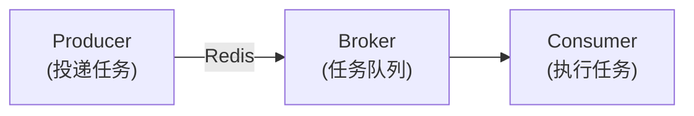

# 任务调度与异步处理教程

GoWind Admin 基于 Asynq 实现分布式任务队列，支持定时任务、延迟任务和异步任务。本教程深入讲解任务调度的架构设计、配置方法和实战场景。

## 一、Asynq 架构

### 1.1 核心组件



- **Producer**：任务生产者，负责投递任务到队列
- **Broker**：消息代理（Redis），存储任务队列
- **Consumer**：任务消费者，从队列中取出任务并执行

### 1.2 队列优先级

Asynq 支持多队列优先级配置（`server.yaml`）：

```yaml
asynq:
  uri: "redis://:*Abcd123456@redis:6379/1"
  concurrency: 10              # 并发 worker 数量
  queues:
    critical: 10               # 高优先级队列（权重 10）
    default: 5                 # 默认队列（权重 5）
    low: 1                     # 低优先级队列（权重 1）
```

**工作原理**：Worker 会优先从高权重队列中取任务。

### 1.3 任务类型

| 类型       | 说明      | 示例                |
|----------|---------|-------------------|
| **立即任务** | 立即执行    | 发送邮件、发送短信         |
| **延迟任务** | 指定时间后执行 | 10 分钟后重试、30 分钟后提醒 |
| **定时任务** | 周期性执行   | 每天凌晨备份、每小时统计      |

## 二、任务定义

### 2.1 定义任务类型

在 `pkg/task/` 目录下定义任务类型常量：

```go
package task

const (
    TypeSendEmail           = "email:send"
    TypeSendSMS             = "sms:send"
    TypeCleanupTempFiles    = "file:cleanup_temp"
    TypeGenerateReport      = "report:generate"
    TypeSyncData            = "data:sync"
)
```

**命名规则**：采用 `模块:操作` 格式，使用冒号分隔，全小写。任务名必须全局唯一，建议语义明确（避免 `task1` 等模糊命名）。

> **特殊特性**：注册 `email:send` 后，`email:send:1` 等变体也会被 `email:send` 的处理器处理，可用于任务分组。

### 2.2 定义任务载荷

每个任务携带一个 JSON 载荷（Payload）：

```go
type SendEmailPayload struct {
    To      string `json:"to"`
    Subject string `json:"subject"`
    Body    string `json:"body"`
}

type CleanupTempFilesPayload struct {
    Directory string `json:"directory"`
    OlderThan int64  `json:"older_than"`  // 秒
}
```

## 三、任务处理器

### 3.1 注册任务处理器

在 `app/admin/service/internal/server/asynq_server.go` 中注册：

```go
func NewAsynqServer(ctx *bootstrap.Context, logger log.Logger) *asynq.Server {
    cfg := ctx.GetConfig().GetServer().GetAsynq()
    
    srv := asynq.NewServer(
        asynq.RedisClientOpt{Addr: cfg.Uri},
        asynq.Config{
            Concurrency: int(cfg.Concurrency),
            Queues:      parseQueues(cfg.Queues),
        },
    )
    
    // 注册任务处理器
    mux := asynq.NewServeMux()
    mux.HandleFunc(task.TypeSendEmail, handleSendEmail)
    mux.HandleFunc(task.TypeSendSMS, handleSendSMS)
    mux.HandleFunc(task.TypeCleanupTempFiles, handleCleanupTempFiles)
    mux.HandleFunc(task.TypeGenerateReport, handleGenerateReport)
    
    go func() {
        if err := srv.Run(mux); err != nil {
            log.Errorf("asynq server error: %v", err)
        }
    }()
    
    return srv
}
```

### 3.2 实现任务处理器

```go
func handleSendEmail(ctx context.Context, t *asynq.Task) error {
    var payload task.SendEmailPayload
    if err := json.Unmarshal(t.Payload(), &payload); err != nil {
        return fmt.Errorf("unmarshal payload failed: %v", err)
    }
    
    log.Infof("sending email to %s: %s", payload.To, payload.Subject)
    
    // 调用邮件服务
    err := emailService.Send(&email.SendRequest{
        To:      payload.To,
        Subject: payload.Subject,
        Body:    payload.Body,
    })
    
    if err != nil {
        log.Errorf("send email failed: %v", err)
        return err  // 返回错误会触发重试
    }
    
    log.Infof("email sent successfully to %s", payload.To)
    return nil
}

func handleCleanupTempFiles(ctx context.Context, t *asynq.Task) error {
    var payload task.CleanupTempFilesPayload
    json.Unmarshal(t.Payload(), &payload)
    
    log.Infof("cleaning temp files in %s older than %d seconds", 
        payload.Directory, payload.OlderThan)
    
    // 清理逻辑
    cutoffTime := time.Now().Add(-time.Duration(payload.OlderThan) * time.Second)
    files, _ := ioutil.ReadDir(payload.Directory)
    
    for _, file := range files {
        if file.ModTime().Before(cutoffTime) {
            os.Remove(filepath.Join(payload.Directory, file.Name()))
            log.Infof("deleted file: %s", file.Name())
        }
    }
    
    return nil
}
```

## 四、投递任务

### 4.1 立即任务

```go
import "github.com/hibiken/asynq"

// 投递立即执行的任务
func EnqueueSendEmail(to, subject, body string) error {
    payload := task.SendEmailPayload{
        To:      to,
        Subject: subject,
        Body:    body,
    }
    
    data, _ := json.Marshal(payload)
    
    _, err := asynqClient.Enqueue(asynq.NewTask(task.TypeSendEmail, data))
    return err
}

// 使用
EnqueueSendEmail("user@example.com", "欢迎", "欢迎使用 GoWind Admin")
```

### 4.2 延迟任务

```go
// 10 分钟后执行
func EnqueueDelayedTask() error {
    payload := task.SendEmailPayload{...}
    data, _ := json.Marshal(payload)
    
    task := asynq.NewTask(task.TypeSendEmail, data)
    
    _, err := asynqClient.EnqueueIn(10*time.Minute, task)
    return err
}

// 指定时间点执行
func EnqueueAtSpecificTime() error {
    payload := task.SendEmailPayload{...}
    data, _ := json.Marshal(payload)
    
    task := asynq.NewTask(task.TypeSendEmail, data)
    
    executeAt := time.Now().Add(1 * time.Hour)
    _, err := asynqClient.EnqueueAt(executeAt, task)
    return err
}
```

### 4.3 定时任务

```go
// 每天凌晨 2 点执行
func RegisterPeriodicTask() {
    payload := task.CleanupTempFilesPayload{
        Directory: "/tmp/uploads",
        OlderThan: 86400,  // 24 小时
    }
    data, _ := json.Marshal(payload)
    
    opts := []asynq.Option{
        asynq.Queue("default"),
        asynq.MaxRetry(3),
        asynq.Timeout(10 * time.Minute),
    }
    
    // Cron 表达式：秒 分 时 日 月 周
    // "0 2 * * *" = 每天凌晨 2 点
    scheduler.RegisterPeriodicTask(
        "cleanup_temp_files_daily",
        "0 2 * * *",
        asynq.NewTask(task.TypeCleanupTempFiles, data),
        opts...,
    )
}
```

### 4.4 指定队列和优先级

```go
// 投递到高优先级队列
func EnqueueCriticalTask() error {
    payload := task.SendEmailPayload{...}
    data, _ := json.Marshal(payload)
    
    task := asynq.NewTask(task.TypeSendEmail, data)
    
    _, err := asynqClient.Enqueue(task, asynq.Queue("critical"))
    return err
}
```

## 五、任务重试与错误处理

### 5.1 自动重试

Asynq 支持自动重试，配置重试策略：

```go
_, err := asynqClient.Enqueue(task, 
    asynq.MaxRetry(3),              // 最多重试 3 次
    asynq.Timeout(5*time.Minute),   // 超时时间
    asynq.RetryIn(1*time.Minute),   // 重试间隔
)
```

**重试间隔策略**：
- 第 1 次失败：1 分钟后重试
- 第 2 次失败：2 分钟后重试
- 第 3 次失败：4 分钟后重试（指数退避）

### 5.2 自定义重试逻辑

```go
func handleSendEmail(ctx context.Context, t *asynq.Task) error {
    var payload task.SendEmailPayload
    json.Unmarshal(t.Payload(), &payload)
    
    err := emailService.Send(&email.SendRequest{...})
    
    if err != nil {
        // 判断是否应该重试
        if isTemporaryError(err) {
            // 返回错误，触发重试
            return err
        } else {
            // 永久性错误，不重试
            log.Errorf("permanent error, won't retry: %v", err)
            return nil
        }
    }
    
    return nil
}

func isTemporaryError(err error) bool {
    // 判断是否为临时错误（如网络超时）
    return strings.Contains(err.Error(), "timeout") ||
           strings.Contains(err.Error(), "connection refused")
}
```

### 5.3 死信队列

重试次数耗尽后，任务进入死信队列（Dead Letter Queue）：

```go
// 监控死信队列
func MonitorDeadLetterQueue() {
    deadLetters, _ := asynqClient.ListDeadLetters()
    
    for _, dl := range deadLetters {
        log.Errorf("dead letter task: type=%s, error=%s", 
            dl.Type, dl.Error)
        
        // 可以手动重新入队或记录告警
    }
}
```

## 六、任务监控

### 6.1 Asynqmon Web UI

[Asynqmon](https://github.com/hibiken/asynqmon) 是 Asynq 官方提供的独立 Web 监控工具，用于监视和管理任务队列。推荐通过 Docker 安装：

```shell
# 拉取镜像
docker pull hibiken/asynqmon:latest

# 启动 Asynqmon
docker run -d \
    --name asynqmon \
    -p 8080:8080 \
    hibiken/asynqmon:latest \
    --redis-url=redis://:*Abcd123456@host.docker.internal:6379/1
```

> **提示**：`--redis-url` 请替换为你实际的 Redis 连接地址。如果 Redis 也运行在 Docker 中，可使用容器名代替 `host.docker.internal`。

启动后访问 <http://localhost:8080> 即可打开监控界面，可查看：

- **仪表盘**：队列概览、任务处理速率、错误统计
- **任务视图**：活跃任务、排队任务、已完成任务、失败任务、定时任务
- **性能指标**：任务处理延迟、吞吐量等 Metrics

### 6.2 CLI 命令行工具

Asynq 还提供命令行工具，方便在终端中查看任务状态：

```shell
# 安装 CLI 工具
go install github.com/hibiken/asynq/tools/asynq@latest

# 查看队列状态
asynq stats

# 查看任务详情
asynq task info <task-id>

# 启动监控面板
asynq dash
```

### 6.3 任务日志

在任务处理器中记录详细日志：

```go
func handleGenerateReport(ctx context.Context, t *asynq.Task) error {
    taskID := t.ID()
    log.Infof("[task:%s] starting report generation", taskID)
    
    startTime := time.Now()
    
    // 执行任务
    err := generateReport()
    
    elapsed := time.Since(startTime)
    if err != nil {
        log.Errorf("[task:%s] failed after %v: %v", taskID, elapsed, err)
        return err
    }
    
    log.Infof("[task:%s] completed in %v", taskID, elapsed)
    return nil
}
```

### 6.4 任务审计日志

将任务执行结果记录到数据库：

```go
func handleSendEmail(ctx context.Context, t *asynq.Task) error {
    var payload task.SendEmailPayload
    json.Unmarshal(t.Payload(), &payload)
    
    // 创建审计记录
    auditLog := &TaskAuditLog{
        TaskType:   task.TypeSendEmail,
        Payload:    string(t.Payload()),
        Status:     "pending",
        StartedAt:  time.Now(),
    }
    auditLogRepo.Create(ctx, auditLog)
    
    // 执行任务
    err := emailService.Send(...)
    
    // 更新审计记录
    if err != nil {
        auditLog.Status = "failed"
        auditLog.Error = err.Error()
    } else {
        auditLog.Status = "success"
    }
    auditLog.CompletedAt = time.Now()
    auditLogRepo.Update(ctx, auditLog)
    
    return err
}
```

## 七、实战场景

### 7.1 场景一：用户注册后发送欢迎邮件

```go
// 在用户注册成功后投递任务
func (s *UserService) Register(ctx context.Context, req *RegisterRequest) error {
    // 1. 创建用户
    user, err := s.userRepo.Create(ctx, req)
    if err != nil {
        return err
    }
    
    // 2. 异步发送欢迎邮件
    task.EnqueueSendEmail(user.Email, "欢迎加入", "欢迎使用 GoWind Admin！")
    
    return nil
}
```

### 7.2 场景二：订单超时自动取消

```go
// 创建订单时投递延迟任务
func (s *OrderService) CreateOrder(ctx context.Context, req *CreateOrderRequest) error {
    order, _ := s.orderRepo.Create(ctx, req)
    
    // 30 分钟后自动取消未支付订单
    payload := task.CancelOrderPayload{
        OrderID: order.ID,
    }
    data, _ := json.Marshal(payload)
    
    asynqClient.EnqueueIn(30*time.Minute, 
        asynq.NewTask(task.TypeCancelOrder, data))
    
    return nil
}

// 任务处理器
func handleCancelOrder(ctx context.Context, t *asynq.Task) error {
    var payload task.CancelOrderPayload
    json.Unmarshal(t.Payload(), &payload)
    
    order, _ := orderRepo.Get(ctx, payload.OrderID)
    
    if order.Status == Order_UNPAID {
        orderRepo.UpdateStatus(ctx, payload.OrderID, Order_CANCELLED)
        log.Infof("order %d auto-cancelled due to timeout", payload.OrderID)
    }
    
    return nil
}
```

### 7.3 场景三：每日数据报表生成

```go
// 注册定时任务
func RegisterDailyReportTask() {
    payload := task.GenerateReportPayload{
        ReportType: "daily_sales",
        Date:       time.Now().Format("2006-01-02"),
    }
    data, _ := json.Marshal(payload)
    
    scheduler.RegisterPeriodicTask(
        "daily_sales_report",
        "0 8 * * *",  // 每天早上 8 点
        asynq.NewTask(task.TypeGenerateReport, data),
        asynq.Queue("low"),
        asynq.MaxRetry(2),
    )
}

// 任务处理器
func handleGenerateReport(ctx context.Context, t *asynq.Task) error {
    var payload task.GenerateReportPayload
    json.Unmarshal(t.Payload(), &payload)
    
    log.Infof("generating %s report for %s", 
        payload.ReportType, payload.Date)
    
    // 查询数据
    data := queryReportData(payload.ReportType, payload.Date)
    
    // 生成 Excel
    excelFile := generateExcel(data)
    
    // 上传到 OSS
    url := oss.UploadFile("reports", 
        fmt.Sprintf("%s_%s.xlsx", payload.ReportType, payload.Date), 
        excelFile)
    
    // 发送邮件通知
    task.EnqueueSendEmail(
        "manager@example.com",
        fmt.Sprintf("%s 报表已生成", payload.ReportType),
        fmt.Sprintf("下载链接：%s", url),
    )
    
    return nil
}
```

### 7.4 场景四：批量数据同步

```go
// 从外部 API 同步数据
func EnqueueDataSyncTask(source string) error {
    payload := task.SyncDataPayload{
        Source: source,
    }
    data, _ := json.Marshal(payload)
    
    _, err := asynqClient.Enqueue(
        asynq.NewTask(task.TypeSyncData, data),
        asynq.Queue("default"),
        asynq.MaxRetry(5),
        asynq.Timeout(30*time.Minute),  // 允许长时间运行
    )
    
    return err
}

func handleSyncData(ctx context.Context, t *asynq.Task) error {
    var payload task.SyncDataPayload
    json.Unmarshal(t.Payload(), &payload)
    
    log.Infof("syncing data from %s", payload.Source)
    
    // 分页同步
    page := 1
    for {
        records, hasMore := fetchDataFromSource(payload.Source, page)
        
        for _, record := range records {
            // 插入或更新数据库
            upsertRecord(record)
        }
        
        if !hasMore {
            break
        }
        page++
    }
    
    log.Infof("data sync completed from %s", payload.Source)
    return nil
}
```

## 八、Lua 脚本中的任务投递

在 Lua 脚本中可以方便地投递任务：

```lua
-- scripts/on_user_registered.lua

eventbus.subscribe("user.created", function(event)
    local user_id = event.user_id
    local email = event.email
    
    -- 投递异步任务
    task.enqueue("send_welcome_email", {
        user_id = user_id,
        email = email
    })
    
    -- 投递延迟任务（1 天后发送提醒）
    task.enqueue_in("send_onboarding_reminder", 86400, {
        user_id = user_id
    })
end)
```

## 九、性能优化

### 9.1 批量投递

避免循环投递单个任务，使用批量接口：

```go
// ❌ 错误做法
for _, user := range users {
    EnqueueSendEmail(user.Email, ...)
}

// ✅ 正确做法
var tasks []*asynq.Task
for _, user := range users {
    payload := task.SendEmailPayload{...}
    data, _ := json.Marshal(payload)
    tasks = append(tasks, asynq.NewTask(task.TypeSendEmail, data))
}

asynqClient.EnqueueBatch(tasks)
```

### 9.2 调整并发度

根据服务器资源和任务耗时调整并发 worker 数量：

```yaml
asynq:
  concurrency: 20  # CPU 密集型任务调小，I/O 密集型任务调大
```

### 9.3 任务分组

将相关任务分组，避免相互阻塞：

```go
// 邮件任务独立队列
asynqClient.Enqueue(task, asynq.Queue("email"))

// 报表任务独立队列
asynqClient.Enqueue(task, asynq.Queue("report"))
```

## 十、常见问题

### Q1: 任务执行失败怎么办？

1. 查看 Asynq Monitor UI 中的失败任务
2. 检查日志中的错误信息
3. 手动重新入队或修复后重试

### Q2: 如何保证任务不丢失？

Asynq 基于 Redis，确保：
1. Redis 持久化配置（AOF + RDB）
2. 任务投递成功后再返回
3. 重要任务记录审计日志

### Q3: 如何处理长时间运行的任务？

1. 增加超时时间：`asynq.Timeout(1*time.Hour)`
2. 定期检查上下文取消信号
3. 将大任务拆分为多个小任务

### Q4: 如何在开发环境调试任务？

本地启动 Redis 和 Asynq Server：

```shell
# 启动 Redis
docker run -d -p 6379:6379 redis

# 启动后端服务（包含 Asynq Server）
gow run admin
```

访问 Asynqmon（参考 [6.1 Asynqmon Web UI](#_6-1-asynqmon-web-ui)）查看任务状态。

## 十一、相关文档

- [后端配置与部署](./backend-config-deploy.md)
- [Lua 脚本扩展实战](./tutorial-lua-extension.md)
- [事件总线与解耦架构](./tutorial-eventbus-architecture.md)
