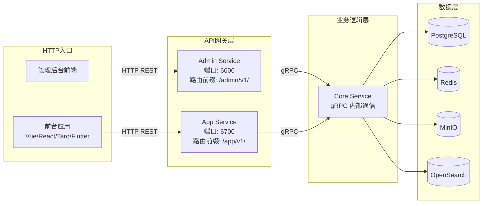
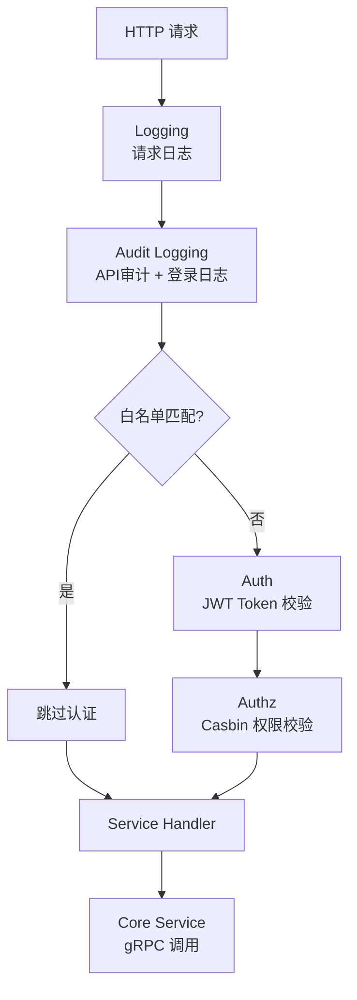
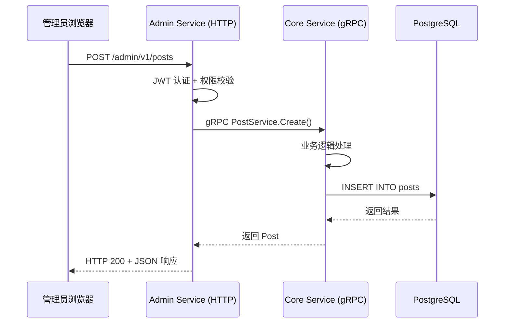

# CMS 后端架构总览

GoWind CMS 后端基于 go-kratos 微服务框架构建，采用 **三服务架构**（Admin Service / App Service / Core Service），实现了管理接口、前台接口与核心业务逻辑的分层解耦。

## 一、三服务架构

CMS 后端最大的特点是 **三层服务分离**，与 GoWind Admin 的单服务架构不同：



### 为什么需要三服务？

| 问题 | Admin 单服务方案 | CMS 三服务方案 |
|------|-----------------|---------------|
| 前台和管理后台共用接口？ | 安全风险大，前台用户可能触发管理操作 | 前台和后台 API 物理隔离 |
| 业务逻辑复用？ | 代码复制或循环依赖 | Core Service 统一提供，gRPC 调用 |
| 权限模型不同？ | 前台用户和后台管理员混在同一白名单 | 各自独立的认证白名单 |
| 独立扩展？ | 无法单独扩展前台或后台 | Admin/App 可独立部署、独立扩容 |

### 服务职责

| 服务 | 目录 | 协议 | 端口 | 职责 |
|------|------|------|------|------|
| **Admin Service** | `app/admin/service/` | HTTP REST + SSE | REST: 6600, SSE: 6601 | 管理后台 API，40+ Service，对接管理前端 |
| **App Service** | `app/app/service/` | HTTP REST + SSE | REST: 6700, SSE: 6701 | 前台应用 API，9 个 Service，对接各终端前台 |
| **Core Service** | `app/core/service/` | gRPC（仅内部） | 动态分配 | 核心业务逻辑 + 数据层，不对外暴露 |

## 二、Admin Service 详解

Admin Service 是管理后台的 API 网关层，接收 HTTP 请求后通过 gRPC 调用 Core Service。

### 架构分层

```
app/admin/service/
├── cmd/server/              # 启动入口
│   ├── assets/              # 内嵌静态资源（OpenAPI 文档）
│   ├── configs/             # 配置文件
│   └── main.go              # 程序入口
└── internal/
    ├── server/              # 服务器层 — 注册 HTTP 路由、中间件
    │   ├── rest_server.go   # REST 服务器（注册所有 Service Handler）
    │   ├── grpc_server.go   # gRPC 客户端（连接 Core Service）
    │   └── sse_server.go    # SSE 服务器（实时推送）
    ├── service/             # 服务层 — 请求转发到 Core Service
    │   ├── post_service.go  # 帖子服务（转发到 coreService）
    │   ├── user_service.go  # 用户服务
    │   └── ...              # 40+ Service
    └── data/                # 数据层（Admin 层通常不需要直接数据库访问）
```

### Admin Service 的转发模式

Admin Service 中的每个 Service 本质上是一个 **gRPC 客户端代理**，将 HTTP 请求转发给 Core Service：

```go
// app/admin/service/internal/service/post_service.go
type PostService struct {
    adminV1.PostServiceHTTPServer       // 实现生成的 HTTP 接口

    postClient contentV1.PostServiceClient // gRPC 客户端，调用 Core Service
    log       *log.Helper
}

// List 直接转发到 Core Service
func (s *PostService) List(ctx context.Context, req *paginationV1.PagingRequest) (*contentV1.ListPostResponse, error) {
    return s.postClient.List(ctx, req)
}
```

### 中间件链

Admin Service 的中间件配置（`rest_server.go`）：



认证白名单（免登录接口）目前只有登录接口：`OperationAuthenticationServiceLogin`。

## 三、App Service 详解

App Service 是前台应用的 API 网关层，相比 Admin Service 接口更精简，权限白名单更宽松。

### 架构分层

```
app/app/service/
├── cmd/server/
│   ├── assets/
│   ├── configs/
│   └── main.go
└── internal/
    ├── server/
    │   ├── rest_server.go       # REST 服务器
    │   └── sse_server.go        # SSE 服务器
    └── service/                  # 9 个 Service（精简版）
        ├── authentication_service.go
        ├── post_service.go
        ├── category_service.go
        ├── tag_service.go
        ├── comment_service.go
        ├── page_service.go
        ├── navigation_service.go
        ├── user_profile_service.go
        └── file_transfer_service.go
```

### 前台公开接口白名单

App Service 的认证白名单更宽松，内容浏览类接口均免登录：

```go
// app/app/service/internal/server/rest_server.go
rpc.AddWhiteList(
    appV1.OperationAuthenticationServiceLogin,

    // 以下接口无需登录即可访问
    appV1.OperationNavigationServiceList,
    appV1.OperationPageServiceList,
    appV1.OperationPostServiceList,
    appV1.OperationCategoryServiceList,
    appV1.OperationCommentServiceList,
    appV1.OperationTagServiceList,

    appV1.OperationPageServiceGet,
    appV1.OperationPostServiceGet,
    appV1.OperationCategoryServiceGet,
    appV1.OperationCommentServiceGet,
    appV1.OperationTagServiceGet,
)
```

### 前台认证差异

App Service 的登录服务会自动设置 `ClientType = app`，与管理后台区分令牌类型：

```go
// app/app/service/internal/service/authentication_service.go
func (s *AuthenticationService) Login(ctx context.Context, req *authenticationV1.LoginRequest) (*authenticationV1.LoginResponse, error) {
    req.ClientType = trans.Ptr(authenticationV1.ClientType_app) // 标记为前台用户
    return s.authenticationServiceClient.Login(ctx, req)
}
```

## 四、Core Service 详解

Core Service 是整个系统的 **业务逻辑核心**，包含所有数据访问和业务规则。

### 架构分层

```
app/core/service/
├── cmd/server/
│   ├── configs/
│   └── main.go
└── internal/
    ├── server/
    │   └── grpc_server.go         # gRPC 服务器（注册所有 Service）
    ├── service/                    # 业务逻辑层（39 个 Service）
    │   ├── post_service.go         # 帖子业务逻辑
    │   ├── user_service.go         # 用户业务逻辑
    │   ├── authentication_service.go
    │   └── ...
    └── data/                       # 数据访问层（60+ Repository）
        ├── ent/                    # Ent ORM 生成代码（343 个文件）
        ├── post_repo.go            # 帖子仓储
        ├── post_translation_repo.go # 帖子翻译仓储
        ├── user_repo.go            # 用户仓储
        └── ...
```

### Core Service 的业务逻辑

与 Admin/App Service 的纯转发不同，Core Service 包含实际的业务逻辑：

```go
// app/core/service/internal/service/post_service.go
func (s *PostService) Create(ctx context.Context, req *contentV1.CreatePostRequest) (*contentV1.Post, error) {
    // 业务规则：新帖子默认状态为"已发布"
    if req.Data.Status == nil {
        req.Data.Status = trans.Ptr(contentV1.Post_POST_STATUS_PUBLISHED)
    }
    return s.postRepo.Create(ctx, req)
}

// 翻译相关的完整业务逻辑
func (s *PostService) TranslationExists(ctx context.Context, req *contentV1.PostTranslationExistsRequest) (*contentV1.PostTranslationExistsResponse, error) {
    exists, err := s.postRepo.TranslationExists(ctx, req.GetPostId(), req.GetLanguageCode())
    ...
}
```

### Core Service 的任务调度

Core Service 还集成了基于 Asynq 的异步任务调度：

```yaml
# app/core/service/configs/server.yaml
server:
  asynq:
    uri: "redis://:*Abcd123456@redis:6379/1"
    enable_gracefully_shutdown: true
    shutdown_timeout: 3s
    codec: "json"
```

## 五、服务间通信

### gRPC 调用链



### 服务注册与发现

三个服务通过 Etcd 进行服务注册和发现：

```yaml
# registry.yaml
registry:
  type: "etcd"
  etcd:
    endpoints:
      - "localhost:2379"
```

- **Core Service** 启动时注册到 Etcd
- **Admin Service** 和 **App Service** 启动时从 Etcd 发现 Core Service 的 gRPC 地址
- 自动支持 Core Service 的多实例负载均衡

## 六、数据访问层

Core Service 的数据层使用 **Ent ORM** 框架，为每个业务实体提供独立的 Repository。

### Repository 模式

```go
// app/core/service/internal/data/post_repo.go
type PostRepo struct {
    data *Data  // Ent 数据库客户端
    log  *log.Helper
}

func (r *PostRepo) List(ctx context.Context, req *paginationV1.PagingRequest) (*contentV1.ListPostResponse, error) {
    // 使用 Ent 客户端查询
    // 支持分页、排序、字段过滤
}

func (r *PostRepo) Create(ctx context.Context, req *contentV1.CreatePostRequest) (*contentV1.Post, error) {
    // 使用 Ent 客户端创建
    // 自动处理分类、标签关联
}
```

### 内容翻译仓储

CMS 独有的翻译仓储，为每个内容实体提供独立的翻译数据访问：

| Repository | 说明 |
|------------|------|
| `post_translation_repo.go` | 帖子多语言翻译 |
| `category_translation_repo.go` | 分类多语言翻译 |
| `tag_translation_repo.go` | 标签多语言翻译 |
| `page_translations_repo.go` | 页面多语言翻译 |
| `dict_entry_i18n_repo.go` | 字典国际化 |

## 七、与 GoWind Admin 架构对比

| 对比项 | GoWind Admin | GoWind CMS |
|--------|-------------|------------|
| 服务数量 | 1 个（Admin Service） | 3 个（Admin + App + Core） |
| 前台 API | 无 | 独立的 App Service |
| 业务逻辑层 | 与 HTTP Handler 在同一服务 | 独立的 Core Service |
| 服务间通信 | 进程内调用 | gRPC 跨服务调用 |
| 内容翻译 | 无 | 完整的翻译仓储体系 |
| 任务调度 | Asynq（同服务内） | Asynq（独立 Core Service） |
| Ent 实体 | 系统管理类 | 系统管理 + 内容管理类 |

## 八、相关文档

- [CMS Protobuf API 定义](./backend-api.md)
- [CMS 前端架构](./frontend-architecture.md)
- [CMS 安装指南](./installation.md)
- [GoWind Admin 后端架构](/admin/backend-architecture.md) — 共享技术基座
