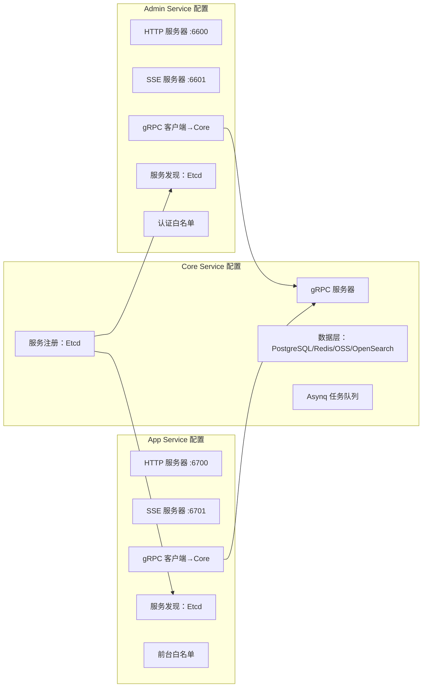
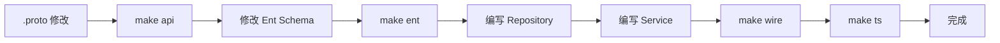
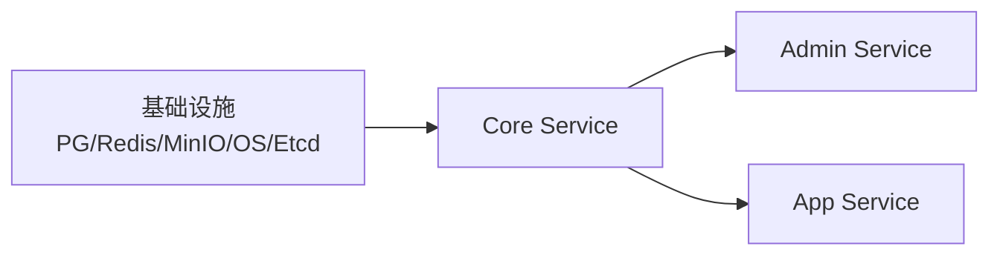

# CMS 配置与部署指南

GoWind CMS 采用三服务架构（Admin / App / Core），配置管理比单服务系统更复杂。本文档详细介绍各服务的配置文件、环境变量、代码生成和服务管理。

## 一、配置文件组织

### 1.1 目录结构

```
app/
├── core/service/configs/
│   ├── server.yaml          # Core Service 配置（gRPC + Asynq + 数据层）
│   └── registry.yaml        # 服务注册（Etcd）
├── admin/service/configs/
│   ├── server.yaml          # Admin Service 配置（HTTP + gRPC 客户端）
│   └── registry.yaml
└── app/service/configs/
    ├── server.yaml           # App Service 配置（HTTP + gRPC 客户端）
    └── registry.yaml
```

### 1.2 三服务配置关系



## 二、Core Service 配置

### 2.1 server.yaml

```yaml
# app/core/service/configs/server.yaml
server:
  # gRPC 服务器（内部通信）
  grpc:
    addr: "0.0.0.0:0"              # 端口由 Etcd 动态分配
    timeout: 60s

  # Asynq 异步任务
  asynq:
    uri: "redis://:*Abcd123456@redis:6379/1"
    enable_gracefully_shutdown: true
    shutdown_timeout: 3s
    codec: "json"
    concurrency: 10
    queues:
      critical: 10
      default: 5
      low: 1

# 数据层配置
data:
  database:
    driver: postgres
    source: "host=postgres port=5432 user=postgres password=*Abcd123456 dbname=cms sslmode=disable"

  redis:
    addr: "redis:6379"
    password: "*Abcd123456"
    db: 0
    read_timeout: 0.2s
    write_timeout: 0.2s

  # 对象存储
  oss:
    type: "minio"                    # minio / local / s3
    endpoint: "minio:9000"
    access_key: "minioadmin"
    secret_key: "minioadmin"
    bucket: "cms"
    use_ssl: false

  # 搜索引擎
  search:
    type: "opensearch"
    endpoint: "http://opensearch:9200"
    username: "admin"
    password: "admin"

# 链路追踪
tracer:
  enabled: true
  provider: jaeger
  endpoint: "http://jaeger:14268/api/traces"
```

### 2.2 registry.yaml

```yaml
# app/core/service/configs/registry.yaml
registry:
  type: "etcd"
  etcd:
    endpoints:
      - "etcd:2379"
    timeout: 5s
    ttl: 10                           # 注册 TTL
```

## 三、Admin Service 配置

### 3.1 server.yaml

```yaml
# app/admin/service/configs/server.yaml
server:
  # REST HTTP 服务器
  rest:
    addr: "0.0.0.0:6600"
    timeout: 5s

  # SSE 服务器
  sse:
    addr: "0.0.0.0:6601"

# gRPC 客户端（连接 Core Service）
client:
  grpc:
    core:
      target: "discovery:///cms-core-service"   # 通过 Etcd 发现
      timeout: 5s

# 服务发现
registry:
  type: "etcd"
  etcd:
    endpoints:
      - "etcd:2379"

# JWT 配置
auth:
  jwt:
    secret: "your-jwt-secret-key"
    issuer: "cms-admin"
    expire: 86400                        # Token 有效期（秒）

# 权限引擎
authorizer:
  type: "casbin"
  model: "configs/rbac_model.conf"

# CORS
cors:
  enabled: true
  allow_origins:
    - "http://localhost:5666"
    - "https://admin.cms.gowind.cloud"
```

### 3.2 认证白名单

```go
// app/admin/service/internal/server/rest_server.go
// Admin 白名单：仅登录接口免认证
rpc.AddWhiteList(
    adminV1.OperationAuthenticationServiceLogin,
)
```

## 四、App Service 配置

### 4.1 server.yaml

```yaml
# app/app/service/configs/server.yaml
server:
  rest:
    addr: "0.0.0.0:6700"
    timeout: 5s

  sse:
    addr: "0.0.0.0:6701"

client:
  grpc:
    core:
      target: "discovery:///cms-core-service"
      timeout: 5s

registry:
  type: "etcd"
  etcd:
    endpoints:
      - "etcd:2379"

auth:
  jwt:
    secret: "your-jwt-secret-key"
    issuer: "cms-app"
    expire: 604800                      # 前台 Token 7 天有效

# CORS（前台需要更宽松的跨域）
cors:
  enabled: true
  allow_origins:
    - "*"
  allow_methods: [GET, POST, PUT, DELETE, OPTIONS]
  allow_headers: [Authorization, Content-Type, Accept-Language]
```

### 4.2 前台白名单

```go
// app/app/service/internal/server/rest_server.go
// App 白名单：内容浏览类接口免认证
rpc.AddWhiteList(
    appV1.OperationAuthenticationServiceLogin,

    // 内容浏览（免登录）
    appV1.OperationPostServiceList,
    appV1.OperationPostServiceGet,
    appV1.OperationCategoryServiceList,
    appV1.OperationCategoryServiceGet,
    appV1.OperationTagServiceList,
    appV1.OperationTagServiceGet,
    appV1.OperationPageServiceList,
    appV1.OperationPageServiceGet,
    appV1.OperationCommentServiceList,
    appV1.OperationCommentServiceGet,
    appV1.OperationNavigationServiceList,
)
```

## 五、代码生成

### 5.1 Make 命令

```makefile
# Makefile
.PHONY: gen api ent wire ts openapi

# 一键生成所有代码
gen: api ent wire ts openapi

# 生成 Protobuf Go 代码
api:
	buf generate

# 生成 Ent ORM 代码
ent:
	go generate ./app/core/service/internal/data/ent

# 生成 Wire 依赖注入代码
wire:
	cd app/core/service/cmd/server && wire
	cd app/admin/service/cmd/server && wire
	cd app/app/service/cmd/server && wire

# 生成 TypeScript 客户端代码
ts:
	buf generate --path api/protos/admin
	buf generate --path api/protos/app

# 生成 OpenAPI 文档
openapi:
	buf generate --template buf.openapi.gen.yaml
```

### 5.2 开发工作流



## 六、服务管理

### 6.1 gow CLI

```bash
# 启动单个服务
gow run core
gow run admin
gow run app

# 指定配置文件
gow run admin -conf ./configs

# 带环境变量
DB_HOST=localhost gow run core
```

### 6.2 启动顺序



Core Service 必须先启动并注册到 Etcd，Admin 和 App 通过 Etcd 发现 Core。

## 七、环境变量

| 环境变量 | 默认值 | 说明 |
|---------|--------|------|
| `DB_HOST` | postgres | 数据库地址 |
| `DB_PASSWORD` | - | 数据库密码 |
| `REDIS_HOST` | redis | Redis 地址 |
| `REDIS_PASSWORD` | - | Redis 密码 |
| `OSS_ENDPOINT` | minio:9000 | 对象存储地址 |
| `OS_HOST` | opensearch | 搜索引擎地址 |
| `ETCD_ENDPOINTS` | etcd:2379 | Etcd 地址 |
| `JWT_SECRET` | - | JWT 密钥 |

## 八、相关文档

- [CMS 安装指南](./installation.md)
- [CMS 后端架构总览](./backend-architecture.md)
- [三服务部署实战](./tutorial-deploy.md)
- [GoWind Admin 配置部署指南](/admin/backend-config-deploy.md)
