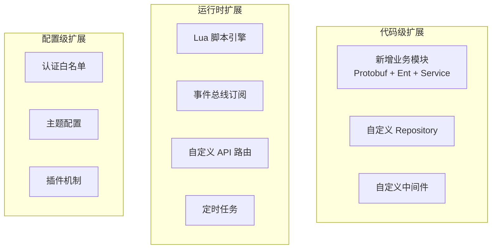
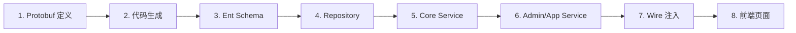
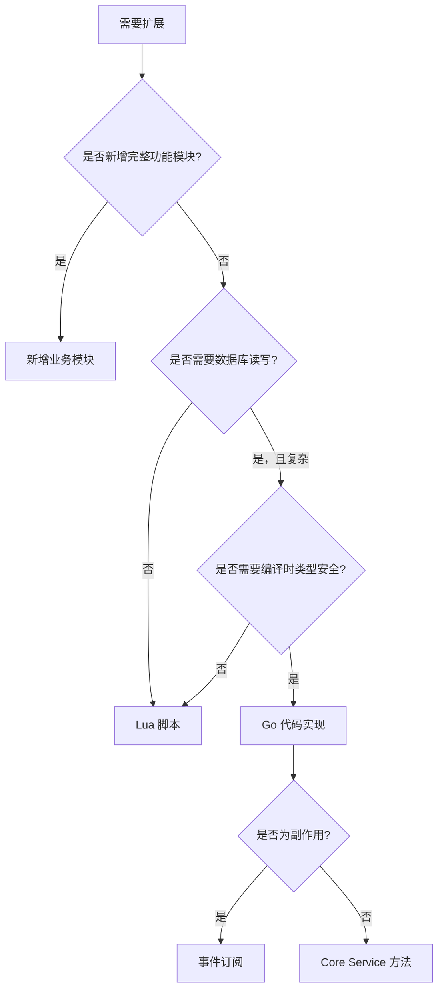

# 后端扩展机制指南

GoWind CMS 提供多种后端扩展方式，无需修改核心代码即可实现自定义业务逻辑。本文档介绍所有扩展机制及其适用场景。

## 一、扩展方式总览



## 二、扩展方式对比

| 方式 | 开发成本 | 运行时灵活 | 性能 | 适用场景 |
|------|---------|-----------|------|---------|
| 新增业务模块 | 高 | 否（需编译） | 最优 | 全新功能模块 |
| Lua 脚本 | 低 | 是 | 中 | 轻量逻辑扩展 |
| 事件订阅 | 低 | 是 | 高 | 副作用处理 |
| 自定义 API | 中 | 是 | 中 | 聚合接口/适配器 |
| 定时任务 | 低 | 是 | 高 | 周期性任务 |
| 中间件 | 中 | 否 | 高 | 全局请求处理 |

## 三、新增业务模块

完整的模块新增流程参见 [新增内容类型全栈实战](./tutorial-new-content.md)。核心步骤：



## 四、Lua 脚本扩展

详见 [Lua 脚本扩展实战](./tutorial-lua-extension.md)。

### 4.1 快速示例

```lua
-- 注册自定义 API
api.register("GET", "/app/v1/posts/popular", function(ctx)
    local posts = db.query("SELECT * FROM posts WHERE status = 1 ORDER BY view_count DESC LIMIT 10")
    return json.encode({ items = posts })
end)

-- 事件订阅
eventbus.subscribe("post.published", function(event)
    log.info("文章已发布: " .. event.PostId)
end)
```

## 五、事件总线扩展

详见 [事件总线架构](./tutorial-eventbus-architecture.md)。

### 5.1 Go 订阅

```go
// 注册订阅者
bus.Subscribe("post.published", func(ctx context.Context, event interface{}) {
    e := event.(*eventbus.PostPublishedEvent)
    // 自定义处理逻辑
})
```

### 5.2 Lua 订阅

```lua
eventbus.subscribe("post.published", function(event)
    -- Lua 处理逻辑
end)
```

## 六、自定义中间件

### 6.1 中间件示例

```go
// pkg/middleware/tenant_context.go
func TenantContext() middleware.Middleware {
    return func(handler middleware.Handler) middleware.Handler {
        return func(ctx context.Context, req interface{}) (interface{}, error) {
            // 从 JWT 中提取租户 ID
            tenantId := ctx.Value(middleware.TenantIDKey{}).(uint32)

            // 注入到 context
            ctx = context.WithValue(ctx, entgo.TenantKey{}, tenantId)

            return handler(ctx, req)
        }
    }
}
```

### 6.2 注册中间件

```go
// app/admin/service/internal/server/rest_server.go
srv.Use(
    middleware.Logging(),
    middleware.Audit(),
    middleware.Auth(),           // JWT 认证
    middleware.TenantContext(),  // 租户上下文
    middleware.Authz(authorizer),// 权限校验
)
```

## 七、定时任务扩展

### 7.1 Asynq 定时任务

```go
// app/core/service/internal/server/asynq_server.go
func RegisterScheduledTasks(scheduler *asynq.Scheduler) {
    scheduler.Register("0 3 * * *", asynq.NewTask(
        task.TypeCleanupExpiredData,
        jsonMustMarshal(task.CleanupExpiredDataPayload{
            EntityType: "posts",
            OlderThan:  time.Now().AddDate(0, 0, -30).Unix(),
        }),
    ))
}
```

### 7.2 Lua 定时任务

```lua
cron.register("0 2 * * *", function()
    -- 每日数据统计
    local stats = db.query("SELECT ...")
    redis.set("daily:stats", json.encode(stats))
end)
```

## 八、扩展最佳实践

### 8.1 选择扩展方式



### 8.2 扩展安全

| 规则 | 说明 |
|------|------|
| Lua 沙箱 | 限制文件系统/网络访问 |
| 事件隔离 | 订阅者 panic 不影响主流程 |
| 权限检查 | 扩展 API 需认证 |

## 九、相关文档

- [新增内容类型全栈实战](./tutorial-new-content.md)
- [Lua 脚本扩展实战](./tutorial-lua-extension.md)
- [事件总线架构](./tutorial-eventbus-architecture.md)
- [GoWind Admin 后端扩展机制](/admin/backend-extension.md)
