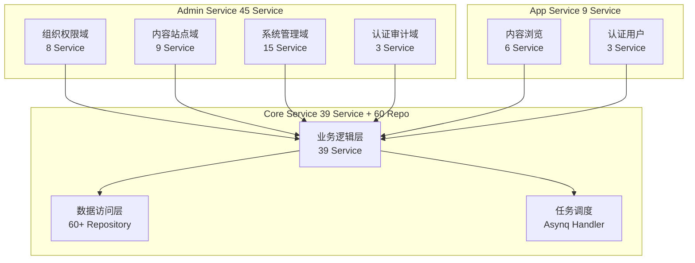
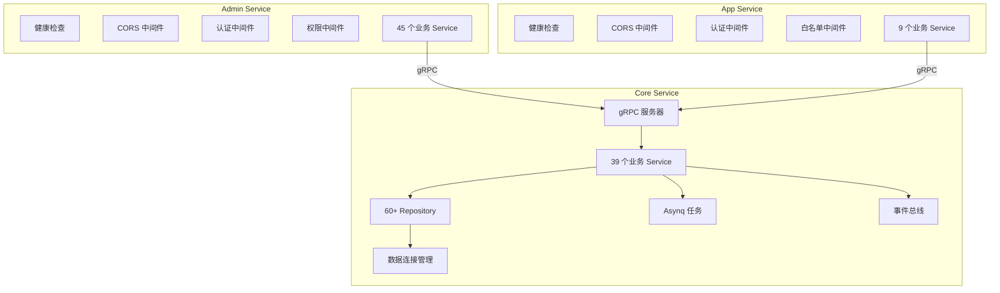

# CMS 后端模块总览

GoWind CMS 后端由三个服务组成，共包含 80+ 个 Service 和 60+ 个 Repository。本文档按功能域梳理所有模块的职责、目录位置和 API 路由。

## 一、服务与模块概览



## 二、组织与权限域

### Admin Service 接口

| Service | 路由 | 说明 |
|---------|------|------|
| UserService | `/admin/v1/users` | 用户管理 CRUD |
| RoleService | `/admin/v1/roles` | 角色管理 |
| TenantService | `/admin/v1/tenants` | 租户管理 |
| OrgUnitService | `/admin/v1/org-units` | 部门管理 |
| PositionService | `/admin/v1/positions` | 职位管理 |
| PermissionService | `/admin/v1/permissions` | 权限管理 |
| MenuService | `/admin/v1/menus` | 菜单管理 |
| ApiService | `/admin/v1/apis` | 接口管理 |

### Core Service 业务逻辑

| Service | 目录 | 说明 |
|---------|------|------|
| UserService | `service/user_service.go` | 用户业务逻辑 + 密码验证 |
| RoleService | `service/role_service.go` | 角色 + 权限分配 |
| TenantService | `service/tenant_service.go` | 租户初始化 + 套餐 |
| OrgUnitService | `service/org_unit_service.go` | 部门树管理 |
| PermissionService | `service/permission_service.go` | 权限校验 |
| MenuService | `service/menu_service.go` | 菜单树 + 权限过滤 |

### 数据仓储

| Repository | 说明 |
|------------|------|
| `user_repo.go` | 用户仓储 |
| `user_role_repo.go` | 用户-角色关联 |
| `role_repo.go` | 角色仓储 |
| `tenant_repo.go` | 租户仓储 |
| `membership_repo.go` | 租户成员关系 |
| `org_unit_repo.go` | 部门仓储 |
| `permission_repo.go` | 权限仓储 |
| `menu_repo.go` | 菜单仓储 |

## 三、内容与站点域

### Admin Service 接口

| Service | 路由 | 说明 |
|---------|------|------|
| PostService | `/admin/v1/posts` | 帖子管理 + 发布工作流 |
| CategoryService | `/admin/v1/categories` | 分类树管理 |
| TagService | `/admin/v1/tags` | 标签管理 |
| CommentService | `/admin/v1/comments` | 评论审核 |
| PageService | `/admin/v1/pages` | 页面管理 |
| SiteService | `/admin/v1/sites` | 站点管理 |
| SiteSettingService | `/admin/v1/site-settings` | 站点配置 |
| NavigationService | `/admin/v1/navigations` | 导航管理 |
| MediaAssetService | `/admin/v1/media-assets` | 媒体资产管理 |

### App Service 接口（精简版）

| Service | 路由 | 说明 |
|---------|------|------|
| PostService | `/app/v1/posts` | 帖子浏览 + 用户发帖 |
| CategoryService | `/app/v1/categories` | 分类浏览 |
| TagService | `/app/v1/tags` | 标签浏览 |
| CommentService | `/app/v1/comments` | 评论浏览 + 发表 |
| PageService | `/app/v1/pages` | 页面展示 |
| NavigationService | `/app/v1/navigations` | 导航获取 |

### 数据仓储

| Repository | 说明 |
|------------|------|
| `post_repo.go` | 帖子仓储（含分页、排序、翻译关联） |
| `post_translation_repo.go` | 帖子多语言翻译 |
| `category_repo.go` | 分类仓储（树形结构） |
| `category_translation_repo.go` | 分类翻译 |
| `tag_repo.go` | 标签仓储 |
| `tag_translation_repo.go` | 标签翻译 |
| `comment_repo.go` | 评论仓储（含树形回复） |
| `page_repo.go` | 页面仓储 |
| `page_translations_repo.go` | 页面翻译 |
| `site_repo.go` | 站点仓储 |
| `site_setting_repo.go` | 站点配置 |
| `navigation_repo.go` | 导航仓储 |
| `media_asset_repo.go` | 媒体资产仓储 |

## 四、系统管理域

### Admin Service 接口

| Service | 路由 | 说明 |
|---------|------|------|
| DictTypeService | `/admin/v1/dict-types` | 字典大类 |
| DictEntryService | `/admin/v1/dict-entries` | 字典子项 |
| TaskService | `/admin/v1/tasks` | 任务调度管理 |
| FileService | `/admin/v1/files` | 文件管理 |
| FileTransferService | `/admin/v1/files/transfer` | 文件传输 |
| LanguageService | `/admin/v1/languages` | 语言管理 |
| TranslatorService | `/admin/v1/translators` | 翻译管理 |
| InternalMessageService | `/admin/v1/internal-messages` | 站内信 |
| CacheService | `/admin/v1/caches` | 缓存管理 |

### 日志审计

| Service | 路由 | 说明 |
|---------|------|------|
| LoginLogService | `/admin/v1/login-logs` | 登录日志 |
| OperationLogService | `/admin/v1/operation-logs` | 操作日志 |
| ApiAuditLogService | `/admin/v1/api-audit-logs` | API 审计日志 |

## 五、认证域

| Service | 路由 | 说明 |
|---------|------|------|
| AdminAuthService | `/admin/v1/login`, `/admin/v1/logout` | 管理后台认证 |
| AppAuthService | `/app/v1/login`, `/app/v1/register` | 前台认证 |
| UserProfileService | `/app/v1/user-profile` | 前台用户资料 |

## 六、Core Service 详解

### 6.1 Service 层

Core Service 是业务逻辑核心，Admin/App Service 通过 gRPC 调用：

```go
// Core Service gRPC 服务器注册所有业务 Service
func NewGRPCServer(
    postSvc *service.PostService,
    userSvc *service.UserService,
    commentSvc *service.CommentService,
    // ... 39 个 Service
) *grpc.Server {
    srv := grpc.NewServer(...)
    contentV1.RegisterPostServiceServer(srv, postSvc)
    identityV1.RegisterUserServiceServer(srv, userSvc)
    // ...
    return srv
}
```

### 6.2 数据访问层

```go
// Core Service Data Provider
var ProviderSet = wire.NewSet(
    NewData,                    // 数据库连接管理
    // 60+ Repository
    data.NewPostRepo,
    data.NewPostTranslationRepo,
    data.NewUserRepo,
    data.NewCommentRepo,
    data.NewSiteRepo,
    data.NewNavigationRepo,
    data.NewMediaAssetRepo,
    // ...
)
```

### 6.3 任务调度

| Handler | 任务类型 | 说明 |
|---------|---------|------|
| HandleIndexPost | `post:index` | 内容索引同步 |
| HandlePublishPost | `post:publish` | 定时发布 |
| HandleSendNotification | `notification:send` | 通知推送 |
| HandleCleanupExpiredData | `cleanup:expired_data` | 数据清理 |
| HandleSyncTranslations | `translation:sync` | 翻译同步 |
| HandleUpdateViewCount | `stats:update_view_count` | 浏览量更新 |

## 七、模块依赖关系



## 八、相关文档

- [CMS 后端架构总览](./backend-architecture.md)
- [CMS Protobuf API 定义](./backend-api.md)
- [配置与部署指南](./backend-config-deploy.md)
- [CMS 前端模块总览](./frontend-modules.md)
