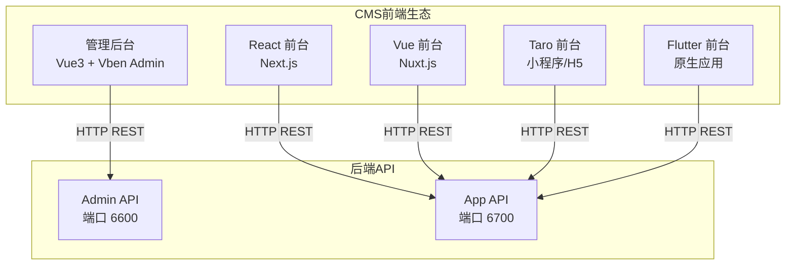
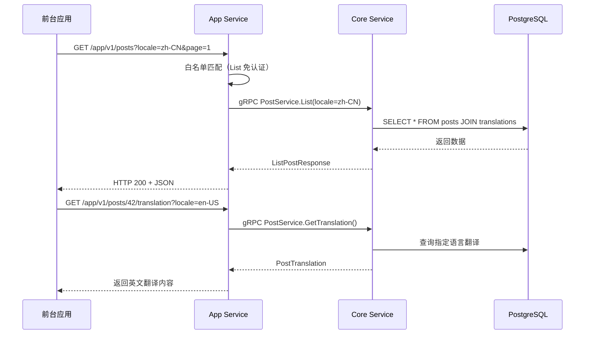

# CMS 前端架构

GoWind CMS 前端由 **1 个管理后台 + 4 套前台应用** 组成。管理后台基于 Vue Vben Admin，与 GoWind Admin 共享技术基座；四套前台使用不同技术栈对接同一个 Headless App API，实现真正的"一次后端、多端覆盖"。

## 一、前端全景



## 二、管理后台

### 技术栈

| 技术 | 版本 | 说明 |
|------|------|------|
| Vue 3 | 3.x | Composition API |
| Vben Admin | 最新 | 企业级中后台框架 |
| Ant Design Vue | 4.x | UI 组件库 |
| Vue Query | 最新 | 服务端状态管理 |
| Pinia | 2.x | 客户端状态管理 |
| Vite | 5.x | 构建工具 |
| TypeScript | 5.x | 类型安全 |

### 目录结构

```
frontend/admin/
├── apps/
│   └── admin/                  # CMS 管理后台应用
│       ├── src/
│       │   ├── api/            # API 层
│       │   │   ├── client.ts   # ApiClient 单例
│       │   │   ├── index.ts    # 统一导出
│       │   │   ├── composables/ # Vue Query hooks
│       │   │   └── generated/  # Protobuf 自动生成代码
│       │   ├── views/          # 页面视图
│       │   │   ├── content/    # 内容管理（帖子/分类/标签/页面）
│       │   │   ├── site/       # 站点管理
│       │   │   ├── media/      # 媒体资源
│       │   │   ├── system/     # 系统管理（用户/角色/权限/字典）
│       │   │   └── ...         # 其他模块
│       │   ├── router/         # 路由配置
│       │   ├── store/          # Pinia 状态管理
│       │   └── locales/        # 国际化
│       └── ...
├── packages/                   # Monorepo 共享包
│   ├── @core/                  # 核心工具
│   ├── effects/                # 公共效果
│   ├── preferences/            # 偏好设置
│   └── types/                  # 类型定义
├── pnpm-workspace.yaml
└── turbo.json
```

### API 调用模式

管理后台使用与 GoWind Admin 相同的 **Vue Query hooks** 模式：

```typescript
// api/composables/post.ts
import { apiClient } from '#/api/client';
import { makeUpdateMask, type PaginationQuery } from '#/transport/rest';

// 列表查询 hook
export function useListPosts(query: PaginationQuery) {
  return useQuery({
    queryKey: ['listPosts', query],
    queryFn: () => apiClient.postService.List(query.toRawParams()),
  });
}

// 创建 mutation
export function useCreatePost() {
  const queryClient = useQueryClient();
  return useMutation({
    mutationFn: (data: Post) => apiClient.postService.Create({ data }),
    onSuccess: () => queryClient.invalidateQueries({ queryKey: ['listPosts'] }),
  });
}
```

### 核心功能模块

| 模块 | 目录 | 说明 |
|------|------|------|
| 帖子管理 | `views/content/post/` | 帖子 CRUD + 翻译编辑 + 区块编辑器 |
| 分类管理 | `views/content/category/` | 树形分类 + 翻译 |
| 标签管理 | `views/content/tag/` | 标签 CRUD + 翻译 |
| 页面管理 | `views/content/page/` | 自定义页面 + 翻译 |
| 站点管理 | `views/site/` | 多站点配置 |
| 媒体资源 | `views/media/` | 图片/视频/文档管理 |
| 系统管理 | `views/system/` | 用户/角色/权限/字典 |

## 三、四套前台应用对比

### 技术栈对比

| 对比项 | React (Next.js) | Vue (Nuxt.js) | Taro | Flutter |
|--------|-----------------|---------------|------|---------|
| 语言 | TypeScript | TypeScript | TypeScript | Dart |
| 框架 | Next.js | Nuxt.js | Taro 4 | Flutter |
| UI 库 | shadcn/ui | — | Taro UI | Material |
| 渲染方式 | SSR + SSG | SSR | CSR | 原生渲染 |
| 状态管理 | Zustand / Context | Pinia | Taro 状态 | BLoC / Cubit |
| 路由 | App Router | Nuxt Router | Taro Router | go_router |
| API 生成 | OpenAPI Generator | OpenAPI Generator | OpenAPI Generator | swagger_parser + retrofit |
| 国际化 | next-intl | @nuxtjs/i18n | Taro i18n | flutter_localizations |
| 目标平台 | PC Web | PC Web | 小程序 + H5 | Android/iOS/Web/Desktop |

### 适用场景

| 场景 | 推荐版本 | 原因 |
|------|---------|------|
| 企业官网 / 博客 | React (Next.js) | SSR 利于 SEO，生态丰富 |
| 快速原型开发 | Vue (Nuxt.js) | 开发体验好，约定优于配置 |
| 微信小程序 | Taro | 一套代码多端运行 |
| 原生移动 App | Flutter | 真正的原生体验，跨平台 |

## 四、React 前台详解（Next.js）

### 目录结构

```
frontend/app/react/
├── src/
│   ├── app/                    # Next.js App Router
│   │   ├── [locale]/           # 国际化路由（/zh-CN, /en-US）
│   │   │   ├── page.tsx        # 首页
│   │   │   ├── posts/          # 帖子列表 + 详情
│   │   │   ├── categories/     # 分类列表
│   │   │   ├── tags/           # 标签列表
│   │   │   ├── about/          # 关于页
│   │   │   └── settings/       # 设置
│   │   └── layout.tsx          # 根布局
│   ├── components/             # React 组件
│   ├── lib/                    # 工具库
│   │   └── api/                # API 客户端
│   ├── messages/               # 国际化消息文件
│   │   ├── zh-CN.json
│   │   └── en-US.json
│   └── stores/                 # Zustand 状态管理
├── messages/                   # 全局国际化
├── .env.development            # 开发环境变量
├── next.config.ts              # Next.js 配置
└── package.json
```

### 环境配置

```bash
# .env.development
NEXT_PUBLIC_API_BASE_URL=http://localhost:6700/app/v1
NEXT_PUBLIC_DEFAULT_LOCALE=zh-CN
```

### API 调用示例

```typescript
// src/lib/api/post.ts
import { apiClient } from './client';

export async function getPosts(locale: string, page = 1, pageSize = 10) {
  const { data } = await apiClient.get('/posts', {
    params: { locale, page, pageSize },
  });
  return data;
}

export async function getPostBySlug(slug: string, locale: string) {
  const { data } = await apiClient.get(`/posts/${slug}`, {
    params: { locale },
  });
  return data;
}
```

### 页面组件示例

```tsx
// src/app/[locale]/posts/[slug]/page.tsx
export default async function PostDetail({
  params: { locale, slug },
}: {
  params: { locale: string; slug: string };
}) {
  const post = await getPostBySlug(slug, locale);

  return (
    <article>
      <h1>{post.title}</h1>
      <div>{post.summary}</div>
      <div dangerouslySetInnerHTML={{ __html: post.content }} />
    </article>
  );
}
```

## 五、Flutter 前台详解

Flutter 版本采用了最完善的架构设计，值得所有版本参考。

### 架构：Feature-First + BLoC

```
frontend/app/flutter_app/lib/
├── core/                       # 核心层
│   ├── constants/              # 常量
│   ├── network/                # 网络层（dio + retrofit）
│   ├── storage/                # 本地存储（sqflite）
│   ├── router/                 # 路由配置（go_router）
│   ├── theme/                  # 主题（亮色/暗色）
│   └── l10n/                   # 国际化
├── features/                   # 功能模块（Feature-First）
│   ├── home/                   # 首页
│   │   ├── data/               # 数据层（API + Model）
│   │   ├── domain/             # 领域层（Repository + Entity）
│   │   └── presentation/       # 表现层（BLoC + Widget）
│   ├── explore/                # 探索
│   ├── post_detail/            # 文章详情
│   ├── post_list/              # 文章列表
│   ├── category/               # 分类
│   ├── tag/                    # 标签
│   ├── search/                 # 搜索
│   ├── bookmark/               # 书签
│   ├── profile/                # 个人资料
│   └── settings/               # 设置
└── main.dart                   # 应用入口
```

### BLoC 状态管理

```dart
// features/post_detail/presentation/bloc/post_detail_bloc.dart
class PostDetailBloc extends Bloc<PostDetailEvent, PostDetailState> {
  final PostRepository repository;

  PostDetailBloc(this.repository) : super(PostDetailInitial()) {
    on<FetchPostDetail>(_onFetchPostDetail);
  }

  Future<void> _onFetchPostDetail(
    FetchPostDetail event,
    Emitter<PostDetailState> emit,
  ) async {
    emit(PostDetailLoading());
    try {
      final post = await repository.getPost(
        id: event.postId,
        locale: event.locale,
      );
      emit(PostDetailLoaded(post));
    } catch (e) {
      emit(PostDetailError(e.toString()));
    }
  }
}
```

### Retrofit API 生成

Flutter 版本通过 `swagger_parser` 从 OpenAPI 文档自动生成 API 客户端：

```dart
// 自动生成的 API 客户端
@RestApi(baseUrl: '/app/v1')
abstract class PostApi {
  factory PostApi(Dio dio, {String baseUrl}) = _PostApi;

  @GET('/posts')
  Future<ListPostResponse> listPosts({
    @Query('locale') String? locale,
    @Query('page') int? page,
    @Query('pageSize') int? pageSize,
  });

  @GET('/posts/{id}')
  Future<Post> getPost(
    @Path('id') int id, {
    @Query('locale') String? locale,
  });
}
```

## 六、前台 API 对接

所有四套前台应用都对接同一个 App API，遵循相同的调用约定：

### 统一 API 调用约定



### 分页参数

所有列表接口使用统一的分页协议：

```http
GET /app/v1/posts?page=1&pageSize=10&orderBy=createdAt&orderDesc=true&search=关键词
```

### 多语言处理

前台通过 `locale` 参数或 URL 路径指定语言：

| 方式 | 示例 | 适用场景 |
|------|------|---------|
| Query 参数 | `/posts?locale=zh-CN` | API 调用 |
| URL 路径 | `/zh-CN/posts/hello-world` | React/Vue 前台路由 |
| Header | `Accept-Language: en-US` | Taro / Flutter |

## 七、国际化架构

### 管理后台

管理后台使用 Vben Admin 内置的 i18n 系统，支持中文和英文：

```
src/locales/
├── zh-CN/          # 中文
│   ├── content.json
│   ├── site.json
│   └── system.json
└── en-US/          # 英文
    ├── content.json
    ├── site.json
    └── system.json
```

### 前台应用

| 版本 | i18n 方案 | 消息文件位置 |
|------|----------|-------------|
| React | `next-intl` | `src/messages/zh-CN.json`, `en-US.json` |
| Vue | `@nuxtjs/i18n` | `locales/zh-CN.json`, `en-US.json` |
| Taro | Taro i18n | `src/i18n/zh-CN.ts`, `en-US.ts` |
| Flutter | flutter_localizations | `lib/l10n/app_zh.arb`, `app_en.arb` |

## 八、与 GoWind Admin 前端的复用关系

管理后台前端与 GoWind Admin 高度复用：

| 共享部分 | 说明 |
|---------|------|
| Monorepo 架构 | 同样使用 pnpm workspace + turbo |
| Vben Admin 框架 | 完全共享 |
| API 层架构 | Vue Query hooks 模式 |
| 系统管理模块 | 用户/角色/权限/字典/菜单等完全复用 |
| 主题和国际化 | 共享亮/暗色主题、i18n |

| CMS 独有部分 | 说明 |
|-------------|------|
| 内容管理模块 | 帖子/分类/标签/页面（Admin 独有） |
| 站点管理模块 | 多站点/导航/站点设置 |
| 媒体资源模块 | 图片/视频/文档管理 |
| 区块编辑器 | SectionType 区块化内容构建 |

## 九、相关文档

- [CMS 后端架构总览](./backend-architecture.md)
- [CMS Protobuf API 定义](./backend-api.md)
- [前台应用开发实战](./tutorial-frontend-app.md)
- [Headless API 对接多端实战](./tutorial-headless-api.md)
- [GoWind Admin 前端架构](/admin/frontend-architecture.md) — 管理后台共享基座
