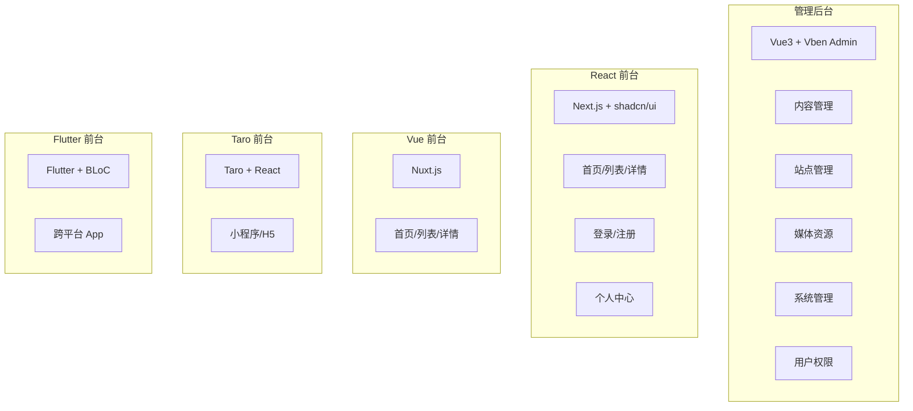

# CMS 前端模块总览

GoWind CMS 前端由 1 个管理后台 + 4 套前台应用组成。本文档梳理所有前端模块的职责、技术栈和目录结构。

## 一、前端全景



## 二、管理后台模块

### 2.1 技术栈

| 技术 | 说明 |
|------|------|
| Vue 3 + TypeScript | 核心框架 |
| Vben Admin (Monorepo) | 后台管理框架 |
| Ant Design Vue 4 | UI 组件库 |
| Vue Query (TanStack Query) | 数据获取与缓存 |
| Pinia | 状态管理 |
| Vite 5 | 构建工具 |

### 2.2 功能模块

| 模块 | 目录 | 功能 |
|------|------|------|
| **内容管理** | `views/content/` | |
| - 帖子管理 | `views/content/post/` | 帖子 CRUD + 区块编辑器 + 翻译 |
| - 分类管理 | `views/content/category/` | 分类树 + 翻译 |
| - 标签管理 | `views/content/tag/` | 标签 + 翻译 |
| - 页面管理 | `views/content/page/` | 自定义页面 |
| - 评论管理 | `views/content/comment/` | 评论审核 + 回复 |
| **站点管理** | `views/site/` | |
| - 站点列表 | `views/site/list/` | 多站点 CRUD |
| - 站点配置 | `views/site/setting/` | SEO / 上传 / 缓存 |
| - 导航管理 | `views/site/navigation/` | 导航栏 + 导航项 |
| **媒体资源** | `views/media/` | 媒体库 + 图片选择器 |
| **系统管理** | `views/system/` | |
| - 用户管理 | `views/system/user/` | 用户 CRUD + 代登录 |
| - 角色管理 | `views/system/role/` | 角色 + 权限分配 |
| - 权限管理 | `views/system/permission/` | 权限点 + 菜单 |
| - 部门管理 | `views/system/dept/` | 部门树 |
| - 字典管理 | `views/system/dict/` | 字典类型 + 子项 |
| - 任务调度 | `views/system/task/` | 定时任务 + 日志 |
| - 缓存管理 | `views/system/cache/` | 缓存查询 + 清理 |
| - 接口管理 | `views/system/api/` | 接口同步 + 树形 |
| **日志审计** | `views/log/` | 登录日志 / 操作日志 / API 审计 |
| **个人中心** | `views/profile/` | 资料 / 头像 / 密码 / 登录记录 |
| **国际化** | `views/i18n/` | 语言管理 + 翻译编辑 |

### 2.3 API 层

```
src/api/
├── client.ts                    # ApiClient 单例
├── index.ts                     # 统一导出
├── composables/                 # Vue Query Hooks
│   ├── post.ts                  # 帖子相关 hooks
│   ├── category.ts
│   ├── tag.ts
│   ├── comment.ts
│   ├── user.ts
│   ├── site.ts
│   ├── media.ts
│   └── ...
├── generated/                   # Protobuf 自动生成
└── types.ts                     # 类型定义
```

### 2.4 核心组件

| 组件 | 说明 |
|------|------|
| `SectionEditor` | 区块化内容编辑器 |
| `RichTextEditor` | TipTap 富文本 |
| `MediaPicker` | 图片选择器 |
| `TranslationTabs` | 多语言翻译编辑 |
| `CategoryTree` | 分类树组件 |
| `AccessControl` | 按钮级权限控制 |

## 三、React 前台（Next.js）

### 3.1 功能模块

| 页面 | 路由 | 说明 |
|------|------|------|
| 首页 | `/[locale]` | 最新文章列表 |
| 文章列表 | `/[locale]/posts` | 分页文章 |
| 文章详情 | `/[locale]/posts/[slug]` | SSR 渲染 + 评论 |
| 分类 | `/[locale]/categories/[slug]` | 分类文章 |
| 标签 | `/[locale]/tags/[slug]` | 标签文章 |
| 搜索 | `/[locale]/search` | 全文搜索 |
| 关于 | `/[locale]/about` | 关于页面 |
| 登录 | `/[locale]/login` | 用户登录 |
| 注册 | `/[locale]/register` | 用户注册 |
| 个人中心 | `/[locale]/profile` | 资料编辑 |

### 3.2 组件

| 组件 | 说明 |
|------|------|
| `PostCard` | 文章卡片 |
| `SectionRenderer` | 区块内容渲染 |
| `CommentSection` | 评论区 |
| `SearchBar` | 搜索栏 + 建议下拉 |
| `LanguageSwitcher` | 语言切换 |
| `NotificationBell` | 通知角标 |
| `SSEProvider` | SSE 连接管理 |

## 四、Vue 前台（Nuxt.js）

| 页面 | 路由 | 说明 |
|------|------|------|
| 首页 | `/` | 最新内容 |
| 文章 | `/posts/[slug]` | 文章详情 |
| 分类 | `/categories/[slug]` | 分类文章 |
| 关于 | `/about` | 关于页面 |

## 五、Taro 前台（小程序/H5）

| 页面 | 路由 | 说明 |
|------|------|------|
| 首页 | `pages/index/index` | Tab 页 |
| 文章列表 | `pages/posts/index` | 文章列表 |
| 文章详情 | `pages/posts/detail` | 文章详情 |
| 分类 | `pages/category/index` | Tab 页 |
| 个人中心 | `pages/profile/index` | Tab 页 |

## 六、Flutter 前台

### 6.1 Feature-First 架构

| Feature | 说明 |
|---------|------|
| `home` | 首页 + 推荐内容 |
| `explore` | 探索 + 搜索 |
| `post_detail` | 文章详情 + 评论 |
| `post_list` | 文章列表 |
| `category` | 分类浏览 |
| `tag` | 标签浏览 |
| `search` | 搜索功能 |
| `bookmark` | 收藏书签 |
| `profile` | 个人资料 |
| `settings` | 应用设置 |

### 6.2 每个 Feature 三层

```
features/home/
├── data/           # 数据层（API + Model）
├── domain/         # 领域层（Repository + Entity）
└── presentation/   # 表现层（BLoC + Widget）
```

## 七、共享约定

### 7.1 API 调用统一

| 约定 | 说明 |
|------|------|
| 分页参数 | `page` / `pageSize` / `orderBy` / `orderDesc` |
| 语言参数 | `locale` 查询参数 |
| 认证头 | `Authorization: Bearer {token}` |
| 错误格式 | `{ code, reason, message }` |

### 7.2 国际化

| 版本 | 方案 | 消息文件 |
|------|------|---------|
| 管理后台 | Vben i18n | `src/locales/zh-CN/*.json` |
| React | next-intl | `src/messages/*.json` |
| Vue | @nuxtjs/i18n | `locales/*.json` |
| Taro | Taro i18n | `src/i18n/*.ts` |
| Flutter | flutter_localizations | `lib/l10n/app_*.arb` |

## 八、相关文档

- [CMS 前端架构](./frontend-architecture.md)
- [前台应用开发实战](./tutorial-frontend-app.md)
- [区块编辑器实战](./tutorial-section-editor.md)
- [CMS 后端模块总览](./backend-modules.md)
