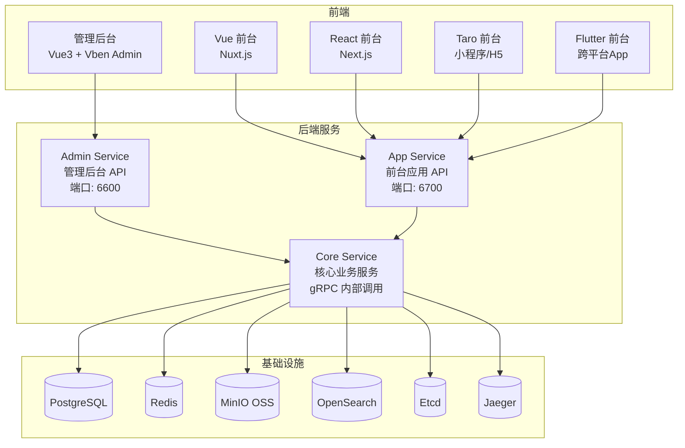

# GoWind CMS 产品介绍

GoWind CMS（全称 **GoWind Content Hub**，简称 GoWind HCH）是一款开箱即用的企业级 Golang 全栈 **Headless 内容平台**。为企业提供灵活、可扩展的全域内容管理与分发解决方案，支持多端内容输出（Web、小程序、App），原生多语言，多租户架构。

## 一、核心特性

### 1. Headless 架构 — 内容与展示分离

- **API 优先**：完整的 RESTful API，OpenAPI 文档自动生成，前后端完全解耦
- **双服务接口**：管理后台 API（`/admin/v1/`）和前台应用 API（`/app/v1/`）独立部署
- **多端适配**：前台支持 Vue（Nuxt.js）、React（Next.js）、Taro（小程序/H5）、Flutter 四套前端
- **灵活输出**：内容可通过任意终端消费，适配 Web、App、小程序等场景

### 2. 组织与权限

- **多租户管理**：租户新增、启用/禁用、套餐配置与数据隔离；新增租户自动初始化部门、角色与管理员
- **用户管理**：用户全生命周期管理，支持多角色、多部门绑定，一键代登录，高级条件查询
- **角色管理**：角色与角色分组管理，精细化配置菜单权限、接口权限与数据权限
- **权限管理**：权限分组、菜单节点与权限点管理，支持按钮级细粒度控制
- **菜单管理**：可视化菜单配置，支持目录、页面、按钮三级，按权限动态渲染
- **部门管理**：多级部门树形管理，联动绑定用户，划分组织层级

### 3. 内容与站点

- **内容管理**：帖子（Post）增删改查、发布/下架、置顶、排序、回收站与批量操作
- **分类管理**：多级分类树形管理，前台按分类快速筛选
- **标签管理**：标签增删改查与内容关联，支持按标签检索
- **评论管理**：评论审核、删除、回复、屏蔽，可按内容、用户、时间筛选
- **页面管理**：自定义页面（Page）创建与发布
- **多语言管理**：语种管理、内容/菜单/提示统一翻译，原生国际化支持
- **站点管理**：多站点独立配置，独立域名、标题、Logo、SEO 与展示风格
- **站点配置**：基础信息、SEO、上传限制、缓存策略等全局参数配置
- **导航管理**：站点导航栏与导航项管理，支持多级导航

### 4. 媒体资源

- **媒体资产管理**：图片/文档/视频统一管理
- **文件存储**：支持本地存储或 MinIO（兼容 S3 协议）对象存储
- **文件上传下载**：完整的文件传输服务，支持大文件处理

### 5. 系统与运维

| 功能 | 说明 |
|------|------|
| 字典管理 | 数据字典大类与子项管理，联动查询、排序、导入导出 |
| 接口管理 | 后端接口统一维护与自动同步，树形展示 |
| 任务调度 | 定时任务管理（基于 Asynq），支持启动/暂停/立即执行，查看运行日志 |
| 消息通知 | 多级消息分类，向指定用户发送消息，查看已读状态 |
| 站内信 | 个人消息中心，支持查看、删除、单条/全部已读 |
| 缓存管理 | 缓存实时查询，按键精准清除或批量清理 |
| 登录日志 | 登录成功/失败日志，含账号、IP、归属地、设备、时间 |
| 操作日志 | 全链路操作日志，记录操作人、IP、请求参数与结果 |
| API 审计日志 | API 请求日志，含路径、参数、响应、耗时 |
| 个人中心 | 个人信息编辑、头像修改、密码重置、登录记录查看 |

## 二、应用场景

### 新闻媒体

快速发布新闻、评论、专题等内容，支持多编辑协作和审核流程。

### 博客平台

个人或企业博客，支持内容分类、标签、存档等功能。

### 内容门户

大型内容聚合平台，支持多频道、多分类、多站点管理。

### 企业官网

企业宣传网站，支持多语言、SEO 优化、自定义页面。

### 知识库

企业内部或对外的知识库、文档管理平台。

## 三、技术架构

### 技术栈

#### 后端

| 层次 | 技术 | 说明 |
|------|------|------|
| 语言 | [Go 1.25+](https://go.dev/) | 高性能编译型语言 |
| 框架 | [go-kratos](https://go-kratos.dev/) | B 站开源微服务框架 |
| 依赖注入 | [Wire](https://github.com/google/wire) | 编译时依赖注入 |
| ORM | [Ent](https://entgo.io/) | Go 实体框架 |
| 数据库 | [PostgreSQL](https://www.postgresql.org/) / MySQL | 关系型数据库（默认 PostgreSQL） |
| 缓存 | [Redis](https://redis.io/) | 内存数据库 |
| 对象存储 | [MinIO](https://min.io/) | 兼容 S3 的对象存储 |
| 搜索引擎 | [OpenSearch](https://opensearch.org/) | 全文检索 |
| 服务注册 | [Etcd](https://etcd.io/) | 服务发现与配置中心 |
| 链路追踪 | [Jaeger](https://www.jaegertracing.io/) + OpenTelemetry | 分布式可观测 |
| API 定义 | [Protobuf](https://protobuf.dev/) + [buf.build](https://buf.build/) | 接口契约优先 |
| 任务调度 | [Asynq](https://github.com/hibiken/asynq) | 基于 Redis 的异步任务队列 |
| 权限引擎 | [Casbin](https://casbin.org/) / OPA | 策略驱动鉴权 |

#### 管理后台前端

| 技术 | 说明 |
|------|------|
| [Vue 3](https://vuejs.org/) + TypeScript | 渐进式前端框架 |
| [Ant Design Vue](https://antdv.com/) | 企业级 UI 组件库 |
| [Vben Admin](https://doc.vben.pro/) | 后台管理框架（Monorepo 架构） |
| Vue Query (TanStack Query) | 数据获取与缓存 |
| Vite + Turbo | 快速热更新 + 增量构建 |

#### 前台展示前端

| 版本 | 技术栈 | 适用场景 |
|------|--------|----------|
| Vue | [Nuxt.js](https://nuxt.com/) + shadcn-vue | Web 应用 / SSR |
| React | [Next.js](https://nextjs.org/) + shadcn/ui | Web 应用 / SSR |
| Taro | [Taro](https://docs.taro.zone/) + React + shadcn/ui | 微信小程序 / H5 |
| Flutter | [Flutter](https://flutter.dev/) + BLoC | 跨平台原生应用 |

### 系统架构

GoWind CMS 采用 **三服务微服务架构**，管理后台与前台应用独立部署，共享核心业务逻辑：



### 三服务职责划分

| 服务 | 目录 | 端口 | 职责 |
|------|------|------|------|
| **Admin Service** | `app/admin/service/` | REST: 6600, SSE: 6601 | 管理后台 HTTP API，对接管理前端 |
| **App Service** | `app/app/service/` | REST: 6700, SSE: 6701 | 前台应用 HTTP API，对接各终端前台 |
| **Core Service** | `app/core/service/` | gRPC（内部） | 核心业务逻辑 + 数据层，被 Admin/App 通过 gRPC 调用 |

> Admin Service 和 App Service 作为 API 网关层，接收 HTTP 请求后通过 gRPC 调用 Core Service 完成业务处理，实现了接口与业务逻辑的解耦。

## 四、项目结构

```
go-wind-cms/
├── backend/                        # 后端服务
│   ├── api/                        # Protobuf API 定义 & 生成代码
│   │   ├── protos/                 # .proto 源文件
│   │   │   ├── admin/service/v1/   # 管理后台 API 定义（41 个 proto 文件）
│   │   │   ├── app/service/v1/     # 前台应用 API 定义（11 个 proto 文件）
│   │   │   ├── content/service/v1/ # 内容领域消息（Post/Category/Tag/Page）
│   │   │   ├── site/service/v1/    # 站点领域消息（Site/Navigation...）
│   │   │   ├── identity/           # 身份管理（User/Role/OrgUnit/Tenant...）
│   │   │   ├── permission/         # 权限管理（Permission/Menu...）
│   │   │   └── ...                 # 其他领域
│   │   └── gen/                    # 生成代码（Go / TypeScript / Dart / OpenAPI）
│   ├── app/
│   │   ├── admin/service/          # 管理后台服务（HTTP/gRPC）
│   │   ├── app/service/            # 前台应用服务（HTTP/gRPC）
│   │   └── core/service/           # 核心业务服务（业务逻辑 + 数据层）
│   ├── pkg/                        # 公共包（鉴权/加密/事件总线/JWT/中间件/OSS...）
│   └── scripts/                    # 部署脚本（Docker/PM2/环境安装）
├── frontend/
│   ├── admin/                      # 管理后台前端（Vue3 + Ant Design Vue + Vben Admin）
│   └── app/                        # 前台应用
│       ├── react/                  # React 前台（Next.js）
│       ├── vue/                    # Vue 前台（Nuxt.js）
│       ├── taro/                   # Taro 前台（微信小程序/H5）
│       └── flutter_app/            # Flutter 前台（跨平台原生）
└── docs/                           # 文档 & 截图
```

## 五、Protobuf API 组织

GoWind CMS 采用 **Protobuf First** 的 API 开发模式，所有接口通过 Protobuf 定义，借助 Buf 工具链自动生成 Go 服务端代码、TypeScript/Dart 客户端代码和 OpenAPI 文档。

### API 路由前缀

| 服务 | 路由前缀 | 说明 |
|------|----------|------|
| Admin Service | `/admin/v1/` | 管理后台接口 |
| App Service | `/app/v1/` | 前台应用接口 |

### 管理后台 API（Admin Service）

Admin Service 提供 40+ 个 Service，覆盖完整的后台管理功能：

**组织与权限：**

| Service | 路由 | 说明 |
|---------|------|------|
| UserService | `/admin/v1/users` | 用户管理 |
| RoleService | `/admin/v1/roles` | 角色管理 |
| TenantService | `/admin/v1/tenants` | 租户管理 |
| OrgUnitService | `/admin/v1/org-units` | 部门管理 |
| PositionService | `/admin/v1/positions` | 职位管理 |
| PermissionService | `/admin/v1/permissions` | 权限管理 |
| MenuService | `/admin/v1/menus` | 菜单管理 |
| ApiService | `/admin/v1/apis` | 接口管理 |

**内容与站点：**

| Service | 路由 | 说明 |
|---------|------|------|
| PostService | `/admin/v1/posts` | 帖子管理 |
| CategoryService | `/admin/v1/categories` | 分类管理 |
| TagService | `/admin/v1/tags` | 标签管理 |
| CommentService | `/admin/v1/comments` | 评论管理 |
| PageService | `/admin/v1/pages` | 页面管理 |
| SiteService | `/admin/v1/sites` | 站点管理 |
| SiteSettingService | `/admin/v1/site-settings` | 站点配置 |
| NavigationService | `/admin/v1/navigations` | 导航管理 |
| MediaAssetService | `/admin/v1/media-assets` | 媒体资产管理 |

**系统管理：**

| Service | 路由 | 说明 |
|---------|------|------|
| DictTypeService / DictEntryService | `/admin/v1/dict-types` `/admin/v1/dict-entries` | 字典管理 |
| TaskService | `/admin/v1/tasks` | 任务调度 |
| FileService / FileTransferService | `/admin/v1/files` | 文件管理 |
| LanguageService | `/admin/v1/languages` | 语言管理 |
| TranslatorService | `/admin/v1/translators` | 翻译管理 |
| InternalMessageService | `/admin/v1/internal-messages` | 站内信 |

### 前台应用 API（App Service）

App Service 提供精简的面向终端用户（C 端）的接口：

| Service | 路由 | 说明 |
|---------|------|------|
| AuthenticationService | `/app/v1/login` `/app/v1/logout` | 前台用户认证 |
| PostService | `/app/v1/posts` | 帖子浏览/创建 |
| CategoryService | `/app/v1/categories` | 分类浏览 |
| TagService | `/app/v1/tags` | 标签浏览 |
| CommentService | `/app/v1/comments` | 评论互动 |
| PageService | `/app/v1/pages` | 页面展示 |
| NavigationService | `/app/v1/navigations` | 导航获取 |
| UserProfileService | `/app/v1/user-profile` | 用户资料 |
| FileTransferService | `/app/v1/files` | 文件上传下载 |

### 代码生成

```shell
cd backend

# 生成 Protobuf Go 代码
make api

# 生成 OpenAPI v3 文档
make openapi

# 生成 TypeScript 代码（管理后台 + React/Taro/Vue 前台）
make ts

# 一键生成全部代码（ent + wire + api + openapi）
make gen
```

## 六、演示地址

| 演示类型 | 访问地址 |
|----------|----------|
| 管理后台 | [https://admin.cms.gowind.cloud](https://admin.cms.gowind.cloud) |
| 后台 API Swagger | [https://api.admin.cms.gowind.cloud/docs/](https://api.admin.cms.gowind.cloud/docs/) |
| 前台 API Swagger | [https://api.cms.gowind.cloud/docs/](https://api.cms.gowind.cloud/docs/) |
| Vue 前台 | [https://vue.cms.gowind.cloud](https://vue.cms.gowind.cloud) |
| React 前台 | [https://react.cms.gowind.cloud](https://react.cms.gowind.cloud) |
| Taro 前台 | [https://taro.cms.gowind.cloud](https://taro.cms.gowind.cloud) |
| Flutter 前台 | [https://flutter.cms.gowind.cloud](https://flutter.cms.gowind.cloud) |

> 所有演示站点通用账号：`admin` / `admin`

## 七、快速开始

### 环境要求

- Go 1.25+
- Docker & Docker Compose
- Node.js 18+ & pnpm
- buf（Protobuf 工具链）

### 1. 启动依赖服务

```bash
cd backend

# Windows
.\scripts\docker\libs_only.ps1

# Linux / macOS
./scripts/docker/libs_only.sh
```

这将启动 PostgreSQL、Redis、MinIO、OpenSearch、Etcd、Jaeger 等依赖服务。

### 2. 启动后端服务

```bash
# 推荐方式：使用 gow CLI
gow run admin

# 或在 IDE 中直接调试运行
```

### 3. 启动前端

```bash
# 管理后台
cd frontend/admin
pnpm install
pnpm dev

# React 前台
cd frontend/app/react
pnpm install
pnpm dev
```

> 详细的安装和部署说明请参考 [CMS 安装指南](./installation.md)。

## 八、与 GoWind Admin 的关系

GoWind CMS 与 [GoWind Admin](/admin/intro.md) 共享相同的技术基座（go-kratos + Ent + Wire + Protobuf + Vben Admin），在组织管理、权限体系、系统管理等方面保持一致。主要差异在于：

| 对比项 | GoWind Admin | GoWind CMS |
|--------|-------------|------------|
| 定位 | 通用后台管理系统 | Headless 内容管理平台 |
| 内容能力 | 无 | 完整（Post/Category/Tag/Comment/Page） |
| 站点管理 | 无 | 多站点 + 导航 + 站点配置 |
| 前台应用 | 无 | 四套前台（Vue/React/Taro/Flutter） |
| API 分层 | 单一 Admin API | Admin API + App API 双层 |
| 多语言 | 后台国际化 | 内容级翻译 + 后台国际化 |
| 媒体资源 | 基础文件管理 | 媒体资产管理 + 内容关联 |

## 九、相关文档

### 基础文档

- [CMS 安装指南](./installation.md)
- [CMS 后端架构总览](./backend-architecture.md)
- [CMS Protobuf API 定义](./backend-api.md)
- [CMS 配置与部署指南](./backend-config-deploy.md)
- [CMS 后端模块总览](./backend-modules.md)
- [CMS 后端扩展机制](./backend-extension.md)
- [CMS 前端架构](./frontend-architecture.md)
- [CMS 前端模块总览](./frontend-modules.md)
- [GoWind Admin 文档](/admin/intro.md) — 共享技术基座的详细说明

### 循序渐进教程

| 阶段 | 教程 | 说明 |
|------|------|------|
| 入门 | [新增内容类型全栈实战](./tutorial-new-content.md) | 从 Protobuf 到前端的全栈开发流程 |
| 入门 | [多端 API 客户端代码生成](./tutorial-codegen.md) | Buf 工具链生成 TS/Dart/OpenAPI |
| 核心 | [内容多语言翻译实战](./tutorial-content-i18n.md) | Post/Category/Tag/Page 翻译机制 |
| 核心 | [内容发布工作流实战](./tutorial-content-workflow.md) | 草稿→审核→发布→下架全生命周期 |
| 核心 | [区块编辑器实战](./tutorial-section-editor.md) | SectionType 区块化内容构建 |
| 核心 | [Headless API 对接多端实战](./tutorial-headless-api.md) | Admin API + App API 双协议设计 |
| 核心 | [前台应用开发实战](./tutorial-frontend-app.md) | React/Next.js 前台从零搭建 |
| 进阶 | [多站点管理实战](./tutorial-multi-site.md) | 多站点 + 导航 + 主题配置 |
| 进阶 | [媒体资源管理实战](./tutorial-media-asset.md) | MinIO 对象存储 + 媒体库 |
| 进阶 | [评论系统实战](./tutorial-comment-system.md) | 多级回复 + 审核 + 互动 |
| 进阶 | [事件总线架构](./tutorial-eventbus-architecture.md) | 业务解耦 + 异步处理 |
| 进阶 | [Lua 脚本扩展实战](./tutorial-lua-extension.md) | 动态扩展业务逻辑 |
| 高阶 | [权限系统实战](./tutorial-permission-system.md) | 双 API 权限模型 |
| 高阶 | [双端登录安全实战](./tutorial-login-security.md) | 管理后台 + 前台双认证体系 |
| 高阶 | [加密与安全工具](./tutorial-crypto-toolkit.md) | AES-GCM + bcrypt + HMAC |
| 高阶 | [全文搜索实战](./tutorial-search.md) | OpenSearch 集成 + 中文分词 |
| 高阶 | [任务调度实战](./tutorial-task-scheduling.md) | Core Service 异步任务 |
| 高阶 | [实时消息推送实战](./tutorial-sse-push.md) | Admin/App 双 SSE 服务 |
| 高阶 | [性能监控实战](./tutorial-performance-monitoring.md) | Jaeger 链路追踪 + 缓存优化 |
| 高阶 | [字典管理系统实战](./tutorial-dict-system.md) | 数据字典 + 国际化 |
| 综合 | [全栈集成实战](./tutorial-fullstack-integration.md) | 新闻发布系统完整案例 |
| 综合 | [三服务部署实战](./tutorial-deploy.md) | Docker + Nginx + PM2 部署 |
