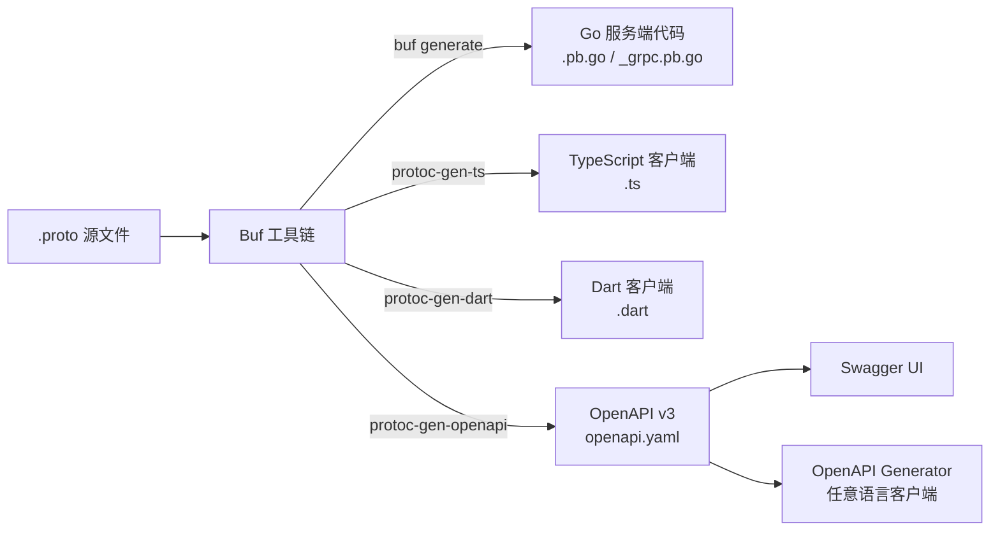
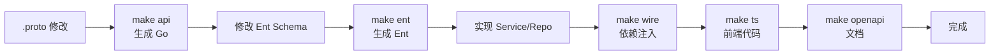

# 多端 API 客户端代码生成教程

GoWind CMS 采用 Protobuf First 的开发模式，通过 Buf 工具链自动生成多端 API 客户端代码。本教程讲解如何为管理后台（TypeScript）和前台应用（TypeScript/Dart）生成 API 客户端。

## 前置条件

- 已阅读 [CMS Protobuf API 定义](./backend-api.md)
- 了解 Protobuf / Buf 基本概念

## 一、代码生成架构

### 1.1 生成流程



### 1.2 生成的代码用途

| 输出 | 语言 | 目录 | 用途 |
|------|------|------|------|
| Go 代码 | Go | `api/gen/go/` | 后端服务端 |
| TypeScript | TS | `api/gen/ts/admin/` | 管理后台前端 |
| TypeScript | TS | `api/gen/ts/app/` | React/Vue 前台 |
| Dart | Dart | `api/gen/dart/` | Flutter 前台 |
| OpenAPI | YAML | `api/gen/openapi/` | API 文档 + 代码生成 |

## 二、Buf 配置

### 2.1 buf.gen.yaml

```yaml
# buf.gen.yaml - Go 代码生成
version: v1
plugins:
  - plugin: go
    out: api/gen/go
    opt: paths=source_relative

  - plugin: go-grpc
    out: api/gen/go
    opt:
      - paths=source_relative
      - require_unimplemented_servers=false

  - plugin: go-http
    out: api/gen/go
    opt: paths=source_relative
```

### 2.2 TypeScript 代码生成

```yaml
# buf.gen.ts.yaml
version: v1
plugins:
  - plugin: ts
    out: api/gen/ts/admin
    opt:
      - paths=source_relative
      - target=admin
    path: protoc-gen-ts

  - plugin: ts
    out: api/gen/ts/app
    opt:
      - paths=source_relative
      - target=app
    path: protoc-gen-ts
```

### 2.3 OpenAPI 生成

```yaml
# buf.gen.openapi.yaml
version: v1
plugins:
  - plugin: openapiv2
    out: api/gen/openapi
    opt:
      - logtostderr=true
      - simple_operation_ids=true
```

### 2.4 Dart 代码生成

```yaml
# buf.gen.dart.yaml
version: v1
plugins:
  - plugin: dart
    out: api/gen/dart
```

## 三、生成命令

### 3.1 Makefile

```makefile
# 生成所有代码（Go + TS + Dart + OpenAPI）
gen: api ent wire ts openapi dart

# Go Protobuf 代码
api:
	buf generate

# TypeScript 代码
ts:
	buf generate --template buf.gen.ts.yaml

# OpenAPI 文档
openapi:
	buf generate --template buf.gen.openapi.yaml

# Dart 代码
dart:
	buf generate --template buf.gen.dart.yaml

# Ent ORM 代码
ent:
	go generate ./app/core/service/internal/data/ent

# Wire 依赖注入
wire:
	cd app/core/service/cmd/server && wire
	cd app/admin/service/cmd/server && wire
	cd app/app/service/cmd/server && wire
```

### 3.2 执行

```bash
cd backend

# 一键生成全部
make gen

# 单独生成 TypeScript
make ts

# 单独生成 OpenAPI
make openapi
```

## 四、TypeScript 客户端

### 4.1 生成的 API 客户端

生成的 TypeScript 代码提供类型安全的 API 调用：

```typescript
// api/gen/ts/admin/service/v1/PostService.ts（自动生成）
export class PostServiceClient {
  async List(params: PagingRequest): Promise<ListPostResponse> {
    return httpClient.get('/admin/v1/posts', { params });
  }

  async Get(id: number, locale?: string): Promise<Post> {
    return httpClient.get(`/admin/v1/posts/${id}`, { params: { locale } });
  }

  async Create(data: CreatePostRequest): Promise<Post> {
    return httpClient.post('/admin/v1/posts', { data });
  }

  async Update(id: number, data: UpdatePostRequest): Promise<Post> {
    return httpClient.put(`/admin/v1/posts/${id}`, { data });
  }

  async Delete(id: number): Promise<void> {
    return httpClient.delete(`/admin/v1/posts/${id}`);
  }
}
```

### 4.2 管理后台使用

```typescript
// frontend/admin/src/api/client.ts
import { PostServiceClient } from '@/api/generated';

export const apiClient = {
  postService: new PostServiceClient(),
  categoryService: new CategoryServiceClient(),
  // ... 其他 Service
};
```

### 4.3 Vue Query 封装

```typescript
// frontend/admin/src/api/composables/post.ts
export function useListPosts(query: Ref<PaginationQuery>) {
  return useQuery({
    queryKey: ['listPosts', query],
    queryFn: () => apiClient.postService.List(query.value.toRawParams()),
  });
}
```

## 五、Flutter 客户端生成

### 5.1 swagger_parser 方式

Flutter 推荐使用 `swagger_parser` 从 OpenAPI 文档生成 Dart 代码：

```yaml
# flutter_app/build.yaml
targets:
  $default:
    builders:
      swagger_parser:
        options:
          output_dir: 'lib/core/network/generated'
          input_path: '../../../backend/api/gen/openapi/admin.swagger.json'
          api_base_url: 'http://localhost:6700/app/v1'
          use_path_for_request: true
```

```shell
# 生成 Dart API 客户端
cd frontend/app/flutter_app
dart run build_runner build
```

### 5.2 生成的 Retrofit API

```dart
// lib/core/network/generated/api/post_api.dart（自动生成）
@RestApi(baseUrl: '/app/v1')
abstract class PostApi {
  factory PostApi(Dio dio, {String? baseUrl}) = _PostApi;

  @GET('/posts')
  Future<ListPostResponse> listPosts({
    @Query('locale') String? locale,
    @Query('page') int? page,
    @Query('pageSize') int? pageSize,
  });

  @GET('/posts/{id}')
  Future<Post> getPost(
    @Path('id') int id, {
    @Query('locale') String? locale,
  });
}
```

### 5.3 Repository 封装

```dart
// features/post_detail/domain/repository/post_repository.dart
class PostRepositoryImpl implements PostRepository {
  final PostApi _api;

  PostRepositoryImpl(this._api);

  @override
  Future<Post> getPost({required int id, required String locale}) async {
    return await _api.getPost(id, locale: locale);
  }

  @override
  Future<ListPostResponse> getPosts({
    required String locale,
    int page = 1,
    int pageSize = 10,
  }) async {
    return await _api.listPosts(
      locale: locale,
      page: page,
      pageSize: pageSize,
    );
  }
}
```

## 六、OpenAPI 文档

### 6.1 访问 Swagger UI

三个服务都内置了 Swagger 文档：

```bash
# Admin API Swagger
http://localhost:6600/docs/

# App API Swagger
http://localhost:6700/docs/
```

### 6.2 从 OpenAPI 生成其他语言

```shell
# 生成 Python 客户端
openapi-generator-cli generate \
  -i http://localhost:6700/docs/openapi.yaml \
  -g python \
  -o ./clients/python

# 生成 Java 客户端
openapi-generator-cli generate \
  -i http://localhost:6700/docs/openapi.yaml \
  -g java \
  -o ./clients/java
```

## 七、开发工作流

### 7.1 API 变更流程



### 7.2 新增接口示例

```protobuf
// 1. 修改 proto
// admin/service/v1/i_post.proto
service PostService {
  // ... 已有接口

  // 新增：获取推荐文章
  rpc GetFeatured(GetFeaturedRequest) returns (ListPostResponse) {
    option (google.api.http) = { get: "/admin/v1/posts/featured" };
  }
}

message GetFeaturedRequest {
  optional string locale = 1;
  optional uint32 limit = 2;
}
```

```bash
# 2. 生成代码
make api    # Go 代码
make ts     # TypeScript 代码
make openapi  # OpenAPI 文档

# 3. 实现 Service
# 4. 前端直接使用生成的 API 客户端
```

## 八、检查清单

| 检查项 | 说明 |
|--------|------|
| buf 配置 | buf.gen.yaml / buf.gen.ts.yaml / buf.gen.openapi.yaml |
| Go 代码生成 | make api |
| TS 代码生成 | make ts |
| Dart 代码生成 | swagger_parser |
| OpenAPI 文档 | make openapi + Swagger UI |
| API 客户端 | 前端使用生成的类型安全客户端 |
| 开发流程 | proto → gen → implement |

## 相关文档

- [CMS Protobuf API 定义](./backend-api.md)
- [CMS 后端架构总览](./backend-architecture.md)
- [Headless API 对接多端实战](./tutorial-headless-api.md)
- [前台应用开发实战](./tutorial-frontend-app.md)
