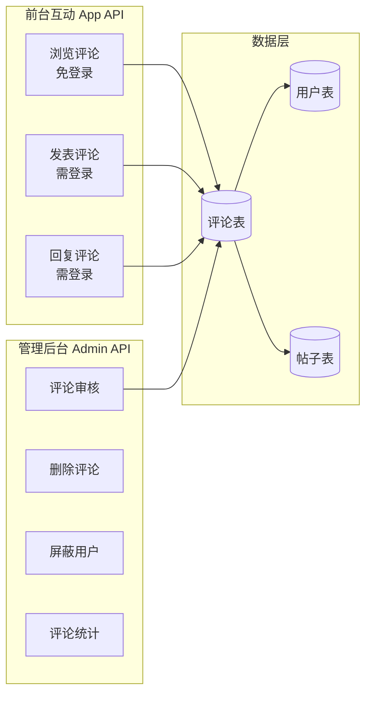
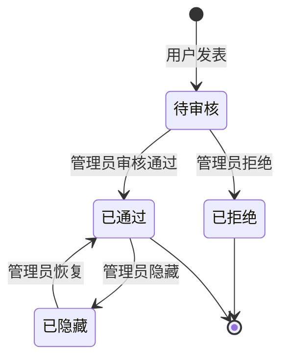

# 评论系统实战教程

GoWind CMS 内置完整的评论系统，支持评论审核、多级回复、屏蔽和管理。本教程讲解评论系统的架构设计、数据模型、前台互动与管理后台审核的完整实现。

## 前置条件

- 已阅读 [CMS 后端架构总览](./backend-architecture.md)
- 了解 App API 白名单机制（参见 [Headless API 对接多端实战](./tutorial-headless-api.md)）

## 一、评论系统架构

### 1.1 功能概览



### 1.2 评论状态流转



| 状态 | 前台可见 | 管理后台 | 说明 |
|------|---------|---------|------|
| PENDING（待审核） | 否 | 可见 | 新评论默认状态 |
| APPROVED（已通过） | 是 | 可见 | 审核通过，前台展示 |
| REJECTED（已拒绝） | 否 | 可见 | 审核拒绝 |
| HIDDEN（已隐藏） | 否 | 可见 | 临时隐藏 |

> 如果站点配置关闭了审核功能，新评论直接为 APPROVED 状态。

## 二、数据模型

### 2.1 Comment 实体

```protobuf
// comment/service/v1/comment.proto

message Comment {
  optional uint32 id = 1;
  optional uint32 post_id = 2 [json_name = "postId"];       // 关联帖子
  optional uint32 user_id = 3 [json_name = "userId"];       // 评论用户
  optional string content = 4;                               // 评论内容
  optional uint32 parent_id = 5 [json_name = "parentId"];   // 父评论ID（多级回复）
  optional Status status = 6;
  enum Status {
    COMMENT_STATUS_PENDING = 0;
    COMMENT_STATUS_APPROVED = 1;
    COMMENT_STATUS_REJECTED = 2;
    COMMENT_STATUS_HIDDEN = 3;
  }

  // 扩展字段（查询时关联填充）
  optional string user_name = 10 [json_name = "userName"];
  optional string user_avatar = 11 [json_name = "userAvatar"];
  optional uint32 reply_count = 12 [json_name = "replyCount"];
  repeated Comment replies = 13 [json_name = "replies"];    // 子回复

  optional google.protobuf.Timestamp created_at = 100;
  optional google.protobuf.Timestamp updated_at = 101;
}
```

### 2.2 Ent Schema

```go
// app/core/service/internal/data/ent/schema/comment.go
type Comment struct{ ent.Schema }

func (Comment) Mixin() []ent.Mixin {
    return []ent.Mixin{mixin.Time{}}
}

func (Comment) Fields() []ent.Field {
    return []ent.Field{
        field.Uint32("post_id"),
        field.Uint32("user_id"),
        field.Text("content"),
        field.Uint32("parent_id").Optional(),  // 自引用（父评论）
        field.Int("status").Default(0),         // PENDING
    }
}

func (Comment) Edges() []ent.Edge {
    return []ent.Edge{
        edge.From("post", Post.Type).Ref("comments").Unique().Required().Field("post_id"),
        edge.From("user", User.Type).Ref("comments").Unique().Field("user_id"),
    }
}
```

### 2.3 评论树结构

```
帖子 #42
├── 评论 #1（顶级评论，user=张三）
│   ├── 评论 #3（回复 #1，user=李四）
│   │   └── 评论 #5（回复 #3，user=张三）
│   └── 评论 #4（回复 #1，user=王五）
├── 评论 #2（顶级评论，user=赵六）
│   └── 评论 #6（回复 #2，user=张三）
```

## 三、Admin API 接口

### 3.1 评论管理接口

```protobuf
// admin/service/v1/i_comment.proto
service CommentService {
  rpc List(pagination.PagingRequest) returns (ListCommentResponse) {
    option (google.api.http) = { get: "/admin/v1/comments" };
  }
  rpc Get(GetCommentRequest) returns (Comment) {
    option (google.api.http) = { get: "/admin/v1/comments/{id}" };
  }
  rpc Delete(DeleteCommentRequest) returns (google.protobuf.Empty) {
    option (google.api.http) = { delete: "/admin/v1/comments/{id}" };
  }
  rpc Approve(ApproveCommentRequest) returns (Comment) {
    option (google.api.http) = { put: "/admin/v1/comments/{id}/approve" };
  }
  rpc Reject(RejectCommentRequest) returns (Comment) {
    option (google.api.http) = { put: "/admin/v1/comments/{id}/reject" };
  }
  rpc Hide(HideCommentRequest) returns (Comment) {
    option (google.api.http) = { put: "/admin/v1/comments/{id}/hide" };
  }
}
```

### 3.2 管理后台筛选

```http
# 按状态筛选评论
GET /admin/v1/comments?status=PENDING&page=1&pageSize=20

# 按帖子筛选
GET /admin/v1/comments?postId=42

# 按用户筛选
GET /admin/v1/comments?userId=10

# 时间范围筛选
GET /admin/v1/comments?startTime=2025-01-01&endTime=2025-01-31
```

## 四、App API 接口

### 4.1 前台评论接口

```protobuf
// app/service/v1/i_comment.proto
service CommentService {
  // 浏览评论（免登录）
  rpc List(pagination.PagingRequest) returns (ListCommentResponse) {
    option (google.api.http) = { get: "/app/v1/comments" };
  }

  // 发表评论（需登录）
  rpc Create(CreateCommentRequest) returns (Comment) {
    option (google.api.http) = { post: "/app/v1/comments" body: "*" };
  }
}
```

### 4.2 前台发表评论

```http
POST /app/v1/comments
Authorization: Bearer {user_token}

{
  "postId": 42,
  "content": "这篇文章写得非常好！",
  "parentId": null
}
```

回复评论：

```http
POST /app/v1/comments
Authorization: Bearer {user_token}

{
  "postId": 42,
  "content": "谢谢支持！",
  "parentId": 1
}
```

## 五、Repository 实现

### 5.1 评论树查询

```go
// app/core/service/internal/data/comment_repo.go
func (r *CommentRepo) ListByPost(
    ctx context.Context, postId uint32, page, pageSize int,
) (*commentV1.ListCommentResponse, error) {
    // 1. 查询顶级评论（parent_id 为空）
    query := r.data.db.Comment.Query().
        Where(
            comment.PostIDEQ(postId),
            comment.StatusEQ(int(commentV1.Comment_COMMENT_STATUS_APPROVED)),
            comment.Not(comment.HasParent()),
        ).
        Order(ent.Desc("created_at"))

    total, err := query.Count(ctx)
    if err != nil {
        return nil, err
    }

    entities, err := query.
        Offset((page - 1) * pageSize).
        Limit(pageSize).
        WithUser().           // 预加载评论用户
        WithReplies().        // 预加载一级回复
        All(ctx)

    // 2. 转换为 Protobuf 并构建评论树
    items := make([]*commentV1.Comment, len(entities))
    for i, entity := range entities {
        items[i] = entity2Proto(entity)
        // 递归加载子回复
        items[i].Replies = r.loadReplies(ctx, entity.ID)
    }

    return &commentV1.ListCommentResponse{
        Items: items,
        Total: uint64(total),
    }, nil
}

func (r *CommentRepo) loadReplies(ctx context.Context, parentId uint32) []*commentV1.Comment {
    replies, err := r.data.db.Comment.Query().
        Where(
            comment.ParentIDEQ(parentId),
            comment.StatusEQ(int(commentV1.Comment_COMMENT_STATUS_APPROVED)),
        ).
        Order(ent.Asc("created_at")).
        WithUser().
        All(ctx)
    if err != nil {
        return nil
    }

    result := make([]*commentV1.Comment, len(replies))
    for i, reply := range replies {
        result[i] = entity2Proto(reply)
        // 递归加载子回复
        result[i].Replies = r.loadReplies(ctx, reply.ID)
    }
    return result
}
```

### 5.2 创建评论

```go
func (r *CommentRepo) Create(
    ctx context.Context, req *commentV1.CreateCommentRequest,
) (*commentV1.Comment, error) {
    builder := r.data.db.Comment.Create().
        SetPostID(req.Data.GetPostId()).
        SetUserID(req.Data.GetUserId()).
        SetContent(req.Data.GetContent()).
        SetStatus(int(commentV1.Comment_COMMENT_STATUS_PENDING))  // 默认待审核

    if parentId := req.Data.GetParentId(); parentId > 0 {
        builder.SetParentID(parentId)
    }

    entity, err := builder.Save(ctx)
    if err != nil {
        return nil, err
    }
    return entity2Proto(entity), nil
}
```

## 六、管理后台实现

### 6.1 评论审核页面

```vue
<!-- views/content/comment/audit.vue -->
<script setup lang="ts">
import { useListComments, useApproveComment, useRejectComment } from '#/api/composables/comment';

const filterStatus = ref('PENDING');
const pagination = reactive(new PaginationQuery());
const { data, isLoading, refetch } = useListComments({
  ...pagination,
  status: filterStatus,
});
const approveMutation = useApproveComment();
const rejectMutation = useRejectComment();

const handleApprove = (id: number) => {
  approveMutation.mutate(id, {
    onSuccess: () => refetch(),
  });
};

const handleReject = (id: number) => {
  rejectMutation.mutate(id, {
    onSuccess: () => refetch(),
  });
};
</script>

<template>
  <Page title="评论审核">
    <RadioGroup v-model:value="filterStatus" button-style="solid">
      <RadioButton value="PENDING">待审核</RadioButton>
      <RadioButton value="APPROVED">已通过</RadioButton>
      <RadioButton value="REJECTED">已拒绝</RadioButton>
      <RadioButton value="HIDDEN">已隐藏</RadioButton>
      <RadioButton value="">全部</RadioButton>
    </RadioGroup>

    <List :loading="isLoading" :data-source="data?.items">
      <template #renderItem="{ item }">
        <List.Item>
          <List.Item.Meta>
            <template #avatar><Avatar :src="item.userAvatar" /></template>
            <template #title>{{ item.userName }}</template>
            <template #description>
              <div>{{ item.content }}</div>
              <small>{{ formatTime(item.createdAt) }}</small>
            </template>
          </List.Item.Meta>
          <template #actions>
            <Button v-if="item.status === 'PENDING'" type="primary" size="small" @click="handleApprove(item.id)">通过</Button>
            <Button v-if="item.status === 'PENDING'" danger size="small" @click="handleReject(item.id)">拒绝</Button>
            <Button danger size="small" @click="handleDelete(item.id)">删除</Button>
          </template>
        </List.Item>
      </template>
    </List>
  </Page>
</template>
```

## 七、前台评论组件

### 7.1 React 评论组件

```tsx
// src/components/post/CommentSection.tsx
'use client';

import { useState, useEffect } from 'react';
import { useAuthStore } from '@/stores/auth';
import { apiClient } from '@/lib/api/client';

interface Comment {
  id: number;
  content: string;
  userName: string;
  userAvatar: string;
  createdAt: string;
  replies?: Comment[];
  parentId?: number;
}

export function CommentSection({ postId }: { postId: number }) {
  const [comments, setComments] = useState<Comment[]>([]);
  const [content, setContent] = useState('');
  const [replyTo, setReplyTo] = useState<number | null>(null);
  const { isAuthenticated } = useAuthStore();

  useEffect(() => {
    apiClient.get('/comments', { params: { postId } }).then((res) => {
      setComments(res.items);
    });
  }, [postId]);

  const handleSubmit = async () => {
    if (!content.trim()) return;

    try {
      const newComment = await apiClient.post('/comments', {
        postId,
        content,
        parentId: replyTo,
      });
      setComments([...comments, newComment]);
      setContent('');
      setReplyTo(null);
    } catch (error) {
      alert('发表评论失败，请先登录');
    }
  };

  return (
    <section className="mt-12">
      <h2 className="text-2xl font-bold mb-6">评论（{comments.length}）</h2>

      {/* 评论输入 */}
      <div className="mb-8">
        {replyTo && (
          <div className="text-sm text-gray-500 mb-2">
            回复评论 #{replyTo}
            <button onClick={() => setReplyTo(null)} className="ml-2 text-red-500">取消</button>
          </div>
        )}
        <textarea
          value={content}
          onChange={(e) => setContent(e.target.value)}
          placeholder={isAuthenticated ? '写下你的评论...' : '请先登录'}
          className="w-full p-3 border rounded"
          rows={3}
        />
        <button
          onClick={handleSubmit}
          disabled={!isAuthenticated}
          className="mt-2 px-4 py-2 bg-blue-600 text-white rounded disabled:opacity-50"
        >
          发表评论
        </button>
      </div>

      {/* 评论列表 */}
      <div className="space-y-6">
        {comments.map((comment) => (
          <CommentItem
            key={comment.id}
            comment={comment}
            onReply={(id) => { setReplyTo(id); setContent(''); }}
          />
        ))}
      </div>
    </section>
  );
}

function CommentItem({
  comment,
  onReply,
}: {
  comment: Comment;
  onReply: (id: number) => void;
}) {
  return (
    <div>
      <div className="flex gap-3">
        
        <div className="flex-1">
          <div className="flex items-center gap-2">
            <span className="font-medium">{comment.userName}</span>
            <time className="text-sm text-gray-400">{comment.createdAt}</time>
          </div>
          <p className="mt-1">{comment.content}</p>
          <button onClick={() => onReply(comment.id)} className="text-sm text-blue-500 mt-1">回复</button>

          {/* 子回复 */}
          {comment.replies && comment.replies.length > 0 && (
            <div className="mt-4 pl-4 border-l-2 space-y-4">
              {comment.replies.map((reply) => (
                <CommentItem key={reply.id} comment={reply} onReply={onReply} />
              ))}
            </div>
          )}
        </div>
      </div>
    </div>
  );
}
```

## 八、最佳实践

### 8.1 防垃圾评论

| 策略 | 实现 |
|------|------|
| 频率限制 | 每用户每分钟最多 5 条评论 |
| 敏感词过滤 | 发布前检查敏感词 |
| IP 限制 | 短时间大量评论的 IP 限流 |
| 审核机制 | 新用户首次评论强制审核 |
| 验证码 | 可选集成图形/行为验证码 |

### 8.2 通知机制

新评论到达时通过 SSE 推送通知管理员：

```go
// Core Service：评论创建后发布事件
func (s *CommentService) Create(ctx context.Context, req *commentV1.CreateCommentRequest) (*commentV1.Comment, error) {
    result, err := s.commentRepo.Create(ctx, req)
    if err != nil {
        return nil, err
    }
    // 发布评论创建事件
    s.eventbus.Publish(ctx, "comment.created", result)
    return result, nil
}
```

## 九、检查清单

| 检查项 | 说明 |
|--------|------|
| Comment Schema 定义 | 字段 + 边缘关系 |
| 状态流转 | PENDING → APPROVED / REJECTED |
| 评论树查询 | 顶级评论 + 递归回复 |
| Admin API | 列表 + 审核 + 删除 |
| App API | 浏览（免登录）+ 发表（需登录） |
| 管理后台审核页 | 状态筛选 + 批量审核 |
| 前台评论组件 | 发表 + 回复 + 多级展示 |
| 防垃圾 | 频率限制 + 敏感词 |

## 相关文档

- [CMS 后端架构总览](./backend-architecture.md)
- [Headless API 对接多端实战](./tutorial-headless-api.md)
- [实时消息推送实战](./tutorial-sse-push.md)
- [前台应用开发实战](./tutorial-frontend-app.md)
