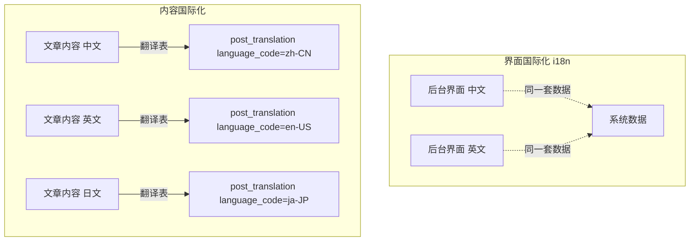
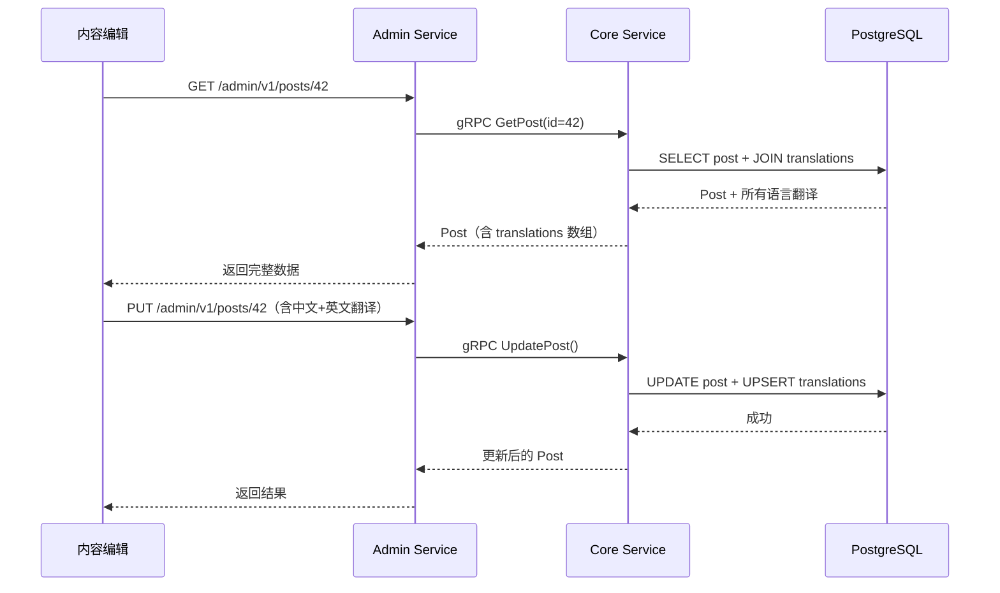

# 内容多语言翻译实战教程

GoWind CMS 原生支持内容级多语言翻译，与 GoWind Admin 仅支持后台界面国际化不同，CMS 为每个内容实体（Post、Category、Tag、Page）都提供了独立的翻译数据模型。本教程深入讲解内容翻译的架构设计、数据模型、API 调用和前端实现。

## 前置条件

- 已阅读 [CMS 后端架构总览](./backend-architecture.md) 和 [CMS API 定义](./backend-api.md)
- 了解 Protobuf、Ent ORM 基本概念
- 本地开发环境已搭建（参见 [安装指南](./installation.md)）

## 一、翻译架构总览

### 1.1 界面国际化 vs 内容国际化



| 对比项 | 界面国际化（i18n） | 内容国际化（翻译） |
|--------|------------------|-----------------|
| 目标 | 后台/前台 UI 文案 | 文章、分类、标签等业务内容 |
| 实现 | 前端 JSON 语言包 | 后端翻译表 + API 参数 |
| 数据 | 静态资源文件 | 数据库动态存储 |
| 管理 | 开发人员维护 | 内容编辑人员维护 |

### 1.2 支持翻译的实体

| 实体 | 翻译表 | Protobuf 消息 | 说明 |
|------|--------|--------------|------|
| Post（帖子） | `post_translations` | `PostTranslation` | 标题、摘要、正文、SEO |
| Category（分类） | `category_translations` | `CategoryTranslation` | 分类名称、描述 |
| Tag（标签） | `tag_translations` | `TagTranslation` | 标签名称 |
| Page（页面） | `page_translations` | `PageTranslation` | 页面标题、内容 |
| DictEntry（字典项） | `dict_entry_i18n` | `DictEntryI18n` | 字典文本 |

### 1.3 翻译数据流



## 二、数据模型

### 2.1 Post 翻译表结构

以帖子翻译为例，每个内容实体都有一个对应的翻译表：

```go
// app/core/service/internal/data/ent/schema/post_translation.go
type PostTranslation struct{ ent.Schema }

func (PostTranslation) Fields() []ent.Field {
    return []ent.Field{
        field.String("language_code").Comment("语言代码，如 zh-CN、en-US"),
        field.String("title").Optional().Comment("翻译后标题"),
        field.String("slug").Optional().Comment("翻译后 URL 别名"),
        field.Text("summary").Optional().Comment("翻译后摘要"),
        field.JSON("content", &[]byte{}).Optional().Comment("翻译后正文（区块 JSON）"),
        field.JSON("seo", map[string]any{}).Optional().Comment("SEO 元数据"),
    }
}

func (PostTranslation) Edges() []ent.Edge {
    return []ent.Edge{
        edge.From("post", Post.Type).Ref("translations").Unique(),
    }
}
```

### 2.2 主表与翻译表的关系

```
posts（主表）
├── id: 42
├── status: PUBLISHED
├── author_id: 1
├── created_at: 2025-01-15
│
└── post_translations（翻译表，一对多）
    ├── { post_id: 42, language_code: "zh-CN", title: "GoWind 入门指南", slug: "gowind-intro-zh" }
    ├── { post_id: 42, language_code: "en-US", title: "GoWind Getting Started", slug: "gowind-intro-en" }
    └── { post_id: 42, language_code: "ja-JP", title: "GoWind入門ガイド", slug: "gowind-intro-ja" }
```

**设计要点**：
- 主表存储与语言无关的字段（状态、作者、时间戳）
- 翻译表存储所有需要翻译的字段（标题、正文、SEO）
- 通过 `language_code` 区分不同语言版本
- 一条主记录可以对应多条翻译记录（一对多关系）

### 2.3 Ent Schema 关联定义

主表的 Ent Schema 通过 edge 关联翻译表：

```go
// app/core/service/internal/data/ent/schema/post.go
func (Post) Edges() []ent.Edge {
    return []ent.Edge{
        // 一对多：一个 Post 有多个翻译
        edge.To("translations", PostTranslation.Type),
        // ...
    }
}
```

## 三、Protobuf API 设计

### 3.1 翻译消息定义

```protobuf
// content/service/v1/post.proto

// 帖子翻译
message PostTranslation {
  optional uint32 id = 1;
  optional uint32 post_id = 2 [json_name = "postId"];
  optional string language_code = 3 [json_name = "languageCode"];
  optional string title = 10;
  optional string slug = 11;
  optional string summary = 12;
  optional string content = 13;
  optional SeoMeta seo = 20 [json_name = "seo"];
}

// 帖子主消息（内嵌翻译数组）
message Post {
  optional uint32 id = 1;
  optional Status status = 5;
  // ... 其他与语言无关的字段

  // 多语言翻译
  repeated PostTranslation translations = 40 [json_name = "translations"];
  repeated string available_languages = 41 [json_name = "availableLanguages"];
}
```

### 3.2 翻译查询接口

Admin Service 提供了检查翻译是否存在的专用接口：

```protobuf
// admin/service/v1/i_post.proto
service PostService {
  // ... CRUD 接口

  // 检查指定语言的翻译是否存在
  rpc TranslationExists(PostTranslationExistsRequest) returns (PostTranslationExistsResponse) {
    option (google.api.http) = {
      get: "/admin/v1/posts/{post_id}/translations/{language_code}"
    };
  }
}

message PostTranslationExistsRequest {
  uint32 post_id = 1 [json_name = "postId"];
  string language_code = 2 [json_name = "languageCode"];
}

message PostTranslationExistsResponse {
  bool exists = 1;
}
```

### 3.3 前台按语言获取翻译

App Service 通过 `locale` 参数获取指定语言的内容：

```protobuf
// app/service/v1/i_post.proto
message GetPostRequest {
  oneof query_by {
    uint32 id = 1;
    string code = 2;  // slug
  }
  optional string locale = 10 [json_name = "locale"];  // 指定语言
}
```

## 四、Repository 层实现

### 4.1 翻译仓储

每个内容实体的翻译都有独立的 Repository：

```go
// app/core/service/internal/data/post_translation_repo.go
type PostTranslationRepo struct {
    data *Data
    log  *log.Helper
}

func NewPostTranslationRepo(ctx *bootstrap.Context, data *Data) *PostTranslationRepo {
    return &PostTranslationRepo{
        data: data,
        log:  ctx.NewLoggerHelper("post-translation/repo"),
    }
}

// 检查翻译是否存在
func (r *PostTranslationRepo) TranslationExists(
    ctx context.Context, postId uint32, languageCode string,
) (bool, error) {
    count, err := r.data.db.PostTranslation.Query()
        .Where(
            posttranslation.HasPostWith(post.IDEQ(postId)),
            posttranslation.LanguageCodeEQ(languageCode),
        )
        .Count(ctx)
    if err != nil {
        return false, err
    }
    return count > 0, nil
}

// 按语言获取翻译
func (r *PostTranslationRepo) GetByLanguage(
    ctx context.Context, postId uint32, languageCode string,
) (*contentV1.PostTranslation, error) {
    entity, err := r.data.db.PostTranslation.Query()
        .Where(
            posttranslation.HasPostWith(post.IDEQ(postId)),
            posttranslation.LanguageCodeEQ(languageCode),
        )
        .Only(ctx)
    if err != nil {
        return nil, err
    }
    return entity2Proto(entity), nil
}
```

### 4.2 主表 Repository 的翻译处理

创建/更新主记录时，自动处理翻译数据：

```go
// app/core/service/internal/data/post_repo.go（简化示例）
func (r *PostRepo) Create(ctx context.Context, req *contentV1.CreatePostRequest) (*contentV1.Post, error) {
    builder := r.data.db.Post.Create().
        SetTitle(req.Data.GetTitle()).
        SetStatus(req.Data.GetStatus())

    // 处理翻译数据
    for _, tr := range req.Data.GetTranslations() {
        builder.AddTranslationIDs(r.createTranslation(ctx, tr))
    }

    entity, err := builder.Save(ctx)
    if err != nil {
        return nil, err
    }
    return entity2Proto(entity), nil
}

// 查询时自动加载翻译
func (r *PostRepo) Get(ctx context.Context, req *contentV1.GetPostRequest) (*contentV1.Post, error) {
    query := r.data.db.Post.Query()

    // 按 ID 或 slug 查询
    if req.GetId() > 0 {
        query = query.Where(post.IDEQ(req.GetId()))
    } else if req.GetCode() != "" {
        query = query.Where(post.SlugEQ(req.GetCode()))
    }

    // 预加载翻译数据
    entity, err := query.WithTranslations().Only(ctx)
    if err != nil {
        return nil, err
    }

    result := entity2Proto(entity)

    // 如果指定了 locale，只返回对应语言的翻译
    if locale := req.GetLocale(); locale != "" {
        for _, tr := range entity.Edges.Translations {
            if tr.LanguageCode == locale {
                // 用翻译数据覆盖主字段
                applyTranslation(result, tr)
                break
            }
        }
    }

    return result, nil
}
```

## 五、Service 业务逻辑

### 5.1 Core Service 翻译逻辑

```go
// app/core/service/internal/service/post_service.go
func (s *PostService) TranslationExists(
    ctx context.Context, req *contentV1.PostTranslationExistsRequest,
) (*contentV1.PostTranslationExistsResponse, error) {
    exists, err := s.postRepo.TranslationExists(ctx, req.GetPostId(), req.GetLanguageCode())
    if err != nil {
        return nil, err
    }
    return &contentV1.PostTranslationExistsResponse{Exists: exists}, nil
}
```

### 5.2 Admin Service 转发

Admin Service 作为代理层，直接转发到 Core Service：

```go
// app/admin/service/internal/service/post_service.go
func (s *PostService) TranslationExists(
    ctx context.Context, req *contentV1.PostTranslationExistsRequest,
) (*contentV1.PostTranslationExistsResponse, error) {
    return s.postClient.TranslationExists(ctx, req)
}
```

## 六、管理后台前端实现

### 6.1 翻译编辑器组件

管理后台的帖子编辑页面需要支持多语言切换编辑：

```vue
<!-- views/content/post/form.vue -->
<script setup lang="ts">
import { useGetPost, useUpdatePost } from '#/api/composables/post';
import { useLanguageStore } from '#/store/language';

const route = useRoute();
const editId = computed(() => Number(route.params.id));
const { data: postData } = useGetPost(editId.value);
const updateMutation = useUpdatePost();

// 当前编辑的语言
const currentLocale = ref('zh-CN');
const languageStore = useLanguageStore();
const supportedLanguages = computed(() => languageStore.supportedLanguages);

// 当前语言的翻译数据
const currentTranslation = computed(() => {
  if (!postData.value?.translations) return null;
  return postData.value.translations.find(
    (t) => t.languageCode === currentLocale.value,
  );
});

// 翻译表单数据
const translationForm = reactive({
  title: '',
  slug: '',
  summary: '',
  content: '',
});

// 切换语言时加载对应翻译
watchEffect(() => {
  if (currentTranslation.value) {
    Object.assign(translationForm, currentTranslation.value);
  } else {
    // 该语言尚无翻译，清空表单
    Object.keys(translationForm).forEach((k) => (translationForm[k] = ''));
  }
});

const handleSaveTranslation = async () => {
  const translations = [...(postData.value?.translations || [])];
  const idx = translations.findIndex(
    (t) => t.languageCode === currentLocale.value,
  );
  if (idx >= 0) {
    translations[idx] = { ...translations[idx], ...translationForm };
  } else {
    translations.push({
      languageCode: currentLocale.value,
      ...translationForm,
    });
  }
  await updateMutation.mutateAsync({
    id: editId.value,
    data: { translations },
  });
};
</script>

<template>
  <Page title="编辑帖子">
    <!-- 语言切换 Tab -->
    <Tabs v-model:activeKey="currentLocale">
      <TabPane
        v-for="lang in supportedLanguages"
        :key="lang.code"
        :tab="lang.name"
      >
        <Form :model="translationForm" layout="vertical">
          <FormItem label="标题">
            <Input v-model:value="translationForm.title" />
          </FormItem>
          <FormItem label="URL 别名（Slug）">
            <Input v-model:value="translationForm.slug" />
          </FormItem>
          <FormItem label="摘要">
            <Textarea v-model:value="translationForm.summary" :rows="3" />
          </FormItem>
          <FormItem label="正文">
            <RichTextEditor v-model:value="translationForm.content" />
          </FormItem>
          <Button type="primary" @click="handleSaveTranslation">
            保存{{ lang.name }}翻译
          </Button>
        </Form>
      </TabPane>
    </Tabs>
  </Page>
</template>
```

### 6.2 翻译状态提示

在帖子列表中展示已翻译的语言标记：

```vue
<!-- views/content/post/index.vue -->
<template>
  <Table :data="data?.items">
    <TableColumn title="标题" data-index="title" />
    <TableColumn title="语言版本">
      <template #default="{ record }">
        <Tag
          v-for="lang in record.availableLanguages"
          :key="lang"
          color="blue"
        >
          {{ lang }}
        </Tag>
      </template>
    </TableColumn>
  </Table>
</template>
```

## 七、前台按语言消费

### 7.1 React 前台（Next.js）

```tsx
// src/app/[locale]/posts/[slug]/page.tsx
export default async function PostDetail({
  params: { locale, slug },
}: {
  params: { locale: string; slug: string };
}) {
  // 通过 locale 参数获取对应语言的翻译
  const post = await getPostBySlug(slug, locale);

  return (
    <article>
      <h1>{post.title}</h1>
      <div>{post.summary}</div>
      {/* content 已经是 locale 对应的翻译内容 */}
      <div dangerouslySetInnerHTML={{ __html: post.content }} />
    </article>
  );
}
```

### 7.2 Flutter 前台

```dart
// features/post_detail/domain/repository/post_repository.dart
abstract class PostRepository {
  Future<Post> getPost({required int id, required String locale});
}

class PostRepositoryImpl implements PostRepository {
  final PostApi api;

  @override
  Future<Post> getPost({required int id, required String locale}) async {
    // API 返回的已经是 locale 对应的翻译内容
    return await api.getPost(id, locale: locale);
  }
}
```

### 7.3 语言切换

前台应用的语言切换只需修改 locale 参数：

```tsx
// React 语言切换组件
function LanguageSwitcher() {
  const { locale, push } = useRouter();
  const { pathname, query } = useRouter();

  const changeLanguage = (newLocale: string) => {
    // URL 路径替换：/zh-CN/posts/xxx -> /en-US/posts/xxx
    push(`/${newLocale}${pathname.replace(`/${locale}`, '')}?${new URLSearchParams(query)}`);
  };

  return (
    <select value={locale} onChange={(e) => changeLanguage(e.target.value)}>
      <option value="zh-CN">中文</option>
      <option value="en-US">English</option>
      <option value="ja-JP">日本語</option>
    </select>
  );
}
```

## 八、语言管理

### 8.1 系统语言管理

CMS 提供独立的语言管理接口，管理支持的语言列表：

```http
# 获取所有语言
GET /admin/v1/languages

# 新增语言
POST /admin/v1/languages
{
  "code": "ko-KR",
  "name": "한국어",
  "sort": 4
}
```

### 8.2 翻译管理

系统提示文案的翻译通过 Translator Service 管理：

```http
# 获取翻译
GET /admin/v1/translators?languageCode=en-US

# 更新翻译
PUT /admin/v1/translators/1
{
  "languageCode": "en-US",
  "key": "post.published",
  "value": "Published"
}
```

## 九、最佳实践

### 9.1 翻译数据策略

| 策略 | 说明 | 适用场景 |
|------|------|---------|
| 完整翻译 | 所有字段都翻译 | 正式发布内容 |
| 部分翻译 | 只翻译标题和摘要 | 快速预览、草稿阶段 |
| 回退策略 | 无翻译时回退到默认语言 | 前台展示容错 |

### 9.2 回退机制实现

```go
// Core Service 中的翻译回退逻辑
func (r *PostRepo) GetWithFallback(
    ctx context.Context, postId uint32, locale string, fallbackLocale string,
) (*contentV1.Post, error) {
    post, err := r.Get(ctx, &contentV1.GetPostRequest{
        QueryBy: &contentV1.GetPostRequest_Id{Id: postId},
        Locale:  locale,
    })
    if err != nil {
        return nil, err
    }

    // 如果指定语言无翻译，回退到默认语言
    if post.GetTitle() == "" && fallbackLocale != "" && fallbackLocale != locale {
        return r.Get(ctx, &contentV1.GetPostRequest{
            QueryBy: &contentV1.GetPostRequest_Id{Id: postId},
            Locale:  fallbackLocale,
        })
    }
    return post, nil
}
```

### 9.3 SEO 与多语言

```html
<!-- 前台 HTML head 中标注多语言版本 -->
<link rel="alternate" hreflang="zh-CN" href="https://example.com/zh-CN/posts/hello" />
<link rel="alternate" hreflang="en-US" href="https://example.com/en-US/posts/hello" />
<link rel="alternate" hreflang="ja-JP" href="https://example.com/ja-JP/posts/hello" />
<link rel="alternate" hreflang="x-default" href="https://example.com/zh-CN/posts/hello" />
```

## 十、检查清单

| 检查项 | 说明 |
|--------|------|
| 翻译表 Schema 定义 | 主表 + 翻译表的 Ent Schema 和 edge 关联 |
| Protobuf 消息定义 | Translation 消息 + 主消息内嵌 translations 数组 |
| Repository 翻译方法 | TranslationExists / GetByLanguage / Create / Update |
| Core Service 业务逻辑 | 翻译检查、按语言查询、回退策略 |
| Admin Service 接口 | 转发翻译相关 RPC |
| App Service 前台接口 | locale 参数支持 |
| 管理后台翻译编辑器 | 语言切换 Tab + 翻译表单 |
| 前台语言适配 | URL 路由 / locale 参数 |

## 相关文档

- [CMS 后端架构总览](./backend-architecture.md)
- [CMS Protobuf API 定义](./backend-api.md)
- [新增内容类型全栈实战](./tutorial-new-content.md)
- [Headless API 对接多端实战](./tutorial-headless-api.md)
- [GoWind Admin 国际化与主题教程](/admin/tutorial-theme-i18n.md)
