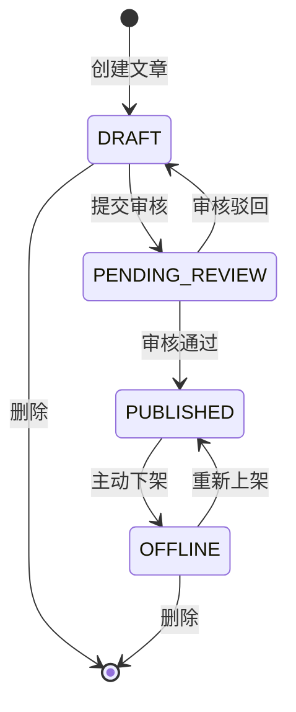
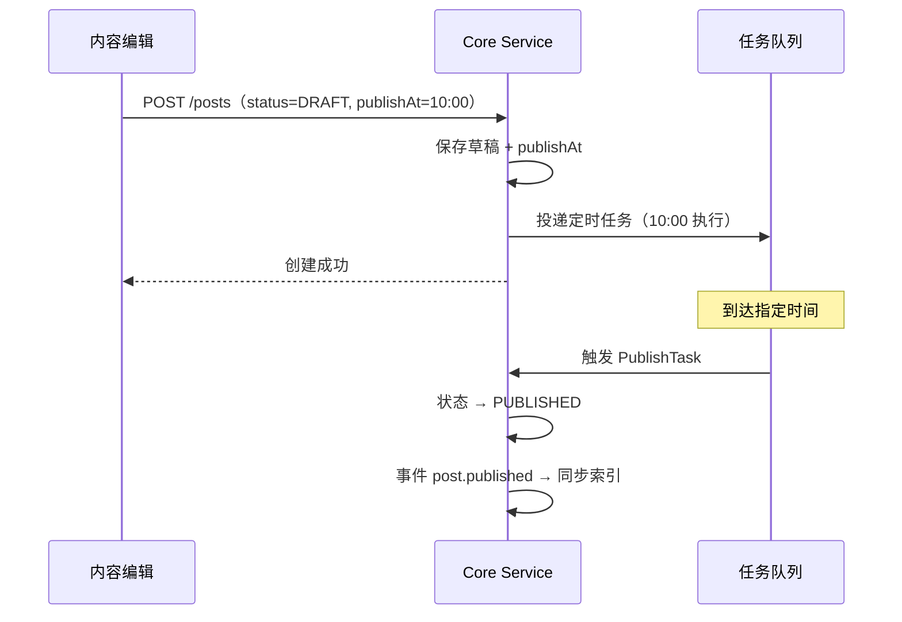

# 内容发布工作流实战教程

GoWind CMS 为内容管理提供了完整的发布工作流，从草稿撰写、审核审批、定时发布到下架归档，覆盖内容全生命周期。本教程讲解内容状态机、审核流程、定时发布和工作流扩展的实现。

## 前置条件

- 已阅读 [CMS 后端架构总览](./backend-architecture.md)
- 了解 CMS 内容模型（Post / Page）

## 一、内容状态机

### 1.1 状态定义



| 状态 | Protobuf 枚举 | 前台可见 | 可编辑 | 说明 |
|------|--------------|---------|--------|------|
| 草稿 | `POST_STATUS_DRAFT` (0) | 否 | 是 | 初始状态，仅作者可见 |
| 待审核 | `POST_STATUS_PENDING_REVIEW` (3) | 否 | 否 | 等待管理员审核 |
| 已发布 | `POST_STATUS_PUBLISHED` (1) | 是 | 是 | 正式发布，前台可见 |
| 已下架 | `POST_STATUS_OFFLINE` (2) | 否 | 是 | 临时下架，可重新上架 |

### 1.2 Protobuf 定义

```protobuf
// content/service/v1/post.proto
message Post {
  optional Status status = 5;
  enum Status {
    POST_STATUS_DRAFT = 0;
    POST_STATUS_PUBLISHED = 1;
    POST_STATUS_OFFLINE = 2;
    POST_STATUS_PENDING_REVIEW = 3;
  }

  // 发布控制
  optional google.protobuf.Timestamp publish_at = 30 [json_name = "publishAt"];
  optional google.protobuf.Timestamp offline_at = 31 [json_name = "offlineAt"];
  optional bool pinned = 32 [json_name = "pinned"];
  optional uint32 sort_order = 33 [json_name = "sortOrder"];
}
```

## 二、状态流转

### 2.1 Core Service 状态控制

```go
// app/core/service/internal/service/post_service.go

// SubmitReview 提交审核
func (s *PostService) SubmitReview(ctx context.Context, req *contentV1.SubmitReviewRequest) (*contentV1.Post, error) {
    post, err := s.postRepo.Get(ctx, &contentV1.GetPostRequest{
        QueryBy: &contentV1.GetPostRequest_Id{Id: req.GetId()},
    })
    if err != nil {
        return nil, err
    }

    // 状态校验：只有草稿状态才能提交审核
    if post.GetStatus() != contentV1.Post_POST_STATUS_DRAFT {
        return nil, errors.BadRequest("INVALID_STATUS", "只有草稿状态才能提交审核")
    }

    return s.postRepo.UpdateStatus(ctx, req.GetId(), contentV1.Post_POST_STATUS_PENDING_REVIEW)
}

// Approve 审核通过 → 自动发布
func (s *PostService) Approve(ctx context.Context, req *contentV1.ApprovePostRequest) (*contentV1.Post, error) {
    post, err := s.postRepo.Get(ctx, &contentV1.GetPostRequest{
        QueryBy: &contentV1.GetPostRequest_Id{Id: req.GetId()},
    })
    if err != nil {
        return nil, err
    }

    if post.GetStatus() != contentV1.Post_POST_STATUS_PENDING_REVIEW {
        return nil, errors.BadRequest("INVALID_STATUS", "只有待审核状态才能通过")
    }

    published, err := s.postRepo.UpdateStatus(ctx, req.GetId(), contentV1.Post_POST_STATUS_PUBLISHED)
    if err != nil {
        return nil, err
    }

    // 发布事件 → 触发索引同步、通知推送
    s.eventbus.Publish(ctx, "post.published", published)
    return published, nil
}

// Reject 审核驳回 → 回到草稿
func (s *PostService) Reject(ctx context.Context, req *contentV1.RejectPostRequest) (*contentV1.Post, error) {
    return s.postRepo.UpdateStatus(ctx, req.GetId(), contentV1.Post_POST_STATUS_DRAFT)
}
```

### 2.2 前台过滤

App API 查询时只返回已发布内容：

```go
// app/core/service/internal/data/post_repo.go
func (r *PostRepo) ListForApp(ctx context.Context, req *paginationV1.PagingRequest) (*contentV1.ListPostResponse, error) {
    query := r.data.db.Post.Query()

    // 前台强制过滤：只返回已发布
    query = query.Where(post.StatusEQ(int(contentV1.Post_POST_STATUS_PUBLISHED)))

    // 发布时间过滤：未到发布时间的不显示
    query = query.Where(
        post.Or(
            post.PublishAtIsNil(),
            post.PublishAtLTE(time.Now()),
        ),
    )
    // ...
}
```

## 三、定时发布

### 3.1 定时发布机制



### 3.2 定时发布实现

```go
func (s *PostService) Create(ctx context.Context, req *contentV1.CreatePostRequest) (*contentV1.Post, error) {
    if req.Data.Status == nil {
        req.Data.Status = trans.Ptr(contentV1.Post_POST_STATUS_PUBLISHED)
    }

    post, err := s.postRepo.Create(ctx, req)
    if err != nil {
        return nil, err
    }

    // 定时发布
    if publishAt := post.GetPublishAt(); publishAt != nil && publishAt.AsTime().After(time.Now()) {
        s.postRepo.UpdateStatus(ctx, post.GetId(), contentV1.Post_POST_STATUS_DRAFT)

        payload, _ := json.Marshal(task.PublishPostPayload{PostId: post.GetId()})
        s.asynqClient.Enqueue(
            asynq.NewTask(task.TypePublishPost, payload),
            asynq.ProcessAt(publishAt.AsTime()),
            asynq.Queue("default"),
        )
    }
    return post, nil
}
```

## 四、管理后台前端

### 4.1 状态操作

```vue
<!-- views/content/post/form.vue -->
<script setup lang="ts">
const formData = reactive({ status: 0, publishAt: null, pinned: false });

// 当前状态决定可用操作
const canSubmitReview = computed(() => formData.status === 0);
const canPublish = computed(() => [0, 3].includes(formData.status));
const canOffline = computed(() => formData.status === 1);
const canEdit = computed(() => [0, 2].includes(formData.status));
</script>

<template>
  <Page title="编辑文章">
    <Form :model="formData">
      <FormItem label="标题">
        <Input v-model:value="formData.title" :disabled="!canEdit" />
      </FormItem>
      <FormItem label="定时发布">
        <DatePicker v-model:value="formData.publishAt" show-time :disabled="!canEdit" />
      </FormItem>

      <Space>
        <Button v-if="canEdit" type="primary">保存草稿</Button>
        <Button v-if="canSubmitReview">提交审核</Button>
        <Button v-if="canPublish" type="primary">立即发布</Button>
        <Button v-if="canOffline" danger>下架</Button>
      </Space>
    </Form>
  </Page>
</template>
```

### 4.2 列表状态筛选

```vue
<template>
  <Tabs v-model:activeKey="filterStatus">
    <TabPane key="" tab="全部" />
    <TabPane key="0" tab="草稿" />
    <TabPane key="3" tab="待审核" />
    <TabPane key="1" tab="已发布" />
    <TabPane key="2" tab="已下架" />
  </Tabs>
</template>
```

## 五、置顶与排序

```go
// 前台查询：置顶优先，然后按发布时间倒序
func (r *PostRepo) ListForApp(ctx context.Context, req *paginationV1.PagingRequest) {
    query := r.data.db.Post.Query().
        Where(post.StatusEQ(int(contentV1.Post_POST_STATUS_PUBLISHED))).
        Order(
            ent.Desc("pinned"),      // 置顶优先
            ent.Desc("sort_order"),  // 自定义排序
            ent.Desc("publish_at"),  // 发布时间倒序
        )
}
```

## 六、回收站

### 6.1 软删除与恢复

```http
# 软删除（进入回收站）
DELETE /admin/v1/posts/{id}

# 查看回收站
GET /admin/v1/posts?deleted=true

# 恢复文章
PUT /admin/v1/posts/{id}/restore

# 彻底删除
DELETE /admin/v1/posts/{id}/permanent
```

## 七、检查清单

| 检查项 | 说明 |
|--------|------|
| 状态枚举定义 | DRAFT / PENDING_REVIEW / PUBLISHED / OFFLINE |
| 状态流转接口 | SubmitReview / Approve / Reject / Publish / Offline |
| 定时发布 | Asynq 定时任务 |
| 前台过滤 | 强制 PUBLISHED 状态过滤 |
| 管理后台 UI | 状态 Tab + 操作按钮 |
| 置顶排序 | pinned + sortOrder + publishAt |
| 回收站 | 软删除 + 恢复 + 彻底删除 |

## 相关文档

- [CMS 后端架构总览](./backend-architecture.md)
- [区块编辑器实战](./tutorial-section-editor.md)
- [任务调度实战](./tutorial-task-scheduling.md)
- [事件总线架构](./tutorial-eventbus-architecture.md)
