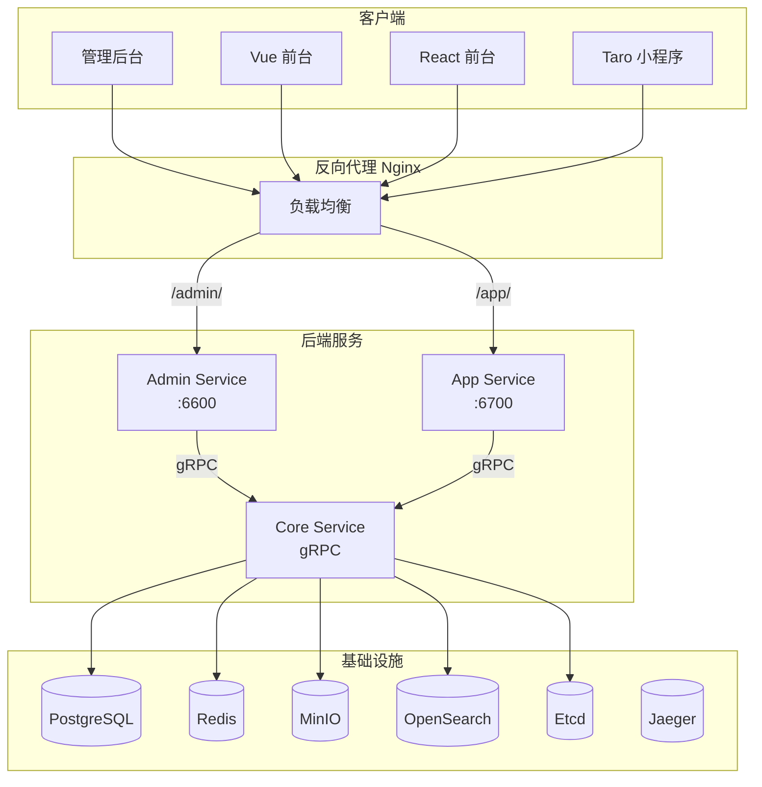

# 三服务部署实战教程

GoWind CMS 采用 Admin / App / Core 三服务架构，部署比单服务的 Admin 更复杂。本教程讲解三服务的本地开发、Docker 部署、Nginx 反向代理和生产环境部署方案。

## 前置条件

- 已阅读 [CMS 后端架构总览](./backend-architecture.md) 和 [安装指南](./installation.md)
- 熟悉 Docker / Docker Compose / Nginx 基本操作

## 一、部署架构

### 1.1 生产架构总览



### 1.2 部署方式对比

| 方式 | 复杂度 | 适用场景 |
|------|--------|---------|
| 本地开发 | 低 | 开发调试 |
| Docker Compose 全量 | 中 | 测试/小规模生产 |
| Docker + Nginx | 中高 | 中等规模生产 |
| Kubernetes | 高 | 大规模生产 |

## 二、本地开发部署

### 2.1 启动基础设施

```bash
cd backend

# 启动所有依赖服务
make docker-libs

# 或使用脚本
# Windows
.\scripts\docker\libs_only.ps1
# Linux/macOS
./scripts/docker/libs_only.sh
```

### 2.2 启动三个服务

```bash
# 使用 gow CLI 分别启动三个服务（三个终端）

# 终端 1：Core Service（必须先启动）
gow run core

# 终端 2：Admin Service
gow run admin

# 终端 3：App Service
gow run app
```

### 2.3 启动前端

```bash
# 终端 4：管理后台
cd frontend/admin
pnpm install
pnpm dev   # http://localhost:5666

# 终端 5：React 前台
cd frontend/app/react
pnpm install
pnpm dev   # http://localhost:3000
```

## 三、Docker Compose 全量部署

### 3.1 完整 docker-compose

```yaml
# docker-compose.yaml
version: "3.8"

services:
  # ========== 基础设施 ==========
  postgres:
    image: postgres:16
    environment:
      POSTGRES_DB: cms
      POSTGRES_USER: postgres
      POSTGRES_PASSWORD: "*Abcd123456"
    ports:
      - "5432:5432"
    volumes:
      - pg_data:/var/lib/postgresql/data

  redis:
    image: redis:7
    command: redis-server --requirepass "*Abcd123456"
    ports:
      - "6379:6379"
    volumes:
      - redis_data:/data

  minio:
    image: minio/minio
    command: server /data --console-address ":9001"
    environment:
      MINIO_ROOT_USER: minioadmin
      MINIO_ROOT_PASSWORD: minioadmin
    ports:
      - "9000:9000"
      - "9001:9001"
    volumes:
      - minio_data:/data

  opensearch:
    image: opensearchproject/opensearch:2.12.0
    environment:
      - discovery.type=single-node
      - "OPENSEARCH_JAVA_OPTS=-Xms512m -Xmx512m"
    ports:
      - "9200:9200"
    volumes:
      - os_data:/usr/share/opensearch/data

  etcd:
    image: bitnami/etcd:3.5
    environment:
      - ALLOW_NONE_AUTHENTICATION=yes
      - ETCD_ADVERTISE_CLIENT_URLS=http://etcd:2379
    ports:
      - "2379:2379"
    volumes:
      - etcd_data:/bitnami/etcd

  # ========== 后端服务 ==========
  core-service:
    build:
      context: .
      dockerfile: Dockerfile
    command: ["/app/core", "-conf", "/app/configs"]
    depends_on:
      - postgres
      - redis
      - minio
      - opensearch
      - etcd
    volumes:
      - ./app/core/service/configs:/app/configs
    environment:
      - DB_HOST=postgres
      - REDIS_HOST=redis
      - OSS_ENDPOINT=minio:9000
      - OS_HOST=opensearch
      - ETCD_ENDPOINTS=etcd:2379
    restart: always

  admin-service:
    build:
      context: .
      dockerfile: Dockerfile
    command: ["/app/admin", "-conf", "/app/configs"]
    depends_on:
      - core-service
      - etcd
    ports:
      - "6600:6600"
      - "6601:6601"
    volumes:
      - ./app/admin/service/configs:/app/configs
    environment:
      - ETCD_ENDPOINTS=etcd:2379
    restart: always

  app-service:
    build:
      context: .
      dockerfile: Dockerfile
    command: ["/app/app", "-conf", "/app/configs"]
    depends_on:
      - core-service
      - etcd
    ports:
      - "6700:6700"
      - "6701:6701"
    volumes:
      - ./app/app/service/configs:/app/configs
    environment:
      - ETCD_ENDPOINTS=etcd:2379
    restart: always

  # ========== 前端 ==========
  admin-frontend:
    build:
      context: ./frontend/admin
      dockerfile: Dockerfile
    ports:
      - "5666:80"
    depends_on:
      - admin-service
    restart: always

  react-frontend:
    build:
      context: ./frontend/app/react
      dockerfile: Dockerfile
    ports:
      - "3000:80"
    depends_on:
      - app-service
    restart: always

volumes:
  pg_data:
  redis_data:
  minio_data:
  os_data:
  etcd_data:
```

### 3.2 一键启动

```bash
# 全量启动（基础设施 + 后端 + 前端）
docker-compose up -d

# 查看服务状态
docker-compose ps

# 查看日志
docker-compose logs -f admin-service
docker-compose logs -f app-service
docker-compose logs -f core-service
```

## 四、Dockerfile

### 4.1 后端多阶段构建

```dockerfile
# backend/Dockerfile
FROM golang:1.25-alpine AS builder

WORKDIR /build
COPY go.mod go.sum ./
RUN go mod download

COPY . .

# 分别编译三个服务的二进制文件
RUN CGO_ENABLED=0 go build -o core ./app/core/service/cmd/server/
RUN CGO_ENABLED=0 go build -o admin ./app/admin/service/cmd/server/
RUN CGO_ENABLED=0 go build -o app ./app/app/service/cmd/server/

# 运行阶段
FROM alpine:3.19

RUN apk add --no-cache ca-certificates tzdata
ENV TZ=Asia/Shanghai

WORKDIR /app
COPY --from=builder /build/core /app/core
COPY --from=builder /build/admin /app/admin
COPY --from=builder /build/app /app/app

# 默认启动 Core Service（可被 docker-compose command 覆盖）
CMD ["/app/core", "-conf", "/app/configs"]
```

### 4.2 管理后台前端 Dockerfile

```dockerfile
# frontend/admin/Dockerfile
FROM node:20-alpine AS builder
WORKDIR /app
COPY pnpm-lock.yaml package.json ./
RUN corepack enable && pnpm install --frozen-lockfile
COPY . .
RUN pnpm build

FROM nginx:alpine
COPY --from=builder /app/apps/admin/dist /usr/share/nginx/html
COPY nginx.conf /etc/nginx/conf.d/default.conf
EXPOSE 80
```

### 4.3 React 前台 Dockerfile

```dockerfile
# frontend/app/react/Dockerfile
FROM node:20-alpine AS builder
WORKDIR /app
COPY package.json pnpm-lock.yaml ./
RUN corepack enable && pnpm install --frozen-lockfile
COPY . .
ENV NEXT_PUBLIC_API_BASE_URL=/app/v1
RUN pnpm build

FROM node:20-alpine AS runner
WORKDIR /app
COPY --from=builder /app/.next/standalone ./
COPY --from=builder /app/.next/static ./.next/static
COPY --from=builder /app/public ./public
EXPOSE 3000
CMD ["node", "server.js"]
```

## 五、Nginx 反向代理

### 5.1 生产 Nginx 配置

```nginx
# /etc/nginx/conf.d/cms.conf

# 管理后台
server {
    listen 443 ssl http2;
    server_name admin.cms.gowind.cloud;

    ssl_certificate /etc/ssl/certs/cms.crt;
    ssl_certificate_key /etc/ssl/private/cms.key;

    # 前端静态资源
    location / {
        proxy_pass http://127.0.0.1:5666;
        proxy_set_header Host $host;
        proxy_set_header X-Real-IP $remote_addr;
    }

    # Admin API
    location /api/ {
        proxy_pass http://127.0.0.1:6600/admin/v1/;
        proxy_set_header Host $host;
        proxy_set_header X-Real-IP $remote_addr;
        proxy_set_header Authorization $http_authorization;
    }

    # Admin SSE
    location /sse/ {
        proxy_pass http://127.0.0.1:6601/events;
        proxy_set_header Connection "";
        proxy_http_version 1.1;
        proxy_buffering off;     # SSE 需要关闭缓冲
        proxy_cache off;
        proxy_read_timeout 86400s;
    }

    # Swagger 文档
    location /docs/ {
        proxy_pass http://127.0.0.1:6600/docs/;
    }
}

# 前台 API
server {
    listen 443 ssl http2;
    server_name api.cms.gowind.cloud;

    ssl_certificate /etc/ssl/certs/cms.crt;
    ssl_certificate_key /etc/ssl/private/cms.key;

    # App API
    location / {
        proxy_pass http://127.0.0.1:6700/app/v1/;
        proxy_set_header Host $host;
        proxy_set_header X-Real-IP $remote_addr;
    }

    # App SSE
    location /events {
        proxy_pass http://127.0.0.1:6701/events;
        proxy_http_version 1.1;
        proxy_buffering off;
        proxy_read_timeout 86400s;
    }

    # Swagger
    location /docs/ {
        proxy_pass http://127.0.0.1:6700/docs/;
    }
}

# React 前台
server {
    listen 443 ssl http2;
    server_name react.cms.gowind.cloud;

    ssl_certificate /etc/ssl/certs/cms.crt;
    ssl_certificate_key /etc/ssl/private/cms.key;

    location / {
        proxy_pass http://127.0.0.1:3000;
        proxy_set_header Host $host;
    }
}

# HTTP → HTTPS 重定向
server {
    listen 80;
    server_name *.cms.gowind.cloud;
    return 301 https://$host$request_uri;
}
```

### 5.2 负载均衡

多实例部署时启用负载均衡：

```nginx
upstream admin_api {
    server 10.0.0.1:6600 weight=3;
    server 10.0.0.2:6600 weight=3;
    server 10.0.0.3:6600 weight=2;
}

upstream app_api {
    server 10.0.0.1:6700;
    server 10.0.0.2:6700;
    ip_hash;  # 会话保持
}

server {
    location /api/ {
        proxy_pass http://admin_api/admin/v1/;
    }
    location / {
        proxy_pass http://app_api/app/v1/;
    }
}
```

## 六、PM2 部署

### 6.1 PM2 配置

```javascript
// ecosystem.config.js
module.exports = {
  apps: [
    {
      name: 'cms-core',
      script: './core',
      args: '-conf ./configs',
      cwd: './app/core/service',
      instances: 1,
      autorestart: true,
      max_memory_restart: '1G',
      env: {
        GO_ENV: 'production',
      },
    },
    {
      name: 'cms-admin',
      script: './admin',
      args: '-conf ./configs',
      cwd: './app/admin/service',
      instances: 2,          // 多实例
      exec_mode: 'cluster',
      autorestart: true,
      env: {
        GO_ENV: 'production',
      },
    },
    {
      name: 'cms-app',
      script: './app',
      args: '-conf ./configs',
      cwd: './app/app/service',
      instances: 2,
      exec_mode: 'cluster',
      autorestart: true,
      env: {
        GO_ENV: 'production',
      },
    },
  ],
};
```

```bash
# PM2 部署
pm2 start ecosystem.config.js

# 查看状态
pm2 status

# 日志
pm2 logs cms-admin
```

## 七、健康检查与监控

### 7.1 健康检查端点

```yaml
# server.yaml 配置健康检查
server:
  health:
    enabled: true
    path: "/healthz"
    read_timeout: 1s
```

```bash
# 检查各服务健康状态
curl http://localhost:6600/healthz   # Admin Service
curl http://localhost:6700/healthz   # App Service
```

### 7.2 Jaeger 链路追踪

```yaml
# server.yaml
server:
  tracer:
    enabled: true
    provider: jaeger
    endpoint: "http://jaeger:14268/api/traces"
```

访问 Jaeger UI：`http://localhost:16686`

## 八、配置管理

### 8.1 配置文件结构

```
configs/
├── core/
│   ├── server.yaml       # Core Service 配置
│   └── registry.yaml     # 服务注册
├── admin/
│   ├── server.yaml       # Admin Service 配置
│   └── registry.yaml
├── app/
│   ├── server.yaml       # App Service 配置
│   └── registry.yaml
└── config.yaml           # 共享配置（数据库、Redis、OSS）
```

### 8.2 环境变量覆盖

```yaml
# server.yaml 使用环境变量
data:
  database:
    driver: postgres
    source: "host=${DB_HOST} port=5432 user=postgres password=${DB_PASSWORD} dbname=cms sslmode=disable"

  redis:
    addr: "${REDIS_HOST}:6379"
    password: "${REDIS_PASSWORD}"

  oss:
    endpoint: "${OSS_ENDPOINT}"
    access_key: "${OSS_ACCESS_KEY}"
    secret_key: "${OSS_SECRET_KEY}"
    bucket: "${OSS_BUCKET}"
```

## 九、部署检查清单

| 检查项 | 说明 |
|--------|------|
| 基础设施 | PostgreSQL / Redis / MinIO / OpenSearch / Etcd |
| Core Service | gRPC 服务注册到 Etcd |
| Admin Service | 连接 Core + HTTP 6600 |
| App Service | 连接 Core + HTTP 6700 |
| Nginx 配置 | HTTPS + 反向代理 + SSE |
| 健康检查 | /healthz 端点 |
| 环境变量 | 数据库密码等敏感信息 |
| 日志收集 | 集中式日志 |
| 链路追踪 | Jaeger 集成 |
| 数据备份 | 定期备份数据库 |

## 相关文档

- [CMS 安装指南](./installation.md)
- [CMS 后端架构总览](./backend-architecture.md)
- [配置与部署指南](./backend-config-deploy.md)
- [GoWind Admin 配置部署指南](/admin/backend-config-deploy.md)
