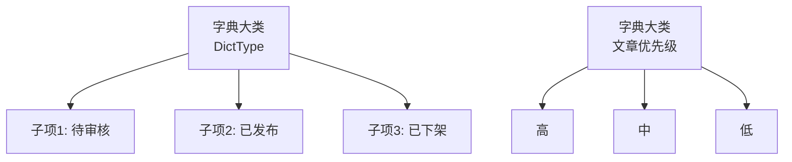

# 字典管理系统实战教程

GoWind CMS 内置完整的数据字典管理功能，支持字典大类和子项的层级管理，可用于内容状态、文章类型、优先级等枚举数据的统一维护。本教程讲解字典系统的架构和使用。

## 前置条件

- 已阅读 [CMS 后端架构总览](./backend-architecture.md)

## 一、字典系统架构

### 1.1 什么是数据字典

数据字典用于管理系统中的枚举值和常量配置，避免在代码中硬编码：



### 1.2 字典 vs 枚举

| 对比项 | 枚举 | 数据字典 |
|--------|------|---------|
| 定义位置 | 代码中 | 数据库 |
| 修改成本 | 需编译 | 运行时 |
| 国际化 | 需硬编码 | 支持翻译 |
| 排序 | 固定 | 可调整 |
| 扩展 | 需改代码 | 管理后台直接增 |

## 二、数据模型

### 2.1 DictType（字典大类）

```protobuf
// dict/service/v1/dict_type.proto
message DictType {
  optional uint32 id = 1;
  optional string name = 2 [json_name = "name"];         // 字典名称
  optional string code = 3 [json_name = "code"];         // 字典编码（唯一）
  optional string description = 4 [json_name = "description"];
  optional Status status = 5;
  enum Status {
    DICT_TYPE_STATUS_ACTIVE = 0;
    DICT_TYPE_STATUS_INACTIVE = 1;
  }
  optional google.protobuf.Timestamp created_at = 100;
}
```

### 2.2 DictEntry（字典子项）

```protobuf
// dict/service/v1/dict_entry.proto
message DictEntry {
  optional uint32 id = 1;
  optional uint32 dict_type_id = 2 [json_name = "dictTypeId"];
  optional string label = 3;           // 显示名称
  optional string value = 4;           // 字典值
  optional uint32 sort = 5;            // 排序
  optional string css_class = 6 [json_name = "cssClass"]; // CSS 样式
  optional bool is_default = 7 [json_name = "isDefault"]; // 是否默认值
  optional Status status = 8;
  repeated DictEntryI18n i18n = 20 [json_name = "i18n"];  // 国际化
}

// 字典子项国际化
message DictEntryI18n {
  optional uint32 id = 1;
  optional uint32 dict_entry_id = 2 [json_name = "dictEntryId"];
  optional string language_code = 3 [json_name = "languageCode"];
  optional string label = 4;           // 翻译后显示名称
}
```

## 三、Admin API

### 3.1 字典大类接口

```http
# 获取字典大类列表
GET /admin/v1/dict-types?page=1&pageSize=20

# 创建字典大类
POST /admin/v1/dict-types
{
  "name": "文章状态",
  "code": "post_status",
  "description": "文章发布状态"
}

# 更新
PUT /admin/v1/dict-types/1

# 删除
DELETE /admin/v1/dict-types/1
```

### 3.2 字典子项接口

```http
# 获取子项列表（按大类筛选）
GET /admin/v1/dict-entries?dictTypeId=1

# 创建子项
POST /admin/v1/dict-entries
{
  "dictTypeId": 1,
  "label": "待审核",
  "value": "3",
  "sort": 1,
  "isDefault": false,
  "i18n": [
    { "languageCode": "zh-CN", "label": "待审核" },
    { "languageCode": "en-US", "label": "Pending Review" }
  ]
}
```

## 四、CMS 常用字典

| 字典编码 | 说明 | 子项示例 |
|---------|------|---------|
| `post_status` | 文章状态 | 草稿/待审核/已发布/已下架 |
| `comment_status` | 评论状态 | 待审核/已通过/已拒绝 |
| `media_type` | 媒体类型 | 图片/视频/音频/文档 |
| `site_theme` | 站点主题 | 亮色/暗色/极简/杂志 |
| `nav_type` | 导航类型 | 顶部导航/页脚/侧边栏 |
| `priority` | 优先级 | 高/中/低 |

## 五、管理后台

### 5.1 字典管理页面

```vue
<!-- views/system/dict/index.vue -->
<script setup lang="ts">
const activeTab = ref('types');
const selectedType = ref(null);
</script>

<template>
  <Page title="字典管理">
    <Tabs v-model:activeKey="activeTab">
      <!-- 字典大类管理 -->
      <TabPane key="types" tab="字典大类">
        <Table :data="dictTypes">
          <TableColumn title="名称" data-index="name" />
          <TableColumn title="编码" data-index="code" />
          <TableColumn title="描述" data-index="description" />
          <TableColumn title="操作">
            <template #default="{ record }">
              <Button @click="selectedType = record; activeTab = 'entries'">管理子项</Button>
            </template>
          </TableColumn>
        </Table>
      </TabPane>

      <!-- 字典子项管理 -->
      <TabPane key="entries" tab="字典子项" :disabled="!selectedType">
        <DictEntryManager :dict-type="selectedType" />
      </TabPane>
    </Tabs>
  </Page>
</template>
```

### 5.2 前端使用字典

```typescript
// composable：获取字典
export function useDict(code: string, locale?: string) {
  return useQuery({
    queryKey: ['dict', code, locale],
    queryFn: () => apiClient.dictService.GetByCode({ code, locale }),
    staleTime: 5 * 60 * 1000, // 5分钟缓存
  });
}

// 组件中使用
const { data: postStatusDict } = useDict('post_status', 'zh-CN');
// postStatusDict.items = [{ label: '草稿', value: '0' }, ...]
```

## 六、缓存优化

```go
// 字典数据变化不频繁，使用 Redis 缓存
func (s *DictService) GetByCode(ctx context.Context, code string) ([]*dictV1.DictEntry, error) {
    cacheKey := fmt.Sprintf("dict:%s", code)

    // 尝试缓存
    if cached, err := s.redis.Get(ctx, cacheKey).Result(); err == nil {
        var entries []*dictV1.DictEntry
        json.Unmarshal([]byte(cached), &entries)
        return entries, nil
    }

    // 查询数据库
    entries, err := s.dictRepo.GetByCode(ctx, code)
    if err != nil {
        return nil, err
    }

    // 写入缓存
    data, _ := json.Marshal(entries)
    s.redis.Set(ctx, cacheKey, data, 30*time.Minute)

    return entries, nil
}

// 字典更新时清除缓存
func (s *DictService) UpdateEntry(ctx context.Context, req *dictV1.UpdateDictEntryRequest) error {
    if err := s.dictRepo.UpdateEntry(ctx, req); err != nil {
        return err
    }
    s.redis.Del(ctx, fmt.Sprintf("dict:%s", req.DictTypeCode))
    return nil
}
```

## 七、检查清单

| 检查项 | 说明 |
|--------|------|
| DictType Schema | 字典大类 |
| DictEntry Schema | 字典子项 + 国际化 |
| Admin API | 大类 + 子项 CRUD |
| 前端页面 | 大类管理 + 子项管理 |
| 字典使用 | useDict composable |
| 缓存 | Redis 缓存 |

## 相关文档

- [CMS 后端架构总览](./backend-architecture.md)
- [CMS 后端模块总览](./backend-modules.md)
- [内容多语言翻译实战](./tutorial-content-i18n.md)
