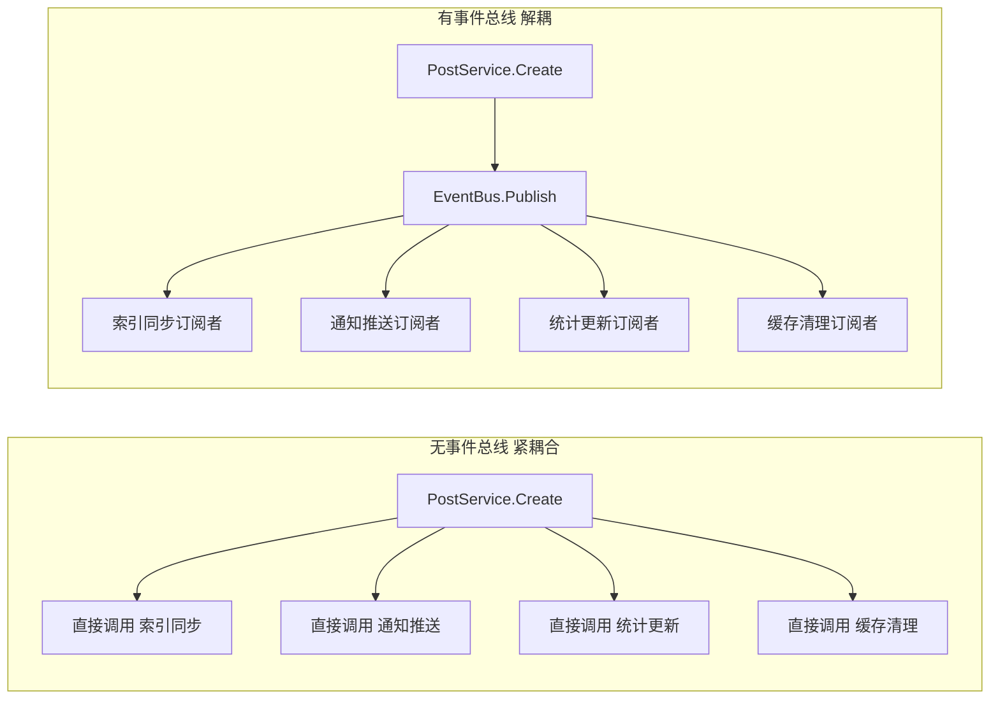
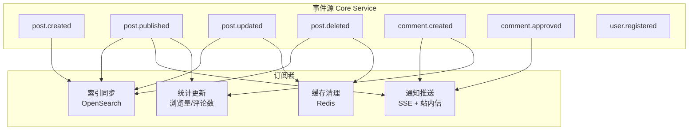
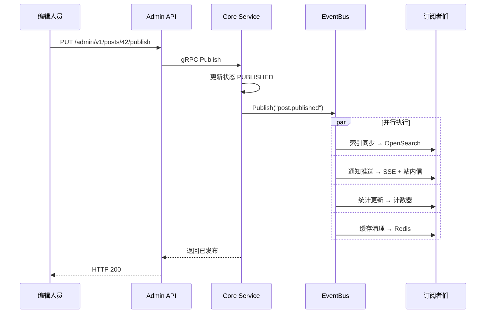

# 事件总线架构实战教程

GoWind CMS 在 Core Service 中集成了 EventBus 事件总线，实现业务逻辑的解耦。内容发布、评论创建、用户操作等核心事件通过事件总线分发，触发索引同步、通知推送、数据统计等异步操作。本教程讲解事件总线的设计原理和使用方法。

## 前置条件

- 已阅读 [CMS 后端架构总览](./backend-architecture.md)
- 建议先阅读 [GoWind Admin 事件总线教程](/admin/tutorial-eventbus-architecture.md)

## 一、事件总线架构

### 1.1 为什么需要事件总线



**无事件总线的问题**：
- 业务逻辑与副作用紧耦合
- 新增副作用需修改核心代码
- 难以测试和维护

**事件总线的优势**：
- 发布者无需知道谁在监听
- 订阅者独立注册，互不影响
- 新增功能只需新增订阅者

### 1.2 CMS 事件流



## 二、核心事件

### 2.1 事件清单

| 事件名 | 触发时机 | 数据载荷 |
|--------|---------|---------|
| `post.created` | 文章创建 | Post 对象 |
| `post.updated` | 文章更新 | Post 对象 |
| `post.published` | 文章发布 | Post 对象 |
| `post.offlined` | 文章下架 | Post 对象 |
| `post.deleted` | 文章删除 | PostId |
| `comment.created` | 评论创建 | Comment 对象 |
| `comment.approved` | 评论审核通过 | Comment 对象 |
| `comment.replied` | 评论被回复 | Comment 对象 |
| `user.registered` | 用户注册 | User 对象 |
| `media.uploaded` | 媒体上传 | MediaAsset 对象 |
| `translation.created` | 翻译创建 | Translation 对象 |

### 2.2 事件载荷定义

```go
// pkg/eventbus/events.go
package eventbus

import "go-wind-cms/api/gen/go/content/service/v1"

type PostPublishedEvent struct {
    PostId      uint32
    Title       string
    Slug        string
    AuthorId    uint32
    AuthorName  string
    SiteId      uint32
    PublishedAt int64
}

type CommentCreatedEvent struct {
    CommentId  uint32
    PostId     uint32
    PostTitle  string
    UserId     uint32
    UserName   string
    Content    string
    ParentId   uint32  // 回复目标（0=顶级评论）
}

type MediaUploadedEvent struct {
    AssetId   uint32
    FileName  string
    FileType  string
    FileSize  uint64
    Url       string
    UploadBy  uint32
}
```

## 三、事件总线实现

### 3.1 EventBus 核心

```go
// pkg/eventbus/eventbus.go
package eventbus

import (
    "context"
    "sync"
)

type Handler func(ctx context.Context, event interface{})

type EventBus struct {
    subscribers map[string][]Handler
    mu          sync.RWMutex
}

func New() *EventBus {
    return &EventBus{
        subscribers: make(map[string][]Handler),
    }
}

// Subscribe 订阅事件
func (b *EventBus) Subscribe(event string, handler Handler) {
    b.mu.Lock()
    defer b.mu.Unlock()
    b.subscribers[event] = append(b.subscribers[event], handler)
}

// Publish 发布事件（同步执行所有订阅者）
func (b *EventBus) Publish(ctx context.Context, event string, data interface{}) {
    b.mu.RLock()
    handlers := make([]Handler, len(b.subscribers[event]))
    copy(handlers, b.subscribers[event])
    b.mu.RUnlock()

    for _, handler := range handlers {
        // 每个 handler 独立 panic 恢复，避免一个失败影响其他
        func() {
            defer func() {
                if r := recover(); r != nil {
                    log.Errorf("事件处理器异常: event=%s, error=%v", event, r)
                }
            }()
            handler(ctx, data)
        }()
    }
}

// PublishAsync 异步发布（通过任务队列）
func (b *EventBus) PublishAsync(ctx context.Context, event string, data interface{}) {
    payload, _ := json.Marshal(data)
    asynqClient.Enqueue(
        asynq.NewTask("event:"+event, payload),
        asynq.Queue("default"),
    )
}
```

### 3.2 依赖注入

```go
// app/core/service/cmd/server/wire.go
var CoreProviderSet = wire.NewSet(
    eventbus.New,           // EventBus 单例
    service.NewEventHandler,
    service.NewPostService,
    // ...
)
```

## 四、事件发布

### 4.1 业务逻辑中发布事件

```go
// app/core/service/internal/service/post_service.go
type PostService struct {
    contentV1.UnimplementedPostServiceServer

    postRepo *data.PostRepo
    eventbus *eventbus.EventBus
    log      *log.Helper
}

func (s *PostService) Create(ctx context.Context, req *contentV1.CreatePostRequest) (*contentV1.Post, error) {
    if req.Data.Status == nil {
        req.Data.Status = trans.Ptr(contentV1.Post_POST_STATUS_PUBLISHED)
    }

    post, err := s.postRepo.Create(ctx, req)
    if err != nil {
        return nil, err
    }

    // 发布事件
    if post.GetStatus() == contentV1.Post_POST_STATUS_PUBLISHED {
        s.eventbus.Publish(ctx, "post.published", &eventbus.PostPublishedEvent{
            PostId:      post.GetId(),
            Title:       post.GetTitle(),
            Slug:        post.GetSlug(),
            AuthorId:    post.GetCreatedBy(),
            SiteId:      post.GetSiteId(),
            PublishedAt: time.Now().Unix(),
        })
    } else {
        s.eventbus.Publish(ctx, "post.created", post)
    }

    return post, nil
}
```

## 五、事件订阅

### 5.1 订阅者注册

```go
// app/core/service/internal/service/event_handler.go
type EventHandler struct {
    searchClient  *search.Client
    sseServer     *sse.Server
    statsRepo     *data.StatsRepo
    cacheClient   *redis.Client
    log           *log.Helper
}

func NewEventHandler(
    bus *eventbus.EventBus,
    searchClient *search.Client,
    sseServer *sse.Server,
    statsRepo *data.StatsRepo,
    cacheClient *redis.Client,
    ctx *bootstrap.Context,
) *EventHandler {
    h := &EventHandler{
        searchClient: searchClient,
        sseServer:    sseServer,
        statsRepo:    statsRepo,
        cacheClient:  cacheClient,
        log:          ctx.NewLoggerHelper("event-handler"),
    }

    // 注册所有事件订阅
    h.registerHandlers(bus)
    return h
}

func (h *EventHandler) registerHandlers(bus *eventbus.EventBus) {
    // 文章事件
    bus.Subscribe("post.created", h.OnPostCreated)
    bus.Subscribe("post.published", h.OnPostPublished)
    bus.Subscribe("post.updated", h.OnPostUpdated)
    bus.Subscribe("post.deleted", h.OnPostDeleted)

    // 评论事件
    bus.Subscribe("comment.created", h.OnCommentCreated)
    bus.Subscribe("comment.approved", h.OnCommentApproved)

    // 媒体事件
    bus.Subscribe("media.uploaded", h.OnMediaUploaded)
}
```

### 5.2 索引同步订阅者

```go
func (h *EventHandler) OnPostPublished(ctx context.Context, event interface{}) {
    e := event.(*eventbus.PostPublishedEvent)
    h.log.Infof("同步文章索引: postId=%d", e.PostId)

    // 获取完整文章数据
    post, err := h.postRepo.Get(ctx, e.PostId)
    if err != nil {
        h.log.Errorf("获取文章失败: %v", err)
        return
    }

    // 索引到 OpenSearch
    if err := h.searchClient.Index(ctx, "cms_posts", post); err != nil {
        h.log.Errorf("索引同步失败: %v", err)
    }
}
```

### 5.3 通知推送订阅者

```go
func (h *EventHandler) OnCommentCreated(ctx context.Context, event interface{}) {
    e := event.(*eventbus.CommentCreatedEvent)

    // 1. 管理后台通知：新评论待审核
    h.sseServer.BroadcastToRole("admin", "comment:pending", map[string]any{
        "commentId": e.CommentId,
        "postId":    e.PostId,
        "userName":  e.UserName,
        "content":   e.Content,
    })

    // 2. 如果是回复，通知被回复的用户
    if e.ParentId > 0 {
        parentComment, _ := h.commentRepo.Get(ctx, e.ParentId)
        if parentComment != nil && parentComment.UserId != e.UserId {
            h.sseServer.Push(parentComment.UserId, "comment:reply", map[string]any{
                "postId":      e.PostId,
                "postTitle":   e.PostTitle,
                "replyByUser": e.UserName,
                "content":     e.Content,
            })

            // 创建站内信
            h.internalMessageRepo.Create(ctx, &internalMessageV1.InternalMessage{
                UserId:  parentComment.UserId,
                Title:   "收到新回复",
                Content: fmt.Sprintf("%s 回复了你的评论", e.UserName),
                Type:    "comment",
            })
        }
    }
}
```

### 5.4 缓存清理订阅者

```go
func (h *EventHandler) OnPostUpdated(ctx context.Context, event interface{}) {
    e := event.(*eventbus.PostPublishedEvent)

    // 清除文章缓存
    cacheKey := fmt.Sprintf("post:detail:%d", e.PostId)
    h.cacheClient.Del(ctx, cacheKey)

    // 清除列表缓存
    h.cacheClient.Del(ctx, "post:list:latest")
    h.cacheClient.Del(ctx, fmt.Sprintf("post:list:category:%d", e.SiteId))
}
```

### 5.5 统计更新订阅者

```go
func (h *EventHandler) OnPostPublished(ctx context.Context, event interface{}) {
    e := event.(*eventbus.PostPublishedEvent)

    // 更新站点文章计数
    h.statsRepo.IncrementPostCount(ctx, e.SiteId)

    // 更新作者文章计数
    h.statsRepo.IncrementUserPostCount(ctx, e.AuthorId)
}
```

## 六、Lua 脚本订阅

### 6.1 通过 Lua 订阅事件

CMS 支持通过 Lua 脚本动态订阅事件，无需编译：

```lua
-- 监听文章发布事件，自动推送到第三方系统
eventbus.subscribe("post.published", function(event)
    local post_id = event.PostId
    local title = event.Title

    -- 调用 HTTP 接口推送
    local response = http.post("https://api.your-service.com/webhook", {
        headers = {
            ["Content-Type"] = "application/json",
            ["Authorization"] = "Bearer your-token"
        },
        body = json.encode({
            event = "post.published",
            postId = post_id,
            title = title,
            timestamp = os.time()
        })
    })

    if response.status ~= 200 then
        log.error("Webhook 推送失败: " .. response.body)
    end
end)
```

### 6.2 常见 Lua 订阅场景

```lua
-- 文章发布后自动生成社交媒体分享
eventbus.subscribe("post.published", function(event)
    -- 生成短链接
    local short_url = api.call("POST", "/admin/v1/short-links", {
        url = "https://example.com/posts/" .. event.PostId
    })

    -- 推送社交媒体
    twitter.post("新文章发布: " .. event.Title .. " " .. short_url)
end)

-- 评论创建后敏感词检测
eventbus.subscribe("comment.created", function(event)
    local is_sensitive = sensitive_words.check(event.Content)
    if is_sensitive then
        api.call("PUT", "/admin/v1/comments/" .. event.CommentId .. "/reject", {
            reason = "包含敏感内容"
        })
    end
end)
```

## 七、事件流程可视化

### 7.1 文章发布完整流程



## 八、最佳实践

### 8.1 事件设计原则

| 原则 | 说明 | 示例 |
|------|------|------|
| 语义命名 | 使用过去式描述发生的事情 | `post.published` 而非 `publish.post` |
| 数据完整 | 事件载荷应包含处理所需全部数据 | 包含 PostId、Title、AuthorId |
| 幂等处理 | 订阅者应能安全重复处理 | 索引同步：Upsert 而非 Insert |
| 不依赖顺序 | 多个订阅者执行顺序不应有依赖 | 索引同步不依赖通知推送 |

### 8.2 同步 vs 异步

```go
// 同步发布：适用于必须立即生效的事件
eventbus.Publish(ctx, "post.updated", post)

// 异步发布：适用于可延迟处理的副作用
eventbus.PublishAsync(ctx, "analytics.track", analyticsData)
```

| 模式 | 适用场景 | 优势 | 劣势 |
|------|---------|------|------|
| 同步 | 数据一致性要求高 | 立即生效 | 阻塞主流程 |
| 异步 | 非关键副作用 | 不阻塞 | 有延迟 |

## 九、检查清单

| 检查项 | 说明 |
|--------|------|
| EventBus 初始化 | Wire 依赖注入 |
| 事件定义 | 事件名 + 载荷结构 |
| 订阅者注册 | 启动时注册所有订阅 |
| 索引同步 | 文章变更同步 OpenSearch |
| 通知推送 | 评论/发布触发 SSE |
| 缓存清理 | 内容更新清理 Redis |
| Lua 脚本订阅 | 支持动态扩展 |
| 错误恢复 | panic 不影响其他订阅者 |

## 相关文档

- [CMS 后端架构总览](./backend-architecture.md)
- [内容发布工作流实战](./tutorial-content-workflow.md)
- [全文搜索实战](./tutorial-search.md)
- [实时消息推送实战](./tutorial-sse-push.md)
- [Lua 脚本扩展实战](./tutorial-lua-extension.md)
- [GoWind Admin 事件总线教程](/admin/tutorial-eventbus-architecture.md)
