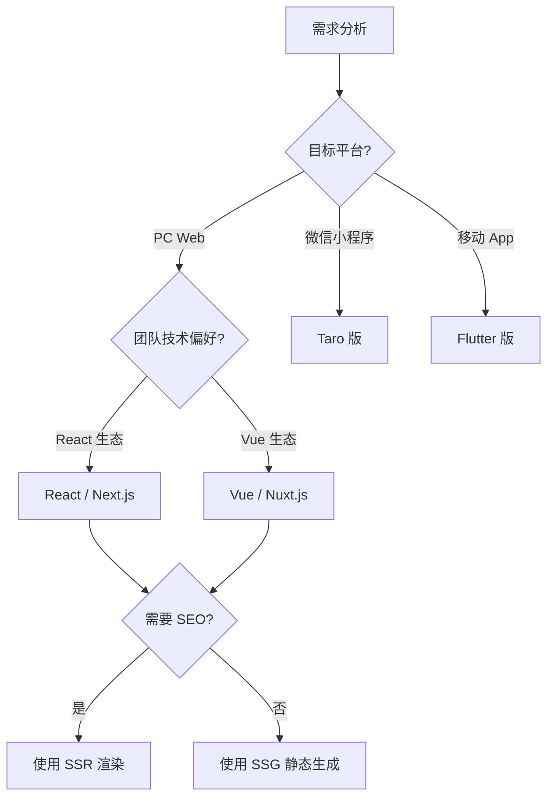

# 前台应用开发实战教程

GoWind CMS 提供四套前台应用（Vue/React/Taro/Flutter），本教程以 React（Next.js）为主线，带你完整走通前台应用的开发流程：从项目初始化、API 对接、页面开发、国际化、到部署上线。

## 前置条件

- 已阅读 [CMS 前端架构](./frontend-architecture.md) 和 [Headless API 对接多端实战](./tutorial-headless-api.md)
- 熟悉 TypeScript / React 基本概念
- 本地已启动 CMS 后端服务（Admin: 6600, App: 6700）

## 一、技术选型

### 1.1 四套前台对比

| 版本 | 框架 | 渲染方式 | 目标平台 | SEO | 适用场景 |
|------|------|---------|---------|-----|---------|
| **React** | Next.js 15 | SSR / SSG | PC Web | 极佳 | 企业官网、新闻门户 |
| **Vue** | Nuxt.js 3 | SSR / SSG | PC Web | 极佳 | 博客、内容站点 |
| **Taro** | Taro 4 | CSR | 小程序 + H5 | 差 | 微信小程序、移动 H5 |
| **Flutter** | Flutter 3 | 原生渲染 | Android/iOS/Web | 差 | 跨平台原生 App |

### 1.2 选择建议



本教程以 **React（Next.js）** 为例，因为它是企业级内容站点最常用的方案。

## 二、项目初始化

### 2.1 创建 Next.js 项目

```shell
# 创建项目
npx create-next-app@latest cms-frontend-react \
  --typescript \
  --app \
  --tailwind \
  --eslint

cd cms-frontend-react
```

### 2.2 安装依赖

```shell
# HTTP 客户端
pnpm add axios

# 国际化
pnpm add next-intl

# UI 组件
pnpm add @radix-ui/react-slot class-variance-authority clsx tailwind-merge lucide-react

# 状态管理（客户端状态）
pnpm add zustand

# Markdown 渲染（如需）
pnpm add react-markdown remark-gfm rehype-raw

# 开发依赖
pnpm add -D @types/node
```

### 2.3 目录结构

```
cms-frontend-react/
├── src/
│   ├── app/                        # Next.js App Router
│   │   ├── [locale]/               # 国际化路由
│   │   │   ├── layout.tsx          # 根布局（含导航栏、页脚）
│   │   │   ├── page.tsx            # 首页
│   │   │   ├── posts/
│   │   │   │   ├── page.tsx        # 文章列表
│   │   │   │   └── [slug]/
│   │   │   │       └── page.tsx    # 文章详情
│   │   │   ├── categories/
│   │   │   │   └── [slug]/
│   │   │   │       └── page.tsx    # 分类文章
│   │   │   ├── tags/
│   │   │   │   └── [slug]/
│   │   │   │       └── page.tsx    # 标签文章
│   │   │   ├── about/
│   │   │   │   └── page.tsx        # 关于页
│   │   │   ├── login/
│   │   │   │   └── page.tsx        # 登录页
│   │   │   └── profile/
│   │   │       └── page.tsx        # 个人中心
│   │   └── api/                    # Next.js API 路由（可选代理）
│   ├── components/                 # React 组件
│   │   ├── layout/                 # 布局组件
│   │   │   ├── Header.tsx
│   │   │   ├── Footer.tsx
│   │   │   └── Sidebar.tsx
│   │   ├── post/                   # 文章相关组件
│   │   │   ├── PostCard.tsx
│   │   │   ├── PostList.tsx
│   │   │   └── CommentSection.tsx
│   │   └── ui/                     # 基础 UI 组件
│   ├── lib/                        # 工具库
│   │   ├── api/                    # API 客户端
│   │   │   ├── client.ts           # Axios 实例
│   │   │   ├── post.ts             # 文章 API
│   │   │   ├── category.ts         # 分类 API
│   │   │   └── auth.ts             # 认证 API
│   │   ├── i18n/                   # 国际化配置
│   │   └── utils.ts                # 通用工具
│   ├── messages/                   # 国际化消息
│   │   ├── zh-CN.json
│   │   └── en-US.json
│   ├── stores/                     # Zustand 状态管理
│   │   ├── auth.ts                 # 认证状态
│   │   └── settings.ts             # 站点设置
│   └── middleware.ts               # Next.js 中间件
├── public/                         # 静态资源
├── .env.local                      # 环境变量
├── next.config.ts                  # Next.js 配置
├── tailwind.config.ts              # Tailwind 配置
└── package.json
```

### 2.4 环境变量

```bash
# .env.local
NEXT_PUBLIC_API_BASE_URL=http://localhost:6700/app/v1
NEXT_PUBLIC_DEFAULT_LOCALE=zh-CN
NEXT_PUBLIC_SITE_URL=http://localhost:3000
```

## 三、API 层搭建

### 3.1 Axios 客户端

```typescript
// src/lib/api/client.ts
import axios from 'axios';

const baseURL = process.env.NEXT_PUBLIC_API_BASE_URL || 'http://localhost:6700/app/v1';

// 服务端和客户端使用不同的 Token 存取方式
export const apiClient = axios.create({
  baseURL,
  timeout: 10000,
  headers: { 'Content-Type': 'application/json' },
});

// 请求拦截器
apiClient.interceptors.request.use((config) => {
  // 客户端请求自动注入 Token
  if (typeof window !== 'undefined') {
    const token = localStorage.getItem('token');
    if (token) {
      config.headers.Authorization = `Bearer ${token}`;
    }
  }
  return config;
});

// 响应拦截器
apiClient.interceptors.response.use(
  (response) => response.data,
  (error) => {
    if (typeof window !== 'undefined' && error.response?.status === 401) {
      localStorage.removeItem('token');
      window.location.href = '/login';
    }
    return Promise.reject(error);
  },
);
```

### 3.2 API 函数封装

```typescript
// src/lib/api/post.ts
import { apiClient } from './client';

export interface PostListParams {
  locale?: string;
  page?: number;
  pageSize?: number;
  orderBy?: string;
  orderDesc?: boolean;
  search?: string;
  categoryId?: number;
  tagId?: number;
}

export async function getPosts(params: PostListParams = {}) {
  return apiClient.get('/posts', { params });
}

export async function getPostBySlug(slug: string, locale: string) {
  return apiClient.get(`/posts/${slug}`, { params: { locale } });
}

export async function getPostsByCategory(categorySlug: string, locale: string, page = 1) {
  return apiClient.get('/posts', {
    params: { locale, page, categorySlug },
  });
}

// src/lib/api/category.ts
export async function getCategories(locale?: string) {
  return apiClient.get('/categories', { params: { locale } });
}

// src/lib/api/navigation.ts
export async function getNavigations() {
  return apiClient.get('/navigations');
}

// src/lib/api/auth.ts
export async function login(username: string, password: string) {
  return apiClient.post('/login', { username, password });
}
```

## 四、页面开发

### 4.1 根布局（含导航和页脚）

```tsx
// src/app/[locale]/layout.tsx
import { NextIntlClientProvider } from 'next-intl';
import { getMessages } from 'next-intl/server';
import { getNavigations, getSiteSettings } from '@/lib/api';
import Header from '@/components/layout/Header';
import Footer from '@/components/layout/Footer';

export default async function LocaleLayout({
  children,
  params: { locale },
}: {
  children: React.ReactNode;
  params: { locale: string };
}) {
  const [messages, navigations, siteSettings] = await Promise.all([
    getMessages(),
    getNavigations(),
    getSiteSettings(locale),
  ]);

  return (
    <NextIntlClientProvider messages={messages}>
      <div className="flex min-h-screen flex-col">
        <Header
          navigations={navigations.items}
          siteName={siteSettings.name}
          logo={siteSettings.logo}
        />
        <main className="flex-1">{children}</main>
        <Footer siteSettings={siteSettings} />
      </div>
    </NextIntlClientProvider>
  );
}
```

### 4.2 首页（文章列表）

```tsx
// src/app/[locale]/page.tsx
import { getPosts, getCategories } from '@/lib/api';
import PostCard from '@/components/post/PostCard';
import Pagination from '@/components/ui/Pagination';

export default async function HomePage({
  params: { locale },
  searchParams: { page = '1' },
}: {
  params: { locale: string };
  searchParams: { page?: string };
}) {
  const pageNum = Number(page);
  const [postsData, categoriesData] = await Promise.all([
    getPosts({ locale, page: pageNum, pageSize: 9 }),
    getCategories(locale),
  ]);

  return (
    <div className="container mx-auto px-4 py-8">
      {/* Hero 区域 */}
      <section className="mb-12 text-center">
        <h1 className="text-4xl font-bold mb-4">最新内容</h1>
        <p className="text-gray-600">探索精彩文章与资讯</p>
      </section>

      {/* 文章网格 */}
      <div className="grid grid-cols-1 md:grid-cols-2 lg:grid-cols-3 gap-6 mb-8">
        {postsData.items.map((post) => (
          <PostCard key={post.id} post={post} locale={locale} />
        ))}
      </div>

      {/* 分页 */}
      <Pagination
        current={pageNum}
        total={postsData.total}
        pageSize={9}
      />
    </div>
  );
}
```

### 4.3 文章卡片组件

```tsx
// src/components/post/PostCard.tsx
import Link from 'next/link';
import Image from 'next/image';
import { format } from 'date-fns';

interface PostCardProps {
  post: {
    id: number;
    title: string;
    slug: string;
    summary: string;
    thumbnail?: string;
    createdAt: string;
    categories?: { name: string; slug: string }[];
  };
  locale: string;
}

export default function PostCard({ post, locale }: PostCardProps) {
  return (
    <Link href={`/${locale}/posts/${post.slug}`}>
      <article className="rounded-lg overflow-hidden shadow-md hover:shadow-lg transition-shadow">
        {post.thumbnail && (
          <Image
            src={post.thumbnail}
            alt={post.title}
            width={400}
            height={200}
            className="w-full h-48 object-cover"
          />
        )}
        <div className="p-5">
          {post.categories && (
            <div className="flex gap-2 mb-2">
              {post.categories.map((cat) => (
                <span key={cat.slug} className="text-xs text-blue-600">
                  {cat.name}
                </span>
              ))}
            </div>
          )}
          <h2 className="text-xl font-semibold mb-2 line-clamp-2">
            {post.title}
          </h2>
          <p className="text-gray-600 text-sm line-clamp-3">{post.summary}</p>
          <time className="text-xs text-gray-400 mt-3 block">
            {format(new Date(post.createdAt), 'yyyy-MM-dd')}
          </time>
        </div>
      </article>
    </Link>
  );
}
```

### 4.4 文章详情页（含评论）

```tsx
// src/app/[locale]/posts/[slug]/page.tsx
import { getPostBySlug } from '@/lib/api';
import CommentSection from '@/components/post/CommentSection';
import { notFound } from 'next/navigation';

export async function generateMetadata({
  params: { locale, slug },
}: {
  params: { locale: string; slug: string };
}) {
  const post = await getPostBySlug(slug, locale);
  return {
    title: post.title,
    description: post.summary,
    openGraph: {
      title: post.title,
      description: post.summary,
      images: post.thumbnail ? [post.thumbnail] : [],
    },
  };
}

export default async function PostDetailPage({
  params: { locale, slug },
}: {
  params: { locale: string; slug: string };
}) {
  let post;
  try {
    post = await getPostBySlug(slug, locale);
  } catch {
    notFound();
  }

  return (
    <article className="container mx-auto px-4 py-8 max-w-3xl">
      {/* 文章头部 */}
      <header className="mb-8">
        <h1 className="text-3xl font-bold mb-4">{post.title}</h1>
        <div className="flex items-center gap-4 text-sm text-gray-500">
          <span>作者：{post.author?.name}</span>
          <time>{new Date(post.createdAt).toLocaleDateString(locale)}</time>
        </div>
      </header>

      {/* 文章正文 */}
      <div
        className="prose prose-lg max-w-none mb-12"
        dangerouslySetInnerHTML={{ __html: post.content }}
      />

      {/* 标签 */}
      {post.tags && (
        <div className="flex gap-2 mb-12">
          {post.tags.map((tag) => (
            <Link
              key={tag.slug}
              href={`/${locale}/tags/${tag.slug}`}
              className="px-3 py-1 bg-gray-100 rounded-full text-sm hover:bg-gray-200"
            >
              #{tag.name}
            </Link>
          ))}
        </div>
      )}

      {/* 评论区 */}
      <CommentSection postId={post.id} />
    </article>
  );
}
```

### 4.5 分类和标签筛选页

```tsx
// src/app/[locale]/categories/[slug]/page.tsx
import { getCategories, getPosts } from '@/lib/api';
import PostCard from '@/components/post/PostCard';

export default async function CategoryPage({
  params: { locale, slug },
  searchParams: { page = '1' },
}: {
  params: { locale: string; slug: string };
  searchParams: { page?: string };
}) {
  const categories = await getCategories(locale);
  const category = categories.items.find((c) => c.slug === slug);

  if (!category) notFound();

  const posts = await getPosts({
    locale,
    categoryId: category.id,
    page: Number(page),
    pageSize: 9,
  });

  return (
    <div className="container mx-auto px-4 py-8">
      <h1 className="text-3xl font-bold mb-8">分类：{category.name}</h1>
      <div className="grid grid-cols-1 md:grid-cols-2 lg:grid-cols-3 gap-6">
        {posts.items.map((post) => (
          <PostCard key={post.id} post={post} locale={locale} />
        ))}
      </div>
    </div>
  );
}
```

## 五、认证功能

### 5.1 登录页面

```tsx
// src/app/[locale]/login/page.tsx
'use client';

import { useState } from 'react';
import { useRouter } from 'next/navigation';
import { useTranslations } from 'next-intl';
import { login } from '@/lib/api/auth';

export default function LoginPage({ params: { locale } }: { params: { locale: string } }) {
  const [username, setUsername] = useState('');
  const [password, setPassword] = useState('');
  const [loading, setLoading] = useState(false);
  const [error, setError] = useState('');
  const router = useRouter();
  const t = useTranslations('auth');

  const handleSubmit = async (e: React.FormEvent) => {
    e.preventDefault();
    setLoading(true);
    setError('');
    try {
      const res = await login(username, password);
      localStorage.setItem('token', res.token);
      localStorage.setItem('user', JSON.stringify(res.user));
      router.push(`/${locale}/profile`);
    } catch (err: any) {
      setError(err.response?.data?.message || '登录失败');
    } finally {
      setLoading(false);
    }
  };

  return (
    <div className="container mx-auto max-w-md py-20">
      <h1 className="text-2xl font-bold mb-6 text-center">{t('login')}</h1>
      <form onSubmit={handleSubmit} className="space-y-4">
        <input
          type="text"
          placeholder={t('username')}
          value={username}
          onChange={(e) => setUsername(e.target.value)}
          className="w-full px-4 py-2 border rounded"
          required
        />
        <input
          type="password"
          placeholder={t('password')}
          value={password}
          onChange={(e) => setPassword(e.target.value)}
          className="w-full px-4 py-2 border rounded"
          required
        />
        {error && <p className="text-red-500 text-sm">{error}</p>}
        <button
          type="submit"
          disabled={loading}
          className="w-full py-2 bg-blue-600 text-white rounded hover:bg-blue-700 disabled:opacity-50"
        >
          {loading ? t('loggingIn') : t('login')}
        </button>
      </form>
    </div>
  );
}
```

### 5.2 认证状态管理

```typescript
// src/stores/auth.ts
import { create } from 'zustand';
import { persist } from 'zustand/middleware';

interface User {
  id: number;
  username: string;
  avatar?: string;
}

interface AuthState {
  token: string | null;
  user: User | null;
  isAuthenticated: boolean;
  setAuth: (token: string, user: User) => void;
  logout: () => void;
}

export const useAuthStore = create<AuthState>()(
  persist(
    (set) => ({
      token: null,
      user: null,
      isAuthenticated: false,
      setAuth: (token, user) =>
        set({ token, user, isAuthenticated: true }),
      logout: () =>
        set({ token: null, user: null, isAuthenticated: false }),
    }),
    { name: 'auth-storage' },
  ),
);
```

## 六、国际化配置

### 6.1 next-intl 配置

```typescript
// src/i18n.ts
import { getRequestConfig } from 'next-intl/server';

export const locales = ['zh-CN', 'en-US'] as const;
export type Locale = (typeof locales)[number];

export default getRequestConfig(async ({ locale }) => ({
  messages: (await import(`./messages/${locale}.json`)).default,
}));
```

### 6.2 消息文件

```json
// src/messages/zh-CN.json
{
  "auth": {
    "login": "登录",
    "logout": "退出",
    "username": "用户名",
    "password": "密码",
    "loggingIn": "登录中..."
  },
  "post": {
    "latest": "最新文章",
    "readMore": "阅读更多",
    "comments": "评论",
    "leaveComment": "发表评论"
  },
  "common": {
    "loading": "加载中...",
    "noData": "暂无数据",
    "search": "搜索"
  }
}
```

### 6.3 中间件

```typescript
// src/middleware.ts
import createMiddleware from 'next-intl/middleware';
import { locales } from './i18n';

export default createMiddleware({
  locales,
  defaultLocale: 'zh-CN',
  localePrefix: 'always',
});

export const config = {
  matcher: ['/((?!api|_next|_vercel|.*\\..*).*)'],
};
```

## 七、SEO 优化

### 7.1 元数据生成

```tsx
// src/app/[locale]/posts/[slug]/page.tsx
export async function generateMetadata({
  params: { locale, slug },
}: {
  params: { locale: string; slug: string };
}) {
  const post = await getPostBySlug(slug, locale);

  return {
    title: post.title,
    description: post.summary,
    keywords: post.tags?.map((t) => t.name),
    alternates: {
      canonical: `/${locale}/posts/${slug}`,
      languages: {
        'zh-CN': `/zh-CN/posts/${slug}`,
        'en-US': `/en-US/posts/${slug}`,
      },
    },
    openGraph: {
      title: post.title,
      description: post.summary,
      type: 'article',
      publishedTime: post.createdAt,
      images: post.thumbnail ? [{ url: post.thumbnail }] : [],
    },
  };
}
```

### 7.2 结构化数据

```tsx
function JsonLd({ post }: { post: any }) {
  const jsonLd = {
    '@context': 'https://schema.org',
    '@type': 'BlogPosting',
    headline: post.title,
    description: post.summary,
    image: post.thumbnail,
    datePublished: post.createdAt,
    dateModified: post.updatedAt,
    author: {
      '@type': 'Person',
      name: post.author?.name,
    },
  };

  return (
    <script
      type="application/ld+json"
      dangerouslySetInnerHTML={{ __html: JSON.stringify(jsonLd) }}
    />
  );
}
```

### 7.3 Sitemap 和 robots

```tsx
// src/app/sitemap.ts
import { getPosts } from '@/lib/api';

export default async function sitemap() {
  const posts = await getPosts({ pageSize: 1000 });
  const locales = ['zh-CN', 'en-US'];

  const postUrls = posts.items.flatMap((post) =>
    locales.map((locale) => ({
      url: `${process.env.NEXT_PUBLIC_SITE_URL}/${locale}/posts/${post.slug}`,
      lastModified: new Date(post.updatedAt || post.createdAt),
    })),
  );

  return [
    { url: process.env.NEXT_PUBLIC_SITE_URL!, lastModified: new Date() },
    ...postUrls,
  ];
}

// src/app/robots.ts
export default function robots() {
  return {
    rules: {
      userAgent: '*',
      allow: '/',
      disallow: ['/api/', '/profile/'],
    },
    sitemap: `${process.env.NEXT_PUBLIC_SITE_URL}/sitemap.xml`,
  };
}
```

## 八、构建与部署

### 8.1 构建

```shell
# 生产构建
pnpm build

# 本地预览
pnpm start
```

### 8.2 Docker 部署

```dockerfile
# Dockerfile
FROM node:20-alpine AS builder
WORKDIR /app
COPY package.json pnpm-lock.yaml ./
RUN corepack enable && pnpm install --frozen-lockfile
COPY . .
RUN pnpm build

FROM node:20-alpine AS runner
WORKDIR /app
COPY --from=builder /app/.next/standalone ./
COPY --from=builder /app/.next/static ./.next/static
COPY --from=builder /app/public ./public
EXPOSE 3000
CMD ["node", "server.js"]
```

```yaml
# docker-compose.yml
services:
  cms-react:
    build: .
    ports:
      - "3000:3000"
    environment:
      - NEXT_PUBLIC_API_BASE_URL=https://api.cms.gowind.cloud/app/v1
      - NEXT_PUBLIC_DEFAULT_LOCALE=zh-CN
    restart: always
```

### 8.3 环境变量

| 环境 | API 地址 |
|------|---------|
| 开发 | `http://localhost:6700/app/v1` |
| 测试 | `https://api.test.cms.gowind.cloud/app/v1` |
| 生产 | `https://api.cms.gowind.cloud/app/v1` |

## 九、性能优化技巧

### 9.1 图片优化

```tsx
import Image from 'next/image';

// Next.js 自动优化图片（WebP、懒加载、响应式）
<Image
  src={post.thumbnail}
  alt={post.title}
  width={400}
  height={200}
  placeholder="blur"
  blurDataURL="data:image/jpeg;base64,..."
/>
```

### 9.2 ISR 增量静态再生

```tsx
// src/app/[locale]/posts/[slug]/page.tsx
export const revalidate = 60; // 每 60 秒重新生成页面

export default async function PostDetailPage({ params }) {
  // 页面会静态生成，60 秒后后台重新验证
}
```

### 9.3 数据预取

```tsx
// 预取分类和标签数据
export async function generateStaticParams() {
  const posts = await getPosts({ pageSize: 100 });
  return posts.items.map((post) => ({
    locale: 'zh-CN',
    slug: post.slug,
  }));
}
```

## 十、检查清单

| 检查项 | 说明 |
|--------|------|
| 项目初始化 | Next.js + TypeScript + Tailwind |
| API 层搭建 | Axios 客户端 + API 函数封装 |
| 页面开发 | 首页 + 文章列表 + 详情 + 分类/标签 |
| 认证功能 | 登录页 + Token 管理 + 状态管理 |
| 国际化 | next-intl 配置 + 消息文件 |
| SEO 优化 | 元数据 + Sitemap + 结构化数据 |
| 构建部署 | Docker 镜像 + 环境变量 |
| 性能优化 | 图片优化 + ISR + 预取 |

## 相关文档

- [CMS 前端架构](./frontend-architecture.md)
- [Headless API 对接多端实战](./tutorial-headless-api.md)
- [内容多语言翻译实战](./tutorial-content-i18n.md)
- [多站点管理实战](./tutorial-multi-site.md)
