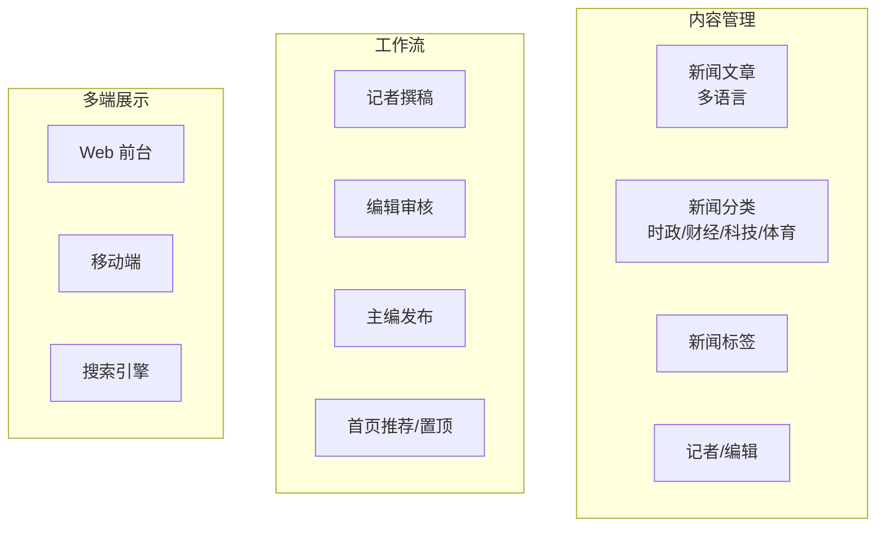
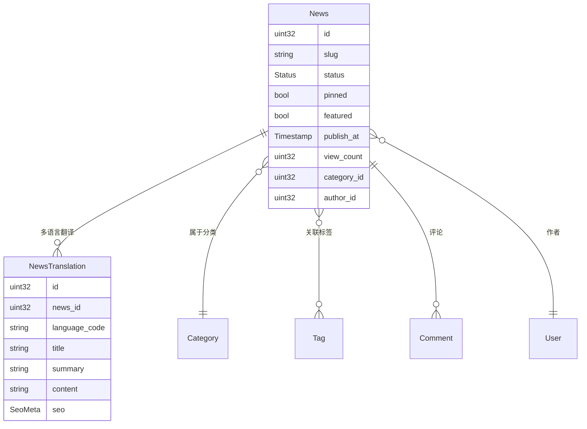
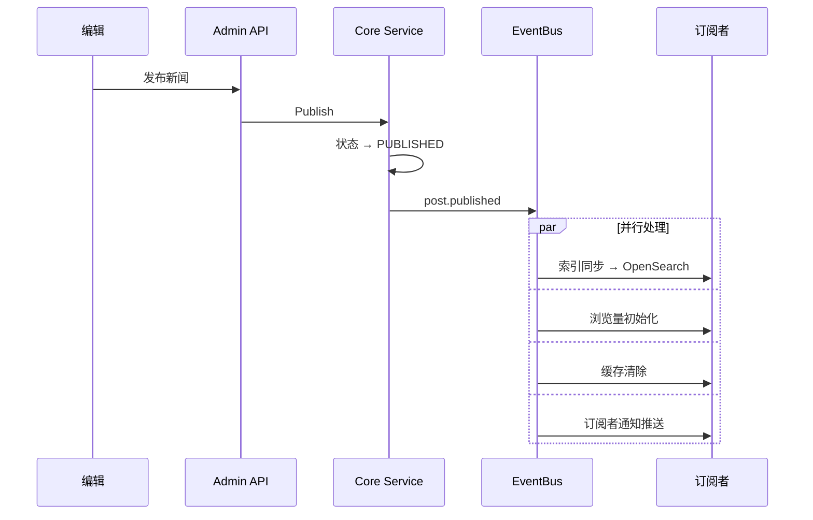

# 全栈集成实战教程

本教程通过一个完整的"新闻发布系统"案例，带你走通 CMS 全栈开发的全流程：从需求分析、数据建模、API 定义、后端实现、管理后台到前台展示，串联所有核心知识点。

## 前置条件

- 已阅读以下教程（按顺序）：
  - [CMS 后端架构总览](./backend-architecture.md)
  - [新增内容类型全栈实战](./tutorial-new-content.md)
  - [内容发布工作流实战](./tutorial-content-workflow.md)
  - [内容多语言翻译实战](./tutorial-content-i18n.md)

## 一、需求分析

### 1.1 新闻发布系统需求



### 1.2 功能清单

| 功能 | 说明 |
|------|------|
| 新闻 CRUD | 创建、编辑、删除、恢复 |
| 多级分类 | 时政/财经/科技/体育，支持子分类 |
| 标签系统 | 每篇新闻可关联多个标签 |
| 审核工作流 | 草稿→待审核→已发布/已驳回 |
| 多语言翻译 | 中/英/日三种语言 |
| 定时发布 | 指定时间自动发布 |
| 全文搜索 | 标题+内容全文检索 |
| 置顶推荐 | 首页头条 + 分类推荐 |
| 浏览统计 | 每篇文章浏览量 |
| 评论互动 | 读者评论 + 审核 |

## 二、数据建模

### 2.1 实体关系



### 2.2 复用 CMS 内容模型

实际上，CMS 的 Post 模型已经覆盖了新闻需求，可以直接复用：

| 新闻需求 | CMS 实现 |
|---------|---------|
| 新闻文章 | Post |
| 新闻分类 | Category |
| 新闻标签 | Tag |
| 多语言 | PostTranslation |
| 审核 | Post 状态机（DRAFT→PENDING_REVIEW→PUBLISHED） |
| 置顶 | Post.pinned |
| 区块编辑 | Section |
| 浏览量 | Post.viewCount |

## 三、后端实现

### 3.1 扩展 Post 字段

如需新闻特有的"featured"（推荐）字段：

```protobuf
// content/service/v1/post.proto
message Post {
  // ... 已有字段
  optional bool featured = 34 [json_name = "featured"];  // 新增：首页推荐
}
```

### 3.2 Ent Schema 更新

```go
// app/core/service/internal/data/ent/schema/post.go
func (Post) Fields() []ent.Field {
    return []ent.Field{
        // ... 已有字段
        field.Bool("featured").Default(false),  // 新增推荐字段
    }
}
```

```shell
cd backend
make ent   # 重新生成 Ent 代码
```

### 3.3 新闻查询 Service

```go
// app/core/service/internal/service/post_service.go

// GetFeaturedNews 获取首页推荐新闻
func (s *PostService) GetFeaturedNews(ctx context.Context, req *contentV1.GetFeaturedRequest) (*contentV1.ListPostResponse, error) {
    query := s.postRepo.Query().
        Where(
            post.StatusEQ(int(contentV1.Post_POST_STATUS_PUBLISHED)),
            post.FeaturedEQ(true),
        ).
        Order(ent.Desc("publish_at"))

    if locale := req.GetLocale(); locale != "" {
        query = query.WithTranslations()
    }

    items, err := query.Limit(int(req.GetLimit())).All(ctx)
    if err != nil {
        return nil, err
    }

    return &contentV1.ListPostResponse{Items: convertPosts(items, req.GetLocale())}, nil
}
```

### 3.4 前台白名单

```go
// app/app/service/internal/server/rest_server.go
rpc.AddWhiteList(
    // ... 已有白名单
    appV1.OperationPostServiceGetFeatured,  // 推荐新闻免登录
)
```

## 四、管理后台

### 4.1 新闻编辑页面

```vue
<!-- views/content/post/form.vue -->
<script setup lang="ts">
const formData = reactive({
  title: '',
  categoryId: null,
  tagIds: [],
  status: 0,
  pinned: false,
  featured: false,      // 新增推荐开关
  publishAt: null,
  sections: [],         // 区块编辑器
});

const canPublish = computed(() => formData.status === 0 || formData.status === 3);

const handleSave = async () => {
  // 根据状态选择保存方式
  if (formData.status === 0) {
    await saveDraft();
  }
};
</script>

<template>
  <Page title="编辑新闻">
    <!-- 基本信息 -->
    <Form :model="formData" layout="vertical">
      <FormItem label="标题（中文）">
        <Input v-model:value="formData.title" />
      </FormItem>

      <Row :gutter="16">
        <Col :span="8">
          <FormItem label="分类">
            <TreeSelect v-model:value="formData.categoryId" :tree-data="categories" />
          </FormItem>
        </Col>
        <Col :span="8">
          <FormItem label="标签">
            <Select v-model:value="formData.tagIds" mode="multiple">
              <SelectOption v-for="t in tags" :key="t.id" :value="t.id">{{ t.name }}</SelectOption>
            </Select>
          </FormItem>
        </Col>
        <Col :span="8">
          <FormItem label="定时发布">
            <DatePicker v-model:value="formData.publishAt" show-time />
          </FormItem>
        </Col>
      </Row>

      <Row :gutter="16">
        <Col :span="6">
          <FormItem label="置顶">
            <Switch v-model:checked="formData.pinned" />
          </FormItem>
        </Col>
        <Col :span="6">
          <FormItem label="首页推荐">
            <Switch v-model:checked="formData.featured" />
          </FormItem>
        </Col>
      </Row>
    </Form>

    <!-- 区块编辑器 -->
    <SectionEditor v-model="formData.sections" />

    <!-- 多语言翻译 -->
    <TranslationTabs :post-id="editId" />

    <!-- 操作按钮 -->
    <Space class="mt-4">
      <Button type="primary" @click="saveDraft">保存草稿</Button>
      <Button @click="submitReview" v-if="formData.status === 0">提交审核</Button>
      <Button type="primary" @click="publish" v-if="canPublish">发布</Button>
    </Space>
  </Page>
</template>
```

### 4.2 新闻列表

```vue
<!-- views/content/post/index.vue -->
<template>
  <Page title="新闻管理">
    <Tabs v-model:activeKey="filterStatus">
      <TabPane key="" tab="全部" />
      <TabPane key="0" tab="草稿" />
      <TabPane key="3" tab="待审核" />
      <TabPane key="1" tab="已发布" />
      <TabPane key="2" tab="已下架" />
    </Tabs>

    <Table :data="data?.items" :loading="isLoading">
      <TableColumn title="标题" data-index="title" />
      <TableColumn title="分类" data-index="category.name" />
      <TableColumn title="状态">
        <template #default="{ record }">
          <Tag :color="statusColors[record.status]">{{ statusLabels[record.status] }}</Tag>
        </template>
      </TableColumn>
      <TableColumn title="浏览" data-index="viewCount" />
      <TableColumn title="推荐">
        <template #default="{ record }">
          <Tag v-if="record.featured" color="gold">推荐</Tag>
          <Tag v-if="record.pinned" color="red">置顶</Tag>
        </template>
      </TableColumn>
      <TableColumn title="操作">
        <template #default="{ record }">
          <Button size="small" @click="goEdit(record.id)">编辑</Button>
          <Button v-if="record.status === 3" type="primary" size="small" @click="approve(record.id)">通过</Button>
        </template>
      </TableColumn>
    </Table>
  </Page>
</template>
```

## 五、前台展示

### 5.1 首页（推荐 + 最新）

```tsx
// src/app/[locale]/page.tsx
export default async function HomePage({ params: { locale } }: { params: { locale: string } }) {
  const [featured, latest, categories] = await Promise.all([
    getPosts({ locale, featured: true, pageSize: 5 }),
    getPosts({ locale, page: 1, pageSize: 10 }),
    getCategories(locale),
  ]);

  return (
    <div className="container mx-auto px-4 py-8">
      {/* 头条新闻 */}
      {featured.items[0] && (
        <section className="mb-12">
          <FeaturedNewsCard post={featured.items[0]} locale={locale} />
        </section>
      )}

      <div className="grid grid-cols-1 lg:grid-cols-3 gap-8">
        {/* 最新新闻 */}
        <div className="lg:col-span-2">
          <h2 className="text-2xl font-bold mb-6">最新新闻</h2>
          <div className="space-y-6">
            {latest.items.map((post) => (
              <NewsCard key={post.id} post={post} locale={locale} />
            ))}
          </div>
          <Pagination current={1} total={latest.total} pageSize={10} />
        </div>

        {/* 侧边栏 */}
        <aside className="space-y-6">
          <CategoryWidget categories={categories.items} />
          <PopularTagsWidget />
          <PopularNewsWidget />
        </aside>
      </div>
    </div>
  );
}
```

### 5.2 新闻详情页

```tsx
// src/app/[locale]/news/[slug]/page.tsx
export default async function NewsDetail({ params: { locale, slug } }) {
  const post = await getPostBySlug(slug, locale);

  // 增加浏览量
  trackView(post.id);

  return (
    <article className="container mx-auto px-4 py-8 max-w-3xl">
      {/* Breadcrumb */}
      <nav className="text-sm mb-4">
        <Link href={`/${locale}`}>首页</Link> &gt;
        <Link href={`/${locale}/categories/${post.category.slug}`}>{post.category.name}</Link>
      </nav>

      {/* 文章头 */}
      <header className="mb-8">
        <h1 className="text-3xl font-bold mb-4">{post.title}</h1>
        <div className="flex items-center gap-4 text-gray-500">
          <span>记者：{post.author.name}</span>
          <time>{formatDate(post.publishAt, locale)}</time>
          <span>浏览：{post.viewCount}</span>
        </div>
      </header>

      {/* 区块内容 */}
      <SectionRenderer sections={post.sections} />

      {/* 标签 */}
      <div className="flex gap-2 mt-8">
        {post.tags.map((tag) => (
          <Link key={tag.slug} href={`/${locale}/tags/${tag.slug}`}>
            #{tag.name}
          </Link>
        ))}
      </div>

      {/* 评论区 */}
      <CommentSection postId={post.id} />

      {/* 相关新闻 */}
      <RelatedNews categoryId={post.category.id} excludeId={post.id} locale={locale} />
    </article>
  );
}
```

### 5.3 多语言切换

```tsx
// 语言切换自动获取对应翻译
function LanguageSwitcher({ currentLocale, slug }: { currentLocale: string; slug: string }) {
  return (
    <select
      value={currentLocale}
      onChange={(e) => router.push(`/${e.target.value}/news/${slug}`)}
    >
      <option value="zh-CN">中文</option>
      <option value="en-US">English</option>
      <option value="ja-JP">日本語</option>
    </select>
  );
}
```

## 六、SEO 优化

### 6.1 元数据

```tsx
export async function generateMetadata({ params: { locale, slug } }) {
  const post = await getPostBySlug(slug, locale);

  return {
    title: post.title,
    description: post.summary,
    alternates: {
      canonical: `/${locale}/news/${slug}`,
      languages: {
        'zh-CN': `/zh-CN/news/${slug}`,
        'en-US': `/en-US/news/${slug}`,
        'ja-JP': `/ja-JP/news/${slug}`,
      },
    },
    openGraph: {
      type: 'article',
      title: post.title,
      images: post.thumbnail ? [post.thumbnail] : [],
    },
  };
}

// ISR 增量静态再生
export const revalidate = 60;
```

### 6.2 结构化数据

```tsx
<JsonLd data={{
  "@context": "https://schema.org",
  "@type": "NewsArticle",
  headline: post.title,
  datePublished: post.publishAt,
  author: { "@type": "Person", name: post.author.name },
  publisher: { "@type": "Organization", name: siteName },
}} />
```

## 七、事件集成

### 7.1 新闻发布事件链



### 7.2 Lua 自动化

```lua
-- 新闻发布后自动推送到社交媒体
eventbus.subscribe("post.published", function(event)
    if event.CategorySlug ~= "news" then return end

    -- 生成短链接
    local url = "https://news.example.com/posts/" .. event.PostId

    -- 推送微博
    http.post("https://api.weibo.com/2/statuses/update.json", {
        headers = { ["Authorization"] = "Bearer weibo-token" },
        body = json.encode({ status = event.Title .. " " .. url })
    })
end)
```

## 八、检查清单

| 检查项 | 说明 |
|--------|------|
| 数据建模 | 复用 Post 模型 + 扩展字段 |
| 后端 API | 推荐新闻接口 + 前台白名单 |
| 管理后台 | 编辑页（区块+翻译+工作流）+ 列表页 |
| 前台展示 | 首页 + 详情 + 分类 + 标签 |
| 多语言 | 中/英/日切换 |
| SEO | 元数据 + 结构化数据 + ISR |
| 事件集成 | 发布事件 + Lua 自动化 |
| 搜索 | OpenSearch 全文检索 |
| 评论 | 评论审核 + 互动 |
| 缓存 | Redis 热点缓存 |

## 相关文档

- [新增内容类型全栈实战](./tutorial-new-content.md)
- [内容发布工作流实战](./tutorial-content-workflow.md)
- [内容多语言翻译实战](./tutorial-content-i18n.md)
- [区块编辑器实战](./tutorial-section-editor.md)
- [前台应用开发实战](./tutorial-frontend-app.md)
