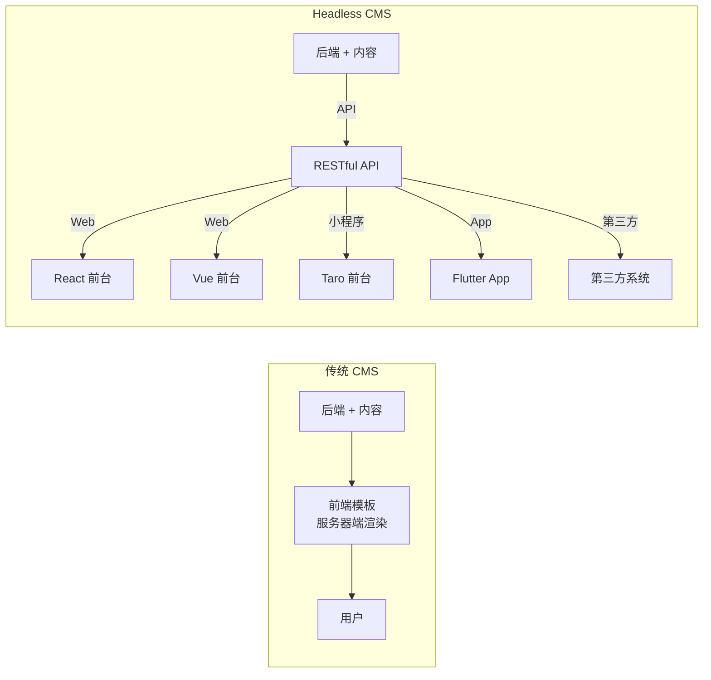
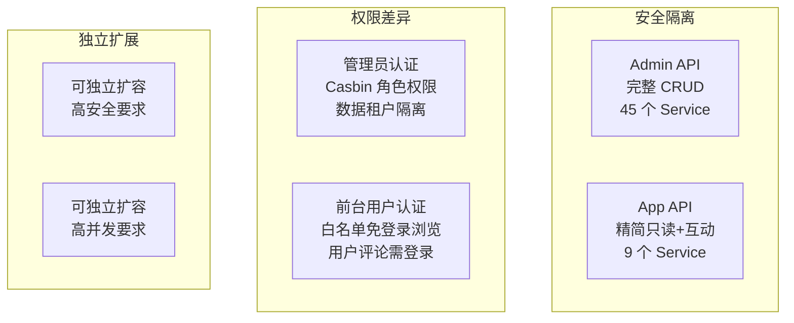
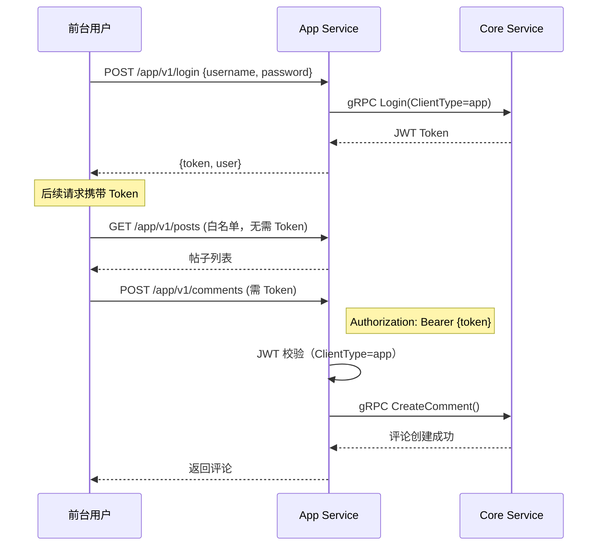
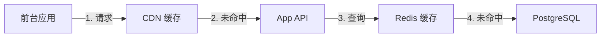

# Headless API 对接多端实战教程

GoWind CMS 作为 Headless 内容平台，核心价值在于"一次创建、多端分发"。本教程深入讲解 Admin API 与 App API 的双协议设计、前台公开接口白名单机制、以及如何从零对接四套前台（Vue/React/Taro/Flutter）。

## 前置条件

- 已阅读 [CMS 后端架构总览](./backend-architecture.md) 和 [CMS API 定义](./backend-api.md)
- 了解 RESTful API、JWT 认证基本概念
- 本地开发环境已搭建

## 一、Headless 架构回顾

### 1.1 什么是 Headless CMS



**传统 CMS**：后端和前端耦合在一起（如 WordPress 的 PHP 模板），前端展示方式由后端决定。

**Headless CMS**：后端只负责内容管理和 API 输出，前端完全独立，可对接任意终端。

### 1.2 CMS 双协议 API

| API | 路由前缀 | 端口 | 面向用户 | 权限要求 |
|-----|---------|------|---------|---------|
| Admin API | `/admin/v1/` | 6600 | 管理后台运营人员 | JWT 认证 + Casbin 权限 |
| App API | `/app/v1/` | 6700 | 前台终端用户（C 端） | 部分接口免认证，其余 JWT |

### 1.3 为什么需要双协议



## 二、App API 接口详解

### 2.1 App Service 提供的接口

App API 只暴露前台需要的功能，相比 Admin API 大幅精简：

| Service | 路由 | 方法 | 免登录 | 说明 |
|---------|------|------|--------|------|
| Authentication | `/app/v1/login` | POST | 是 | 前台用户登录 |
| Authentication | `/app/v1/logout` | POST | 否 | 退出登录 |
| Post | `/app/v1/posts` | GET | 是 | 帖子列表（支持分页、语言） |
| Post | `/app/v1/posts/{id}` | GET | 是 | 帖子详情 |
| Post | `/app/v1/posts` | POST | 否 | 用户发帖（需登录） |
| Category | `/app/v1/categories` | GET | 是 | 分类列表 |
| Category | `/app/v1/categories/{id}` | GET | 是 | 分类详情 |
| Tag | `/app/v1/tags` | GET | 是 | 标签列表 |
| Tag | `/app/v1/tags/{id}` | GET | 是 | 标签详情 |
| Comment | `/app/v1/comments` | GET | 是 | 评论列表 |
| Comment | `/app/v1/comments` | POST | 否 | 发表评论（需登录） |
| Page | `/app/v1/pages` | GET | 是 | 页面列表 |
| Page | `/app/v1/pages/{id}` | GET | 是 | 页面详情 |
| Navigation | `/app/v1/navigations` | GET | 是 | 导航菜单 |
| UserProfile | `/app/v1/user-profile` | GET | 否 | 个人资料 |
| FileTransfer | `/app/v1/files` | POST | 否 | 文件上传 |

### 2.2 免认证白名单

App Service 在 `rest_server.go` 中配置了免登录接口白名单：

```go
// app/app/service/internal/server/rest_server.go
rpc.AddWhiteList(
    // 认证接口
    appV1.OperationAuthenticationServiceLogin,

    // 内容浏览接口（免登录）
    appV1.OperationNavigationServiceList,
    appV1.OperationPageServiceList,
    appV1.OperationPostServiceList,
    appV1.OperationCategoryServiceList,
    appV1.OperationCommentServiceList,
    appV1.OperationTagServiceList,

    appV1.OperationPageServiceGet,
    appV1.OperationPostServiceGet,
    appV1.OperationCategoryServiceGet,
    appV1.OperationCommentServiceGet,
    appV1.OperationTagServiceGet,
)
```

**设计原则**：
- 浏览类接口（List / Get）免登录 → 有利于 SEO 和用户转化
- 互动类接口（Create 评论、发帖、上传文件）需登录 → 防止滥用
- 个人资料接口需登录 → 保护用户隐私

### 2.3 前台认证机制

App Service 的登录会自动标记令牌类型为 `app`：

```go
// app/app/service/internal/service/authentication_service.go
func (s *AuthenticationService) Login(
    ctx context.Context, req *authenticationV1.LoginRequest,
) (*authenticationV1.LoginResponse, error) {
    // 标记为前台用户令牌
    req.ClientType = trans.Ptr(authenticationV1.ClientType_app)
    return s.authenticationServiceClient.Login(ctx, req)
}
```

这样后端可以区分前台用户和管理后台管理员的 Token，防止跨端使用。

## 三、API 调用约定

### 3.1 统一分页协议

所有列表接口使用统一的分页参数：

```http
GET /app/v1/posts?page=1&pageSize=10&orderBy=createdAt&orderDesc=true&search=关键词
```

| 参数 | 类型 | 默认值 | 说明 |
|------|------|--------|------|
| page | int | 1 | 当前页码 |
| pageSize | int | 10 | 每页条数 |
| orderBy | string | createdAt | 排序字段 |
| orderDesc | bool | false | 是否降序 |
| search | string | - | 全文搜索关键词 |

响应格式：

```json
{
  "items": [...],
  "total": 150
}
```

### 3.2 多语言参数

通过 `locale` 查询参数指定返回内容的语言：

```http
# 获取中文内容
GET /app/v1/posts?locale=zh-CN

# 获取英文内容
GET /app/v1/posts?locale=en-US

# 获取帖子详情（指定语言）
GET /app/v1/posts/42?locale=ja-JP
```

### 3.3 认证流程



### 3.4 错误响应

统一的错误响应格式：

```json
{
  "code": 401,
  "reason": "UNAUTHORIZED",
  "message": "未登录或登录已过期",
  "metadata": {}
}
```

常见错误码：

| HTTP 状态码 | reason | 说明 |
|------------|--------|------|
| 400 | INVALID_ARGUMENT | 参数错误 |
| 401 | UNAUTHORIZED | 未认证 |
| 403 | FORBIDDEN | 无权限 |
| 404 | NOT_FOUND | 资源不存在 |
| 500 | INTERNAL | 服务器内部错误 |

## 四、对接 React 前台（Next.js）

### 4.1 API 客户端封装

```typescript
// src/lib/api/client.ts
import axios from 'axios';

const API_BASE_URL = process.env.NEXT_PUBLIC_API_BASE_URL || 'http://localhost:6700/app/v1';

export const apiClient = axios.create({
  baseURL: API_BASE_URL,
  timeout: 10000,
  headers: {
    'Content-Type': 'application/json',
  },
});

// 请求拦截：自动注入 Token 和 locale
apiClient.interceptors.request.use((config) => {
  const token = localStorage.getItem('token');
  if (token) {
    config.headers.Authorization = `Bearer ${token}`;
  }
  return config;
});

// 响应拦截：统一错误处理
apiClient.interceptors.response.use(
  (response) => response.data,
  (error) => {
    if (error.response?.status === 401) {
      localStorage.removeItem('token');
      window.location.href = '/login';
    }
    return Promise.reject(error);
  },
);
```

### 4.2 API 函数封装

```typescript
// src/lib/api/post.ts
import { apiClient } from './client';

export interface PostListParams {
  locale?: string;
  page?: number;
  pageSize?: number;
  orderBy?: string;
  orderDesc?: boolean;
  search?: string;
}

export async function getPosts(params: PostListParams = {}) {
  return apiClient.get('/posts', { params });
}

export async function getPostBySlug(slug: string, locale: string) {
  return apiClient.get(`/posts/${slug}`, { params: { locale } });
}

export async function getPostsByCategory(categoryId: number, locale: string, page = 1) {
  return apiClient.get('/posts', {
    params: { locale, page, categoryId },
  });
}

export async function getPostsByTag(tagId: number, locale: string, page = 1) {
  return apiClient.get('/posts', {
    params: { locale, page, tagId },
  });
}
```

### 4.3 SSR 页面组件

```tsx
// src/app/[locale]/page.tsx（首页）
import { getPosts, getNavigations, getCategories } from '@/lib/api';

export default async function HomePage({
  params: { locale },
}: {
  params: { locale: string };
}) {
  const [postsRes, navRes, catRes] = await Promise.all([
    getPosts({ locale, page: 1, pageSize: 10 }),
    getNavigations(),
    getCategories({ locale }),
  ]);

  return (
    <div className="container mx-auto">
      {/* 导航栏 */}
      <nav>
        {navRes.items.map((item) => (
          <Link key={item.id} href={item.url}>{item.title}</Link>
        ))}
      </nav>

      {/* 文章列表 */}
      <main className="grid grid-cols-3 gap-6">
        {postsRes.items.map((post) => (
          <article key={post.id}>
            <Link href={`/${locale}/posts/${post.slug}`}>
              <h2>{post.title}</h2>
              <p>{post.summary}</p>
            </Link>
          </article>
        ))}
      </main>

      {/* 侧边栏分类 */}
      <aside>
        <h3>分类</h3>
        {catRes.items.map((cat) => (
          <Link key={cat.id} href={`/${locale}/categories/${cat.slug}`}>
            {cat.name}
          </Link>
        ))}
      </aside>
    </div>
  );
}
```

### 4.4 认证与评论

```tsx
// src/components/CommentSection.tsx
'use client';
import { useState } from 'react';
import { apiClient } from '@/lib/api/client';

export function CommentSection({ postId }: { postId: number }) {
  const [content, setContent] = useState('');
  const [comments, setComments] = useState([]);

  const handleSubmit = async () => {
    try {
      const newComment = await apiClient.post('/comments', {
        postId,
        content,
      });
      setComments([...comments, newComment]);
      setContent('');
    } catch (error) {
      if (error.response?.status === 401) {
        alert('请先登录');
      }
    }
  };

  return (
    <div>
      <h3>评论</h3>
      {comments.map((c) => (
        <div key={c.id}>{c.content}</div>
      ))}
      <textarea
        value={content}
        onChange={(e) => setContent(e.target.value)}
      />
      <button onClick={handleSubmit}>发表评论</button>
    </div>
  );
}
```

## 五、对接 Flutter 前台

### 5.1 Retrofit API 自动生成

Flutter 版通过 `swagger_parser` 从 OpenAPI 文档生成 API 客户端：

```yaml
# build.yaml
targets:
  $default:
    builders:
      swagger_parser:
        options:
          output_dir: 'lib/core/network/generated'
          api_base_url: 'http://localhost:6700/app/v1'
```

```shell
# 从 OpenAPI 生成 Dart API 代码
dart run swagger_parser
```

### 5.2 生成的 API 客户端

```dart
// lib/core/network/generated/api/post_api.dart（自动生成）
@RestApi(baseUrl: '/app/v1')
abstract class PostApi {
  factory PostApi(Dio dio, {String? baseUrl}) = _PostApi;

  @GET('/posts')
  Future<ListPostResponse> listPosts({
    @Query('locale') String? locale,
    @Query('page') int? page,
    @Query('pageSize') int? pageSize,
    @Query('search') String? search,
  });

  @GET('/posts/{id}')
  Future<Post> getPost(
    @Path('id') int id, {
    @Query('locale') String? locale,
  });
}
```

### 5.3 BLoC 模式调用

```dart
// features/post_list/presentation/bloc/post_list_bloc.dart
class PostListBloc extends Bloc<PostListEvent, PostListState> {
  final PostApi postApi;
  final String locale;

  PostListBloc({required this.postApi, required this.locale})
      : super(PostListInitial()) {
    on<FetchPosts>(_onFetchPosts);
    on<RefreshPosts>(_onRefreshPosts);
    on<LoadMorePosts>(_onLoadMorePosts);
  }

  int _currentPage = 1;
  List<Post> _allPosts = [];

  Future<void> _onFetchPosts(
    FetchPosts event,
    Emitter<PostListState> emit,
  ) async {
    emit(PostListLoading());
    try {
      _currentPage = 1;
      final response = await postApi.listPosts(
        locale: locale,
        page: _currentPage,
        pageSize: 10,
      );
      _allPosts = response.items;
      emit(PostListLoaded(_allPosts, hasMore: response.items.length >= 10));
    } catch (e) {
      emit(PostListError(e.toString()));
    }
  }

  Future<void> _onLoadMorePosts(
    LoadMorePosts event,
    Emitter<PostListState> emit,
  ) async {
    try {
      _currentPage++;
      final response = await postApi.listPosts(
        locale: locale,
        page: _currentPage,
        pageSize: 10,
      );
      _allPosts = [..._allPosts, ...response.items];
      emit(PostListLoaded(_allPosts, hasMore: response.items.length >= 10));
    } catch (e) {
      _currentPage--;
      emit(PostListLoaded(_allPosts, hasMore: true, error: e.toString()));
    }
  }
}
```

### 5.4 Dio 拦截器配置

```dart
// lib/core/network/dio_client.dart
class DioClient {
  static Dio create() {
    final dio = Dio(BaseOptions(
      baseUrl: 'http://localhost:6700/app/v1',
      connectTimeout: Duration(seconds: 10),
      receiveTimeout: Duration(seconds: 15),
    ));

    // 请求拦截：注入 Token
    dio.interceptors.add(InterceptorsWrapper(
      onRequest: (options, handler) {
        final token = TokenStorage.getToken();
        if (token != null) {
          options.headers['Authorization'] = 'Bearer $token';
        }
        handler.next(options);
      },
      onError: (error, handler) {
        if (error.response?.statusCode == 401) {
          // Token 过期，跳转登录
          TokenStorage.clear();
          NavigationService.navigateTo('/login');
        }
        handler.next(error);
      },
    ));

    return dio;
  }
}
```

## 六、对接 Taro 小程序

### 6.1 API 封装

```typescript
// src/services/api.ts
import Taro from '@tarojs/taro';

const BASE_URL = 'http://localhost:6700/app/v1';

export function request<T = any>(
  url: string,
  options: { method?: keyof Taro.request.Method; data?: any } = {},
): Promise<T> {
  const token = Taro.getStorageSync('token');
  return new Promise((resolve, reject) => {
    Taro.request({
      url: `${BASE_URL}${url}`,
      method: options.method || 'GET',
      data: options.data,
      header: {
        'Content-Type': 'application/json',
        ...(token ? { Authorization: `Bearer ${token}` } : {}),
      },
      success: (res) => {
        if (res.statusCode >= 200 && res.statusCode < 300) {
          resolve(res.data as T);
        } else if (res.statusCode === 401) {
          Taro.navigateTo({ url: '/pages/login/index' });
          reject(new Error('未登录'));
        } else {
          reject(new Error(res.data?.message || '请求失败'));
        }
      },
      fail: reject,
    });
  });
}

export const api = {
  getPosts: (params: { locale?: string; page?: number }) =>
    request('/posts', { data: params }),

  getPost: (id: number, locale?: string) =>
    request(`/posts/${id}`, { data: { locale } }),

  login: (data: { username: string; password: string }) =>
    request('/login', { method: 'POST', data }),

  createComment: (data: { postId: number; content: string }) =>
    request('/comments', { method: 'POST', data }),
};
```

### 6.2 页面调用

```tsx
// src/pages/posts/index.tsx
import { View, Text } from '@tarojs/components';
import { useState, useEffect } from 'react';
import { api } from '@/services/api';

export default function PostsPage() {
  const [posts, setPosts] = useState([]);
  const [loading, setLoading] = useState(true);

  useEffect(() => {
    api.getPosts({ locale: 'zh-CN', page: 1 }).then((res) => {
      setPosts(res.items);
      setLoading(false);
    });
  }, []);

  if (loading) return <Text>加载中...</Text>;

  return (
    <View>
      {posts.map((post) => (
        <View key={post.id} onClick={() => navigateToDetail(post.id)}>
          <Text>{post.title}</Text>
          <Text>{post.summary}</Text>
        </View>
      ))}
    </View>
  );
}
```

## 七、自定义第三方对接

### 7.1 任意 HTTP 客户端调用

App API 是标准 RESTful 接口，任何语言都可以对接：

```python
# Python 对接示例
import requests

API_BASE = "http://localhost:6700/app/v1"

# 获取文章列表
response = requests.get(f"{API_BASE}/posts", params={
    "locale": "zh-CN",
    "page": 1,
    "pageSize": 10,
})
posts = response.json()

# 登录获取 Token
login_resp = requests.post(f"{API_BASE}/login", json={
    "username": "user@example.com",
    "password": "password123",
})
token = login_resp.json()["token"]

# 发表评论（需认证）
requests.post(
    f"{API_BASE}/comments",
    json={"postId": 42, "content": "很棒的文章！"},
    headers={"Authorization": f"Bearer {token}"},
)
```

### 7.2 Webhook 集成

内容发布后通过事件总线触发 Webhook 通知第三方：

```lua
-- 监听帖子发布事件，触发 Webhook
eventbus.subscribe("post.published", function(event)
    local post_id = event.post_id
    local post = api.get("/app/v1/posts/" .. post_id)

    -- 发送到第三方系统
    http.post("https://your-webhook.com/content", {
        headers = { ["Content-Type"] = "application/json" },
        body = json.encode({
            event = "post.published",
            data = post,
            timestamp = os.time()
        })
    })
end)
```

## 八、性能优化

### 8.1 缓存策略



| 层级 | 缓存策略 | TTL | 适用场景 |
|------|---------|-----|---------|
| CDN | 静态资源 + 页面缓存 | 长期 | SSR 页面、图片 |
| 应用层 | Redis 缓存热点内容 | 5-15 分钟 | 文章列表、分类 |
| 数据库 | 查询缓存 | 实时 | 最新数据 |

### 8.2 前台缓存配置

站点配置中可以设置全局缓存策略：

```http
GET /app/v1/site-settings
```

```json
{
  "cache": {
    "enabled": true,
    "ttl": 600,
    "strategy": "stale-while-revalidate"
  }
}
```

## 九、安全注意事项

### 9.1 API 防护

| 风险 | 防护措施 |
|------|---------|
| 暴力破解 | 登录接口限流（IP + 账号） |
| DDoS | API 网关限流 + WAF |
| 数据爬取 | 频率限制 + 异常检测 |
| XSS | 内容输出 HTML 转义 |
| CSRF | Token 认证（非 Cookie） |

### 9.2 CORS 配置

```yaml
# app/app/service/configs/server.yaml
server:
  rest:
    cors:
      enabled: true
      allow_origins:
        - "https://vue.cms.gowind.cloud"
        - "https://react.cms.gowind.cloud"
        - "https://taro.cms.gowind.cloud"
      allow_methods: [GET, POST, PUT, DELETE]
      allow_headers: [Authorization, Content-Type]
```

## 十、检查清单

| 检查项 | 说明 |
|--------|------|
| App Service 白名单配置 | 浏览类接口免登录 |
| Token 类型区分 | 前台 ClientType=app |
| 分页协议统一 | page / pageSize / orderBy |
| 多语言参数 | locale 查询参数 |
| 前台 API 客户端 | 封装认证、错误处理 |
| CORS 配置 | 允许前台域名跨域 |
| 缓存策略 | 合理设置 TTL |

## 相关文档

- [CMS 后端架构总览](./backend-architecture.md)
- [CMS Protobuf API 定义](./backend-api.md)
- [CMS 前端架构](./frontend-architecture.md)
- [内容多语言翻译实战](./tutorial-content-i18n.md)
- [前台应用开发实战](./tutorial-frontend-app.md)
