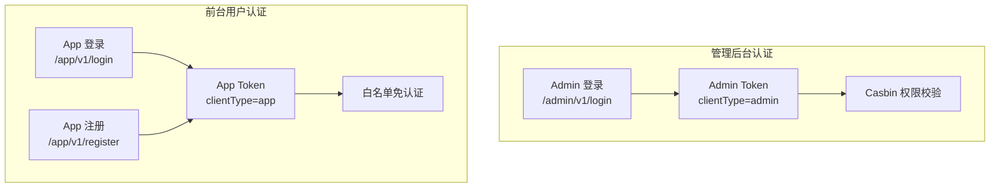
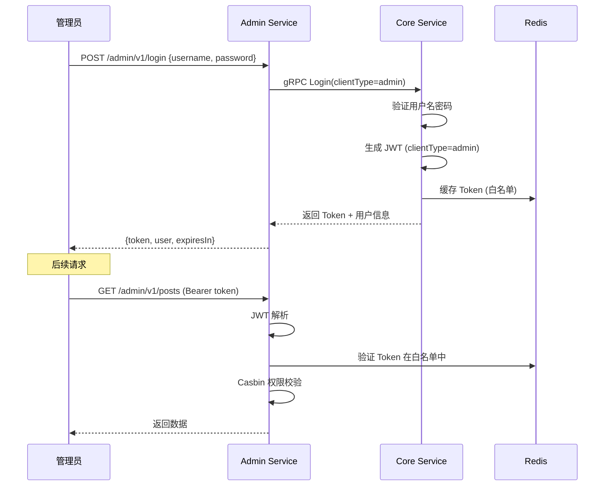

# 双端登录安全实战教程

GoWind CMS 有管理后台和前台应用两套独立的认证体系，安全模型比单应用的 GoWind Admin 更复杂。本教程讲解双 Token 机制、前台用户注册登录、管理后台认证安全、密码策略和防护措施。

## 前置条件

- 已阅读 [CMS 后端架构总览](./backend-architecture.md)
- 已阅读 [权限系统实战](./tutorial-permission-system.md)
- 建议先阅读 [GoWind Admin 登录安全教程](/admin/tutorial-login-security.md)

## 一、双认证体系

### 1.1 架构对比



| 对比项 | 管理后台 | 前台应用 |
|--------|---------|---------|
| 登录入口 | `/admin/v1/login` | `/app/v1/login` |
| 注册入口 | 管理员创建 | `/app/v1/register` 自助注册 |
| Token 类型 | `admin` | `app` |
| 权限模型 | Casbin RBAC | 角色简化 |
| 白名单 | 仅登录 | 内容浏览免登录 |
| 密码策略 | 强密码要求 | 中等要求 |

## 二、管理后台认证

### 2.1 登录流程



### 2.2 JWT 生成

```go
// pkg/jwt/jwt.go
func GenerateToken(claims *CustomClaims) (string, error) {
    claims.ExpiresAt = time.Now().Add(24 * time.Hour).Unix()
    claims.IssuedAt = time.Now().Unix()
    claims.NotBefore = time.Now().Unix()

    token := jwt.NewWithClaims(jwt.SigningMethodHS256, claims)
    return token.SignedString([]byte(secretKey))
}

type CustomClaims struct {
    UserID     uint32 `json:"user_id"`
    TenantID   uint32 `json:"tenant_id"`
    UserName   string `json:"user_name"`
    Roles      []string `json:"roles"`
    ClientType string `json:"client_type"`  // admin / app
    jwt.RegisteredClaims
}
```

### 2.3 Token 白名单

为支持主动注销，Token 同时存入 Redis 白名单：

```go
// app/core/service/internal/service/authentication_service.go
func (s *AuthenticationService) Login(ctx context.Context, req *authV1.LoginRequest) (*authV1.LoginResponse, error) {
    // 验证用户名密码
    user, err := s.userService.VerifyPassword(ctx, req.GetUserName(), req.GetPassword())
    if err != nil {
        // 记录失败日志
        s.loginLogService.RecordFailed(ctx, req.GetUserName(), getClientIP(ctx))
        return nil, errors.Unauthorized("LOGIN_FAILED", "用户名或密码错误")
    }

    // 生成 Token
    claims := &jwt.CustomClaims{
        UserID:     user.Id,
        TenantID:   user.TenantId,
        UserName:   user.UserName,
        Roles:      user.Roles,
        ClientType: req.GetClientType().String(),
    }
    token, _ := jwt.GenerateToken(claims)

    // 存入 Redis 白名单
    tokenKey := fmt.Sprintf("token:%s:%d", req.GetClientType(), user.Id)
    s.redis.Set(ctx, tokenKey, token, 24*time.Hour)

    // 记录成功日志
    s.loginLogService.RecordSuccess(ctx, user.Id, getClientIP(ctx), req.GetClientType())

    return &authV1.LoginResponse{
        Token:     token,
        ExpiresIn: 86400,
        User:      user,
    }, nil
}

func (s *AuthenticationService) Logout(ctx context.Context, req *authV1.LogoutRequest) (*emptypb.Empty, error) {
    // 从 Redis 删除 Token
    userId := ctx.Value(middleware.UserIDKey{}).(uint32)
    clientType := ctx.Value(middleware.ClientTypeKey{}).(string)
    tokenKey := fmt.Sprintf("token:%s:%d", clientType, userId)
    s.redis.Del(ctx, tokenKey)

    return &emptypb.Empty{}, nil
}
```

## 三、前台用户认证

### 3.1 前台注册

```protobuf
// app/service/v1/i_authentication.proto
service AuthenticationService {
  rpc Login(LoginRequest) returns (LoginResponse) {
    option (google.api.http) = { post: "/app/v1/login" body: "*" };
  }
  rpc Register(RegisterRequest) returns (RegisterResponse) {
    option (google.api.http) = { post: "/app/v1/register" body: "*" };
  }
  rpc RefreshToken(RefreshTokenRequest) returns (LoginResponse) {
    option (google.api.http) = { post: "/app/v1/refresh-token" body: "*" };
  }
}

message RegisterRequest {
  string username = 1;
  string email = 2;
  string password = 3;
  string phone = 4 [json_name = "phone"];
  string verify_code = 5 [json_name = "verifyCode"];  // 验证码
}
```

### 3.2 注册实现

```go
// app/core/service/internal/service/authentication_service.go
func (s *AuthenticationService) Register(ctx context.Context, req *authV1.RegisterRequest) (*authV1.RegisterResponse, error) {
    // 1. 检查用户名是否已存在
    exists, err := s.userService.UserNameExists(ctx, req.GetUsername())
    if err != nil {
        return nil, err
    }
    if exists {
        return nil, errors.BadRequest("USERNAME_EXISTS", "用户名已被注册")
    }

    // 2. 检查邮箱是否已存在
    if req.GetEmail() != "" {
        exists, _ = s.userService.EmailExists(ctx, req.GetEmail())
        if exists {
            return nil, errors.BadRequest("EMAIL_EXISTS", "邮箱已被注册")
        }
    }

    // 3. 验证码校验（如启用）
    if req.GetVerifyCode() != "" {
        if !s.verifyCode(ctx, req.GetPhone(), req.GetVerifyCode()) {
            return nil, errors.BadRequest("INVALID_CODE", "验证码错误")
        }
    }

    // 4. 密码加密
    hashedPassword, err := bcrypt.GenerateFromPassword(
        []byte(req.GetPassword()), bcrypt.DefaultCost,
    )
    if err != nil {
        return nil, err
    }

    // 5. 创建用户（默认角色=前台用户）
    user, err := s.userService.Create(ctx, &identityV1.CreateUserRequest{
        Data: &identityV1.User{
            UserName: req.GetUsername(),
            Email:    req.GetEmail(),
            Phone:    req.GetPhone(),
            Password: string(hashedPassword),
            Status:   identityV1.User_USER_STATUS_ACTIVE,
        },
    })

    // 6. 自动登录，返回 Token
    claims := &jwt.CustomClaims{
        UserID:     user.Id,
        UserName:   user.UserName,
        ClientType: "app",
    }
    token, _ := jwt.GenerateToken(claims)

    return &authV1.RegisterResponse{
        Token: token,
        User:  user,
    }, nil
}
```

### 3.3 前台登录标记

App Service 的登录自动设置 `clientType=app`：

```go
// app/app/service/internal/service/authentication_service.go
func (s *AuthenticationService) Login(ctx context.Context, req *authV1.LoginRequest) (*authV1.LoginResponse, error) {
    // 强制标记为前台用户
    req.ClientType = trans.Ptr(authV1.ClientType_app)
    return s.authenticationServiceClient.Login(ctx, req)
}
```

## 四、密码安全

### 4.1 密码加密

```go
// 使用 bcrypt 加密（自适应成本因子）
func HashPassword(password string) (string, error) {
    bytes, err := bcrypt.GenerateFromPassword([]byte(password), bcrypt.DefaultCost)
    return string(bytes), err
}

func CheckPassword(password, hash string) bool {
    err := bcrypt.CompareHashAndPassword([]byte(hash), []byte(password))
    return err == nil
}
```

### 4.2 密码策略

```protobuf
message PasswordPolicy {
  optional uint32 min_length = 1 [json_name = "minLength"];           // 最小长度
  optional bool require_uppercase = 2 [json_name = "requireUppercase"]; // 大写字母
  optional bool require_lowercase = 3 [json_name = "requireLowercase"]; // 小写字母
  optional bool require_digit = 4 [json_name = "requireDigit"];        // 数字
  optional bool require_special = 5 [json_name = "requireSpecial"];    // 特殊字符
  optional uint32 expire_days = 6 [json_name = "expireDays"];          // 过期天数
}
```

### 4.3 密码强度验证

```go
func ValidatePassword(password string, policy *authV1.PasswordPolicy) error {
    if policy == nil {
        policy = &authV1.PasswordPolicy{
            MinLength:         8,
            RequireUppercase:  true,
            RequireLowercase:  true,
            RequireDigit:      true,
            RequireSpecial:    false,
        }
    }

    if uint32(len(password)) < policy.GetMinLength() {
        return errors.BadRequest("WEAK_PASSWORD", fmt.Sprintf("密码至少%d位", policy.GetMinLength()))
    }
    if policy.GetRequireUppercase() && !hasUppercase(password) {
        return errors.BadRequest("WEAK_PASSWORD", "密码需包含大写字母")
    }
    if policy.GetRequireLowercase() && !hasLowercase(password) {
        return errors.BadRequest("WEAK_PASSWORD", "密码需包含小写字母")
    }
    if policy.GetRequireDigit() && !hasDigit(password) {
        return errors.BadRequest("WEAK_PASSWORD", "密码需包含数字")
    }
    return nil
}
```

## 五、安全防护

### 5.1 登录限流

```go
// pkg/middleware/rate_limit.go
func LoginRateLimit(redis *redis.Client) middleware.Middleware {
    return func(handler middleware.Handler) middleware.Handler {
        return func(ctx context.Context, req interface{}) (interface{}, error) {
            ip := getClientIP(ctx)
            key := fmt.Sprintf("rate:login:%s", ip)

            // 1 分钟最多 5 次尝试
            count, _ := redis.Incr(ctx, key).Result()
            if count == 1 {
                redis.Expire(ctx, key, time.Minute)
            }
            if count > 5 {
                return nil, errors.ResourceExhausted("RATE_LIMIT", "登录尝试过于频繁，请稍后再试")
            }

            return handler(ctx, req)
        }
    }
}
```

### 5.2 账号锁定

```go
func (s *AuthenticationService) Login(ctx context.Context, req *authV1.LoginRequest) (*authV1.LoginResponse, error) {
    // 检查账号是否被锁定
    lockKey := fmt.Sprintf("lock:user:%s", req.GetUserName())
    locked, _ := s.redis.Get(ctx, lockKey).Bool()
    if locked {
        ttl, _ := s.redis.TTL(ctx, lockKey).Result()
        return nil, errors.Forbidden("ACCOUNT_LOCKED",
            fmt.Sprintf("账号已锁定，请%d分钟后重试", int(ttl.Minutes())))
    }

    user, err := s.userService.VerifyPassword(ctx, req.GetUserName(), req.GetPassword())
    if err != nil {
        // 记录失败次数
        failKey := fmt.Sprintf("fail:user:%s", req.GetUserName())
        fails, _ := s.redis.Incr(ctx, failKey).Result()
        if fails == 1 {
            s.redis.Expire(ctx, failKey, 30*time.Minute)
        }

        // 连续失败 5 次锁定 30 分钟
        if fails >= 5 {
            s.redis.Set(ctx, lockKey, true, 30*time.Minute)
            return nil, errors.Forbidden("ACCOUNT_LOCKED", "账号已锁定30分钟")
        }

        return nil, errors.Unauthorized("LOGIN_FAILED",
            fmt.Sprintf("用户名或密码错误，还剩%d次尝试", 5-fails))
    }

    // 登录成功，清除失败计数
    s.redis.Del(ctx, fmt.Sprintf("fail:user:%s", req.GetUserName()))
    return s.generateLoginResponse(ctx, user, req.GetClientType())
}
```

### 5.3 登录日志

```go
// 登录日志记录
message LoginLog {
  optional uint32 id = 1;
  optional string username = 2;
  optional bool success = 3;
  optional string ip = 4;
  optional string location = 5 [json_name = "location"];  // IP 归属地
  optional string user_agent = 6 [json_name = "userAgent"];
  optional string device = 7;   // 设备类型
  optional string client_type = 8 [json_name = "clientType"];
  optional google.protobuf.Timestamp login_at = 100;
}
```

## 六、Token 刷新

### 6.1 Token 过期与刷新

```go
func (s *AuthenticationService) RefreshToken(ctx context.Context, req *authV1.RefreshTokenRequest) (*authV1.LoginResponse, error) {
    // 解析旧 Token
    claims, err := jwt.ParseToken(req.GetRefreshToken())
    if err != nil {
        return nil, errors.Unauthorized("INVALID_TOKEN", "刷新令牌无效")
    }

    // 生成新 Token
    newClaims := &jwt.CustomClaims{
        UserID:     claims.UserID,
        TenantID:   claims.TenantID,
        UserName:   claims.UserName,
        Roles:      claims.Roles,
        ClientType: claims.ClientType,
    }
    token, _ := jwt.GenerateToken(newClaims)

    // 更新 Redis 白名单
    tokenKey := fmt.Sprintf("token:%s:%d", claims.ClientType, claims.UserID)
    s.redis.Set(ctx, tokenKey, token, 24*time.Hour)

    return &authV1.LoginResponse{
        Token:     token,
        ExpiresIn: 86400,
    }, nil
}
```

## 七、管理后台安全配置

### 7.1 安全配置

```yaml
# configs/security.yaml
security:
  # 管理后台安全策略
  admin:
    max_login_attempts: 5        # 最大登录尝试次数
    lock_duration: 30m           # 锁定时长
    session_timeout: 24h         # 会话超时
    password_policy:
      min_length: 12             # 管理员密码最小 12 位
      require_uppercase: true
      require_lowercase: true
      require_digit: true
      require_special: true
      expire_days: 90            # 90天强制改密

  # 前台用户安全策略
  app:
    max_login_attempts: 10
    lock_duration: 15m
    session_timeout: 168h        # 前台 7 天
    password_policy:
      min_length: 8
      require_uppercase: false
      require_lowercase: true
      require_digit: true
      require_special: false
```

## 八、检查清单

| 检查项 | 说明 |
|--------|------|
| 双 Token 机制 | admin / app Token 区分 |
| 管理后台登录 | JWT + Redis 白名单 |
| 前台注册 | 用户名/邮箱/手机号注册 |
| 前台登录 | 自动设置 clientType=app |
| 密码加密 | bcrypt |
| 密码策略 | 长度/复杂度要求 |
| 登录限流 | IP + 账号双重限流 |
| 账号锁定 | 连续失败自动锁定 |
| 登录日志 | 成功/失败日志记录 |
| Token 刷新 | 无感续期 |

## 相关文档

- [CMS 后端架构总览](./backend-architecture.md)
- [权限系统实战](./tutorial-permission-system.md)
- [Headless API 对接多端实战](./tutorial-headless-api.md)
- [GoWind Admin 登录安全教程](/admin/tutorial-login-security.md)
