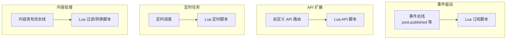

# Lua 脚本扩展实战教程

GoWind CMS 内置 Lua 脚本引擎，支持通过脚本动态扩展业务逻辑，无需编译部署。本教程讲解 CMS 中 Lua 脚本的应用场景、API 接口和实战案例。

## 前置条件

- 已阅读 [CMS 后端架构总览](./backend-architecture.md)
- 建议先阅读 [GoWind Admin Lua 脚本扩展实战](/admin/tutorial-lua-extension.md)

## 一、Lua 扩展架构

### 1.1 CMS 中的 Lua 应用



### 1.2 CMS vs Admin Lua 差异

| 对比项 | Admin | CMS |
|--------|-------|-----|
| 事件类型 | 用户/角色/系统 | 内容/评论/翻译/媒体 |
| API 扩展 | 系统管理 | 内容管理 + 前台 API |
| 定时任务 | 系统维护 | 内容同步 + 数据分析 |

## 二、事件订阅

### 2.1 内容事件订阅

```lua
-- 文章发布后自动生成社交媒体摘要
eventbus.subscribe("post.published", function(event)
    local post_id = event.PostId
    local title = event.Title
    local author = event.AuthorName

    -- 获取完整文章
    local post = api.call("GET", "/admin/v1/posts/" .. post_id)

    -- 生成 AI 摘要（调用外部服务）
    local summary = http.post("https://api.ai-service.com/summarize", {
        headers = { ["Authorization"] = "Bearer your-key" },
        body = json.encode({ text = post.content })
    })

    -- 更新文章摘要
    api.call("PUT", "/admin/v1/posts/" .. post_id, {
        data = { summary = summary }
    })

    log.info("已自动生成摘要: postId=" .. post_id)
end)
```

### 2.2 评论审核扩展

```lua
-- 评论创建时进行敏感词检测
eventbus.subscribe("comment.created", function(event)
    local content = event.Content
    local comment_id = event.CommentId

    -- 检查敏感词
    local sensitive_words = {"广告", "垃圾", "恶意"}
    for _, word in ipairs(sensitive_words) do
        if string.find(content, word) then
            -- 自动拒绝
            api.call("PUT", "/admin/v1/comments/" .. comment_id .. "/reject", {
                data = { reason = "包含敏感内容: " .. word }
            })
            log.warn("评论被自动拒绝: commentId=" .. comment_id)
            return
        end
    end

    -- 无敏感词，自动通过
    api.call("PUT", "/admin/v1/comments/" .. comment_id .. "/approve")
end)
```

## 三、自定义 API

### 3.1 注册自定义路由

```lua
-- 自定义 API：获取热门文章
api.register("GET", "/app/v1/posts/popular", function(ctx)
    local limit = tonumber(ctx.query.limit) or 10
    local days = tonumber(ctx.query.days) or 7

    -- 查询最近 N 天浏览量最高的文章
    local start_time = os.time() - (days * 24 * 3600)

    local posts = db.query([[
        SELECT p.id, p.title, p.slug, COUNT(v.id) as view_count
        FROM posts p
        JOIN post_views v ON v.post_id = p.id
        WHERE p.status = 1 AND v.created_at >= ?
        GROUP BY p.id
        ORDER BY view_count DESC
        LIMIT ?
    ]], start_time, limit)

    return json.encode({ items = posts })
end)

-- 自定义 API：统计仪表盘
api.register("GET", "/admin/v1/dashboard/stats", function(ctx)
    local stats = {
        post_count = db.scalar("SELECT COUNT(*) FROM posts WHERE status = 1"),
        comment_count = db.scalar("SELECT COUNT(*) FROM comments WHERE status = 1"),
        user_count = db.scalar("SELECT COUNT(*) FROM users WHERE status = 1"),
        today_views = db.scalar([[
            SELECT COUNT(*) FROM post_views
            WHERE created_at >= CURRENT_DATE
        ]]),
    }
    return json.encode(stats)
end)
```

## 四、定时任务

### 4.1 内容分析

```lua
-- 每日凌晨 2 点生成内容热力图数据
cron.register("0 2 * * *", function()
    log.info("开始生成内容热力图...")

    -- 查询最近 30 天每日发文量
    local daily_stats = db.query([[
        SELECT DATE(created_at) as date, COUNT(*) as count
        FROM posts
        WHERE status = 1 AND created_at >= NOW() - INTERVAL '30 days'
        GROUP BY DATE(created_at)
        ORDER BY date
    ]])

    -- 缓存到 Redis
    redis.set("stats:content_heatmap", json.encode(daily_stats))

    log.info("热力图数据已更新")
end)
```

### 4.2 过期内容归档

```lua
-- 每月 1 日归档已下架超过 90 天的文章
cron.register("0 3 1 * *", function()
    local threshold = os.time() - (90 * 24 * 3600)

    local expired = db.query([[
        SELECT id FROM posts
        WHERE status = 2 AND updated_at < ?
    ]], threshold)

    for _, post in ipairs(expired) do
        -- 归档到归档表
        db.execute("INSERT INTO posts_archive SELECT * FROM posts WHERE id = ?", post.id)
        -- 删除原记录
        db.execute("DELETE FROM posts WHERE id = ?", post.id)
        log.info("已归档文章: " .. post.id)
    end
end)
```

## 五、内容处理流水线

### 5.1 Markdown 转换

```lua
-- 文章创建时自动将 Markdown 转换为 HTML
eventbus.subscribe("post.created", function(event)
    local post_id = event.PostId

    local post = api.call("GET", "/admin/v1/posts/" .. post_id)
    if not post or not post.content then return end

    -- 检查是否为 Markdown
    if post.content_format == "markdown" then
        -- 调用转换服务
        local html = http.post("https://api.markdown.com/render", {
            body = json.encode({ markdown = post.content })
        })

        -- 保存 HTML 版本
        api.call("PUT", "/admin/v1/posts/" .. post_id, {
            data = {
                content_html = html,
                content_format = "html"
            }
        })
    end
end)
```

### 5.2 图片自动压缩

```lua
-- 文章发布时自动检测并压缩过大图片
eventbus.subscribe("post.published", function(event)
    local post = api.call("GET", "/admin/v1/posts/" .. event.PostId)
    if not post.sections then return end

    for _, section in ipairs(post.sections) do
        if section.type == "SECTION_TYPE_IMAGE" then
            local url = section.data.image.url
            local file_info = oss.stat(url)

            -- 大于 2MB 的图片自动压缩
            if file_info.size > 2 * 1024 * 1024 then
                local compressed_url = image.compress(url, {
                    quality = 85,
                    maxWidth = 1920,
                    format = "webp"
                })

                -- 更新区块数据
                section.data.image.url = compressed_url
                log.info("已压缩图片: " .. url .. " → " .. compressed_url)
            end
        end
    end

    -- 保存更新后的区块
    api.call("PUT", "/admin/v1/posts/" .. event.PostId, {
        data = { sections = post.sections }
    })
end)
```

## 六、Lua API 参考

### 6.1 可用全局对象

| 对象 | 说明 |
|------|------|
| `api` | CMS API 调用 |
| `db` | 数据库查询 |
| `redis` | Redis 操作 |
| `http` | HTTP 客户端 |
| `oss` | 对象存储操作 |
| `image` | 图片处理 |
| `log` | 日志记录 |
| `json` | JSON 编解码 |
| `eventbus` | 事件订阅 |
| `cron` | 定时任务注册 |
| `os` | 系统函数 |
| `string` | 字符串操作 |

### 6.2 常用 API

```lua
-- API 调用
api.call(method, path, options)
api.register(method, path, handler)

-- 数据库
db.query(sql, params)       -- 查询
db.scalar(sql, params)       -- 查询单值
db.execute(sql, params)      -- 执行

-- Redis
redis.get(key)
redis.set(key, value, ttl)
redis.del(key)
redis.incr(key)

-- HTTP
http.get(url, options)
http.post(url, options)

-- 日志
log.info(msg)
log.warn(msg)
log.error(msg)
```

## 七、检查清单

| 检查项 | 说明 |
|--------|------|
| Lua 引擎初始化 | 启动时加载脚本 |
| 事件订阅 | 内容/评论事件处理 |
| 自定义 API | 注册路由 |
| 定时任务 | cron 注册 |
| 安全沙箱 | 限制危险操作 |
| 错误恢复 | panic 不影响主流程 |

## 相关文档

- [CMS 后端架构总览](./backend-architecture.md)
- [事件总线架构](./tutorial-eventbus-architecture.md)
- [内容发布工作流实战](./tutorial-content-workflow.md)
- [GoWind Admin Lua 脚本扩展](/admin/tutorial-lua-extension.md)
