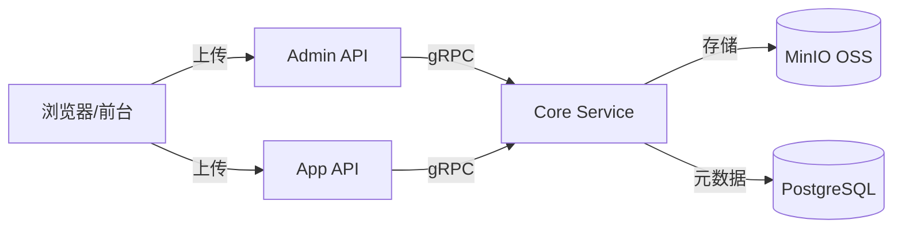

# 媒体资源管理实战教程

GoWind CMS 提供完整的媒体资源管理能力，支持图片、文档、视频的统一存储与管理，底层集成 MinIO 对象存储（兼容 S3 协议）。本教程讲解媒体资源的架构设计、上传下载、与内容关联的实现。

## 前置条件

- 已阅读 [CMS 后端架构总览](./backend-architecture.md)
- 本地已启动 MinIO 服务（默认端口 9000/9001）

## 一、媒体资源架构

### 1.1 整体架构



### 1.2 媒体资源类型

| 类型 | 支持格式 | 用途 |
|------|---------|------|
| 图片 | JPG、PNG、GIF、WebP、SVG | 文章配图、缩略图、Logo |
| 文档 | PDF、DOC、DOCX、XLS、PPT | 附件下载 |
| 视频 | MP4、WebM、MOV | 视频内容 |
| 音频 | MP3、WAV、AAC | 播客、音频内容 |

### 1.3 存储方案对比

| 方案 | 实现 | 适用场景 |
|------|------|---------|
| 本地存储 | 文件系统 | 开发测试 |
| MinIO | 对象存储（S3 兼容） | 生产环境 |
| 云存储 | AWS S3 / 阿里云 OSS | 大规模生产 |

## 二、数据模型

### 2.1 MediaAsset 实体

```protobuf
// media/service/v1/media_asset.proto

message MediaAsset {
  optional uint32 id = 1;
  optional string name = 2 [json_name = "name"];           // 原始文件名
  optional string file_name = 3 [json_name = "fileName"];   // 存储文件名（UUID）
  optional string url = 4 [json_name = "url"];              // 访问 URL
  optional string mime_type = 5 [json_name = "mimeType"];   // MIME 类型
  optional uint64 file_size = 6 [json_name = "fileSize"];   // 文件大小（字节）
  optional string storage_path = 7 [json_name = "storagePath"]; // 存储路径
  optional MediaType type = 8;                               // 媒体类型
  enum MediaType {
    MEDIA_TYPE_IMAGE = 0;
    MEDIA_TYPE_VIDEO = 1;
    MEDIA_TYPE_AUDIO = 2;
    MEDIA_TYPE_DOCUMENT = 3;
    MEDIA_TYPE_OTHER = 4;
  }

  // 图片特有属性
  optional uint32 width = 10 [json_name = "width"];
  optional uint32 height = 11 [json_name = "height"];

  // 视频特有属性
  optional uint32 duration = 12 [json_name = "duration"];  // 时长（秒）

  // 缩略图
  optional string thumbnail_url = 20 [json_name = "thumbnailUrl"];

  optional uint32 uploaded_by = 100 [json_name = "uploadedBy"];
  optional google.protobuf.Timestamp created_at = 200;
}
```

### 2.2 Ent Schema

```go
// app/core/service/internal/data/ent/schema/media_asset.go
type MediaAsset struct{ ent.Schema }

func (MediaAsset) Mixin() []ent.Mixin {
    return []ent.Mixin{mixin.Time{}}
}

func (MediaAsset) Fields() []ent.Field {
    return []ent.Field{
        field.String("name"),
        field.String("file_name").Unique(),
        field.String("url"),
        field.String("mime_type"),
        field.Uint64("file_size").Default(0),
        field.String("storage_path"),
        field.Int("type").Default(0),
        field.Uint32("width").Optional(),
        field.Uint32("height").Optional(),
        field.Uint32("duration").Optional(),
        field.String("thumbnail_url").Optional(),
        field.Uint32("uploaded_by").Optional(),
    }
}
```

## 三、文件上传与下载

### 3.1 FileTransfer 服务

CMS 提供统一的文件传输服务（FileTransferService），同时注册在 Admin API 和 App API 中：

```protobuf
// admin/service/v1/i_file.proto
service FileService {
  rpc UploadFile(UploadFileRequest) returns (FileInfo) {
    option (google.api.http) = {
      post: "/admin/v1/files/upload"
      body: "*"
    };
  }
  rpc DownloadFile(DownloadFileRequest) returns (stream FileChunk) {
    option (google.api.http) = {
      get: "/admin/v1/files/{path}"
    };
  }
  rpc DeleteFile(DeleteFileRequest) returns (google.protobuf.Empty) {
    option (google.api.http) = {
      delete: "/admin/v1/files/{path}"
    };
  }
}

message UploadFileRequest {
  string file_name = 1 [json_name = "fileName"];
  bytes chunk_data = 2 [json_name = "chunkData"];  // 分块数据
  uint32 chunk_index = 3 [json_name = "chunkIndex"];
  uint32 total_chunks = 4 [json_name = "totalChunks"];
  string mime_type = 5 [json_name = "mimeType"];
}
```

### 3.2 分块上传

支持大文件分块上传：

```go
// app/core/service/internal/service/file_transfer_service.go
func (s *FileTransferService) UploadFile(
    ctx context.Context, req *storageV1.UploadFileRequest,
) (*storageV1.FileInfo, error) {
    // 1. 将分块写入临时文件
    tempPath := fmt.Sprintf("/tmp/%s_%d", req.GetFileName(), req.GetChunkIndex())
    if err := os.WriteFile(tempPath, req.GetChunkData(), 0644); err != nil {
        return nil, err
    }

    // 2. 所有分块上传完毕后合并
    if req.GetChunkIndex() == req.GetTotalChunks()-1 {
        finalPath, err := s.mergeChunks(req.GetFileName(), req.GetTotalChunks())
        if err != nil {
            return nil, err
        }

        // 3. 上传到 MinIO
        url, err := s.ossClient.Upload(ctx, finalPath, req.GetFileName())
        if err != nil {
            return nil, err
        }

        // 4. 创建媒体资源记录
        mediaAsset := s.createMediaAsset(ctx, finalPath, url, req)

        // 5. 清理临时文件
        s.cleanupTempFiles(req.GetFileName(), req.GetTotalChunks())

        return mediaAsset, nil
    }

    return &storageV1.FileInfo{FileName: req.GetFileName()}, nil
}
```

### 3.3 MinIO 集成

```go
// pkg/oss/minio_client.go
type MinIOClient struct {
    client *minio.Client
    bucket string
}

func NewMinIOClient(endpoint, accessKey, secretKey, bucket string) (*MinIOClient, error) {
    client, err := minio.New(endpoint, &minio.Options{
        Creds: credentials.NewStaticV4(accessKey, secretKey, ""),
        Secure: false,
    })
    if err != nil {
        return nil, err
    }
    // 自动创建 bucket
    ctx := context.Background()
    exists, err := client.BucketExists(ctx, bucket)
    if err != nil {
        return nil, err
    }
    if !exists {
        if err := client.MakeBucket(ctx, bucket, minio.MakeBucketOptions{}); err != nil {
            return nil, err
        }
    }
    return &MinIOClient{client: client, bucket: bucket}, nil
}

func (c *MinIOClient) Upload(ctx context.Context, localPath, objectName string) (string, error) {
    _, err := c.client.FPutObject(ctx, c.bucket, objectName, localPath, minio.PutObjectOptions{
        ContentType: "application/octet-stream",
    })
    if err != nil {
        return "", err
    }
    return fmt.Sprintf("/%s/%s", c.bucket, objectName), nil
}
```

## 四、管理后台媒体库

### 4.1 媒体库页面

```vue
<!-- views/media/index.vue -->
<script setup lang="ts">
import { useListMediaAssets, useDeleteMediaAsset } from '#/api/composables/media';
import { Upload } from 'ant-design-vue';

const pagination = reactive(new PaginationQuery());
const { data, isLoading } = useListMediaAssets(pagination);
const deleteMutation = useDeleteMediaAsset();
const previewVisible = ref(false);
const previewUrl = ref('');

const handleUpload = (info) => {
  // 上传成功后刷新列表
  if (info.file.status === 'done') {
    queryClient.invalidateQueries({ queryKey: ['listMediaAssets'] });
  }
};

const handleDelete = (id: number) => {
  Modal.confirm({
    title: '确认删除？',
    onOk: () => deleteMutation.mutate(id),
  });
};
</script>

<template>
  <Page title="媒体资源">
    <!-- 上传区域 -->
    <Upload
      action="/api/admin/v1/files/upload"
      :headers="{ Authorization: `Bearer ${token}` }"
      multiple
      @change="handleUpload"
    >
      <Button type="primary">上传文件</Button>
    </Upload>

    <!-- 媒体网格 -->
    <div class="grid grid-cols-6 gap-4 mt-4">
      <div v-for="asset in data?.items" :key="asset.id" class="media-item">
        <div class="thumbnail" @click="previewUrl = asset.url; previewVisible = true">
          
          <video v-else-if="asset.type === 1" :src="asset.url" />
          <div v-else class="file-icon">{{ asset.mimeType }}</div>
        </div>
        <div class="info">
          <span class="name">{{ asset.name }}</span>
          <span class="size">{{ formatSize(asset.fileSize) }}</span>
        </div>
        <Button danger size="small" @click="handleDelete(asset.id)">删除</Button>
      </div>
    </div>
  </Page>
</template>
```

### 4.2 图片选择器组件

内容编辑器中集成图片选择器：

```vue
<!-- components/MediaPicker.vue -->
<script setup lang="ts">
const props = defineProps<{ modelValue: string }>();
const emit = defineEmits<{ 'update:modelValue': [value: string] }>();

const open = ref(false);
const { data } = useListMediaAssets({ pageSize: 24 });

const handleSelect = (url: string) => {
  emit('update:modelValue', url);
  open.value = false;
};
</script>

<template>
  <div>
    <div v-if="modelValue" class="preview">
      
    </div>
    <Button @click="open = true">选择图片</Button>
    <Modal v-model:open="open" title="选择媒体" width="800px">
      <div class="grid grid-cols-6 gap-2">
        <div
          v-for="asset in data?.items?.filter(a => a.type === 0)"
          :key="asset.id"
          @click="handleSelect(asset.url)"
          class="cursor-pointer border-2 hover:border-blue-500"
        >
          
        </div>
      </div>
    </Modal>
  </div>
</template>
```

## 五、前台文件上传

### 5.1 前台上传（需登录）

```tsx
// React 前台：用户头像上传
async function uploadAvatar(file: File): Promise<string> {
  const formData = new FormData();
  formData.append('file', file);

  const response = await fetch(`${API_BASE}/files/upload`, {
    method: 'POST',
    headers: {
      Authorization: `Bearer ${getToken()}`,
    },
    body: formData,
  });

  const data = await response.json();
  return data.url;
}
```

### 5.2 Flutter 前台上传

```dart
Future<String> uploadFile(File file, {String? mimeType}) async {
  final formData = FormData.fromMap({
    'file': await MultipartFile.fromFile(
      file.path,
      contentType: MediaType.parse(mimeType ?? 'application/octet-stream'),
    ),
  });

  final response = await dio.post('/files/upload', data: formData);
  return response.data['url'];
}
```

## 六、内容与媒体关联

### 6.1 帖子缩略图

```http
POST /admin/v1/posts
{
  "title": "新产品发布",
  "thumbnail": "https://oss.example.com/images/product-launch.jpg",
  ...
}
```

### 6.2 富文本编辑器中的图片

TipTap 编辑器直接嵌入图片 URL：

```typescript
// 编辑器中插入图片
editor.commands.setImage({
  src: selectedImageUrl,
  alt: '图片描述',
  title: '图片标题',
});
```

## 七、图片处理

### 7.1 缩略图生成

```go
// pkg/oss/thumbnail.go
func GenerateThumbnail(srcPath, dstPath string, maxWidth, maxHeight int) error {
    src, err := imaging.Open(srcPath)
    if err != nil {
        return err
    }
    thumb := imaging.Fit(src, maxWidth, maxHeight, imaging.Lanczos)
    return imaging.Save(thumb, dstPath)
}
```

### 7.2 图片格式转换

上传时自动生成 WebP 格式以优化加载：

```go
func OptimizeAndUpload(ctx context.Context, ossClient *MinIOClient, localPath string) (string, error) {
    // 生成 WebP 版本
    webpPath := strings.Replace(localPath, filepath.Ext(localPath), ".webp", 1)
    if err := ConvertToWebP(localPath, webpPath); err == nil {
        // 上传 WebP 版本
        ossClient.Upload(ctx, webpPath, generateObjectName(webpPath))
    }

    // 上传原始版本
    url, err := ossClient.Upload(ctx, localPath, generateObjectName(localPath))
    return url, err
}
```

## 八、安全与权限

### 8.1 上传安全

| 安全检查 | 实现 |
|---------|------|
| 文件类型白名单 | 服务端验证 MIME 类型 |
| 文件大小限制 | 站点配置 `maxUploadSize` |
| 文件名安全 | UUID 重命名，防止路径遍历 |
| 病毒扫描 | 可选集成 ClamAV |

### 8.2 访问控制

```yaml
# MinIO 桶策略：公开读取
# 公开 bucket 用于 CDN 加速
# 私有 bucket 用于需要授权的文件
oss:
  public_bucket: "cms-public"
  private_bucket: "cms-private"
```

## 九、检查清单

| 检查项 | 说明 |
|--------|------|
| MinIO 服务启动 | Docker Compose 启动依赖 |
| OSS 客户端配置 | endpoint / bucket / credentials |
| MediaAsset Schema | 字段完整 |
| FileTransfer 服务 | 上传/下载/删除 |
| 管理后台媒体库 | 网格展示 + 上传 + 选择器 |
| 前台上传 | Token 认证 + FormData |
| 内容关联 | 缩略图 / 富文本图片 |
| 安全检查 | 类型白名单 + 大小限制 |

## 相关文档

- [CMS 后端架构总览](./backend-architecture.md)
- [前台应用开发实战](./tutorial-frontend-app.md)
- [多站点管理实战](./tutorial-multi-site.md)
- [GoWind Admin 文件存储教程](/admin/tutorial-file-storage.md)
