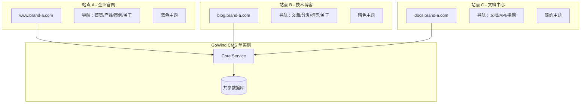
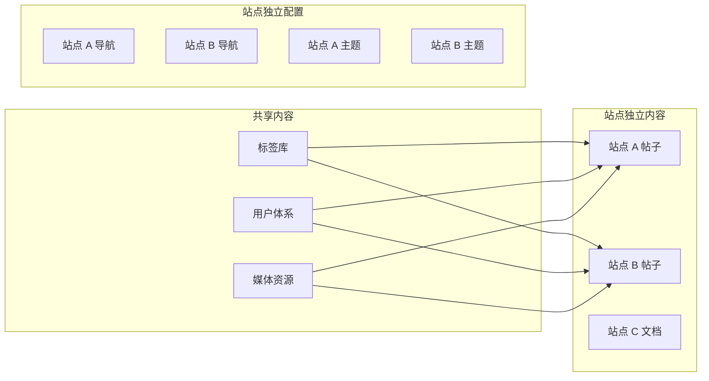

# 多站点管理实战教程

GoWind CMS 支持多站点管理，一套系统可同时管理多个独立站点（如品牌官网、博客、文档站），每个站点拥有独立的域名、主题、导航、SEO 配置和内容。本教程讲解多站点架构的设计与实现。

## 前置条件

- 已阅读 [CMS 后端架构总览](./backend-architecture.md)
- 了解 CMS 的内容管理模型（Post / Category / Page）

## 一、多站点架构

### 1.1 什么是多站点



### 1.2 多站点 vs 多租户

| 对比项 | 多租户 | 多站点 |
|--------|--------|--------|
| 隔离级别 | 数据完全隔离 | 数据共享，站点独立展示 |
| 用户体系 | 各租户独立用户 | 同一用户体系 |
| 目的 | SaaS 服务多客户 | 一个组织管理多个站点 |
| 内容共享 | 不共享 | 可选择性共享 |

### 1.3 站点数据模型

| 实体 | 说明 |
|------|------|
| **Site（站点）** | 站点基础信息（域名、标题、Logo、主题） |
| **SiteSetting（站点配置）** | 站点全局参数（SEO、上传、缓存） |
| **Navigation（导航）** | 站点导航栏及导航项 |
| **Post / Page / Category** | 内容可关联到特定站点 |

## 二、站点管理

### 2.1 Protobuf 定义

```protobuf
// site/service/v1/site.proto

message Site {
  optional uint32 id = 1;
  optional string name = 2 [json_name = "name"];
  optional string domain = 3 [json_name = "domain"];        // 站点域名
  optional string title = 4 [json_name = "title"];          // 站点标题
  optional string description = 5 [json_name = "description"];
  optional string logo = 6 [json_name = "logo"];            // Logo URL
  optional string favicon = 7 [json_name = "favicon"];
  optional string theme = 8 [json_name = "theme"];           // 主题标识
  optional Status status = 9;
  enum Status {
    SITE_STATUS_ACTIVE = 0;
    SITE_STATUS_INACTIVE = 1;
  }
  optional google.protobuf.Timestamp created_at = 100;
  optional google.protobuf.Timestamp updated_at = 101;
}
```

### 2.2 Admin API 接口

```protobuf
// admin/service/v1/i_site.proto
service SiteService {
  rpc List(pagination.PagingRequest) returns (ListSiteResponse) {
    option (google.api.http) = { get: "/admin/v1/sites" };
  }
  rpc Get(GetSiteRequest) returns (Site) {
    option (google.api.http) = { get: "/admin/v1/sites/{id}" };
  }
  rpc Create(CreateSiteRequest) returns (Site) {
    option (google.api.http) = { post: "/admin/v1/sites" body: "*" };
  }
  rpc Update(UpdateSiteRequest) returns (Site) {
    option (google.api.http) = { put: "/admin/v1/sites/{id}" body: "*" };
  }
  rpc Delete(DeleteSiteRequest) returns (google.protobuf.Empty) {
    option (google.api.http) = { delete: "/admin/v1/sites/{id}" };
  }
}
```

### 2.3 创建站点

```http
POST /admin/v1/sites
Authorization: Bearer {admin_token}

{
  "name": "技术博客",
  "domain": "blog.example.com",
  "title": "Tech Blog - 技术分享",
  "description": "分享前沿技术、开发经验和行业洞察",
  "logo": "https://oss.example.com/logos/blog-logo.png",
  "favicon": "https://oss.example.com/logos/blog-favicon.ico",
  "theme": "dark",
  "status": "SITE_STATUS_ACTIVE"
}
```

### 2.4 站点关联

内容创建时可以指定关联的站点：

```http
POST /admin/v1/posts
{
  "title": "GoWind 架构解析",
  "siteId": 2,
  "categoryId": 5,
  ...
}
```

前台请求时通过域名或 `siteId` 参数自动匹配站点：

```http
# 通过域名自动匹配（推荐）
GET /app/v1/posts
Host: blog.example.com

# 或通过参数指定
GET /app/v1/posts?siteId=2
```

## 三、站点配置

### 3.1 站点配置模型

```protobuf
// site/service/v1/site_setting.proto
message SiteSetting {
  optional uint32 id = 1;
  optional uint32 site_id = 2 [json_name = "siteId"];

  // SEO 配置
  optional string seo_title = 10 [json_name = "seoTitle"];
  optional string seo_description = 11 [json_name = "seoDescription"];
  optional string seo_keywords = 12 [json_name = "seoKeywords"];

  // 上传限制
  optional uint32 max_upload_size = 20 [json_name = "maxUploadSize"];
  optional string allowed_file_types = 21 [json_name = "allowedFileTypes"];

  // 缓存策略
  optional bool cache_enabled = 30 [json_name = "cacheEnabled"];
  optional uint32 cache_ttl = 31 [json_name = "cacheTtl"];

  // 社交链接
  optional string social_github = 40 [json_name = "socialGithub"];
  optional string social_twitter = 41 [json_name = "socialTwitter"];
  optional string social_linkedin = 42 [json_name = "socialLinkedin"];
}
```

### 3.2 管理后台配置页面

```vue
<!-- views/site/setting.vue -->
<script setup lang="ts">
import { useGetSiteSettings, useUpdateSiteSettings } from '#/api/composables/site';

const props = defineProps<{ siteId: number }>();
const { data: settings } = useGetSiteSettings(props.siteId);
const updateMutation = useUpdateSiteSettings();

const formData = reactive({
  seoTitle: '',
  seoDescription: '',
  seoKeywords: '',
  maxUploadSize: 10,
  allowedFileTypes: 'jpg,png,gif,pdf',
  cacheEnabled: true,
  cacheTtl: 600,
});

watchEffect(() => {
  if (settings.value) Object.assign(formData, settings.value);
});

const handleSave = () => {
  updateMutation.mutate({ id: props.siteId, data: formData });
};
</script>

<template>
  <Page title="站点配置">
    <Tabs>
      <TabPane key="seo" tab="SEO 配置">
        <Form :model="formData" layout="vertical">
          <FormItem label="SEO 标题">
            <Input v-model:value="formData.seoTitle" />
          </FormItem>
          <FormItem label="SEO 描述">
            <Textarea v-model:value="formData.seoDescription" :rows="3" />
          </FormItem>
          <FormItem label="SEO 关键词">
            <Input v-model:value="formData.seoKeywords" placeholder="逗号分隔" />
          </FormItem>
        </Form>
      </TabPane>
      <TabPane key="upload" tab="上传限制">
        <Form :model="formData" layout="vertical">
          <FormItem label="最大上传大小（MB）">
            <InputNumber v-model:value="formData.maxUploadSize" :min="1" :max="100" />
          </FormItem>
          <FormItem label="允许的文件类型">
            <Input v-model:value="formData.allowedFileTypes" />
          </FormItem>
        </Form>
      </TabPane>
      <TabPane key="cache" tab="缓存策略">
        <Form :model="formData" layout="vertical">
          <FormItem label="启用缓存">
            <Switch v-model:checked="formData.cacheEnabled" />
          </FormItem>
          <FormItem label="缓存时间（秒）">
            <InputNumber v-model:value="formData.cacheTtl" :min="60" :max="3600" />
          </FormItem>
        </Form>
      </TabPane>
    </Tabs>
    <Button type="primary" @click="handleSave">保存</Button>
  </Page>
</template>
```

## 四、导航管理

### 4.1 导航数据模型

```protobuf
// site/service/v1/navigation.proto

message Navigation {
  optional uint32 id = 1;
  optional uint32 site_id = 2 [json_name = "siteId"];
  optional string name = 3;           // 导航栏名称
  optional NavigationType type = 4;   // 类型
  enum NavigationType {
    NAVIGATION_TYPE_HEADER = 0;  // 顶部导航
    NAVIGATION_TYPE_FOOTER = 1;  // 页脚导航
    NAVIGATION_TYPE_SIDEBAR = 2; // 侧边导航
  }
  repeated NavigationItem items = 10 [json_name = "items"];
}

message NavigationItem {
  optional uint32 id = 1;
  optional string title = 2;     // 显示文字
  optional string url = 3;       // 链接地址
  optional string icon = 4;      // 图标
  optional uint32 parent_id = 5 [json_name = "parentId"];  // 父导航项（多级）
  optional uint32 sort = 6;      // 排序
  optional string target = 7;    // 打开方式（_self/_blank）
}
```

### 4.2 多级导航示例

```json
{
  "id": 1,
  "siteId": 2,
  "name": "主导航",
  "type": "NAVIGATION_TYPE_HEADER",
  "items": [
    {
      "id": 1,
      "title": "首页",
      "url": "/",
      "sort": 1
    },
    {
      "id": 2,
      "title": "技术文章",
      "url": "/posts",
      "sort": 2,
      "items": [
        { "parentId": 2, "title": "前端开发", "url": "/categories/frontend", "sort": 1 },
        { "parentId": 2, "title": "后端开发", "url": "/categories/backend", "sort": 2 },
        { "parentId": 2, "title": "DevOps", "url": "/categories/devops", "sort": 3 }
      ]
    },
    {
      "id": 3,
      "title": "关于我们",
      "url": "/about",
      "sort": 3
    }
  ]
}
```

### 4.3 前台导航渲染

```tsx
// React 前台导航组件
// src/components/layout/Header.tsx
async function Header({ siteId }: { siteId: number }) {
  const navigations = await getNavigations(siteId);
  const headerNav = navigations.items.find(
    (n) => n.type === 'NAVIGATION_TYPE_HEADER',
  );

  return (
    <header className="border-b">
      <div className="container mx-auto flex items-center justify-between py-4">
        <nav className="flex gap-6">
          {headerNav?.items.map((item) => (
            <NavItem key={item.id} item={item} />
          ))}
        </nav>
      </div>
    </header>
  );
}

function NavItem({ item }: { item: NavigationItem }) {
  const hasChildren = item.items && item.items.length > 0;

  if (hasChildren) {
    return (
      <div className="relative group">
        <Link href={item.url}>{item.title}</Link>
        <div className="absolute hidden group-hover:block">
          {item.items!.map((child) => (
            <Link key={child.id} href={child.url}>
              {child.title}
            </Link>
          ))}
        </div>
      </div>
    );
  }

  return <Link href={item.url}>{item.title}</Link>;
}
```

## 五、域名路由

### 5.1 基于域名的站点匹配

App Service 根据请求的 `Host` 头自动识别站点：

```go
// app/app/service/internal/server/rest_server.go
func SiteMiddleware(sites map[string]uint32) middleware.Middleware {
    return func(handler middleware.Handler) middleware.Handler {
        return func(ctx context.Context, req interface{}) (interface{}, error) {
            if httpCtx, ok := http.FromServerContext(ctx); ok {
                host := httpCtx.Request.Host
                // 去掉端口号
                if idx := strings.LastIndex(host, ":"); idx > 0 {
                    host = host[:idx]
                }
                if siteId, exists := sites[host]; exists {
                    // 注入 siteId 到 context
                    ctx = context.WithValue(ctx, SiteIDKey{}, siteId)
                }
            }
            return handler(ctx, req)
        }
    }
}
```

### 5.2 前台多站点 Nginx 配置

```nginx
# nginx.conf
# 站点 A：企业官网
server {
    listen 80;
    server_name www.example.com;
    location / {
        proxy_pass http://localhost:3000;  # React 前台
    }
    location /api/ {
        proxy_pass http://localhost:6700/app/v1/;  # App API
    }
}

# 站点 B：技术博客
server {
    listen 80;
    server_name blog.example.com;
    location / {
        proxy_pass http://localhost:3001;  # Vue 前台
    }
    location /api/ {
        proxy_pass http://localhost:6700/app/v1/;
    }
}
```

## 六、内容与站点的关联

### 6.1 Ent Schema 关联

```go
// app/core/service/internal/data/ent/schema/post.go
func (Post) Edges() []ent.Edge {
    return []ent.Edge{
        edge.From("site", Site.Type).Ref("posts").Unique(),  // 帖子关联站点
        // ... 其他关系
    }
}

// app/core/service/internal/data/ent/schema/site.go
func (Site) Edges() []ent.Edge {
    return []ent.Edge{
        edge.To("posts", Post.Type),           // 站点的帖子
        edge.To("pages", Page.Type),           // 站点的页面
        edge.To("navigations", Navigation.Type), // 站点的导航
        edge.To("settings", SiteSetting.Type),   // 站点配置
    }
}
```

### 6.2 前台按站点查询

```http
# 前台 API 自动根据域名注入站点过滤
GET /app/v1/posts
Host: blog.example.com
# → 等价于 WHERE site_id = 2
```

```go
// app/core/service/internal/data/post_repo.go
func (r *PostRepo) List(ctx context.Context, req *paginationV1.PagingRequest) (*contentV1.ListPostResponse, error) {
    query := r.data.db.Post.Query()

    // 从 context 获取站点 ID
    if siteId, ok := ctx.Value(SiteIDKey{}).(uint32); ok {
        query = query.Where(post.HasSiteWith(site.IDEQ(siteId)))
    }

    // ... 分页、排序
}
```

## 七、主题管理

### 7.1 站点主题配置

每个站点可独立配置展示主题：

| 主题标识 | 风格 | 适用场景 |
|---------|------|---------|
| `light` | 亮色简洁 | 企业官网 |
| `dark` | 暗色极客 | 技术博客 |
| `minimal` | 极简纯文字 | 文档站 |
| `magazine` | 杂志排版 | 新闻门户 |

### 7.2 前台主题切换

```tsx
// React 前台根据站点主题加载样式
async function RootLayout({ children }: { children: React.ReactNode }) {
  const siteSettings = await getSiteSettings();
  const theme = siteSettings.theme || 'light';

  return (
    <html data-theme={theme}>
      <body className={themeClasses[theme]}>
        {children}
      </body>
    </html>
  );
}
```

## 八、最佳实践

### 8.1 多站点内容策略



### 8.2 SEO 最佳实践

| 配置项 | 建议 |
|--------|------|
| 独立域名 | 每个站点使用独立域名或子域名 |
| 独立 sitemap | 每个站点生成独立的 sitemap.xml |
| canonical | 正确设置 canonical URL 避免重复内容 |
| robots.txt | 按站点配置爬虫策略 |

## 九、检查清单

| 检查项 | 说明 |
|--------|------|
| 站点创建 | Site 实体 + 基础信息 |
| 站点配置 | SiteSetting（SEO/上传/缓存） |
| 导航管理 | Navigation + NavigationItem |
| 域名路由 | Host 头自动匹配站点 |
| 内容关联 | Post/Page 关联 Site |
| 前台适配 | 按站点加载主题和导航 |
| Nginx 配置 | 多域名反向代理 |
| SEO 配置 | 独立 sitemap + robots |

## 相关文档

- [CMS 后端架构总览](./backend-architecture.md)
- [CMS Protobuf API 定义](./backend-api.md)
- [前台应用开发实战](./tutorial-frontend-app.md)
- [Headless API 对接多端实战](./tutorial-headless-api.md)
- [GoWind Admin 多租户架构实战](/admin/tutorial-multi-tenancy.md)
