# 新增内容类型全栈实战教程

本教程以新增「视频」内容类型为例，带你完整走通 CMS 的全栈开发流程：从 Protobuf API 定义 → Ent 数据层 → Core Service 业务逻辑 → Admin/App Service 接口层 → 管理后台前端页面 → 前台消费。

## 前置条件

- 已阅读 [CMS 后端架构总览](./backend-architecture.md) 和 [CMS API 定义](./backend-api.md)
- 本地开发环境已搭建（参见 [安装指南](./installation.md)）
- 了解 Go 语言、Protobuf、Vue 3 基本概念

## 全栈流程总览

```mermaid
graph LR
    S1[1. 定义 Protobuf] --> S2[2. 生成 Go 代码]
    S2 --> S3[3. 定义 Ent Schema]
    S3 --> S4[4. 生成 Ent 代码]
    S4 --> S5[5. 编写 Repository]
    S5 --> S6[6. Core Service 业务逻辑]
    S6 --> S7[7. Admin Service 接口]
    S7 --> S8[8. App Service 接口]
    S8 --> S9[9. Wire 依赖注入]
    S9 --> S10[10. 管理后台页面]
    S10 --> S11[11. 前台消费]
```



## 步骤 1：定义 Protobuf API

### 1.1 定义领域消息

创建 `api/protos/content/service/v1/video.proto`：

```protobuf
syntax = "proto3";

package content.service.v1;

import "gnostic/openapi/v3/annotations.proto";
import "google/protobuf/empty.proto";
import "google/protobuf/timestamp.proto";
import "google/protobuf/field_mask.proto";
import "pagination/v1/pagination.proto";
import "content/service/v1/types.proto";

// 视频
message Video {
  optional uint32 id = 1 [json_name = "id"];
  optional string title = 2 [json_name = "title"];
  optional string slug = 3 [json_name = "slug"];
  optional string description = 5 [json_name = "description"];
  optional string video_url = 6 [json_name = "videoUrl"];
  optional string thumbnail = 7 [json_name = "thumbnail"];
  optional uint32 duration = 8 [json_name = "duration"]; // 时长（秒）
  optional uint32 view_count = 9 [json_name = "viewCount"];

  optional Status status = 10;
  enum Status {
    VIDEO_STATUS_DRAFT = 0;
    VIDEO_STATUS_PUBLISHED = 1;
    VIDEO_STATUS_OFFLINE = 2;
  }

  repeated uint32 category_ids = 20 [json_name = "categoryIds"];
  repeated uint32 tag_ids = 21 [json_name = "tagIds"];

  // 多语言翻译
  repeated VideoTranslation translations = 40 [json_name = "translations"];
  repeated string available_languages = 41 [json_name = "availableLanguages"];

  optional uint32 created_by = 100 [json_name = "createdBy"];
  optional google.protobuf.Timestamp created_at = 200 [json_name = "createdAt"];
  optional google.protobuf.Timestamp updated_at = 201 [json_name = "updatedAt"];
}

message VideoTranslation {
  optional uint32 id = 1 [json_name = "id"];
  optional uint32 video_id = 2 [json_name = "videoId"];
  optional string language_code = 3 [json_name = "languageCode"];
  optional string title = 10 [json_name = "title"];
  optional string slug = 11 [json_name = "slug"];
  optional string description = 12 [json_name = "description"];
  optional SeoMeta seo = 20 [json_name = "seo"];
}

message ListVideoResponse {
  repeated Video items = 1;
  uint64 total = 2;
}

message GetVideoRequest {
  oneof query_by {
    uint32 id = 1 [json_name = "id"];
    string code = 2 [json_name = "code"];
  }
  optional string locale = 10 [json_name = "locale"];
}

message CreateVideoRequest { Video data = 1; }

message UpdateVideoRequest {
  uint32 id = 1;
  Video data = 2;
  google.protobuf.FieldMask update_mask = 3 [json_name = "updateMask"];
}

message DeleteVideoRequest { uint32 id = 1; }
```

### 1.2 定义 Admin Service 接口

创建 `api/protos/admin/service/v1/i_video.proto`：

```protobuf
syntax = "proto3";

package admin.service.v1;

import "google/api/annotations.proto";
import "google/protobuf/empty.proto";
import "pagination/v1/pagination.proto";
import "content/service/v1/video.proto";

service VideoService {
  rpc List(pagination.PagingRequest) returns (content.service.v1.ListVideoResponse) {
    option (google.api.http) = { get: "/admin/v1/videos" };
  }
  rpc Get(content.service.v1.GetVideoRequest) returns (content.service.v1.Video) {
    option (google.api.http) = { get: "/admin/v1/videos/{id}" };
  }
  rpc Create(content.service.v1.CreateVideoRequest) returns (content.service.v1.Video) {
    option (google.api.http) = { post: "/admin/v1/videos" body: "*" };
  }
  rpc Update(content.service.v1.UpdateVideoRequest) returns (content.service.v1.Video) {
    option (google.api.http) = { put: "/admin/v1/videos/{id}" body: "*" };
  }
  rpc Delete(content.service.v1.DeleteVideoRequest) returns (google.protobuf.Empty) {
    option (google.api.http) = { delete: "/admin/v1/videos/{id}" };
  }
}
```

### 1.3 定义 App Service 接口

创建 `api/protos/app/service/v1/i_video.proto`：

```protobuf
syntax = "proto3";

package app.service.v1;

import "google/api/annotations.proto";
import "pagination/v1/pagination.proto";
import "content/service/v1/video.proto";

service VideoService {
  rpc List(pagination.PagingRequest) returns (content.service.v1.ListVideoResponse) {
    option (google.api.http) = { get: "/app/v1/videos" };
  }
  rpc Get(content.service.v1.GetVideoRequest) returns (content.service.v1.Video) {
    option (google.api.http) = { get: "/app/v1/videos/{id}" };
  }
}
```

## 步骤 2：生成 Go 代码

```shell
cd backend
make api
```

生成的内容会输出到 `api/gen/go/` 目录：
- `content/service/v1/video.pb.go` — 消息定义
- `content/service/v1/video_grpc.pb.go` — gRPC 服务接口
- `admin/service/v1/i_video.pb.go` — Admin HTTP 服务接口
- `app/service/v1/i_video.pb.go` — App HTTP 服务接口

## 步骤 3：定义 Ent Schema

创建 `app/core/service/internal/data/ent/schema/video.go`：

```go
package schema

import (
    "entgo.io/ent"
    "entgo.io/ent/schema/field"
    "entgo.io/ent/schema/edge"
    "entgo.io/ent/schema/mixin"
)

type Video struct{ ent.Schema }

func (Video) Mixin() []ent.Mixin {
    return []ent.Mixin{
        mixin.Time{},
    }
}

func (Video) Fields() []ent.Field {
    return []ent.Field{
        field.String("title"),
        field.String("slug").Unique(),
        field.Text("description").Optional(),
        field.String("video_url").Optional(),
        field.String("thumbnail").Optional(),
        field.Uint32("duration").Default(0),
        field.Uint32("view_count").Default(0),
        field.Int("status").Default(1),
    }
}

func (Video) Edges() []ent.Edge {
    return []ent.Edge{
        edge.To("translations", VideoTranslation.Type),
        edge.From("categories", Category.Type).Ref("videos"),
        edge.From("tags", Tag.Type).Ref("videos"),
    }
}
```

创建翻译 Schema `app/core/service/internal/data/ent/schema/video_translation.go`：

```go
package schema

import (
    "entgo.io/ent"
    "entgo.io/ent/schema/field"
    "entgo.io/ent/schema/edge"
    "entgo.io/ent/schema/mixin"
)

type VideoTranslation struct{ ent.Schema }

func (VideoTranslation) Mixin() []ent.Mixin {
    return []ent.Mixin{mixin.Time{}}

}

func (VideoTranslation) Fields() []ent.Field {
    return []ent.Field{
        field.String("language_code"),
        field.String("title").Optional(),
        field.String("slug").Optional(),
        field.Text("description").Optional(),
        field.JSON("seo", map[string]any{}).Optional(),
    }
}

func (VideoTranslation) Edges() []ent.Edge {
    return []ent.Edge{
        edge.From("video", Video.Type).Ref("translations").Unique(),
    }
}
```

## 步骤 4：生成 Ent 代码

```shell
cd backend
make ent
```

## 步骤 5：编写 Repository

创建 `app/core/service/internal/data/video_repo.go`：

```go
package data

import (
    "context"

    "github.com/go-kratos/kratos/v2/log"
    paginationV1 "github.com/tx7do/go-crud/api/gen/go/pagination/v1"
    "github.com/tx7do/kratos-bootstrap/bootstrap"

    contentV1 "go-wind-cms/api/gen/go/content/service/v1"
    "go-wind-cms/app/core/service/internal/data/ent"
)

type VideoRepo struct {
    data *Data
    log  *log.Helper
}

func NewVideoRepo(ctx *bootstrap.Context, data *Data) *VideoRepo {
    return &VideoRepo{
        data: data,
        log:  ctx.NewLoggerHelper("video/repo"),
    }
}

func (r *VideoRepo) List(ctx context.Context, req *paginationV1.PagingRequest) (*contentV1.ListVideoResponse, error) {
    // 构建 Ent 查询，支持分页、排序、搜索
    query := r.data.db.Video.Query()
    // ... 分页和排序逻辑（参考 post_repo.go）
    items, err := query.All(ctx)
    if err != nil {
        return nil, err
    }
    // 转换为 protobuf 消息
    // ...
    return &contentV1.ListVideoResponse{Items: results, Total: total}, nil
}

func (r *VideoRepo) Get(ctx context.Context, req *contentV1.GetVideoRequest) (*contentV1.Video, error) {
    // 按 ID 或 code 查询
    // ...
}

func (r *VideoRepo) Create(ctx context.Context, req *contentV1.CreateVideoRequest) (*contentV1.Video, error) {
    // 使用 Ent 创建 Video 记录
    // 自动处理分类、标签关联
    // ...
}

func (r *VideoRepo) Update(ctx context.Context, req *contentV1.UpdateVideoRequest) (*contentV1.Video, error) {
    // 使用 FieldMask 精确更新字段
    // ...
}

func (r *VideoRepo) Delete(ctx context.Context, req *contentV1.DeleteVideoRequest) error {
    // 软删除（设置 deleted_at）
    // ...
}
```

::: tip 参考
完整的 Repository 实现请参考 `app/core/service/internal/data/post_repo.go`（约 700 行），它是最完善的示例，包含了分页、排序、翻译关联、分类标签关联等所有模式。
:::

## 步骤 6：Core Service 业务逻辑

创建 `app/core/service/internal/service/video_service.go`：

```go
package service

import (
    "context"

    "github.com/go-kratos/kratos/v2/log"
    "github.com/tx7do/go-utils/trans"
    "github.com/tx7do/kratos-bootstrap/bootstrap"
    "google.golang.org/protobuf/types/known/emptypb"

    "go-wind-cms/app/core/service/internal/data"
    contentV1 "go-wind-cms/api/gen/go/content/service/v1"
    paginationV1 "github.com/tx7do/go-crud/api/gen/go/pagination/v1"
)

type VideoService struct {
    contentV1.UnimplementedVideoServiceServer

    videoRepo *data.VideoRepo
    log       *log.Helper
}

func NewVideoService(ctx *bootstrap.Context, repo *data.VideoRepo) *VideoService {
    return &VideoService{
        videoRepo: repo,
        log:       ctx.NewLoggerHelper("video/service/core-service"),
    }
}

func (s *VideoService) List(ctx context.Context, req *paginationV1.PagingRequest) (*contentV1.ListVideoResponse, error) {
    return s.videoRepo.List(ctx, req)
}

func (s *VideoService) Get(ctx context.Context, req *contentV1.GetVideoRequest) (*contentV1.Video, error) {
    return s.videoRepo.Get(ctx, req)
}

func (s *VideoService) Create(ctx context.Context, req *contentV1.CreateVideoRequest) (*contentV1.Video, error) {
    // 业务规则：新视频默认状态为"已发布"
    if req.Data.Status == nil {
        req.Data.Status = trans.Ptr(contentV1.Video_VIDEO_STATUS_PUBLISHED)
    }
    return s.videoRepo.Create(ctx, req)
}

func (s *VideoService) Update(ctx context.Context, req *contentV1.UpdateVideoRequest) (*contentV1.Video, error) {
    return s.videoRepo.Update(ctx, req)
}

func (s *VideoService) Delete(ctx context.Context, req *contentV1.DeleteVideoRequest) (*emptypb.Empty, error) {
    if err := s.videoRepo.Delete(ctx, req); err != nil {
        return nil, err
    }
    return &emptypb.Empty{}, nil
}
```

## 步骤 7：Admin Service 接口层

创建 `app/admin/service/internal/service/video_service.go`（gRPC 转发代理）：

```go
package service

import (
    "context"

    "github.com/go-kratos/kratos/v2/log"
    "github.com/tx7do/kratos-bootstrap/bootstrap"
    "google.golang.org/protobuf/types/known/emptypb"

    adminV1 "go-wind-cms/api/gen/go/admin/service/v1"
    contentV1 "go-wind-cms/api/gen/go/content/service/v1"
    paginationV1 "github.com/tx7do/go-crud/api/gen/go/pagination/v1"
)

type VideoService struct {
    adminV1.VideoServiceHTTPServer

    videoClient contentV1.VideoServiceClient // gRPC 客户端
    log         *log.Helper
}

func NewVideoService(ctx *bootstrap.Context, client contentV1.VideoServiceClient) *VideoService {
    return &VideoService{
        videoClient: client,
        log:         ctx.NewLoggerHelper("video/service/admin-service"),
    }
}

func (s *VideoService) List(ctx context.Context, req *paginationV1.PagingRequest) (*contentV1.ListVideoResponse, error) {
    return s.videoClient.List(ctx, req)
}

func (s *VideoService) Get(ctx context.Context, req *contentV1.GetVideoRequest) (*contentV1.Video, error) {
    return s.videoClient.Get(ctx, req)
}

func (s *VideoService) Create(ctx context.Context, req *contentV1.CreateVideoRequest) (*contentV1.Video, error) {
    return s.videoClient.Create(ctx, req)
}

func (s *VideoService) Update(ctx context.Context, req *contentV1.UpdateVideoRequest) (*contentV1.Video, error) {
    return s.videoClient.Update(ctx, req)
}

func (s *VideoService) Delete(ctx context.Context, req *contentV1.DeleteVideoRequest) (*emptypb.Empty, error) {
    return s.videoClient.Delete(ctx, req)
}
```

## 步骤 8：App Service 接口层

创建 `app/app/service/internal/service/video_service.go`：

```go
package service

import (
    "context"

    "github.com/go-kratos/kratos/v2/log"
    "github.com/tx7do/kratos-bootstrap/bootstrap"

    appV1 "go-wind-cms/api/gen/go/app/service/v1"
    contentV1 "go-wind-cms/api/gen/go/content/service/v1"
    paginationV1 "github.com/tx7do/go-crud/api/gen/go/pagination/v1"
)

type VideoService struct {
    appV1.VideoServiceHTTPServer

    videoClient contentV1.VideoServiceClient
    log         *log.Helper
}

func NewVideoService(ctx *bootstrap.Context, client contentV1.VideoServiceClient) *VideoService {
    return &VideoService{
        videoClient: client,
        log:         ctx.NewLoggerHelper("video/service/app-service"),
    }
}

// 仅暴露 List 和 Get（前台只读）
func (s *VideoService) List(ctx context.Context, req *paginationV1.PagingRequest) (*contentV1.ListVideoResponse, error) {
    return s.videoClient.List(ctx, req)
}

func (s *VideoService) Get(ctx context.Context, req *contentV1.GetVideoRequest) (*contentV1.Video, error) {
    return s.videoClient.Get(ctx, req)
}
```

## 步骤 9：注册路由与依赖注入

### 9.1 注册 HTTP 路由

在 `app/admin/service/internal/server/rest_server.go` 中注册：

```go
func NewRestServer(
    // ... 已有参数
    videoService *service.VideoService, // 新增
) *http.Server {
    // ... 已有代码

    // 注册 Video HTTP Handler
    adminV1.RegisterVideoServiceHTTPServer(srv, videoService)

    // ... 返回
}
```

在 `app/app/service/internal/server/rest_server.go` 中同理注册，并在白名单中添加免认证接口：

```go
rpc.AddWhiteList(
    // ... 已有白名单
    appV1.OperationVideoServiceList, // 新增：视频列表免登录
    appV1.OperationVideoServiceGet,  // 新增：视频详情免登录
)
```

### 9.2 注册 gRPC 服务

在 `app/core/service/internal/server/grpc_server.go` 中注册：

```go
func NewGRPCServer(
    // ... 已有参数
    videoService *service.VideoService, // 新增
) *grpc.Server {
    // ... 已有代码
    contentV1.RegisterVideoServiceServer(srv, videoService)
    return srv
}
```

### 9.3 Wire 依赖注入

```shell
cd backend
make wire
```

Wire 会自动生成依赖注入代码。如果手动配置 Provider，在 `wire.go` 中添加：

```go
// app/core/service/cmd/server/wire.go
var CoreProviderSet = wire.NewSet(
    // ... 已有 Provider
    data.NewVideoRepo,
    service.NewVideoService,
)

// app/admin/service/cmd/server/wire.go
var AdminProviderSet = wire.NewSet(
    // ... 已有 Provider
    service.NewVideoService,
)
```

## 步骤 10：管理后台页面

### 10.1 生成 TypeScript API 代码

```shell
cd backend
make ts
```

### 10.2 创建 Vue Query Composable

创建 `frontend/admin/apps/admin/src/api/composables/video.ts`：

```typescript
import { useQuery, useMutation, useQueryClient } from '@tanstack/vue-query';
import { apiClient } from '#/api/client';
import { makeUpdateMask, type PaginationQuery } from '#/transport/rest';

// 视频列表
export function useListVideos(query: PaginationQuery) {
  return useQuery({
    queryKey: ['listVideos', query],
    queryFn: () => apiClient.videoService.List(query.toRawParams()),
  });
}

// 视频详情
export function useGetVideo(id: number) {
  return useQuery({
    queryKey: ['getVideo', id],
    queryFn: () => apiClient.videoService.Get({ id }),
    enabled: !!id,
  });
}

// 创建视频
export function useCreateVideo() {
  const queryClient = useQueryClient();
  return useMutation({
    mutationFn: (data: any) => apiClient.videoService.Create({ data }),
    onSuccess: () => queryClient.invalidateQueries({ queryKey: ['listVideos'] }),
  });
}

// 更新视频
export function useUpdateVideo() {
  const queryClient = useQueryClient();
  return useMutation({
    mutationFn: ({ id, data }: { id: number; data: any }) =>
      apiClient.videoService.Update({
        id,
        data,
        updateMask: makeUpdateMask(data),
      }),
    onSuccess: () => queryClient.invalidateQueries({ queryKey: ['listVideos'] }),
  });
}

// 删除视频
export function useDeleteVideo() {
  const queryClient = useQueryClient();
  return useMutation({
    mutationFn: (id: number) => apiClient.videoService.Delete({ id }),
    onSuccess: () => queryClient.invalidateQueries({ queryKey: ['listVideos'] }),
  });
}
```

### 10.3 列表页面

创建 `views/content/video/index.vue`：

```vue
<script setup lang="ts">
import { useListVideos, useDeleteVideo } from '#/api/composables/video';
import { PaginationQuery } from '#/transport/rest';

const pagination = reactive(new PaginationQuery());
const { data, isLoading } = useListVideos(pagination);
const deleteMutation = useDeleteVideo();

const handleDelete = (id: number) => {
  Modal.confirm({
    title: '确认删除该视频？',
    onOk: () => deleteMutation.mutate(id),
  });
};
</script>

<template>
  <Page title="视频管理">
    <Table :loading="isLoading" :data="data?.items">
      <TableColumn title="标题" data-index="title" />
      <TableColumn title="状态" data-index="status" />
      <TableColumn title="时长" data-index="duration" />
      <TableColumn title="播放量" data-index="viewCount" />
      <TableColumn title="操作">
        <template #default="{ record }">
          <Button @click="goEdit(record.id)">编辑</Button>
          <Button danger @click="handleDelete(record.id)">删除</Button>
        </template>
      </TableColumn>
    </Table>
  </Page>
</template>
```

### 10.4 表单页面

创建 `views/content/video/form.vue`：

```vue
<script setup lang="ts">
import { useGetVideo, useCreateVideo, useUpdateVideo } from '#/api/composables/video';

const route = useRoute();
const editId = computed(() => Number(route.params.id));

const { data: videoData } = useGetVideo(editId.value);
const createMutation = useCreateVideo();
const updateMutation = useUpdateVideo();

const formData = reactive({
  title: '',
  slug: '',
  description: '',
  videoUrl: '',
  thumbnail: '',
  duration: 0,
});

watch(videoData, (val) => {
  if (val) Object.assign(formData, val);
});

const handleSubmit = async () => {
  if (editId.value) {
    await updateMutation.mutateAsync({ id: editId.value, data: formData });
  } else {
    await createMutation.mutateAsync(formData);
  }
  router.push('/content/video');
};
</script>

<template>
  <Page :title="editId ? '编辑视频' : '新建视频'">
    <Form :model="formData" @finish="handleSubmit">
      <FormItem label="标题" name="title" :rules="[{ required: true }]">
        <Input v-model:value="formData.title" />
      </FormItem>
      <FormItem label="视频地址" name="videoUrl">
        <Input v-model:value="formData.videoUrl" />
      </FormItem>
      <FormItem label="描述" name="description">
        <Textarea v-model:value="formData.description" :rows="4" />
      </FormItem>
      <Button type="primary" html-type="submit">保存</Button>
    </Form>
  </Page>
</template>
```

## 步骤 11：前台消费

### React (Next.js) 前台

```tsx
// frontend/app/react/src/app/[locale]/videos/page.tsx
import { apiClient } from '@/lib/api/client';

export default async function VideoList({
  params: { locale },
}: {
  params: { locale: string };
}) {
  const { data } = await apiClient.get('/videos', {
    params: { locale, page: 1, pageSize: 12 },
  });

  return (
    <div className="grid grid-cols-3 gap-6">
      {data.items.map((video: any) => (
        <div key={video.id}>
          
          <h3>{video.title}</h3>
          <p>{video.description}</p>
        </div>
      ))}
    </div>
  );
}
```

### Flutter 前台

```dart
// features/video/presentation/bloc/video_list_bloc.dart
class VideoListBloc extends Bloc<VideoListEvent, VideoListState> {
  final dio = Dio();
  final api = VideoApi(dio);

  VideoListBloc() : super(VideoListInitial()) {
    on<FetchVideos>(_onFetchVideos);
  }

  Future<void> _onFetchVideos(FetchVideos event, Emitter<VideoListState> emit) async {
    emit(VideoListLoading());
    try {
      final response = await api.listVideos(locale: event.locale);
      emit(VideoListLoaded(response.items));
    } catch (e) {
      emit(VideoListError(e.toString()));
    }
  }
}
```

## 验证

### 后端验证

```shell
# 启动服务
make run-core
make run-admin
make run-app

# 测试 Admin API
curl http://localhost:6600/admin/v1/videos

# 测试 App API
curl http://localhost:6700/app/v1/videos

# 查看 Swagger 文档
# Admin: http://localhost:6600/docs/
# App: http://localhost:6700/docs/
```

### 前端验证

```shell
# 管理后台
cd frontend/admin
pnpm dev

# React 前台
cd frontend/app/react
pnpm dev
```

## 检查清单

| 检查项 | 说明 |
|--------|------|
| Protobuf 定义完整 | content 领域消息 + Admin 接口 + App 接口 |
| Ent Schema 定义 | 主表 + 翻译表 + 边缘关系 |
| 代码生成通过 | `make api && make ent && make wire` |
| Core Service 注册 | gRPC 服务器注册 |
| Admin Service 转发 | HTTP Handler 注册 |
| App Service 转发 | HTTP Handler + 白名单注册 |
| 管理后台页面 | 列表页 + 表单页 + Vue Query hooks |
| 前台消费 | 至少一个前台可获取数据 |

## 相关文档

- [CMS 后端架构总览](./backend-architecture.md)
- [CMS Protobuf API 定义](./backend-api.md)
- [CMS 前端架构](./frontend-architecture.md)
- [内容多语言翻译实战](./tutorial-content-i18n.md)
- [Headless API 对接多端实战](./tutorial-headless-api.md)
