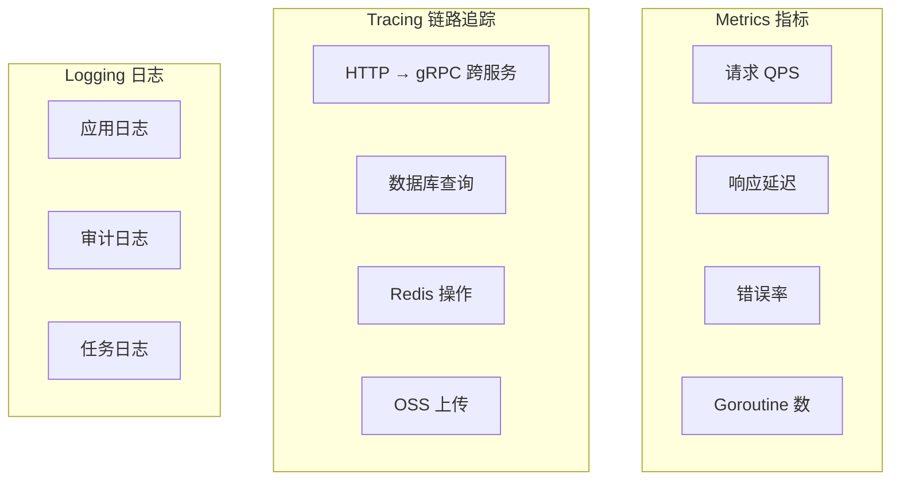
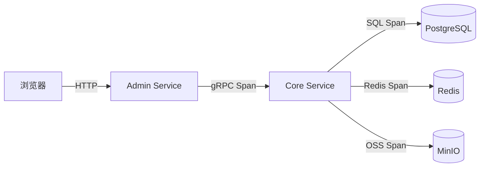
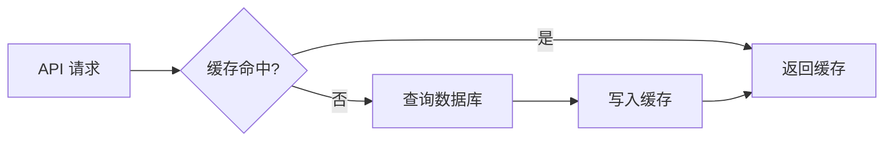

# 性能监控实战教程

GoWind CMS 集成了完整的可观测性体系，包括 Jaeger 链路追踪、Redis 缓存监控、数据库慢查询分析和应用性能指标采集。本教程讲解 CMS 三服务架构下的性能监控方案。

## 前置条件

- 已阅读 [CMS 后端架构总览](./backend-architecture.md)
- 本地已启动 Jaeger 服务

## 一、可观测性架构

### 1.1 三维监控



### 1.2 CMS 跨服务链路



## 二、Jaeger 链路追踪

### 2.1 配置

```yaml
# server.yaml
server:
  tracer:
    enabled: true
    provider: jaeger
    endpoint: "http://jaeger:14268/api/traces"
    sampler:
      type: const          # 全量采样（生产用 probabilistic）
      param: 1
```

### 2.2 跨服务 Trace 传递

```go
// Admin Service → Core Service 的 gRPC 调用会自动传递 Trace 上下文
// Kratos 框架内置 OpenTelemetry 中间件，自动注入/提取 Span

// 手动添加自定义 Span
func (s *PostService) Create(ctx context.Context, req *contentV1.CreatePostRequest) (*contentV1.Post, error) {
    ctx, span := tracer.Start(ctx, "PostService.Create")
    defer span.End()

    span.SetAttributes(
        attribute.String("post.title", req.Data.GetTitle()),
        attribute.Int("post.author_id", int(req.Data.GetCreatedBy())),
    )

    post, err := s.postRepo.Create(ctx, req)
    if err != nil {
        span.RecordError(err)
        return nil, err
    }

    span.SetAttributes(attribute.Int("post.id", int(post.GetId())))
    return post, nil
}
```

### 2.3 Jaeger UI 分析

访问 `http://localhost:16686`：

| 功能 | 说明 |
|------|------|
| Find Traces | 按服务/时间/标签搜索链路 |
| Compare | 对比两条链路 |
| Dependencies | 服务依赖图 |
| Service Map | 服务拓扑 |

### 2.4 慢请求分析

```go
// 为慢请求添加标记
func (r *PostRepo) List(ctx context.Context, req *paginationV1.PagingRequest) (*contentV1.ListPostResponse, error) {
    ctx, span := tracer.Start(ctx, "PostRepo.List")
    defer span.End()

    start := time.Now()

    // 查询
    result, err := r.query(ctx, req)

    duration := time.Since(start)
    span.SetAttributes(
        attribute.Int64("db.duration_ms", duration.Milliseconds()),
        attribute.Int("result.count", len(result.Items)),
    )

    // 慢查询标记
    if duration > 200*time.Millisecond {
        span.SetAttributes(attribute.Bool("db.slow_query", true))
        log.Warnf("慢查询: PostRepo.List 耗时 %v", duration)
    }

    return result, err
}
```

## 三、Redis 缓存监控

### 3.1 缓存策略



### 3.2 缓存实现

```go
// pkg/cache/cache.go
type Cache struct {
    client *redis.Client
    log    *log.Helper
}

func (c *Cache) GetOrSet(ctx context.Context, key string, ttl time.Duration, fn func() (interface{}, error)) (interface{}, error) {
    // 1. 尝试从缓存读取
    val, err := c.client.Get(ctx, key).Result()
    if err == nil {
        c.log.Debugf("缓存命中: %s", key)
        return val, nil
    }

    // 2. 缓存未命中，执行函数
    result, err := fn()
    if err != nil {
        return nil, err
    }

    // 3. 写入缓存
    data, _ := json.Marshal(result)
    c.client.Set(ctx, key, data, ttl)
    c.log.Debugf("缓存写入: %s, TTL=%v", key, ttl)

    return result, nil
}
```

### 3.3 缓存使用

```go
func (s *PostService) Get(ctx context.Context, req *contentV1.GetPostRequest) (*contentV1.Post, error) {
    cacheKey := fmt.Sprintf("post:detail:%d:%s", req.GetId(), req.GetLocale())

    return s.cache.GetOrSet(ctx, cacheKey, 10*time.Minute, func() (*contentV1.Post, error) {
        return s.postRepo.Get(ctx, req)
    })
}
```

### 3.4 缓存清理

内容更新时自动清除相关缓存：

```go
func (s *PostService) Update(ctx context.Context, req *contentV1.UpdatePostRequest) (*contentV1.Post, error) {
    post, err := s.postRepo.Update(ctx, req)
    if err != nil {
        return nil, err
    }

    // 清除详情缓存
    s.cache.Del(ctx, fmt.Sprintf("post:detail:%d", post.GetId()))
    // 清除列表缓存
    s.cache.DelPattern(ctx, "post:list:*")

    return post, nil
}
```

## 四、数据库优化

### 4.1 慢查询日志

```yaml
# PostgreSQL 配置 postgresql.conf
log_min_duration_statement = 200   # 200ms 以上记录
log_line_prefix = '%t [%p] %u@%d '
```

### 4.2 索引优化

```sql
-- 帖子常用查询索引
CREATE INDEX idx_posts_status_published_at ON posts (status, published_at DESC);
CREATE INDEX idx_posts_site_id ON posts (site_id);
CREATE INDEX idx_posts_slug ON posts (slug);
CREATE INDEX idx_posts_author_id ON posts (created_by);

-- 评论索引
CREATE INDEX idx_comments_post_id_status ON comments (post_id, status);
CREATE INDEX idx_comments_parent_id ON comments (parent_id);

-- 翻译索引
CREATE INDEX idx_post_translations_post_lang ON post_translations (post_id, language_code);
```

### 4.3 连接池配置

```yaml
# server.yaml
data:
  database:
    driver: postgres
    source: "host=postgres port=5432 ..."
    max_open_conns: 25          # 最大连接数
    max_idle_conns: 10          # 最大空闲连接
    conn_max_lifetime: 300s     # 连接最大生命周期
    conn_max_idle_time: 60s     # 空闲连接最大存活时间
```

## 五、性能指标

### 5.1 关键指标

| 指标 | 说明 | 告警阈值 |
|------|------|---------|
| HTTP QPS | 每秒请求数 | > 5000/s |
| HTTP P99 延迟 | 99 分位响应时间 | > 500ms |
| gRPC 延迟 | Core Service 调用耗时 | > 200ms |
| 数据库查询 | 慢查询比例 | > 5% |
| 缓存命中率 | Redis 缓存效率 | < 80% |
| 错误率 | HTTP 5xx 比例 | > 1% |
| Goroutine | 活跃协程数 | > 10000 |

### 5.2 应用指标采集

```go
// pkg/metrics/metrics.go
var (
    httpRequestDuration = prometheus.NewHistogramVec(
        prometheus.HistogramOpts{
            Name: "http_request_duration_seconds",
            Help: "HTTP request duration",
        },
        []string{"method", "path", "status"},
    )

    grpcRequestDuration = prometheus.NewHistogramVec(
        prometheus.HistogramOpts{
            Name: "grpc_request_duration_seconds",
            Help: "gRPC request duration",
        },
        []string{"service", "method"},
    )

    cacheHitRate = prometheus.NewGaugeVec(
        prometheus.GaugeOpts{
            Name: "cache_hit_rate",
            Help: "Cache hit rate",
        },
        []string{"cache_type"},
    )
)
```

## 六、压力测试

### 6.1 使用 wrk

```bash
# 测试前台 API
wrk -t4 -c100 -d30s http://localhost:6700/app/v1/posts

# 带认证的测试
wrk -t4 -c100 -d30s -H "Authorization: Bearer xxx" http://localhost:6600/admin/v1/posts
```

### 6.2 使用 Vegeta

```bash
# 持续 60 秒压力测试
echo "GET http://localhost:6700/app/v1/posts" | vegeta attack -duration=60s -rate=100 | vegeta report

# 输出报告
vegeta report -type=json results.bin | jq
```

## 七、性能优化清单

| 优化项 | 方法 | 预期收益 |
|--------|------|---------|
| 数据库索引 | 分析慢查询添加索引 | 50-90% |
| Redis 缓存 | 热点数据缓存 | 70-95% |
| 连接池 | 合理配置 | 20% |
| N+1 查询 | Ent 预加载 | 50-80% |
| 分页优化 | 游标分页 | 大数据量显著 |
| CDN 静态资源 | 图片/JS/CSS | 前端 80% |
| Gzip 压缩 | HTTP 响应压缩 | 带宽 70% |

## 八、检查清单

| 检查项 | 说明 |
|--------|------|
| Jaeger 集成 | 链路追踪配置 |
| Redis 缓存 | 热点数据缓存 |
| 数据库索引 | 慢查询分析 |
| 连接池配置 | 合理的连接数 |
| 性能指标 | Prometheus 采集 |
| 压力测试 | wrk / Vegeta |
| 慢查询监控 | PostgreSQL 日志 |

## 相关文档

- [CMS 后端架构总览](./backend-architecture.md)
- [配置与部署指南](./backend-config-deploy.md)
- [三服务部署实战](./tutorial-deploy.md)
- [GoWind Admin 性能监控教程](/admin/tutorial-performance-monitoring.md)
