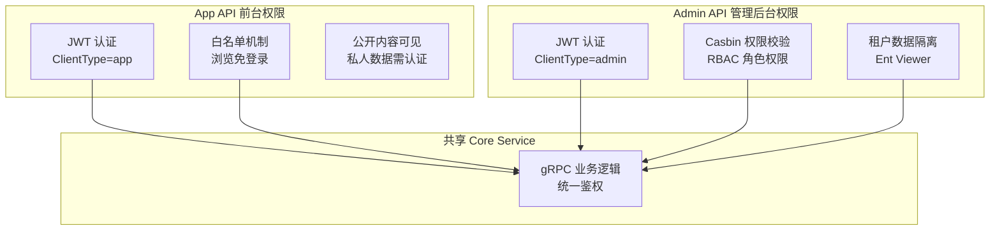
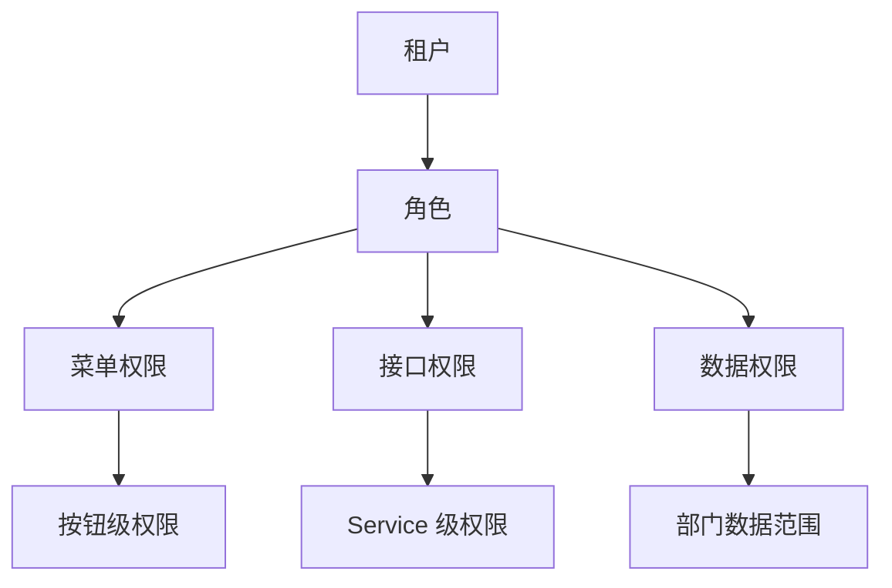
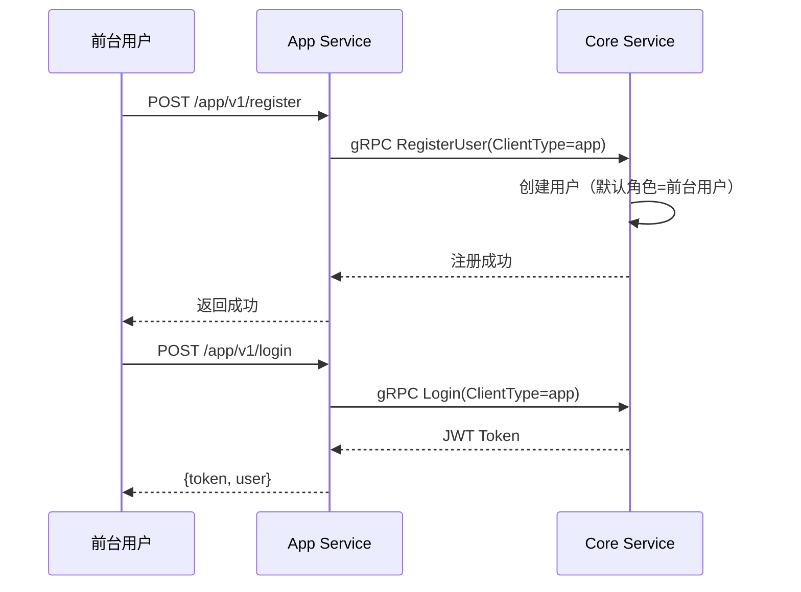

# 权限系统实战教程

GoWind CMS 与 GoWind Admin 共享相同的技术基座（Casbin + JWT），但在权限模型上因 Headless 双 API 的特性有独特设计。本教程深入讲解 CMS 的前后台双权限模型、认证白名单、数据隔离和前端权限控制。

## 前置条件

- 已阅读 [CMS 后端架构总览](./backend-architecture.md)
- 建议先阅读 [GoWind Admin 权限系统深度解析](/admin/tutorial-permission-system.md)

## 一、CMS 权限架构

### 1.1 双 API 权限对比



### 1.2 CMS vs Admin 权限差异

| 对比项 | GoWind Admin | GoWind CMS |
|--------|-------------|------------|
| API 层级 | 单一 Admin API | Admin API + App API 双层 |
| 用户类型 | 管理员 | 管理员 + 前台用户 |
| 认证白名单 | 仅登录接口 | 登录 + 内容浏览接口 |
| 权限模型 | RBAC | RBAC（管理端）+ 白名单（前台） |
| Token 类型 | admin | admin + app |
| 数据隔离 | 租户隔离 | 租户隔离 + 公开/私有分层 |

## 二、认证体系

### 2.1 双 Token 机制

```go
// authentication/service/v1/types.proto
enum ClientType {
  CLIENT_TYPE_UNSPECIFIED = 0;
  CLIENT_TYPE_ADMIN = 1;   // 管理后台
  CLIENT_TYPE_APP = 2;     // 前台应用
}
```

JWT Token 中包含 `clientType` 字段，区分令牌来源：

```json
{
  "user_id": 1,
  "tenant_id": 1,
  "roles": ["admin"],
  "client_type": "admin",
  "exp": 1735689600
}
```

### 2.2 登录认证流程

**管理后台登录**：

```http
POST /admin/v1/login
{
  "username": "admin",
  "password": "xxx",
  "clientType": 1
}
```

**前台应用登录**：

```http
POST /app/v1/login
{
  "username": "user@example.com",
  "password": "xxx"
}
# 后端自动设置 clientType=2
```

### 2.3 Token 校验中间件

```go
// pkg/middleware/auth.go
func Auth() middleware.Middleware {
    return func(handler middleware.Handler) middleware.Handler {
        return func(ctx context.Context, req interface{}) (interface{}, error) {
            if header, ok := transport.FromServerContext(ctx); ok {
                token := header.RequestHeader().Get("Authorization")
                token = strings.TrimPrefix(token, "Bearer ")

                claims, err := jwt.ParseToken(token)
                if err != nil {
                    return nil, errors.Unauthorized("TOKEN_INVALID", "token无效")
                }

                // 注入用户信息到 context
                ctx = context.WithValue(ctx, UserIDKey{}, claims.UserID)
                ctx = context.WithValue(ctx, TenantIDKey{}, claims.TenantID)
                ctx = context.WithValue(ctx, ClientTypeKey{}, claims.ClientType)
            }
            return handler(ctx, req)
        }
    }
}
```

## 三、白名单机制

### 3.1 Admin Service 白名单

Admin API 严格控制，仅登录接口免认证：

```go
// app/admin/service/internal/server/rest_server.go
rpc.AddWhiteList(
    adminV1.OperationAuthenticationServiceLogin,  // 只有登录接口免认证
)
```

### 3.2 App Service 白名单

App API 白名单宽松，所有浏览类接口免认证：

```go
// app/app/service/internal/server/rest_server.go
rpc.AddWhiteList(
    // 认证接口
    appV1.OperationAuthenticationServiceLogin,

    // 内容浏览（免登录，利于 SEO）
    appV1.OperationPostServiceList,
    appV1.OperationPostServiceGet,
    appV1.OperationCategoryServiceList,
    appV1.OperationCategoryServiceGet,
    appV1.OperationTagServiceList,
    appV1.OperationTagServiceGet,
    appV1.OperationPageServiceList,
    appV1.OperationPageServiceGet,
    appV1.OperationCommentServiceList,
    appV1.OperationCommentServiceGet,
    appV1.OperationNavigationServiceList,
)
```

### 3.3 自定义白名单扩展

新增前台接口时需要添加白名单：

```go
// 新增视频接口（免登录浏览）
rpc.AddWhiteList(
    appV1.OperationVideoServiceList,
    appV1.OperationVideoServiceGet,
)
```

## 四、RBAC 权限模型

### 4.1 权限层次



### 4.2 Casbin 策略

CMS 使用 Casbin RBAC 模型，与 Admin 完全一致：

```ini
# model.conf
[request_definition]
r = sub, obj, act

[policy_definition]
p = sub, obj, act

[role_definition]
g = _, _

[policy_effect]
e = some(where, p.eft == allow)

[matchers]
m = g(r.sub, p.sub) && keyMatch2(r.obj, p.obj) && (r.act == p.act || p.act == "*")
```

### 4.3 管理后台权限校验

```go
// app/admin/service/internal/server/rest_server.go
func NewRestServer(..., authorizer *authorizer.CasbinAuthorizer) *http.Server {
    srv := http.NewServer(...)

    // 中间件链
    srv.Use(
        middleware.Logging(),
        middleware.Audit(),
        authMiddleware,       // JWT 认证（跳过白名单）
        authzMiddleware(authorizer),  // Casbin 权限校验
    )

    return srv
}
```

## 五、数据权限

### 5.1 租户数据隔离

通过 Ent Viewer 机制自动注入租户过滤：

```go
// pkg/middleware/ent_viewer.go
func EntViewer() middleware.Middleware {
    return func(handler middleware.Handler) middleware.Handler {
        return func(ctx context.Context, req interface{}) (interface{}, error) {
            tenantId := ctx.Value(TenantIDKey{}).(uint32)

            // 注入租户上下文，Ent 会自动过滤
            ctx = context.WithValue(ctx, entgo.TenantKey{}, tenantId)
            return handler(ctx, req)
        }
    }
}
```

### 5.2 部门数据范围

```go
// 数据权限范围
enum DataScope {
  DATA_SCOPE_ALL = 0;        // 全部数据
  DATA_SCOPE_DEPT = 1;       // 本部门
  DATA_SCOPE_DEPT_AND_SUB = 2; // 本部门及子部门
  DATA_SCOPE_SELF = 3;       // 仅本人
}
```

## 六、前端权限控制

### 6.1 路由守卫

管理后台（Vben Admin）路由级权限：

```typescript
// frontend/admin/apps/admin/src/router/guard.ts
async function registerAccessGuard(router) {
  router.beforeEach(async (to, from, next) => {
    // 白名单路由
    if (WHITE_LIST.includes(to.path)) {
      next();
      return;
    }

    const token = getToken();
    if (!token) {
      next({ path: '/auth/login' });
      return;
    }

    // 检查路由权限
    const { hasAccessByRoles } = useAccess();
    if (!hasAccessByRoles(to.meta.authority)) {
      next({ path: '/403' });
      return;
    }

    next();
  });
}
```

### 6.2 按钮级权限

```vue
<template>
  <!-- 有删除权限才显示按钮 -->
  <AccessControl :access="['post:delete']">
    <Button danger @click="handleDelete">删除</Button>
  </AccessControl>
</template>
```

### 6.3 菜单权限

菜单根据用户角色动态渲染：

```typescript
// 根据权限过滤菜单
function filterMenusByPermission(menus: Menu[], permissions: string[]): Menu[] {
  return menus.filter((menu) => {
    if (menu.children) {
      menu.children = filterMenusByPermission(menu.children, permissions);
    }
    return !menu.permission || permissions.includes(menu.permission);
  });
}
```

## 七、前台用户权限

### 7.1 前台 vs 后台用户

| 对比项 | 管理后台用户 | 前台用户 |
|--------|------------|---------|
| 登录入口 | `/admin/v1/login` | `/app/v1/login` |
| Token 类型 | `admin` | `app` |
| 权限模型 | Casbin RBAC | 角色简化（普通用户/VIP） |
| 可操作接口 | 全部管理接口 | 评论、发帖、上传文件 |

### 7.2 前台用户注册流程



## 八、检查清单

| 检查项 | 说明 |
|--------|------|
| 双 Token 机制 | admin / app Token 区分 |
| Admin API 白名单 | 仅登录接口 |
| App API 白名单 | 浏览类接口免登录 |
| Casbin 权限配置 | RBAC 模型 + 策略 |
| 租户数据隔离 | Ent Viewer 自动过滤 |
| 前端路由守卫 | 登录态 + 权限检查 |
| 按钮级权限 | AccessControl 组件 |
| 前台用户注册 | App Service 注册接口 |

## 相关文档

- [CMS 后端架构总览](./backend-architecture.md)
- [GoWind Admin 权限系统深度解析](/admin/tutorial-permission-system.md)
- [GoWind Admin 登录安全教程](/admin/tutorial-login-security.md)
- [Headless API 对接多端实战](./tutorial-headless-api.md)
