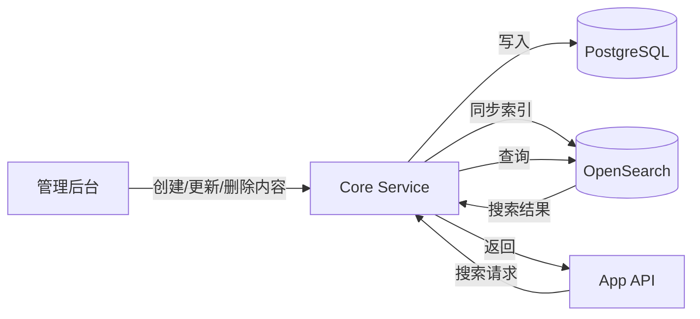

# 全文搜索实战教程

GoWind CMS 集成 OpenSearch 搜索引擎，为内容平台提供高性能的全文检索能力。本教程讲解搜索架构设计、索引管理、搜索 API 和前端搜索功能的实现。

## 前置条件

- 已阅读 [CMS 后端架构总览](./backend-architecture.md)
- 本地已启动 OpenSearch 服务（默认端口 9200）

## 一、搜索架构

### 1.1 为什么需要全文搜索

| 场景 | 数据库 LIKE 查询 | OpenSearch 全文搜索 |
|------|-----------------|-------------------|
| 关键词搜索 | 慢（全表扫描） | 快（倒排索引） |
| 中文分词 | 不支持 | 支持（IK 分词器） |
| 相关度排序 | 不支持 | TF-IDF / BM25 |
| 模糊匹配 | 仅 LIKE %keyword% | 支持拼写纠错 |
| 高亮显示 | 不支持 | 支持搜索结果高亮 |
| 聚合统计 | 慢 | 快（Aggregation） |

### 1.2 搜索架构



### 1.3 索引设计

| 索引 | 文档类型 | 说明 |
|------|---------|------|
| `cms_posts` | Post | 帖子全文索引 |
| `cms_pages` | Page | 页面索引 |
| `cms_categories` | Category | 分类索引 |
| `cms_tags` | Tag | 标签索引 |

## 二、索引映射

### 2.1 Post 索引映射

```json
{
  "mappings": {
    "properties": {
      "id": { "type": "integer" },
      "title": {
        "type": "text",
        "analyzer": "ik_max_word",
        "search_analyzer": "ik_smart"
      },
      "summary": {
        "type": "text",
        "analyzer": "ik_max_word"
      },
      "content": {
        "type": "text",
        "analyzer": "ik_max_word"
      },
      "slug": { "type": "keyword" },
      "status": { "type": "integer" },
      "categories": {
        "properties": {
          "id": { "type": "integer" },
          "name": { "type": "keyword" }
        }
      },
      "tags": {
        "properties": {
          "id": { "type": "integer" },
          "name": { "type": "keyword" }
        }
      },
      "author": { "type": "keyword" },
      "language_code": { "type": "keyword" },
      "created_at": { "type": "date" },
      "updated_at": { "type": "date" }
    }
  },
  "settings": {
    "analysis": {
      "analyzer": {
        "ik_max_word": { "type": "ik_max_word" },
        "ik_smart": { "type": "ik_smart" }
      }
    }
  }
}
```

### 2.2 中文分词配置

OpenSearch 需安装 IK Analysis 插件支持中文分词：

```shell
# 安装 IK 分词器插件
./bin/opensearch-plugin install https://github.com/medcl/elasticsearch-analysis-ik/releases/download/v2.12.0/elasticsearch-analysis-ik-2.12.0.zip

# 重启 OpenSearch
docker-compose restart opensearch
```

## 三、索引同步

### 3.1 实时同步

内容变更时自动同步到 OpenSearch：

```go
// app/core/service/internal/service/post_service.go
func (s *PostService) Create(ctx context.Context, req *contentV1.CreatePostRequest) (*contentV1.Post, error) {
    // 1. 写入数据库
    post, err := s.postRepo.Create(ctx, req)
    if err != nil {
        return nil, err
    }

    // 2. 同步到 OpenSearch（异步任务）
    s.task.Enqueue(ctx, task.TypeIndexPost, &task.IndexPostPayload{
        PostId: post.Id,
        Action: "create",
    })

    return post, nil
}

func (s *PostService) Update(ctx context.Context, req *contentV1.UpdatePostRequest) (*contentV1.Post, error) {
    post, err := s.postRepo.Update(ctx, req)
    if err != nil {
        return nil, err
    }

    // 同步更新索引
    s.task.Enqueue(ctx, task.TypeIndexPost, &task.IndexPostPayload{
        PostId: post.Id,
        Action: "update",
    })

    return post, nil
}

func (s *PostService) Delete(ctx context.Context, req *contentV1.DeletePostRequest) (*emptypb.Empty, error) {
    if err := s.postRepo.Delete(ctx, req); err != nil {
        return nil, err
    }

    // 删除索引
    s.task.Enqueue(ctx, task.TypeIndexPost, &task.IndexPostPayload{
        PostId: req.GetId(),
        Action: "delete",
    })

    return &emptypb.Empty{}, nil
}
```

### 3.2 索引任务处理器

```go
// app/core/service/internal/server/asynq_server.go
func HandleIndexPost(ctx context.Context, t *asynq.Task) error {
    var payload task.IndexPostPayload
    if err := json.Unmarshal(t.Payload(), &payload); err != nil {
        return err
    }

    switch payload.Action {
    case "create", "update":
        // 从数据库获取最新数据
        post, err := postRepo.Get(ctx, payload.PostId)
        if err != nil {
            return err
        }
        // 索引到 OpenSearch
        return searchClient.Index(ctx, "cms_posts", post)

    case "delete":
        // 从 OpenSearch 删除
        return searchClient.Delete(ctx, "cms_posts", fmt.Sprint(payload.PostId))
    }

    return nil
}
```

### 3.3 全量重建索引

```go
func (s *PostService) RebuildIndex(ctx context.Context) error {
    // 1. 删除旧索引
    s.searchClient.DeleteIndex(ctx, "cms_posts")

    // 2. 创建新索引
    s.searchClient.CreateIndex(ctx, "cms_posts", postMapping)

    // 3. 分批导入数据
    pageSize := 100
    page := 1
    for {
        posts, err := s.postRepo.List(ctx, &pagination.PagingRequest{
            Page: uint32(page), PageSize: uint32(pageSize),
        })
        if err != nil {
            return err
        }

        // 批量索引
        s.searchClient.BulkIndex(ctx, "cms_posts", posts.Items)

        if len(posts.Items) < pageSize {
            break
        }
        page++
    }

    return nil
}
```

## 四、搜索 API

### 4.1 App API 搜索接口

前台搜索通过 Post List 接口的 `search` 参数实现：

```http
GET /app/v1/posts?search=GoWind&locale=zh-CN&page=1&pageSize=10
```

### 4.2 高级搜索接口

可扩展自定义搜索接口：

```protobuf
// app/service/v1/i_search.proto
service SearchService {
  rpc Search(SearchRequest) returns (SearchResponse) {
    option (google.api.http) = { get: "/app/v1/search" };
  }
}

message SearchRequest {
  string query = 1;                          // 搜索关键词
  optional string locale = 2;                // 语言
  optional uint32 category_id = 3;           // 分类过滤
  repeated string tag_names = 4;             // 标签过滤
  optional int32 page = 10;
  optional int32 page_size = 11;
  optional string sort_by = 12;              // 排序：relevance / date
}

message SearchResponse {
  repeated SearchHit hits = 1;
  uint64 total = 2;
  optional uint64 took_ms = 3;               // 耗时（毫秒）
}

message SearchHit {
  string type = 1;                           // 结果类型：post / page
  uint32 id = 2;
  string title = 3;
  string summary = 4;
  string url = 5;
  optional string highlight = 6;             // 高亮片段
  optional float score = 7;                  // 相关度分数
}
```

### 4.3 搜索查询实现

```go
// app/core/service/internal/service/search_service.go
func (s *SearchService) Search(ctx context.Context, req *searchV1.SearchRequest) (*searchV1.SearchResponse, error) {
    query := opensearch.NewBoolQuery()

    // 全文搜索
    if req.GetQuery() != "" {
        multiMatch := opensearch.NewMultiMatchQuery(req.GetQuery()).
            Field("title", 3).      // 标题权重 3
            Field("summary", 2).    // 摘要权重 2
            Field("content", 1).    // 正文权重 1
            Type("best_fields").
            Analyzer("ik_smart")
        query.Must(multiMatch)
    }

    // 语言过滤
    if locale := req.GetLocale(); locale != "" {
        query.Filter(opensearch.NewTermQuery("language_code", locale))
    }

    // 分类过滤
    if categoryId := req.GetCategoryId(); categoryId > 0 {
        query.Filter(opensearch.NewTermQuery("categories.id", categoryId))
    }

    // 标签过滤
    for _, tagName := range req.GetTagNames() {
        query.Filter(opensearch.NewTermQuery("tags.name", tagName))
    }

    // 只搜索已发布内容
    query.Filter(opensearch.NewTermQuery("status", 1))

    // 构建搜索请求
    searchSource := opensearch.NewSearchSource().
        Query(query).
        From(int((req.GetPage() - 1) * req.GetPageSize())).
        Size(int(req.GetPageSize())).
        Highlight(opensearch.NewHighlight().
            Field("title").
            Field("summary").
            PreTags("<em>").
            PostTags("</em>"))

    // 排序
    if req.GetSortBy() == "date" {
        searchSource.Sort("created_at", false)
    } else {
        searchSource.Sort("_score", false)
    }

    // 执行搜索
    result, err := s.searchClient.Search(ctx, "cms_posts", searchSource)
    if err != nil {
        return nil, err
    }

    // 构建响应
    hits := make([]*searchV1.SearchHit, len(result.Hits))
    for i, hit := range result.Hits {
        hits[i] = &searchV1.SearchHit{
            Type:      "post",
            Id:        hit.Source.Id,
            Title:     hit.Source.Title,
            Summary:   hit.Source.Summary,
            Url:       fmt.Sprintf("/posts/%s", hit.Source.Slug),
            Highlight: hit.Highlight["title"],
            Score:     hit.Score,
        }
    }

    return &searchV1.SearchResponse{
        Hits:   hits,
        Total:  result.Total,
        TookMs: result.Took,
    }, nil
}
```

## 五、前端搜索

### 5.1 React 搜索组件

```tsx
// src/components/search/SearchBar.tsx
'use client';

import { useState, useRef, useEffect } from 'react';
import { useRouter } from 'next/navigation';

export function SearchBar({ locale }: { locale: string }) {
  const [query, setQuery] = useState('');
  const [suggestions, setSuggestions] = useState([]);
  const [isOpen, setIsOpen] = useState(false);
  const router = useRouter();
  const debounceRef = useRef<NodeJS.Timeout>();

  // 防抖搜索建议
  useEffect(() => {
    if (!query.trim() || query.length < 2) {
      setSuggestions([]);
      return;
    }

    debounceRef.current = setTimeout(async () => {
      const res = await fetch(`/api/search?q=${encodeURIComponent(query)}&locale=${locale}&pageSize=5`);
      const data = await res.json();
      setSuggestions(data.hits || []);
      setIsOpen(true);
    }, 300);

    return () => clearTimeout(debounceRef.current);
  }, [query, locale]);

  const handleSubmit = (e: React.FormEvent) => {
    e.preventDefault();
    if (query.trim()) {
      router.push(`/${locale}/search?q=${encodeURIComponent(query)}`);
      setIsOpen(false);
    }
  };

  return (
    <div className="relative">
      <form onSubmit={handleSubmit}>
        <input
          type="search"
          value={query}
          onChange={(e) => setQuery(e.target.value)}
          placeholder="搜索文章..."
          className="w-full px-4 py-2 border rounded"
          onFocus={() => suggestions.length > 0 && setIsOpen(true)}
          onBlur={() => setTimeout(() => setIsOpen(false), 200)}
        />
      </form>

      {/* 搜索建议下拉 */}
      {isOpen && suggestions.length > 0 && (
        <div className="absolute top-full left-0 right-0 mt-1 bg-white border rounded shadow-lg z-50">
          {suggestions.map((hit) => (
            <a
              key={hit.id}
              href={hit.url}
              className="block px-4 py-2 hover:bg-gray-100"
            >
              <div dangerouslySetInnerHTML={{ __html: hit.highlight || hit.title }} />
              <p className="text-sm text-gray-500">{hit.summary}</p>
            </a>
          ))}
        </div>
      )}
    </div>
  );
}
```

### 5.2 搜索结果页

```tsx
// src/app/[locale]/search/page.tsx
export default async function SearchPage({
  params: { locale },
  searchParams: { q, page = '1' },
}: {
  params: { locale: string };
  searchParams: { q: string; page?: string };
}) {
  const results = await fetch(
    `${API_BASE}/search?query=${encodeURIComponent(q)}&locale=${locale}&page=${page}&pageSize=10`,
  ).then((res) => res.json());

  return (
    <div className="container mx-auto px-4 py-8">
      <h1 className="text-2xl font-bold mb-2">搜索结果</h1>
      <p className="text-gray-500 mb-6">找到约 {results.total} 条「{q}」相关结果</p>

      <div className="space-y-6">
        {results.hits.map((hit) => (
          <article key={hit.id} className="border-b pb-4">
            <a href={hit.url}>
              <h2
                className="text-xl font-semibold hover:text-blue-600"
                dangerouslySetInnerHTML={{ __html: hit.highlight || hit.title }}
              />
              <p className="text-gray-600 mt-1">{hit.summary}</p>
            </a>
          </article>
        ))}
      </div>

      <Pagination
        current={Number(page)}
        total={results.total}
        pageSize={10}
      />
    </div>
  );
}
```

## 六、搜索优化

### 6.1 搜索权重调优

```go
// 标题匹配权重最高，摘要次之，正文最低
multiMatch := opensearch.NewMultiMatchQuery(query).
    Field("title^3").        // 权重 3
    Field("title.prefix^2"). // 前缀匹配权重 2
    Field("summary^2").
    Field("content^1").
    Type("best_fields").
    TieBreaker(0.3)
```

### 6.2 同义词配置

```json
{
  "settings": {
    "analysis": {
      "filter": {
        "synonym_filter": {
          "type": "synonym",
          "synonyms": [
            "GoWind,gowind,go-wind",
            "CMS,content management system,内容管理系统",
            "前端,frontend,front-end"
          ]
        }
      },
      "analyzer": {
        "synonym_analyzer": {
          "tokenizer": "ik_max_word",
          "filter": ["synonym_filter", "lowercase"]
        }
      }
    }
  }
}
```

## 七、检查清单

| 检查项 | 说明 |
|--------|------|
| OpenSearch 服务 | Docker Compose 启动 |
| IK 分词器 | 安装中文分词插件 |
| 索引映射 | 字段 + 分词器配置 |
| 索引同步 | 实时异步任务同步 |
| 全量重建 | 批量导入功能 |
| 搜索 API | 高级搜索接口 |
| 前端搜索 | 搜索栏 + 结果页 + 高亮 |
| 搜索优化 | 权重 + 同义词 |

## 相关文档

- [CMS 后端架构总览](./backend-architecture.md)
- [任务调度实战](./tutorial-task-scheduling.md)
- [Headless API 对接多端实战](./tutorial-headless-api.md)
- [前台应用开发实战](./tutorial-frontend-app.md)
