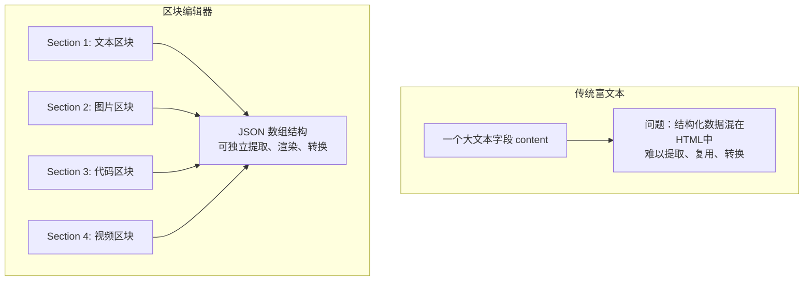

# 区块编辑器实战教程

GoWind CMS 独创了基于 SectionType 的区块化内容编辑器，允许内容编辑人员像搭积木一样构建富文本内容。每个区块有独立的类型和配置，支持文本、图片、视频、代码块、轮播等多种区块类型。本教程讲解区块编辑器的架构、数据模型和前后端实现。

## 前置条件

- 已阅读 [CMS 前端架构](./frontend-architecture.md)
- 了解 TipTap / 富文本编辑器基本概念

## 一、区块编辑器架构

### 1.1 传统富文本 vs 区块编辑器



| 对比项 | 传统富文本 | 区块编辑器 |
|--------|----------|-----------|
| 数据结构 | HTML 字符串 | JSON 区块数组 |
| 结构化数据 | 难以提取 | 可按区块类型提取 |
| 扩展性 | 依赖编辑器插件 | 可自定义区块类型 |
| 多端渲染 | 需解析 HTML | 各端独立渲染区块 |
| 数据迁移 | 困难 | 区块级别迁移 |

### 1.2 区块类型

| 区块类型 | SectionType | 说明 |
|---------|-------------|------|
| 文本段落 | `SECTION_TYPE_TEXT` | 富文本段落（支持 Markdown） |
| 标题 | `SECTION_TYPE_HEADING` | H1-H6 标题 |
| 图片 | `SECTION_TYPE_IMAGE` | 单张/多张图片 |
| 代码块 | `SECTION_TYPE_CODE` | 代码高亮 |
| 视频 | `SECTION_TYPE_VIDEO` | 视频嵌入 |
| 引用 | `SECTION_TYPE_QUOTE` | 引用文本 |
| 分隔线 | `SECTION_TYPE_DIVIDER` | 水平分隔线 |
| 列表 | `SECTION_TYPE_LIST` | 有序/无序列表 |
| 表格 | `SECTION_TYPE_TABLE` | 数据表格 |
| 轮播 | `SECTION_TYPE_CAROUSEL` | 图片轮播 |
| 按钮 | `SECTION_TYPE_BUTTON` | CTA 按钮 |
| 嵌入 | `SECTION_TYPE_EMBED` | 第三方嵌入（YouTube/Twitter） |

## 二、数据模型

### 2.1 Section 消息定义

```protobuf
// content/service/v1/section.proto

message Section {
  optional string id = 1;              // 区块 UUID
  optional SectionType type = 2;       // 区块类型
  optional uint32 sort_order = 3 [json_name = "sortOrder"];  // 排序
  optional SectionData data = 4;       // 区块数据
}

enum SectionType {
  SECTION_TYPE_UNSPECIFIED = 0;
  SECTION_TYPE_HEADING = 1;
  SECTION_TYPE_TEXT = 2;
  SECTION_TYPE_IMAGE = 3;
  SECTION_TYPE_CODE = 4;
  SECTION_TYPE_VIDEO = 5;
  SECTION_TYPE_QUOTE = 6;
  SECTION_TYPE_DIVIDER = 7;
  SECTION_TYPE_LIST = 8;
  SECTION_TYPE_TABLE = 9;
  SECTION_TYPE_CAROUSEL = 10;
  SECTION_TYPE_BUTTON = 11;
  SECTION_TYPE_EMBED = 12;
}

message SectionData {
  oneof data {
    HeadingData heading = 1;
    TextData text = 2;
    ImageData image = 3;
    CodeData code = 4;
    VideoData video = 5;
    QuoteData quote = 6;
    ListData list = 8;
    TableData table = 9;
    CarouselData carousel = 10;
    ButtonData button = 11;
    EmbedData embed = 12;
  }
}

message HeadingData {
  optional uint32 level = 1;     // 1-6
  optional string text = 2;
}

message TextData {
  optional string content = 1;   // Markdown 或 HTML
}

message ImageData {
  optional string url = 1;
  optional string alt = 2;
  optional string caption = 3;
  optional uint32 width = 4;
  optional uint32 height = 5;
}

message CodeData {
  optional string language = 1;  // go, javascript, python...
  optional string code = 2;
  optional bool show_line_numbers = 3 [json_name = "showLineNumbers"];
}

message VideoData {
  optional string url = 1;
  optional string poster = 2;    // 封面图
  optional uint32 duration = 3;
}
```

### 2.2 Post 中的区块

```protobuf
// content/service/v1/post.proto
message Post {
  // ...
  // 内容以区块数组存储
  repeated Section sections = 14 [json_name = "sections"];

  // 兼容字段：纯文本摘要（从区块自动生成）
  optional string summary = 15;
}
```

### 2.3 存储格式

```json
{
  "id": 42,
  "title": "GoWind 架构解析",
  "sections": [
    {
      "id": "sec-001",
      "type": "SECTION_TYPE_HEADING",
      "sortOrder": 1,
      "data": {
        "heading": { "level": 2, "text": "架构概述" }
      }
    },
    {
      "id": "sec-002",
      "type": "SECTION_TYPE_TEXT",
      "sortOrder": 2,
      "data": {
        "text": { "content": "GoWind CMS 采用三服务架构..." }
      }
    },
    {
      "id": "sec-003",
      "type": "SECTION_TYPE_CODE",
      "sortOrder": 3,
      "data": {
        "code": {
          "language": "go",
          "code": "func main() {\n    fmt.Println(\"Hello\")\n}",
          "showLineNumbers": true
        }
      }
    },
    {
      "id": "sec-004",
      "type": "SECTION_TYPE_IMAGE",
      "sortOrder": 4,
      "data": {
        "image": {
          "url": "https://oss.example.com/architecture.png",
          "alt": "架构图",
          "caption": "图1：CMS 三服务架构"
        }
      }
    }
  ]
}
```

## 三、管理后台编辑器

### 3.1 基于 TipTap 的区块编辑器

```vue
<!-- components/editor/SectionEditor.vue -->
<script setup lang="ts">
import { useEditor, EditorContent } from '@tiptap/vue-3';
import StarterKit from '@tiptap/starter-kit';
import Image from '@tiptap/extension-image';
import CodeBlockLowlight from '@tiptap/extension-code-block-lowlight';

const props = defineProps<{ modelValue: Section[] }>();
const emit = defineEmits<{ 'update:modelValue': [value: Section[]] }>();

const sections = ref<Section[]>(props.modelValue || []);

// TipTap 编辑器配置
const editor = useEditor({
  extensions: [StarterKit, Image, CodeBlockLowlight],
  content: sectionsToHTML(sections.value),
  onUpdate: ({ editor }) => {
    // 将 TipTap JSON 转换为 Section 数组
    sections.value = htmlToSections(editor.getHTML());
    emit('update:modelValue', sections.value);
  },
});

// 监听外部数据变化
watch(() => props.modelValue, (val) => {
  if (val && JSON.stringify(val) !== JSON.stringify(sections.value)) {
    sections.value = val;
    editor.value?.commands.setContent(sectionsToHTML(val));
  }
});

// 添加区块
const addSection = (type: SectionType) => {
  const newSection: Section = {
    id: generateUUID(),
    type,
    sortOrder: sections.value.length + 1,
    data: createDefaultData(type),
  };
  sections.value.push(newSection);
  emit('update:modelValue', sections.value);
};

const moveSection = (index: number, direction: 'up' | 'down') => {
  const targetIndex = direction === 'up' ? index - 1 : index + 1;
  if (targetIndex < 0 || targetIndex >= sections.value.length) return;
  [sections.value[index], sections.value[targetIndex]] =
    [sections.value[targetIndex], sections.value[index]];
  // 重新排序
  sections.value.forEach((s, i) => (s.sortOrder = i + 1));
  emit('update:modelValue', sections.value);
};

const deleteSection = (id: string) => {
  sections.value = sections.value.filter((s) => s.id !== id);
  emit('update:modelValue', sections.value);
};

// 工具栏可用的区块类型
const sectionTypes = [
  { type: 1, label: '标题', icon: 'HeadingOutlined' },
  { type: 2, label: '文本', icon: 'FontSizeOutlined' },
  { type: 3, label: '图片', icon: 'PictureOutlined' },
  { type: 4, label: '代码', icon: 'CodeOutlined' },
  { type: 5, label: '视频', icon: 'VideoCameraOutlined' },
  { type: 6, label: '引用', icon: 'MessageOutlined' },
  { type: 9, label: '表格', icon: 'TableOutlined' },
  { type: 11, label: '按钮', icon: 'LinkOutlined' },
];
</script>

<template>
  <div class="section-editor">
    <!-- 工具栏 -->
    <div class="toolbar">
      <Tooltip v-for="st in sectionTypes" :key="st.type" :title="st.label">
        <Button @click="addSection(st.type)">
          <component :is="st.icon" />
        </Button>
      </Tooltip>
    </div>

    <!-- 区块列表（可拖拽排序） -->
    <draggable
      v-model="sections"
      item-key="id"
      handle=".drag-handle"
      @end="$emit('update:modelValue', sections)"
    >
      <template #item="{ element, index }">
        <div class="section-item">
          <div class="drag-handle">⋮⋮</div>
          <SectionRenderer
            :section="element"
            @update="(data) => element.data = data"
          />
          <div class="section-actions">
            <Button size="small" @click="moveSection(index, 'up')">上移</Button>
            <Button size="small" @click="moveSection(index, 'down')">下移</Button>
            <Button size="small" danger @click="deleteSection(element.id)">删除</Button>
          </div>
        </div>
      </template>
    </draggable>

    <!-- 空状态 -->
    <div v-if="sections.length === 0" class="empty-state">
      <p>点击上方工具栏按钮添加内容区块</p>
    </div>
  </div>
</template>
```

### 3.2 区块渲染组件

```vue
<!-- components/editor/SectionRenderer.vue -->
<script setup lang="ts">
const props = defineProps<{ section: Section }>();
const emit = defineEmits<{ update: [data: SectionData] }>();

const isEditing = ref(false);
</script>

<template>
  <div class="section-renderer" @dblclick="isEditing = true">
    <!-- 标题区块 -->
    <component
      :is="`h${section.data.heading?.level || 2}`"
      v-if="section.type === 1"
    >
      <EditableText
        v-model="section.data.heading.text"
        :editing="isEditing"
        @blur="emit('update', section.data)"
      />
    </component>

    <!-- 文本区块 -->
    <div v-else-if="section.type === 2" class="text-section">
      <TipTapEditor
        v-model="section.data.text.content"
        :editing="isEditing"
        @blur="emit('update', section.data)"
      />
    </div>

    <!-- 图片区块 -->
    <div v-else-if="section.type === 3" class="image-section">
      <MediaPicker
        v-if="isEditing"
        v-model="section.data.image.url"
        @select="emit('update', section.data)"
      />
      <figure v-else>
        
        <figcaption v-if="section.data.image.caption">
          {{ section.data.image.caption }}
        </figcaption>
      </figure>
    </div>

    <!-- 代码区块 -->
    <div v-else-if="section.type === 4" class="code-section">
      <select v-if="isEditing" v-model="section.data.code.language">
        <option value="go">Go</option>
        <option value="javascript">JavaScript</option>
        <option value="python">Python</option>
        <option value="java">Java</option>
      </select>
      <pre><code :class="`language-${section.data.code.language}`">{{
        section.data.code.code
      }}</code></pre>
    </div>

    <!-- 视频区块 -->
    <div v-else-if="section.type === 5" class="video-section">
      <video
        :src="section.data.video.url"
        :poster="section.data.video.poster"
        controls
      />
    </div>
  </div>
</template>
```

## 四、前台区块渲染

### 4.1 React 前台渲染

```tsx
// src/components/post/SectionRenderer.tsx
import Image from 'next/image';

interface SectionRendererProps {
  sections: Section[];
}

export function SectionRenderer({ sections }: SectionRendererProps) {
  return (
    <div className="post-content">
      {sections
        .sort((a, b) => a.sortOrder - b.sortOrder)
        .map((section) => {
          switch (section.type) {
            case 1: // HEADING
              const Tag = `h${section.data.heading?.level || 2}` as keyof JSX.IntrinsicElements;
              return <Tag key={section.id}>{section.data.heading?.text}</Tag>;

            case 2: // TEXT
              return (
                <div
                  key={section.id}
                  className="prose"
                  dangerouslySetInnerHTML={{ __html: section.data.text?.content }}
                />
              );

            case 3: // IMAGE
              return (
                <figure key={section.id} className="my-8">
                  <Image
                    src={section.data.image?.url}
                    alt={section.data.image?.alt || ''}
                    width={section.data.image?.width || 800}
                    height={section.data.image?.height || 400}
                    className="rounded-lg"
                  />
                  {section.data.image?.caption && (
                    <figcaption className="text-center text-gray-500 text-sm mt-2">
                      {section.data.image.caption}
                    </figcaption>
                  )}
                </figure>
              );

            case 4: // CODE
              return (
                <pre key={section.id} className="bg-gray-900 rounded-lg p-4 overflow-x-auto">
                  <code className={`language-${section.data.code?.language}`}>
                    {section.data.code?.code}
                  </code>
                </pre>
              );

            case 5: // VIDEO
              return (
                <video
                  key={section.id}
                  src={section.data.video?.url}
                  poster={section.data.video?.poster}
                  controls
                  className="w-full rounded-lg my-8"
                />
              );

            case 6: // QUOTE
              return (
                <blockquote
                  key={section.id}
                  className="border-l-4 border-blue-500 pl-4 italic text-gray-700 my-6"
                >
                  {section.data.quote?.text}
                </blockquote>
              );

            case 7: // DIVIDER
              return <hr key={section.id} className="my-8" />;

            case 11: // BUTTON
              return (
                <div key={section.id} className="text-center my-6">
                  <a
                    href={section.data.button?.url}
                    className="inline-block px-6 py-3 bg-blue-600 text-white rounded-lg hover:bg-blue-700"
                  >
                    {section.data.button?.text}
                  </a>
                </div>
              );

            default:
              return null;
          }
        })}
    </div>
  );
}
```

### 4.2 Flutter 前台渲染

```dart
// features/post_detail/presentation/widgets/section_list.dart
class SectionList extends StatelessWidget {
  final List<Section> sections;

  @override
  Widget build(BuildContext context) {
    final sorted = sections..sort((a, b) => a.sortOrder.compareTo(b.sortOrder));

    return Column(
      children: sorted.map((section) => _buildSection(section)).toList(),
    );
  }

  Widget _buildSection(Section section) {
    switch (section.type) {
      case SectionType.heading:
        return _buildHeading(section.data.heading);
      case SectionType.text:
        return _buildText(section.data.text);
      case SectionType.image:
        return _buildImage(section.data.image);
      case SectionType.code:
        return _buildCode(section.data.code);
      case SectionType.video:
        return _buildVideo(section.data.video);
      default:
        return SizedBox.shrink();
    }
  }

  Widget _buildImage(ImageData data) {
    return Padding(
      padding: EdgeInsets.symmetric(vertical: 16),
      child: Column(
        children: [
          Image.network(data.url),
          if (data.caption != null)
            Text(data.caption!, style: TextStyle(color: Colors.grey)),
        ],
      ),
    );
  }
}
```

## 五、摘要自动生成

从区块数据自动生成文本摘要：

```go
// app/core/service/internal/service/post_service.go
func (s *PostService) generateSummary(sections []*contentV1.Section) string {
    var sb strings.Builder
    for _, sec := range sections {
        switch sec.GetType() {
        case contentV1.SectionType_SECTION_TYPE_TEXT:
            // 提取文本内容
            content := sec.GetData().GetText().GetContent()
            sb.WriteString(stripHTML(content))
            sb.WriteString(" ")
        case contentV1.SectionType_SECTION_TYPE_HEADING:
            sb.WriteString(sec.GetData().GetHeading().GetText())
            sb.WriteString(" ")
        }
        // 截取前 200 字符
        if sb.Len() > 200 {
            break
        }
    }
    summary := sb.String()
    if len(summary) > 200 {
        summary = summary[:200] + "..."
    }
    return summary
}
```

## 六、自定义区块类型

### 6.1 扩展 SectionType

```protobuf
// 新增自定义区块类型
enum SectionType {
  // ... 标准类型
  SECTION_TYPE_CALLOUT = 100;     // 提示框
  SECTION_TYPE_GALLERY = 101;     // 图库
  SECTION_TYPE_TIMELINE = 102;    // 时间线
  SECTION_TYPE_PRICING = 103;     // 价格表
}
```

### 6.2 前端注册自定义区块

```typescript
// 注册自定义区块渲染器
const sectionRenderers: Record<number, React.FC<{ data: any }>> = {
  100: CalloutSection,    // 提示框
  101: GallerySection,    // 图库
  102: TimelineSection,   // 时间线
  103: PricingSection,    // 价格表
};

export function SectionRenderer({ section }: { section: Section }) {
  const Renderer = sectionRenderers[section.type];
  if (Renderer) return <Renderer data={section.data} />;
  return <div>未知区块类型</div>;
}
```

## 七、检查清单

| 检查项 | 说明 |
|--------|------|
| Section 消息定义 | 区块类型枚举 + 数据消息 |
| Post 关联区块 | sections 数组字段 |
| 管理后台编辑器 | TipTap + 拖拽排序 + 区块操作 |
| 区块渲染组件 | 每种类型独立渲染器 |
| 前台多端渲染 | React / Flutter / Taro |
| 摘要自动生成 | 从区块提取文本 |
| 自定义区块 | 可扩展类型 |

## 相关文档

- [CMS 前端架构](./frontend-architecture.md)
- [内容发布工作流实战](./tutorial-content-workflow.md)
- [媒体资源管理实战](./tutorial-media-asset.md)
- [前台应用开发实战](./tutorial-frontend-app.md)
