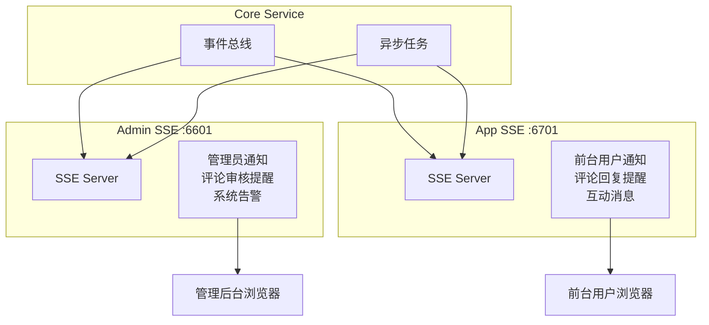
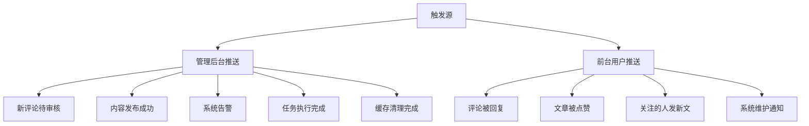
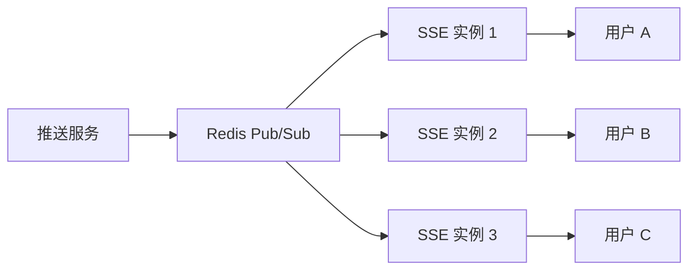

# 实时消息推送实战教程

GoWind CMS 在 Admin Service 和 App Service 中都集成了 SSE（Server-Sent Events）服务，用于向管理后台和前台应用推送实时消息。本教程讲解 SSE 架构设计、推送场景和前后端实现。

## 前置条件

- 已阅读 [CMS 后端架构总览](./backend-architecture.md)
- 了解 HTTP 长连接概念
- 建议先阅读 [GoWind Admin SSE 推送教程](/admin/tutorial-sse-push.md)

## 一、SSE 架构

### 1.1 CMS 双 SSE 服务



| SSE 服务 | 端口 | 面向用户 | 推送内容 |
|---------|------|---------|---------|
| Admin SSE | 6601 | 管理员 | 评论审核提醒、系统告警、任务状态 |
| App SSE | 6701 | 前台用户 | 评论回复、互动通知、系统消息 |

### 1.2 SSE vs WebSocket

| 对比项 | SSE | WebSocket |
|--------|-----|-----------|
| 通信方向 | 服务端→客户端（单向） | 双向 |
| 协议 | HTTP | WebSocket |
| 重连机制 | 浏览器自动重连 | 需手动实现 |
| 复杂度 | 低 | 高 |
| 适用场景 | 通知推送、状态更新 | 聊天、实时协作 |

CMS 的通知场景只需要服务端推送，SSE 是更简洁的选择。

## 二、服务端实现

### 2.1 SSE 服务器

```go
// app/admin/service/internal/server/sse_server.go
type SSEServer struct {
    clients map[uint32]*client.Player  // userId → 客户端连接
    mu      sync.RWMutex
}

func NewSSEServer() *SSEServer {
    return &SSEServer{
        clients: make(map[uint32]*client.Player),
    }
}

// SSE 端点，前端 EventSource 连接
func (s *SSEServer) HandleSSE(c *gin.Context) {
    userId := c.GetUint32("userId")

    c.Header("Content-Type", "text/event-stream")
    c.Header("Cache-Control", "no-cache")
    c.Header("Connection", "keep-alive")
    c.Header("Access-Control-Allow-Origin", "*")

    // 注册客户端连接
    player := client.NewPlayer(userId, c.Writer)
    s.register(userId, player)
    defer s.unregister(userId)

    // 保持连接
    ticker := time.NewTicker(30 * time.Second)
    defer ticker.Stop()

    for {
        select {
        case <-c.Done():
            return
        case <-ticker.C:
            // 心跳保活
            c.SSEvent("ping", "heartbeat")
            c.Writer.Flush()
        }
    }
}

// 向指定用户推送消息
func (s *SSEServer) Push(userId uint32, event string, data interface{}) {
    s.mu.RLock()
    defer s.mu.RUnlock()

    if client, exists := s.clients[userId]; exists {
        client.Send(event, data)
    }
}

// 广播给所有在线用户
func (s *SSEServer) Broadcast(event string, data interface{}) {
    s.mu.RLock()
    defer s.mu.RUnlock()

    for _, client := range s.clients {
        client.Send(event, data)
    }
}
```

### 2.2 事件总线集成

Core Service 中的事件通过 EventBus 触发 SSE 推送：

```go
// app/core/service/internal/service/event_handler.go
func (s *EventHandler) OnCommentCreated(ctx context.Context, event *CommentCreatedEvent) {
    // 1. 通知管理后台：新评论待审核
    s.adminSSEClient.Push(event.PostAuthorId, "comment:pending", map[string]any{
        "commentId": event.CommentId,
        "postId":    event.PostId,
        "content":   event.Content,
        "userName":  event.UserName,
    })

    // 2. 通知前台用户：文章有新评论
    s.appSSEClient.Push(event.PostAuthorId, "comment:new", map[string]any{
        "postId":    event.PostId,
        "postTitle": event.PostTitle,
        "userName":  event.UserName,
    })
}

func (s *EventHandler) OnCommentReplied(ctx context.Context, event *CommentRepliedEvent) {
    // 通知被回复的用户
    s.appSSEClient.Push(event.ReplyToUserId, "comment:reply", map[string]any{
        "commentId":   event.CommentId,
        "postId":      event.PostId,
        "replyByUser": event.UserName,
        "content":     event.Content,
    })
}
```

### 2.3 注册事件订阅

```go
// app/core/service/internal/service/service.go
func InitEventHandlers(eventbus *eventbus.EventBus, adminSSE *sse.Client, appSSE *sse.Client) {
    handler := &EventHandler{adminSSEClient: adminSSE, appSSEClient: appSSE}

    // 订阅评论事件
    eventbus.Subscribe("comment.created", handler.OnCommentCreated)
    eventbus.Subscribe("comment.replied", handler.OnCommentReplied)
    eventbus.Subscribe("comment.approved", handler.OnCommentApproved)

    // 订阅帖子事件
    eventbus.Subscribe("post.published", handler.OnPostPublished)
    eventbus.Subscribe("post.updated", handler.OnPostUpdated)
}
```

## 三、管理后台前端实现

### 3.1 SSE 连接管理

```typescript
// frontend/admin/apps/admin/src/utils/sse.ts
class SSEClient {
  private eventSource: EventSource | null = null;
  private listeners: Map<string, Set<(data: any) => void>> = new Map();
  private reconnectTimer: NodeJS.Timeout | null = null;

  connect(token: string) {
    if (this.eventSource) {
      this.eventSource.close();
    }

    this.eventSource = new EventSource(
      `${import.meta.env.VITE_SSE_URL}/events?token=${token}`,
    );

    this.eventSource.onopen = () => {
      console.log('SSE 已连接');
    };

    this.eventSource.onerror = () => {
      console.log('SSE 连接断开，5 秒后重连...');
      this.eventSource?.close();
      this.reconnectTimer = setTimeout(() => this.connect(token), 5000);
    };

    // 注册事件监听
    this.listeners.forEach((callbacks, eventName) => {
      this.eventSource?.addEventListener(eventName, (e: MessageEvent) => {
        const data = JSON.parse(e.data);
        callbacks.forEach((cb) => cb(data));
      });
    });
  }

  on(event: string, callback: (data: any) => void) {
    if (!this.listeners.has(event)) {
      this.listeners.set(event, new Set());
    }
    this.listeners.get(event)!.add(callback);
  }

  off(event: string, callback: (data: any) => void) {
    this.listeners.get(event)?.delete(callback);
  }

  disconnect() {
    this.eventSource?.close();
    if (this.reconnectTimer) clearTimeout(this.reconnectTimer);
  }
}

export const sseClient = new SSEClient();
```

### 3.2 全局通知集成

```typescript
// frontend/admin/apps/admin/src/App.vue
import { sseClient } from '@/utils/sse';
import { useNotification } from 'ant-design-vue';

const { info, success, warning } = useNotification();
const token = getToken();

// 连接 SSE
sseClient.connect(token);

// 新评论审核提醒
sseClient.on('comment:pending', (data) => {
  warning({
    title: '新评论待审核',
    content: `${data.userName}: ${data.content}`,
    onClick: () => router.push('/content/comment/audit'),
  });
});

// 系统告警
sseClient.on('system:alert', (data) => {
  info({
    title: '系统告警',
    content: data.message,
  });
});

onUnmounted(() => {
  sseClient.disconnect();
});
```

### 3.3 角标通知

```vue
<!-- components/layout/Header.vue -->
<script setup lang="ts">
import { sseClient } from '@/utils/sse';

const pendingCount = ref(0);

onMounted(() => {
  sseClient.on('comment:pending', () => {
    pendingCount.value++;
  });
});

const handleClick = () => {
  router.push('/content/comment/audit');
  pendingCount.value = 0;
};
</script>

<template>
  <Badge :count="pendingCount">
    <BellOutlined @click="handleClick" />
  </Badge>
</template>
```

## 四、前台应用 SSE

### 4.1 React 前台 SSE

```tsx
// src/lib/sse/client.ts
export class AppSSEClient {
  private eventSource: EventSource | null = null;

  connect(token: string) {
    this.eventSource = new EventSource(
      `${process.env.NEXT_PUBLIC_SSE_URL}/events?token=${token}`,
    );

    this.eventSource.addEventListener('comment:reply', this.onCommentReply);
    this.eventSource.addEventListener('notification', this.onNotification);

    this.eventSource.onerror = () => {
      this.eventSource?.close();
      setTimeout(() => this.connect(token), 5000);
    };
  }

  private onCommentReply = (e: MessageEvent) => {
    const data = JSON.parse(e.data);
    // 显示 toast 通知
    toast.success(`${data.replyByUser} 回复了你的评论`);
  };

  private onNotification = (e: MessageEvent) => {
    const data = JSON.parse(e.data);
    // 更新通知角标
    notificationStore.increment();
  };

  disconnect() {
    this.eventSource?.close();
  }
}
```

### 4.2 通知中心组件

```tsx
// src/components/layout/NotificationBell.tsx
'use client';

import { useEffect, useState } from 'react';
import { Popover, Badge, List } from 'antd';
import { AppSSEClient } from '@/lib/sse/client';

interface Notification {
  id: number;
  title: string;
  content: string;
  type: string;
  createdAt: string;
}

export function NotificationBell({ token }: { token: string }) {
  const [notifications, setNotifications] = useState<Notification[]>([]);
  const [unreadCount, setUnreadCount] = useState(0);

  useEffect(() => {
    if (!token) return;

    const sse = new AppSSEClient();
    sse.connect(token);

    return () => sse.disconnect();
  }, [token]);

  return (
    <Popover
      content={
        <List
          dataSource={notifications}
          renderItem={(n) => (
            <List.Item>
              <List.Item.Meta
                title={n.title}
                description={n.content}
              />
            </List.Item>
          )}
        />
      }
      trigger="click"
    >
      <Badge count={unreadCount}>
        <BellIcon />
      </Badge>
    </Popover>
  );
}
```

### 4.3 Flutter 前台 SSE

```dart
// lib/core/network/sse_client.dart
class SSEClient {
  final String baseUrl;
  late final EventSource _eventSource;

  final _commentReplyController = StreamController<Map<String, dynamic>>.broadcast();
  final _notificationController = StreamController<Map<String, dynamic>>.broadcast();

  Stream<Map<String, dynamic>> get onCommentReply => _commentReplyController.stream;
  Stream<Map<String, dynamic>> get onNotification => _notificationController.stream;

  SSEClient({required this.baseUrl});

  Future<void> connect(String token) async {
    _eventSource = await EventSource.connect(
      '$baseUrl/events?token=$token',
    );

    _eventSource.addEventListener('comment:reply', (event) {
      final data = jsonDecode(event.data);
      _commentReplyController.add(data);
    });

    _eventSource.addEventListener('notification', (event) {
      final data = jsonDecode(event.data);
      _notificationController.add(data);
    });
  }

  void dispose() {
    _eventSource.close();
    _commentReplyController.close();
    _notificationController.close();
  }
}
```

```dart
// 使用示例：在 BLoC 中监听 SSE
class NotificationBloc extends Bloc<NotificationEvent, NotificationState> {
  final SSEClient sseClient;

  NotificationBloc({required this.sseClient}) : super(NotificationInitial()) {
    sseClient.onCommentReply.listen((data) {
      add(ReceiveNotification(
        title: '${data['replyByUser']} 回复了你',
        content: data['content'],
      ));
    });
  }
}
```

## 五、推送场景

### 5.1 CMS 推送场景总览



### 5.2 自定义推送

通过 Lua 脚本自定义推送逻辑：

```lua
-- 文章发布时推送通知给所有关注者
eventbus.subscribe("post.published", function(event)
    local post_id = event.post_id
    local author_id = event.author_id

    -- 查询所有关注者
    local followers = api.get("/admin/v1/users/" .. author_id .. "/followers")

    for _, follower_id in ipairs(followers) do
        -- 推送 SSE 通知
        sse.push_to_app_user(follower_id, "post:new", {
            postId = post_id,
            authorName = event.author_name,
            title = event.title,
        })
    end
end)
```

## 六、性能与可靠性

### 6.1 连接管理

| 指标 | 建议 |
|------|------|
| 最大连接数 | 单实例 5000-10000 |
| 心跳间隔 | 30 秒 |
| 超时断开 | 60 秒无响应 |
| 水平扩展 | Nginx 负载均衡 + Redis Pub/Sub |

### 6.2 水平扩展

多实例部署时通过 Redis Pub/Sub 同步推送：



```go
// Redis Pub/Sub 广播
func (s *SSEServer) Push(userId uint32, event string, data interface{}) {
    msg := PushMessage{
        UserId: userId,
        Event:  event,
        Data:   data,
    }
    payload, _ := json.Marshal(msg)
    // 发布到 Redis，所有 SSE 实例订阅
    redisClient.Publish(ctx, "sse:push", payload)
}

// 每个 SSE 实例订阅 Redis
func (s *SSEServer) SubscribeRedis() {
    sub := redisClient.Subscribe(ctx, "sse:push")
    for msg := range sub.Channel() {
        var pushMsg PushMessage
        json.Unmarshal([]byte(msg.Payload), &pushMsg)

        // 只推送给本实例连接的用户
        s.localPush(pushMsg.UserId, pushMsg.Event, pushMsg.Data)
    }
}
```

## 七、检查清单

| 检查项 | 说明 |
|--------|------|
| SSE 服务器 | Admin SSE + App SSE 双服务 |
| 事件订阅 | EventBus 集成 |
| 管理后台前端 | SSE 连接 + 通知展示 |
| 前台前端 | React/Flutter SSE 客户端 |
| 心跳保活 | 30 秒心跳 |
| 自动重连 | 断线 5 秒重连 |
| 水平扩展 | Redis Pub/Sub 广播 |
| 消息类型 | 评论/通知/系统告警 |

## 相关文档

- [CMS 后端架构总览](./backend-architecture.md)
- [评论系统实战](./tutorial-comment-system.md)
- [任务调度实战](./tutorial-task-scheduling.md)
- [GoWind Admin SSE 推送教程](/admin/tutorial-sse-push.md)
