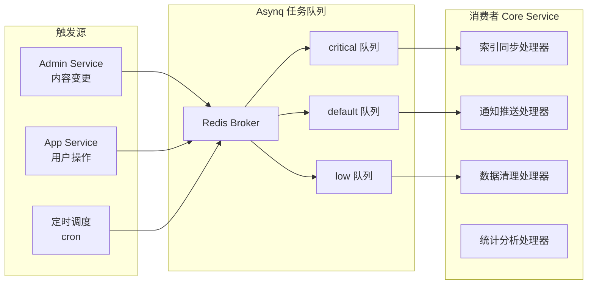

# 任务调度实战教程

GoWind CMS 在 Core Service 中集成基于 Asynq 的分布式任务队列，用于处理索引同步、通知推送、数据清理等异步操作。本教程讲解 CMS 任务调度的配置、定义和管理。

## 前置条件

- 已阅读 [CMS 后端架构总览](./backend-architecture.md)
- 建议先阅读 [GoWind Admin 任务调度教程](/admin/tutorial-task-scheduling.md)（共享相同的技术基座）

## 一、CMS 任务架构

### 1.1 Core Service 中的任务调度



### 1.2 与 Admin 任务调度的差异

| 对比项 | Admin | CMS |
|--------|-------|-----|
| 部署位置 | Admin Service 内 | Core Service 内 |
| 任务类型 | 系统级（邮件/清理） | 内容级（索引/同步/推送） |
| 任务来源 | 后台操作 | 后台 + 前台用户操作 |

## 二、配置

### 2.1 Core Service 任务配置

```yaml
# app/core/service/configs/server.yaml
server:
  asynq:
    uri: "redis://:*Abcd123456@redis:6379/1"
    enable_gracefully_shutdown: true
    shutdown_timeout: 3s
    codec: "json"
    concurrency: 10
    queues:
      critical: 10
      default: 5
      low: 1
```

### 2.2 Asynq Server 初始化

```go
// app/core/service/internal/server/asynq_server.go
func NewAsynqServer(ctx *bootstrap.Context, logger log.Logger) *asynq.Server {
    cfg := ctx.GetConfig().GetServer().GetAsynq()

    srv := asynq.NewServer(
        asynq.RedisClientOpt{Addr: cfg.Uri},
        asynq.Config{
            Concurrency: int(cfg.Concurrency),
            Queues:      parseQueues(cfg.Queues),
        },
    )

    mux := asynq.NewServeMux()

    // 注册任务处理器
    mux.HandleFunc(task.TypeIndexPost, HandleIndexPost)
    mux.HandleFunc(task.TypeSendNotification, HandleSendNotification)
    mux.HandleFunc(task.TypeCleanupExpiredData, HandleCleanupExpiredData)
    mux.HandleFunc(task.TypeGenerateReport, HandleGenerateReport)
    mux.HandleFunc(task.TypeSyncTranslations, HandleSyncTranslations)

    return srv
}
```

## 三、任务定义

### 3.1 任务类型常量

```go
// pkg/task/task_types.go
const (
    // 内容索引任务
    TypeIndexPost        = "post:index"
    TypeIndexPage        = "page:index"
    TypeRebuildIndex     = "search:rebuild_index"

    // 通知任务
    TypeSendNotification = "notification:send"
    TypeSendEmail        = "email:send"

    // 维护任务
    TypeCleanupExpiredData  = "cleanup:expired_data"
    TypeCleanupTempFiles    = "cleanup:temp_files"
    TypeSyncTranslations    = "translation:sync"

    // 统计任务
    TypeGenerateReport   = "report:generate"
    TypeUpdateViewCount  = "stats:update_view_count"
)
```

### 3.2 任务载荷

```go
// pkg/task/payloads.go

// 内容索引任务
type IndexPostPayload struct {
    PostId uint32 `json:"postId"`
    Action string `json:"action"` // create / update / delete
}

// 通知推送任务
type SendNotificationPayload struct {
    UserId  uint32 `json:"userId"`
    Title   string `json:"title"`
    Content string `json:"content"`
    Type    string `json:"type"` // comment / system / mention
}

// 数据清理任务
type CleanupExpiredDataPayload struct {
    EntityType string `json:"entityType"` // posts / comments / files
    OlderThan  int64  `json:"olderThan"`  // unix timestamp
}

// 统计任务
type UpdateViewCountPayload struct {
    PostId    uint32 `json:"postId"`
    Increment uint32 `json:"increment"`
}
```

## 四、任务处理器

### 4.1 索引同步处理器

```go
func HandleIndexPost(ctx context.Context, t *asynq.Task) error {
    var payload task.IndexPostPayload
    if err := json.Unmarshal(t.Payload(), &payload); err != nil {
        return fmt.Errorf("解析载荷失败: %w", err)
    }

    switch payload.Action {
    case "create", "update":
        post, err := postRepo.Get(ctx, &contentV1.GetPostRequest{
            QueryBy: &contentV1.GetPostRequest_Id{Id: payload.PostId},
        })
        if err != nil {
            return err
        }
        return searchClient.Index(ctx, "cms_posts", post)

    case "delete":
        return searchClient.Delete(ctx, "cms_posts", fmt.Sprint(payload.PostId))
    }

    return nil
}
```

### 4.2 通知推送处理器

```go
func HandleSendNotification(ctx context.Context, t *asynq.Task) error {
    var payload task.SendNotificationPayload
    if err := json.Unmarshal(t.Payload(), &payload); err != nil {
        return err
    }

    // 1. 创建站内信
    _, err := internalMessageRepo.Create(ctx, &internalMessageV1.CreateInternalMessageRequest{
        Data: &internalMessageV1.InternalMessage{
            UserId:  payload.UserId,
            Title:   payload.Title,
            Content: payload.Content,
            Type:    payload.Type,
        },
    })
    if err != nil {
        return err
    }

    // 2. 通过 SSE 推送实时通知
    sseServer.Broadcast(ctx, payload.UserId, map[string]any{
        "event":   "notification",
        "title":   payload.Title,
        "content": payload.Content,
    })

    return nil
}
```

### 4.3 数据清理处理器

```go
func HandleCleanupExpiredData(ctx context.Context, t *asynq.Task) error {
    var payload task.CleanupExpiredDataPayload
    if err := json.Unmarshal(t.Payload(), &payload); err != nil {
        return err
    }

    switch payload.EntityType {
    case "posts":
        // 清理回收站中超过 30 天的帖子
        _, err := postRepo.PermanentlyDelete(ctx, payload.OlderThan)
        return err

    case "comments":
        // 清理被拒绝的评论
        _, err := commentRepo.CleanupRejected(ctx, payload.OlderThan)
        return err

    case "files":
        // 清理临时上传文件
        return cleanupTempFiles(payload.OlderThan)
    }

    return nil
}
```

### 4.4 浏览量统计处理器

```go
func HandleUpdateViewCount(ctx context.Context, t *asynq.Task) error {
    var payload task.UpdateViewCountPayload
    if err := json.Unmarshal(t.Payload(), &payload); err != nil {
        return err
    }

    // 异步更新浏览量（Redis 缓存 + 定期刷入数据库）
    cacheKey := fmt.Sprintf("post:view:%d", payload.PostId)
    count, err := redisClient.IncrBy(ctx, cacheKey, int64(payload.Increment)).Result()
    if err != nil {
        return err
    }

    // 每积累 100 次浏览刷入数据库
    if count%100 == 0 {
        return postRepo.UpdateViewCount(ctx, payload.PostId, count)
    }

    return nil
}
```

## 五、任务投递

### 5.1 内容变更触发

```go
// app/core/service/internal/service/post_service.go
func (s *PostService) Create(ctx context.Context, req *contentV1.CreatePostRequest) (*contentV1.Post, error) {
    post, err := s.postRepo.Create(ctx, req)
    if err != nil {
        return nil, err
    }

    // 投递索引任务（default 队列）
    payload, _ := json.Marshal(task.IndexPostPayload{
        PostId: post.Id,
        Action: "create",
    })
    s.asynqClient.Enqueue(
        asynq.NewTask(task.TypeIndexPost, payload),
        asynq.Queue("default"),
    )

    return post, nil
}
```

### 5.2 用户操作触发

```go
// 评论创建后通知文章作者
func (s *CommentService) Create(ctx context.Context, req *commentV1.CreateCommentRequest) (*commentV1.Comment, error) {
    comment, err := s.commentRepo.Create(ctx, req)
    if err != nil {
        return nil, err
    }

    // 异步通知文章作者
    payload, _ := json.Marshal(task.SendNotificationPayload{
        UserId:  post.AuthorId,
        Title:   "新评论通知",
        Content: fmt.Sprintf("您的文章收到了新评论"),
        Type:    "comment",
    })
    s.asynqClient.Enqueue(
        asynq.NewTask(task.TypeSendNotification, payload),
        asynn.Queue("critical"),  // 通知类任务高优先级
    )

    return comment, nil
}
```

## 六、定时任务

### 6.1 定时清理

```go
// app/core/service/internal/server/asynq_server.go
func RegisterScheduledTasks(scheduler *asynq.Scheduler) {
    // 每天凌晨 3 点清理过期数据
    scheduler.Register("0 3 * * *", asynq.NewTask(
        task.TypeCleanupExpiredData,
        jsonMustMarshal(task.CleanupExpiredDataPayload{
            EntityType: "posts",
            OlderThan:  time.Now().AddDate(0, 0, -30).Unix(),  // 30 天前
        }),
    ))

    // 每小时同步翻译缓存
    scheduler.Register("0 * * * *", asynq.NewTask(
        task.TypeSyncTranslations,
        nil,
    ))

    // 每周一生成周报
    scheduler.Register("0 9 * * 1", asynq.NewTask(
        task.TypeGenerateReport,
        jsonMustMarshal(task.GenerateReportPayload{
            Type: "weekly",
        }),
    ))
}
```

## 七、管理后台任务管理

### 7.1 Task Service 接口

CMS 提供可视化的任务管理界面：

```http
# 查看任务列表
GET /admin/v1/tasks?page=1&pageSize=20

# 立即执行任务
POST /admin/v1/tasks/1/run

# 暂停定时任务
PUT /admin/v1/tasks/1/pause

# 查看任务执行日志
GET /admin/v1/tasks/1/logs?page=1
```

### 7.2 Asynqmon 监控

Asynq 提供 Web UI 监控任务状态：

```shell
# 启动 Asynqmon
asynqmon --port=8080 --redis-addr=localhost:6379
```

| 监控项 | 说明 |
|--------|------|
| Active Tasks | 正在执行的任务 |
| Pending Tasks | 等待执行的任务 |
| Retry Tasks | 重试中的任务 |
| Dead Tasks | 失败任务 |
| Scheduled Tasks | 定时任务 |
| Processed/Failed | 统计数据 |

## 八、最佳实践

### 8.1 任务设计原则

| 原则 | 说明 |
|------|------|
| 幂等性 | 任务重复执行不应产生副作用 |
| 超时控制 | 设置合理的超时时间 |
| 重试策略 | 指数退避重试 |
| 优先级 | 关键任务高优先级 |

### 8.2 重试配置

```go
s.asynqClient.Enqueue(
    asynq.NewTask(task.TypeIndexPost, payload),
    asynq.Queue("default"),
    asynq.MaxRetry(5),                    // 最多重试 5 次
    asynq.RetryDelay(30*time.Second),     // 初始延迟 30 秒
    asynq.Timeout(2*time.Minute),         // 超时 2 分钟
)
```

## 九、检查清单

| 检查项 | 说明 |
|--------|------|
| Asynq 配置 | Redis 连接 + 队列优先级 |
| 任务处理器注册 | 所有任务类型注册到 ServeMux |
| 任务投递 | 业务逻辑中正确投递任务 |
| 定时任务 | cron 表达式配置 |
| 任务监控 | Asynqmon Web UI |
| 重试策略 | 指数退避 + 最大重试 |
| 幂等性 | 任务可安全重试 |

## 相关文档

- [CMS 后端架构总览](./backend-architecture.md)
- [全文搜索实战](./tutorial-search.md)
- [实时消息推送实战](./tutorial-sse-push.md)
- [GoWind Admin 任务调度教程](/admin/tutorial-task-scheduling.md)
