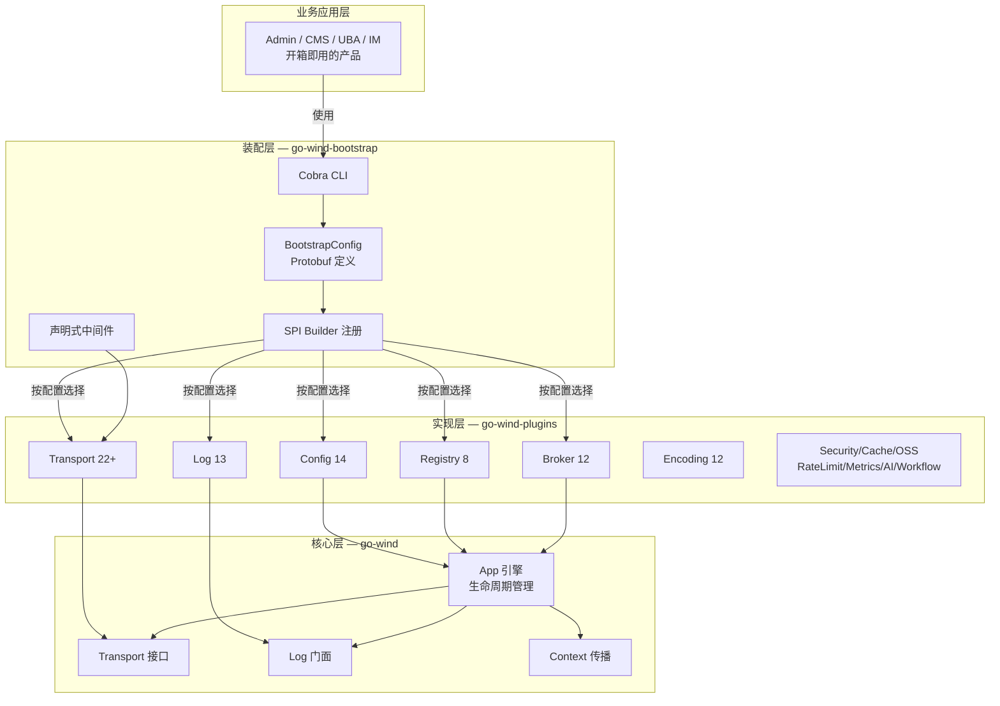
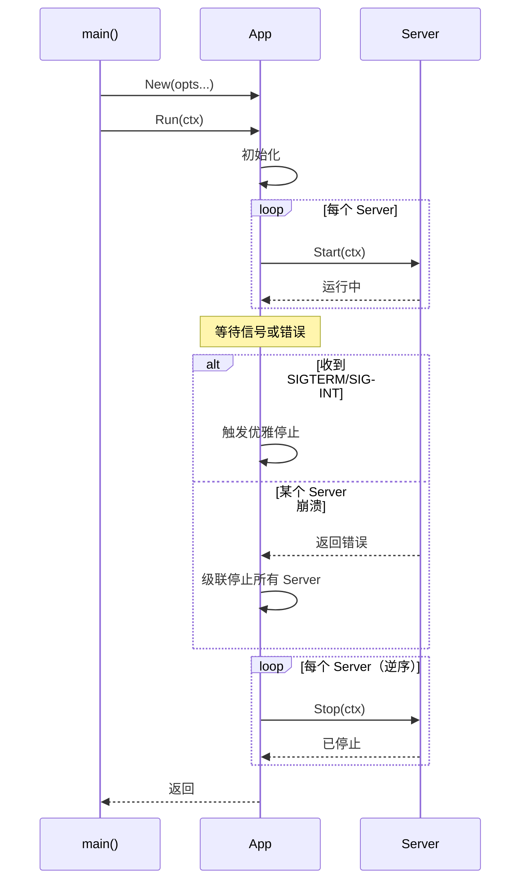
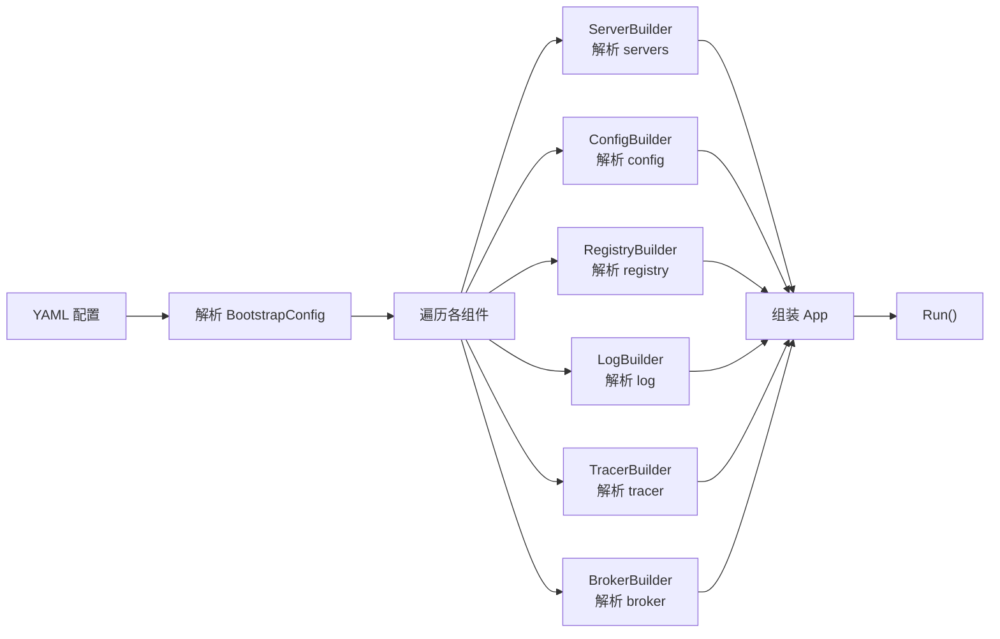
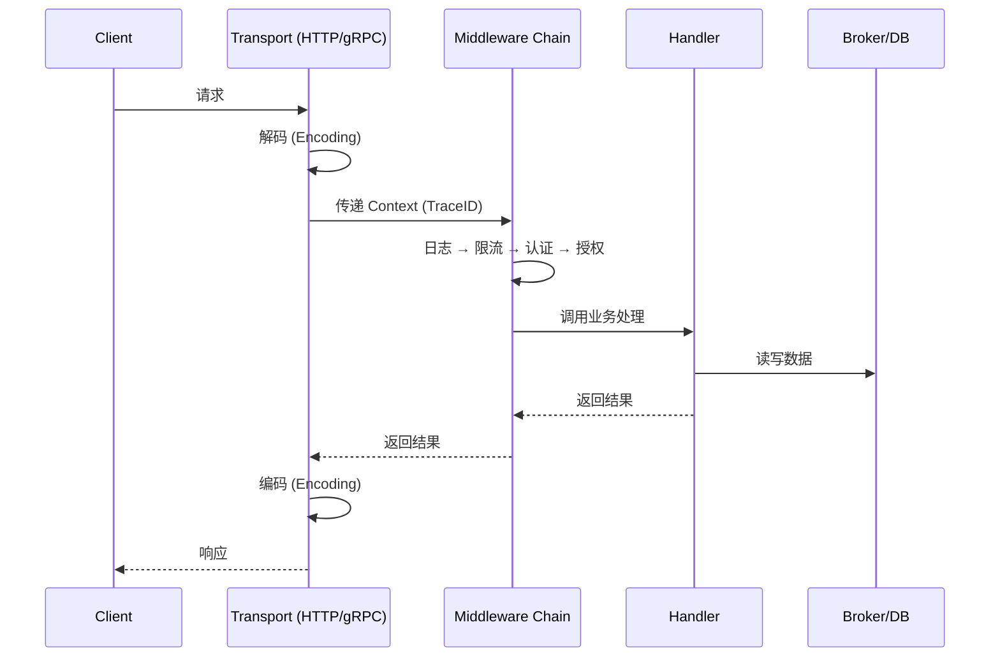
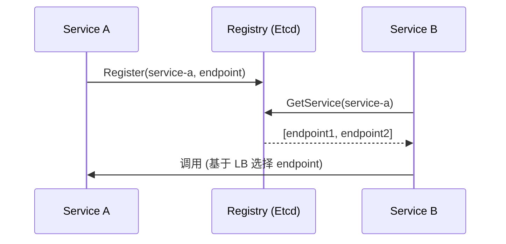

# 框架整体架构

本文档介绍 GoWind 框架三个项目的分层架构、模块关系和数据流。

## 一、三层架构



## 二、核心层（go-wind）

### 2.1 职责

| 模块 | 文件 | 职责 |
|------|------|------|
| App | `app.go` | 引擎核心：生命周期管理、优雅启停 |
| Transport | `transport/` | 传输层抽象：Server 接口定义 |
| Log | `log/` | 日志门面：Logger 接口 + Level + 全局注册 |
| Context | `context.go` | 请求级元数据传播：TraceID / UserID / Metadata |
| Instance | `instance.go` | 服务实例模型 |
| Errors | `errors.go` | 统一错误定义 |

### 2.2 核心接口

```go
// Transport Server 接口
type Server interface {
    Start(context.Context) error
    Stop(context.Context) error
    Endpoint() []string
}

// Log 门面接口
type Logger interface {
    Log(level Level, msg string, fields ...Field)
    With(fields ...Field) Logger
}

// App 引擎
type App struct {
    servers   []Server
    logger    Logger
    // ...
}

func (a *App) Run(ctx context.Context) error
func (a *App) Stop(ctx context.Context) error
```

### 2.3 生命周期



## 三、实现层（go-wind-plugins）

### 3.1 统一接口

每个领域的插件实现 go-wind 核心定义的接口：

```go
// 配置中心接口
type Config interface {
    Load() (*Value, error)
    Watch() (<-chan *Value, error)
}

// 服务注册接口
type Registry interface {
    Register(ctx context.Context, svc *Service) error
    Deregister(ctx context.Context, svc *Service) error
    GetService(ctx context.Context, name string) ([]*Service, error)
}

// 消息队列接口
type Broker interface {
    Publish(ctx context.Context, topic string, msg *Message) error
    Subscribe(ctx context.Context, topic string, handler Handler) (Subscriber, error)
}
```

### 3.2 插件目录结构

```
go-wind-plugins/
├── config/           # 配置中心
│   ├── apollo/
│   ├── consul/
│   ├── etcd/
│   ├── file/
│   ├── nacos/
│   └── ...
├── registry/         # 服务注册
│   ├── consul/
│   ├── etcd/
│   ├── nacos/
│   └── ...
├── log/              # 日志
│   ├── zap/
│   ├── zerolog/
│   ├── logrus/
│   └── ...
├── transport/        # 传输协议
│   ├── http/
│   ├── grpc/
│   ├── websocket/
│   └── ...
├── broker/           # 消息队列
│   ├── kafka/
│   ├── rabbitmq/
│   ├── nats/
│   └── ...
├── encoding/         # 编解码
├── security/         # 安全
├── cache/            # 缓存
├── oss/              # 对象存储
├── tracer/           # 链路追踪
├── metrics/          # 指标监控
├── ratelimit/        # 限流
├── circuitbreaker/   # 熔断
├── ai/               # AI 集成
├── workflow/         # 工作流
├── health/           # 健康检查
├── retry/            # 重试
└── go.work           # Go Workspace 多模块管理
```

### 3.3 独立版本管理

每个插件子目录拥有独立的 `go.mod`，可以独立引用和版本化：

```go
// 只引入需要的插件
import (
    _ "github.com/tx7do/go-wind-plugins/transport/http"
    _ "github.com/tx7do/go-wind-plugins/log/zap"
    _ "github.com/tx7do/go-wind-plugins/registry/etcd"
)
```

## 四、装配层（go-wind-bootstrap）

### 4.1 配置驱动

```yaml
# 一份 YAML 描述完整应用拓扑
name: order-service

servers:
  - name: http-api
    type: http
    addr: ":8080"
    middleware: [log, recovery, cors, auth]

  - name: grpc-api
    type: grpc
    addr: ":9090"

log:
  level: info
  format: json
  adapter: zap

config:
  type: nacos
  config:
    server: "nacos:8848"
    namespace: production

registry:
  type: etcd
  config:
    endpoints: ["etcd:2379"]

tracer:
  type: otlp
  config:
    endpoint: "jaeger:4317"
```

### 4.2 SPI 机制

```go
// 插件通过 init() 自注册
package http

import "github.com/tx7do/go-wind-bootstrap"

func init() {
    bootstrap.RegisterServer("http", NewHTTPServer)
}

// 业务代码只需 blank import
import _ "github.com/tx7do/go-wind-plugins/transport/http"
```

### 4.3 Builder 解析链



## 五、数据流

### 5.1 请求处理流



### 5.2 服务发现流



## 六、技术选型矩阵

| 领域 | 推荐选择 | 备选 |
|------|---------|------|
| 配置中心 | Nacos | Apollo, Consul, Etcd |
| 服务注册 | Etcd | Consul, Nacos |
| 日志 | Zap | Zerolog, Logrus |
| 传输协议 | HTTP + gRPC | WebSocket, SSE |
| 消息队列 | Kafka | RabbitMQ, NATS |
| 链路追踪 | OTLP → Jaeger | — |
| 安全 | JWT + Casbin | — |
| 缓存 | Redis | Local Cache |
| 对象存储 | MinIO | S3 |
| 限流 | Sentinel | Token Bucket, BBR |

## 相关文档

- [GoWind 框架介绍](./intro.md)
- [核心框架介绍](./core-intro.md)
- [插件生态总览](./plugins-intro.md)
- [声明式启动器介绍](./bootstrap-intro.md)
