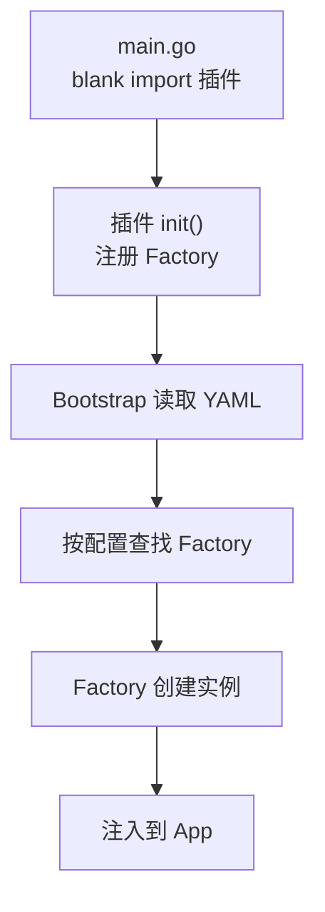
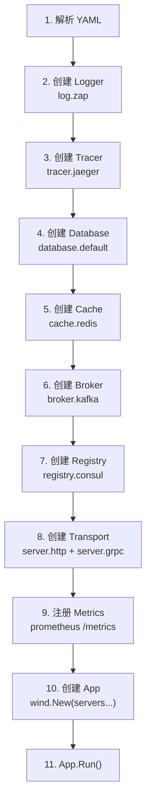

# Bootstrap SPI 机制

go-wind-bootstrap 通过 SPI（Service Provider Interface）机制实现插件自动注册和实例化。

## 一、SPI 工作流程



## 二、Registry 全貌

```go
// bootstrap/registry/registry.go

// ===== Transport =====
func RegisterTransport(name string, factory TransportFactory)
func NewTransport(name string, opts ...) (transport.Server, error)

// ===== Log =====
func RegisterLog(name string, factory LogFactory)
func NewLog(name string, opts ...) (log.Logger, error)

// ===== Database =====
func RegisterDatabase(name string, factory DatabaseFactory)
func NewDatabase(name string, opts ...) (*ent.Client, error)

// ===== Cache =====
func RegisterCache(name string, factory CacheFactory)
func NewCache(name string, opts ...) (cache.Cache, error)

// ===== Broker =====
func RegisterBroker(name string, factory BrokerFactory)
func NewBroker(name string, opts ...) (broker.Broker, error)

// ===== Tracer =====
func RegisterTracer(name string, factory TracerFactory)
func NewTracer(name string, opts ...) (tracer.Tracer, error)

// ===== Config Source =====
func RegisterConfig(name string, factory ConfigFactory)
func NewConfig(name string, opts ...) (config.Source, error)

// ===== Registry =====
func RegisterRegistry(name string, factory RegistryFactory)
func NewRegistry(name string, opts ...) (registry.Registry, error)

// ===== OSS =====
func RegisterOSS(name string, factory OSSFactory)
func NewOSS(name string, opts ...) (oss.OSS, error)
```

## 三、SPI 注册示例

### 3.1 Transport 注册

```go
// plugins/transport/http/register.go
package http

import (
    "github.com/tx7do/go-wind/transport"
    "github.com/tx7do/go-wind-bootstrap/registry"
)

func init() {
    registry.RegisterTransport("http", NewServer)
}
```

当 main.go 中 `_ "github.com/tx7do/go-wind-plugins/transport/http"` 时，`init()` 自动执行，将 HTTP Server 的工厂函数注册到 Registry。

### 3.2 Bootstrap 自动实例化

```yaml
# config.yaml
server:
  http:                    # key = "http" → 查找注册名 "http"
    addr: ":8080"
```

Bootstrap 解析配置时：

1. 遍历 `server` 下的所有 key
2. 对每个 key，调用 `registry.NewTransport(key, options...)`
3. 返回的 Server 自动添加到 App

### 3.3 Database 注册

```go
// plugins/database/mysql/register.go
package mysql

func init() {
    registry.RegisterDatabase("mysql", NewClient)
}
```

```yaml
database:
  default:                # 连接名（不参与查找）
    driver: mysql         # 查找注册名
    dsn: "..."
```

## 四、SPI 装配详解

以一个完整服务为例：

```go
import (
    _ "github.com/tx7do/go-wind-plugins/transport/http"
    _ "github.com/tx7do/go-wind-plugins/transport/grpc"
    _ "github.com/tx7do/go-wind-plugins/log/zap"
    _ "github.com/tx7do/go-wind-plugins/database/mysql"
    _ "github.com/tx7do/go-wind-plugins/cache/redis"
    _ "github.com/tx7do/go-wind-plugins/broker/kafka"
    _ "github.com/tx7do/go-wind-plugins/registry/consul"
    _ "github.com/tx7do/go-wind-plugins/tracer/jaeger"
    _ "github.com/tx7do/go-wind-plugins/metrics/prometheus"
)
```

Bootstrap 装配顺序：



## 五、自定义 SPI

### 5.1 定义接口

```go
// myapp/notifier/notifier.go
package notifier

type Notifier interface {
    Notify(ctx context.Context, message string) error
}
```

### 5.2 实现 Factory

```go
// myapp/notifier/email/email.go
package email

type Notifier struct {
    smtpAddr string
}

func New(opts ...Option) notifier.Notifier {
    n := &Notifier{}
    for _, opt := range opts { opt(n) }
    return n
}

func (n *Notifier) Notify(ctx context.Context, msg string) error {
    // 发送邮件
    return nil
}
```

### 5.3 注册到 Bootstrap Registry

```go
// myapp/notifier/email/register.go
package email

import "myapp/bootstrap/registry"

type Factory func(opts ...Option) notifier.Notifier

func init() {
    registry.RegisterNotifier("email", New)
}
```

### 5.4 使用

```yaml
# config.yaml
notifier:
  email:
    smtp_addr: "smtp.example.com:587"
    from: "noreply@example.com"
```

```go
import _ "myapp/notifier/email"

func main() {
    app := bootstrap.New("config.yaml")
    app.Run()
}
```

## 六、SPI 生命周期

每个 SPI 实例可以可选实现以下接口：

```go
// 初始化（创建后调用）
type Initializer interface {
    Init(ctx context.Context) error
}

// 启动（App.Run 时调用）
type Starter interface {
    Start(ctx context.Context) error
}

// 停止（App 停止时逆序调用）
type Stopper interface {
    Stop(ctx context.Context) error
}
```

Bootstrap 自动检测并调用对应方法。

## 七、SPI vs Google Wire

| 对比项 | Bootstrap SPI | Google Wire |
|--------|--------------|-------------|
| 依赖方式 | 运行时注册 | 编译时生成 |
| 灵活性 | 高（可热插拔） | 中（编译确定） |
| 类型安全 | 运行时检查 | 编译时检查 |
| 配置驱动 | YAML 驱动 | 代码驱动 |
| 学习成本 | 低 | 中 |

## 相关文档

- [Bootstrap 介绍](./bootstrap-intro.md)
- [Bootstrap 配置系统](./bootstrap-config.md)
- [插件注册机制](./plugins-registry.md)
- [自定义插件开发教程](./tutorial-custom-plugin.md)
