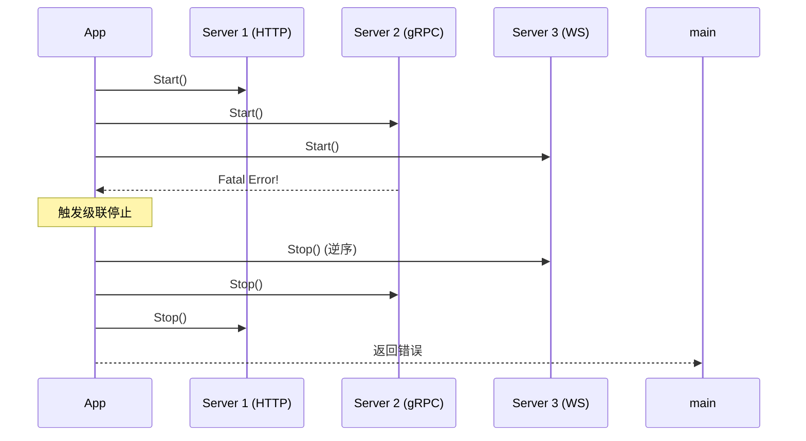

# App 生命周期管理

App 是 go-wind 的引擎核心，负责管理所有 Server 的启动、运行和优雅停止。

## 一、生命周期阶段


## 二、启动流程

```go
func (a *App) Run(ctx context.Context) error {
    // 1. 创建带取消的 context
    ctx, cancel := context.WithCancel(ctx)
    defer cancel()

    // 2. 启动所有 Server
    for _, srv := range a.servers {
        if err := srv.Start(ctx); err != nil {
            // 启动失败，级联停止已启动的 Server
            a.stopAll(ctx)
            return err
        }
        a.logger.Info("server started", "type", srv.Type(), "endpoints", srv.Endpoint())
    }

    // 3. 等待信号或错误
    select {
    case <-a.signalCh:
        a.logger.Info("received shutdown signal")
    case <-ctx.Done():
        a.logger.Info("context cancelled")
    case err := <-a.errCh:
        a.logger.Error("server error", "err", err)
    }

    // 4. 优雅停止
    return a.stopAll(ctx)
}
```

## 三、优雅停止

### 3.1 逆序停止

Server 按注册的**逆序**停止，确保依赖关系正确：

```go
func (a *App) stopAll(ctx context.Context) error {
    var firstErr error
    for i := len(a.servers) - 1; i >= 0; i-- {
        srv := a.servers[i]
        if err := srv.Stop(ctx); err != nil && firstErr == nil {
            firstErr = err
        }
    }
    return firstErr
}
```

### 3.2 超时控制

```go
app := wind.New(
    wind.WithShutdownTimeout(30 * time.Second),
)

// 停止时，每个 Server 有 30 秒完成清理
```

## 四、信号处理

```go
app := wind.New(
    wind.WithSignalHandler(),  // 自动监听 SIGTERM/SIGINT
)

// 收到信号后自动触发优雅停止
// 适用于 Docker/K8s 环境的容器生命周期管理
```

## 五、级联崩溃

任何一个 Server 发生致命错误返回时，App 会自动停止所有其他 Server：



## 六、多 Server 示例

```go
func main() {
    app := wind.New(
        wind.WithName("multi-server"),
        wind.WithServer(httpServer),    // 先启动
        wind.WithServer(grpcServer),
        wind.WithServer(wsServer),      // 最后启动
        wind.WithShutdownTimeout(15*time.Second),
        wind.WithSignalHandler(),
    )

    if err := app.Run(context.Background()); err != nil {
        log.Fatal(err)
    }
}
```

## 相关文档

- [核心框架介绍](./core-intro.md)
- [Context 传播](./core-context.md)
- [Transport 抽象](./core-transport.md)
- [声明式启动器介绍](./bootstrap-intro.md)
