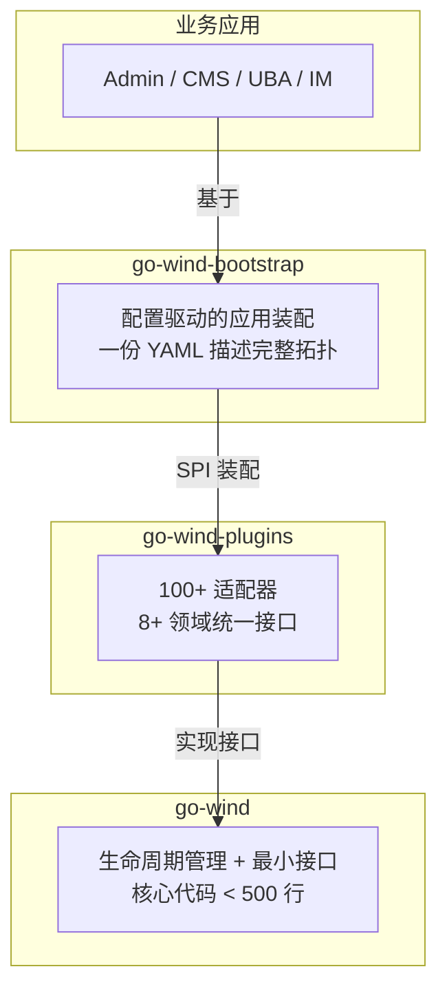
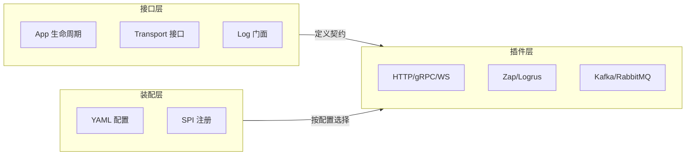

# GoWind 框架

GoWind 框架是一套 **积木式 Go 微服务框架**，由三个核心项目组成，提供从底层生命周期管理到声明式配置启动的完整基础设施。



## 一、三个项目

| 项目 | 仓库 | 定位 | 核心代码 |
|------|------|------|---------|
| **go-wind** | [tx7do/go-wind](https://github.com/tx7do/go-wind) | 核心框架：生命周期 + 最小接口 | < 500 行 |
| **go-wind-plugins** | [tx7do/go-wind-plugins](https://github.com/tx7do/go-wind-plugins) | 插件生态：100+ 适配器，8+ 领域 | 按子模块独立版本 |
| **go-wind-bootstrap** | [tx7do/go-wind-bootstrap](https://github.com/tx7do/go-wind-bootstrap) | 声明式启动器：YAML 配置驱动装配 | — |

## 二、设计哲学

### 2.1 积木式架构

> 不是一揽子全栈框架，而是一盒积木。

- **组合优于继承** — 每个插件只实现标准接口，业务代码依赖接口而非实现
- **接口优于实现** — 核心只定义最小接口，具体实现由插件提供
- **零隐藏魔法** — 所有行为都是显式的，没有隐式初始化和全局状态

### 2.2 分层职责



### 2.3 零外部依赖

核心框架仅依赖 `golang.org/x/sync`，不引入任何第三方库。

## 三、插件领域总览

go-wind-plugins 覆盖 8+ 领域，100+ 适配器：

| 领域 | 接口 | 适配器数量 | 示例 |
|------|------|-----------|------|
| 配置中心 | Config | 14 | Apollo, Consul, Etcd, Nacos, Vault, K8s |
| 服务注册 | Registry | 8 | Consul, Etcd, Nacos, Eureka, Zookeeper |
| 日志 | Logger | 13 | Zap, Zerolog, Logrus, Loki, Sentry |
| 传输协议 | Transport | 22+ | HTTP, gRPC, WebSocket, SSE, TCP, KCP |
| 消息队列 | Broker | 12 | Kafka, RabbitMQ, NATS, MQTT, Pulsar, Redis |
| 编解码 | Encoding | 12 | JSON, Protobuf, YAML, TOML, MsgPack |
| 链路追踪 | Tracer | 3 | OTLP, Jaeger, OpenTelemetry |
| 指标监控 | Metrics | 3 | Prometheus, OpenTelemetry, Datadog |

此外还包括：安全（JWT/Casbin）、缓存（Redis/Local）、对象存储（MinIO/S3）、限流熔断（Sentinel/Hystrix）、AI 集成（OpenAI/LangChainGo）、工作流引擎（Temporal/Argo）等。

## 四、快速开始

### 4.1 安装

```bash
go get github.com/tx7do/go-wind
go get github.com/tx7do/go-wind-bootstrap
```

### 4.2 最小示例

```go
package main

import (
    "github.com/tx7do/go-wind"
    _ "github.com/tx7do/go-wind-plugins/transport/http"    // 导入 HTTP 插件
    _ "github.com/tx7do/go-wind-plugins/log/zap"           // 导入 Zap 日志插件
    "github.com/tx7do/go-wind-bootstrap"
)

func main() {
    // 一行启动：读取 YAML 配置，装配所有组件
    bootstrap.RunApp()
}
```

### 4.3 配置文件

```yaml
# app.yaml
name: my-service

servers:
  - name: http
    type: http
    addr: ":8080"

log:
  level: info
  format: json

registry:
  type: etcd
  config:
    endpoints: ["localhost:2379"]
```

## 五、与业务应用的关系

| 层次 | 项目 | 说明 |
|------|------|------|
| 框架基础设施 | go-wind + plugins + bootstrap | 提供微服务运行时 |
| 开发工具 | [GoWind Toolkit](/toolkit/intro.md) | CLI 代码生成 + 桌面端 |
| 业务应用 | [Admin](/admin/intro.md) / [CMS](/cms/intro.md) / [UBA](/uba/intro.md) / IM | 开箱即用的产品 |

## 六、相关文档

### 基础文档

- [框架整体架构](./architecture.md)

### go-wind 核心

- [核心框架介绍](./core-intro.md)
- [App 生命周期管理](./core-lifecycle.md)
- [Context 传播](./core-context.md)
- [Transport 抽象](./core-transport.md)
- [Log 门面接口](./core-logging.md)

### go-wind-plugins 插件

- [插件生态总览](./plugins-intro.md)
- [配置中心](./plugins-config.md)
- [服务注册](./plugins-registry.md)
- [日志适配](./plugins-log.md)
- [传输协议](./plugins-transport.md)
- [消息队列](./plugins-broker.md)
- [编解码](./plugins-encoding.md)
- [安全](./plugins-security.md)
- [链路追踪](./plugins-tracer.md)
- [缓存](./plugins-cache.md)
- [对象存储](./plugins-oss.md)
- [限流熔断](./plugins-ratelimit.md)
- [指标监控](./plugins-metrics.md)
- [AI 集成](./plugins-ai.md)
- [工作流引擎](./plugins-workflow.md)

### go-wind-bootstrap 启动器

- [声明式启动器介绍](./bootstrap-intro.md)
- [BootstrapConfig 配置定义](./bootstrap-config.md)
- [SPI 插件注册机制](./bootstrap-spi.md)
- [声明式中间件编排](./bootstrap-middleware.md)
- [Cobra CLI 集成](./bootstrap-cli.md)
- [完整示例](./bootstrap-examples.md)

### 教程

| 阶段 | 教程 | 说明 |
|------|------|------|
| 入门 | [从零搭建一个微服务](./tutorial-quick-start.md) | 使用 bootstrap 快速搭建 |
| 核心 | [自定义插件开发](./tutorial-custom-plugin.md) | 实现 go-wind 接口 |
| 核心 | [多协议同时监听](./tutorial-multi-transport.md) | HTTP + gRPC + WebSocket |
| 进阶 | [从 Kratos 迁移](./tutorial-migration.md) | 迁移指南 |
