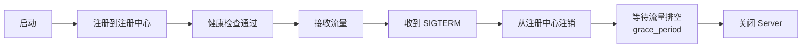

# Bootstrap 集成与网关插件

go-wind-plugins 还提供网关、远程调用等高级插件，与 Bootstrap 深度集成。

## 一、API 网关

### 1.1 网关路由

```go
import gatewayPlugin "github.com/tx7do/go-wind-plugins/gateway"

gw := gatewayPlugin.New(
    gatewayPlugin.WithAddr(":8080"),
    gatewayPlugin.WithRoutes([]gatewayPlugin.Route{
        {Prefix: "/api/users", Service: "user-service", StripPrefix: true},
        {Prefix: "/api/orders", Service: "order-service", StripPrefix: true},
        {Prefix: "/api/products", Service: "product-service", StripPrefix: false},
    }),
    gatewayPlugin.WithLoadBalancer("round_robin"),
)
```

### YAML 配置

```yaml
gateway:
  addr: ":8080"
  load_balancer: round_robin        # round_robin | random | weighted | least_conn
  routes:
    - prefix: /api/users
      service: user-service
      strip_prefix: true
      timeout: 10s
      retry: 3
    - prefix: /api/orders
      service: order-service
      strip_prefix: true
  middleware:
    - rate_limit
    - jwt_auth
    - cors
    - tracing
```

### 1.2 负载均衡策略

| 策略 | 说明 |
|------|------|
| `round_robin` | 轮询（默认） |
| `random` | 随机 |
| `weighted` | 加权（根据服务实例权重） |
| `least_conn` | 最少连接 |
| `consistent_hash` | 一致性哈希（会话保持） |

## 二、服务客户端

### 2.1 gRPC 客户端

```go
import grpcClientPlugin "github.com/tx7do/go-wind-plugins/client/grpc"

conn, _ := grpcClientPlugin.New(
    grpcClientPlugin.WithTarget("consul://user-service"),
    grpcClientPlugin.WithBalancer("round_robin"),
    grpcClientPlugin.WithTimeout(5*time.Second),
    grpcClientPlugin.WithInterceptor(retryInterceptor),
)

userClient := pb.NewUserServiceClient(conn)
resp, _ := userClient.GetUser(ctx, &pb.GetUserRequest{Id: "123"})
```

### 2.2 HTTP 客户端

```go
import httpClientPlugin "github.com/tx7do/go-wind-plugins/client/http"

client := httpClientPlugin.New(
    httpClientPlugin.WithBaseURL("http://user-service"),
    httpClientPlugin.WithTimeout(5*time.Second),
    httpClientPlugin.WithRetry(3, 100*time.Millisecond),
    httpClientPlugin.WithTracing(true),
)
```

## 三、健康检查

```go
import healthPlugin "github.com/tx7do/go-wind-plugins/health"

healthChecker := healthPlugin.New(
    healthPlugin.WithCheck("database", func(ctx context.Context) error {
        return dbClient.Ping(ctx)
    }),
    healthPlugin.WithCheck("redis", func(ctx context.Context) error {
        _, err := redisCache.Ping(ctx)
        return err
    }),
    healthPlugin.WithCheck("kafka", func(ctx context.Context) error {
        return kafkaBroker.Ping(ctx)
    }),
)
```

### HTTP 端点

```go
// 自动注册 /health 和 /ready 端点
// GET /health → liveness check（进程存活）
// GET /ready  → readiness check（依赖就绪）
```

```yaml
health:
  enabled: true
  liveness_path: /health
  readiness_path: /ready
  checks:
    database:
      interval: 10s
      timeout: 3s
      failures: 3        # 连续失败 3 次标记为不健康
    redis:
      interval: 5s
      timeout: 1s
```

## 四、优雅上下线

结合服务注册与健康检查实现：



```yaml
registry:
  consul:
    addr: "localhost:8500"
    deregister:
      critical_timeout: 60s       # 不健康后 60s 自动注销
    health_check:
      interval: 10s
      deregister_after: 30s

lifecycle:
  grace_period: 15s               # 收到信号后等待 15s
  shutdown_timeout: 30s           # 优雅关闭超时
```

## 五、事件驱动

### Webhook 回调

```go
import webhookPlugin "github.com/tx7do/go-wind-plugins/webhook"

wh := webhookPlugin.New(
    webhookPlugin.WithRetry(3, 5*time.Second),
    webhookPlugin.WithTimeout(10*time.Second),
    webhookPlugin.WithHMACKey("webhook-secret"),
)

wh.Subscribe("order.created", "https://partner.com/webhooks/order")
wh.Publish(ctx, "order.created", orderData)
```

## 六、定时任务编排

在 Bootstrap 中通过注解/配置编排定时任务：

```yaml
tasks:
  - name: daily-report
    schedule: "0 9 * * *"          # 每天 9 点
    handler: report.DailyReport
    queue: low

  - name: cleanup-tokens
    schedule: "0 0 * * 0"          # 每周日
    handler: auth.CleanupExpiredTokens
    queue: default
```

## 相关文档

- [插件总览](./plugins-intro.md)
- [插件配置系统](./plugins-config.md)
- [声明式启动器介绍](./bootstrap-intro.md)
- [声明式中间件编排](./bootstrap-middleware.md)
