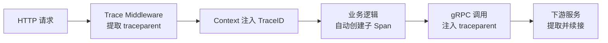

# 链路追踪插件

go-wind-plugins 提供分布式链路追踪适配器，遵循 OpenTelemetry 标准，支持 Jaeger、Zipkin 等。

## 一、Tracer 接口

```go
type Tracer interface {
    StartSpan(ctx context.Context, name string, opts ...SpanOption) (context.Context, Span)
    Inject(ctx context.Context, carrier propagator.TextMapCarrier)
    Extract(ctx context.Context, carrier propagator.TextMapCarrier) context.Context
    Close(ctx context.Context) error
}

type Span interface {
    End()
    SetAttributes(kv ...KeyValue)
    AddEvent(name string, ...EventOption)
    RecordError(err error)
    SetStatus(code StatusCode, msg string)
}
```

## 二、适配器列表

| 适配器 | 导入路径 | 后端 |
|--------|---------|------|
| OTLP | `plugins/tracer/otlp` | OpenTelemetry Collector（通用） |
| Jaeger | `plugins/tracer/jaeger` | Jaeger UI |
| Zipkin | `plugins/tracer/zipkin` | Zipkin UI |

## 三、OTLP（推荐）

```go
import _ "github.com/tx7do/go-wind-plugins/tracer/otlp"
```

### YAML 配置

```yaml
tracer:
  otlp:
    endpoint: "localhost:4317"        # OTLP gRPC endpoint
    insecure: true
    sample_ratio: 1.0                 # 采样率 (0~1)
    service_name: my-service
    resource:
      deployment.environment: production
      host.name: ${HOSTNAME}
```

## 四、Jaeger

```go
import _ "github.com/tx7do/go-wind-plugins/tracer/jaeger"
```

### YAML 配置

```yaml
tracer:
  jaeger:
    endpoint: "http://jaeger:14268/api/traces"
    agent_host: "jaeger-agent"
    agent_port: 6831
    sampler_type: const              # const | probabilistic | ratelimiting | remote
    sampler_param: 1                 # 1 = 全采样
    service_name: my-service
```

## 五、Zipkin

```go
import _ "github.com/tx7do/go-wind-plugins/tracer/zipkin"
```

### YAML 配置

```yaml
tracer:
  zipkin:
    endpoint: "http://zipkin:9411/api/v2/spans"
    sample_ratio: 0.5
    service_name: my-service
```

## 六、在代码中使用

### 6.1 创建 Span

```go
import "github.com/tx7do/go-wind/tracer"

func handleOrder(ctx context.Context, order *Order) error {
    ctx, span := tracer.StartSpan(ctx, "handleOrder")
    defer span.End()

    span.SetAttributes(
        tracer.String("order.id", order.ID),
        tracer.Int("item.count", len(order.Items)),
    )

    if err := validate(ctx, order); err != nil {
        span.RecordError(err)
        span.SetStatus(tracer.StatusError, err.Error())
        return err
    }

    return nil
}
```

### 6.2 跨服务传播

追踪信息自动通过 HTTP Header / gRPC Metadata 传播：

```go
// HTTP：自动注入 traceparent Header
// gRPC：自动注入 x-trace-* Metadata
// 调用其他服务时无需手动传播
```

### 6.3 添加事件

```go
ctx, span := tracer.StartSpan(ctx, "process-payment")
defer span.End()

span.AddEvent("payment.started")
// ... 处理支付
span.AddEvent("payment.completed",
    tracer.String("transaction.id", txID),
)
```

## 七、采样策略

| 策略 | 说明 | 适用场景 |
|------|------|---------|
| `const(1)` | 全采样 | 开发/测试 |
| `probabilistic(0.1)` | 10% 采样 | 生产环境 |
| `ratelimiting(100)` | 100 span/s | 限流采样 |
| `remote` | 动态配置 | 大规模集群 |

## 八、与 Context 集成



TraceID 同时写入 go-wind Context，可在日志中关联：

```go
ctx, span := tracer.StartSpan(ctx, "operation")
traceID := wind.TraceID(ctx)

log.Info("processing", log.String("trace_id", traceID))
// 日志中自动携带 trace_id，可跳转到 Jaeger UI
```

## 相关文档

- [Context 传播](./core-context.md)
- [插件配置系统](./plugins-config.md)
- [指标监控插件](./plugins-metrics.md)
