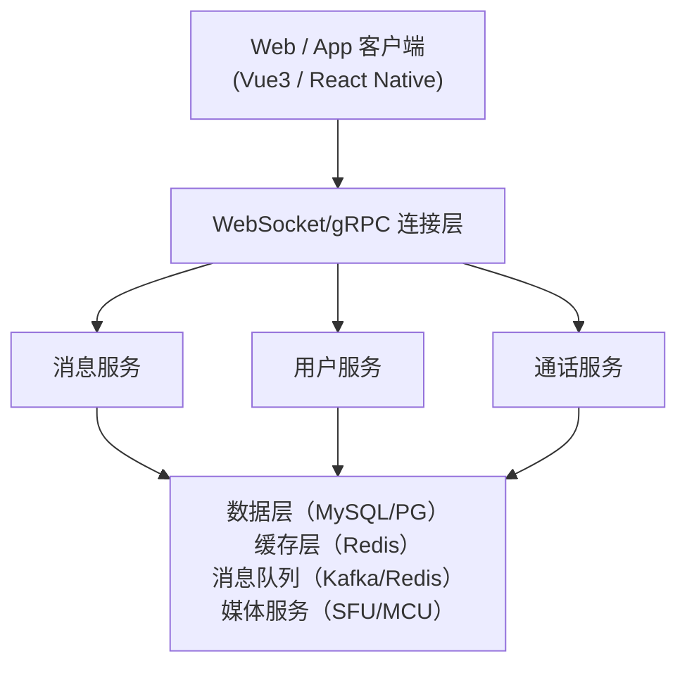
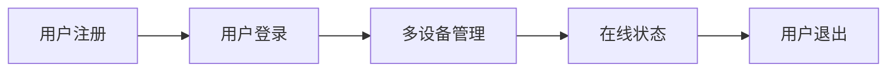
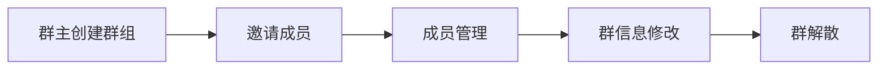

# GoWind IM 产品介绍

GoWind IM 是一个轻量级但功能完整的即时通讯组件，基于 Go 后端和 Vue3
前端构建。支持私聊、群聊、消息推送、在线状态检测、文件传输等实时通讯功能，可独立使用或无缝集成到其他应用中。

## 一、核心特性

### 1. 私聊和群聊

- **一对一私聊**：支持加密的端对端通讯
- **群组聊天**：支持创建、管理群组和群内讨论
- **群组权限**：群主、管理员、普通成员等角色管理
- **频道模式**：支持频道式的单向消息广播
- **分组管理**：联系人、群组可分组管理

### 2. 消息功能

- **多种消息类型**：文本、图片、视频、文件、语音、视频通话等
- **消息加密**：支持 E2E 端对端加密
- **消息搜索**：支持全文搜索历史消息
- **消息撤回**：支持发送后一定时间内撤回消息
- **消息已读回执**：显示单聊和群聊的消息已读状态
- **消息引用和转发**：支持引用和转发消息

### 3. 在线状态管理

- **在线状态检测**：实时显示用户在线离线状态
- **自定义状态**：支持自定义用户状态信息
- **最后活跃时间**：记录用户最后活跃时间
- **设备识别**：识别用户登录的设备
- **多设备同步**：支持一个账号多设备登录

### 4. 消息推送

- **实时通知**：Web、App 消息实时推送
- **离线消息**：离线期间的消息缓存和推送
- **推送配置**：支持自定义推送规则和免打扰时段
- **智能推送**：根据用户行为智能决定推送方式
- **推送分析**：推送送达率和用户反馈统计

### 5. 文件传输

- **文件上传下载**：支持各种格式文件传输
- **文件转链**：生成文件分享链接
- **文件预览**：图片、视频、文档等支持在线预览
- **断点续传**：大文件支持断点续传和秒传
- **文件过期**：自动清理过期文件

### 6. 音视频通话

- **语音通话**：支持点对点语音通话
- **视频通话**：支持点对点视频通话
- **群组通话**：支持多人音视频会议
- **屏幕共享**：支持屏幕共享展示
- **通话录制**：支持通话录音和录屏

### 7. 安全性

- **身份认证**：支持 JWT、OAuth 等认证方式
- **端对端加密**：消息加密传输
- **内容过滤**：垃圾信息和敏感词过滤
- **设备管理**：管理登录设备和远程登出
- **审计日志**：记录敏感操作日志

### 8. 可扩展性

- **插件系统**：支持开发自定义插件
- **Webhook 支持**：与第三方系统集成
- **API 开放**：完整的 REST API 和 WebSocket API
- **客户端 SDK**：提供多种编程语言的 SDK
- **自定义字段**：支持扩展用户和消息属性

## 二、应用场景

### 客服系统

实时客服对话，支持排队、转接、问题分类等。

### 社交应用

支持私聊、群聊、动态、朋友圈等社交功能。

### 团队协作

内部团队沟通、项目讨论、日志共享等协作工具。

### 游戏社交

游戏内玩家沟通、行会聊天、战队语音等。

### 在线教育

师生沟通、班级讨论、课堂提问等教学辅助。

### IoT 通知

设备状态变化通知、告警推送等。

## 三、技术架构

### 技术栈

| 层次       | 技术                               | 说明             |
|----------|----------------------------------|----------------|
| **后端**   | Go 1.18+、Kratos 框架、gRPC          | 高性能、低延迟的实时通讯   |
| **前端**   | Vue3、TypeScript、WebSocket、WebRTC | 现代化 Web 和移动客户端 |
| **消息队列** | Redis / Kafka                    | 消息存储和分发        |
| **数据库**  | MySQL / PostgreSQL               | 用户、消息等数据存储     |
| **缓存**   | Redis                            | 在线状态、会话缓存      |
| **媒体服务** | SFU / MCU                        | 音视频 P2P 或中继    |

### 系统架构



## 四、核心功能模块

### 1. 用户管理



- 账号注册和登录
- 多设备支持
- 在线状态管理
- 用户资料编辑

### 2. 联系人管理

- 添加、删除、封禁联系人
- 联系人分组
- 联系人昵称和备注
- 黑名单管理

### 3. 消息功能

- 消息类型：文本、图片、视频、文件、语音
- 消息状态：发送中、已发送、已送达、已读
- 消息操作：编辑、撤回、删除、引用、转发
- 消息搜索和存档

### 4. 群组管理



- 创建和解散群组
- 成员邀请和移除
- 群组权限管理
- 群公告和群描述

### 5. 文件管理

- 文件上传和下载
- 文件分享和权限
- 文件预览
- 存储空间管理

## 五、快速开始

### 1. 在线演示

敬请期待...

### 2. 环境准备

- Go 1.18+
- Node.js 16+
- MySQL 8.0+ 或 PostgreSQL 12+
- Redis 6.0+

### 3. 快速启动

```bash
git clone https://github.com/tx7do/go-wind-im.git
cd go-wind-im

# 后端启动
cd backend
make init
gow run im

# 前端启动
cd ../frontend
pnpm install
pnpm dev
```

### 4. 访问地址

- Web UI：http://localhost:3000
- API 文档：http://localhost:7800/docs/
- WebSocket：ws://localhost:7800/ws

## 六、API 概览

### 用户 API

```bash
# 用户注册
POST /api/v1/auth/register
{
  "username": "user1",
  "password": "password123",
  "email": "user@example.com"
}

# 用户登录
POST /api/v1/auth/login
{
  "username": "user1",
  "password": "password123"
}

# 获取用户信息
GET /api/v1/users/{user_id}

# 更新用户信息
PUT /api/v1/users/{user_id}
{
  "nickname": "新昵称",
  "avatar": "头像URL"
}
```

### 消息 API

```bash
# 发送消息
POST /api/v1/messages
{
  "type": "text",
  "to_user_id": "user2",
  "content": "Hello"
}

# 获取聊天历史
GET /api/v1/messages/{user_id}?page=1&limit=20

# 标记消息已读
PUT /api/v1/messages/{message_id}/read

# 撤回消息
DELETE /api/v1/messages/{message_id}
```

### 群组 API

```bash
# 创建群组
POST /api/v1/groups
{
  "name": "我的群组",
  "description": "群组描述",
  "members": ["user2", "user3"]
}

# 获取群组信息
GET /api/v1/groups/{group_id}

# 获取群组消息
GET /api/v1/groups/{group_id}/messages

# 添加群成员
POST /api/v1/groups/{group_id}/members
{
  "member_ids": ["user4", "user5"]
}

# 移除群成员
DELETE /api/v1/groups/{group_id}/members/{member_id}
```

## 七、WebSocket 消息格式

```javascript
// 连接 WebSocket
const ws = new WebSocket('ws://localhost:7800/ws?token=your_token');

// 发送消息
ws.send(JSON.stringify({
    type: 'message',
    to_user_id: 'user2',
    content: 'Hello',
    message_type: 'text'
}));

// 接收消息
ws.onmessage = (event) => {
    const message = JSON.parse(event.data);
    console.log('Received:', message);
};

// 消息类型
{
    type: 'message',        // 消息
        type
:
    'status',         // 在线状态
        type
:
    'typing',         // 正在输入
        type
:
    'read',           // 已读回执
        type
:
    'notification'    // 系统通知
}
```

## 八、部署指南

### Docker 部署

```bash
docker build -t gowind-im:latest .
docker run -d \
  -p 7800:7800 \
  -e DATABASE_DSN="your-database-dsn" \
  -e REDIS_ADDR="your-redis-addr" \
  gowind-im:latest
```

### Docker Compose 部署

```yaml
version: '3.8'
services:
  mysql:
    image: mysql:8.0
    environment:
      MYSQL_ROOT_PASSWORD: root
      MYSQL_DATABASE: im
    ports:
      - "3306:3306"
    volumes:
      - mysql_data:/var/lib/mysql

  redis:
    image: redis:7.0
    ports:
      - "6379:6379"

  im:
    build: .
    ports:
      - "7800:7800"
    depends_on:
      - mysql
      - redis
    environment:
      DATABASE_DSN: root:root@tcp(mysql:3306)/im
      REDIS_ADDR: redis:6379

volumes:
  mysql_data:
```

## 九、集成 SDK

### JavaScript/TypeScript SDK

```javascript
import {IMClient} from '@gowind/im-sdk';

const client = new IMClient({
    serverUrl: 'ws://localhost:7800',
    userId: 'user1',
    token: 'your_token'
});

// 连接
await client.connect();

// 发送消息
await client.sendMessage({
    to: 'user2',
    type: 'text',
    content: 'Hello'
});

// 接收消息
client.on('message', (message) => {
    console.log('New message:', message);
});

// 断开连接
await client.disconnect();
```

### Go SDK

```go
import "github.com/tx7do/go-wind-im/sdk"

client := sdk.NewClient("ws://localhost:7800", "user1", "token")
err := client.Connect()
if err != nil {
  log.Fatal(err)
}
defer client.Close()

// 发送消息
msg := &sdk.Message{
  To:      "user2",
  Type:    "text",
  Content: "Hello",
}
err = client.SendMessage(msg)
```

## 十、常见问题

### Q: IM 能支持多少并发用户？

A: 在合理的硬件配置下，单机可支持数万并发连接。通过水平扩展可支持更多用户。

### Q: 如何保证消息不丢失？

A: 使用消息队列（Kafka/Redis）持久化，以及数据库存储确保可靠性。

### Q: 是否支持消息加密？

A: 支持端对端加密和传输层加密。

### Q: 离线消息如何处理？

A: 离线消息缓存在服务器，用户上线后自动同步。

### Q: 是否支持群组消息？

A: 完全支持，包括群聊、频道等模式。

### Q: 如何实现消息推送通知？

A: 集成第三方推送服务（APNs、FCM、极光等）或自建推送系统。

## 十一、获取帮助

- 📖 [快速开始指南](/guide/getting-started.md)
- 📧 邮件：<yanglinbo@gmail.com>
- 💬 讨论：[GitHub Discussions](https://github.com/tx7do/go-wind-im/discussions)
- 🐛 反馈：[GitHub Issues](https://github.com/tx7do/go-wind-im/issues)

---

更详细的安装和使用说明，请参考 [IM 安装指南](/im/installation.md)。
