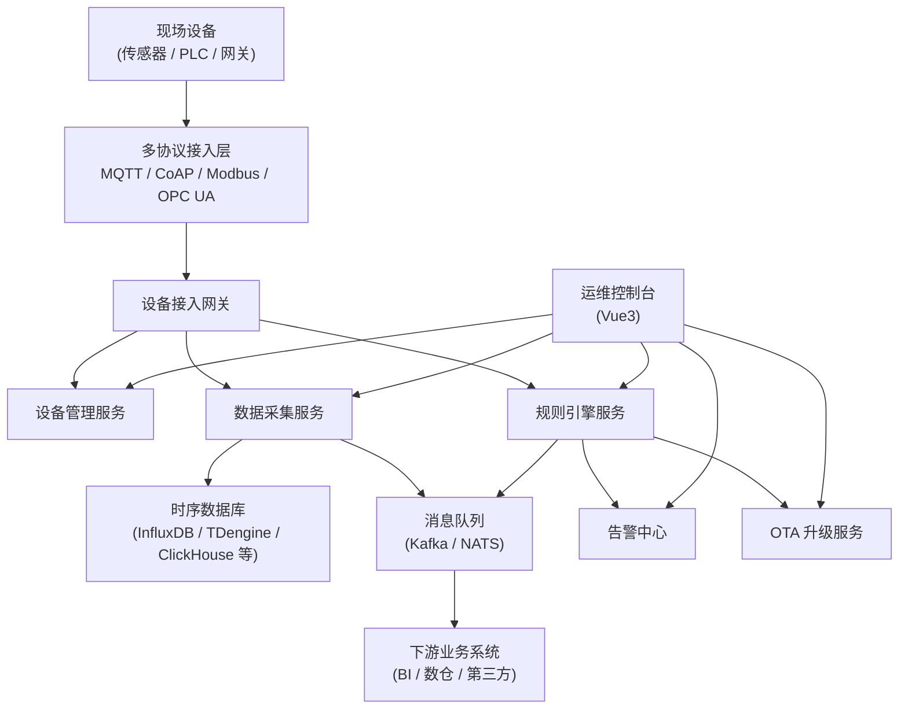
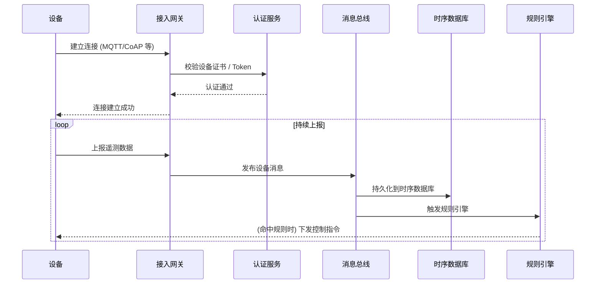

# GoWind IoT 产品介绍

GoWind IoT 是一套面向 B 端市场的企业级物联网管理与数据采集平台，基于 Go 后端和 Vue3 前端构建。平台覆盖**设备接入 → 数据采集 → 规则引擎 → 告警处置 → 远程运维 → OTA 升级**的全链路能力，支持各类工业协议与时序数据库，为智慧城市、工业物联网、能源园区、楼宇园区等场景提供开箱即用的私有化部署方案。

> GoWind IoT 为**闭源商业化产品**，提供企业级授权与私有化交付，不开放源代码。如需商务洽谈，请参见文末联系方式。

## 一、产品定位

GoWind IoT 聚焦「**设备统一接入、数据统一治理、业务统一编排**」三大核心目标，解决 B 端客户在物联网项目交付中的共性痛点：

- **协议碎片化**：现场设备协议繁多（MQTT、CoAP、Modbus、OPC UA、TCP/UDP 自定义协议等），接入成本高
- **数据孤岛严重**：不同厂商、不同业务的设备数据分散，难以统一治理与二次利用
- **运维人力紧张**：设备规模大、分布广，现场运维成本居高不下
- **升级风险高**：固件分发、灰度、回滚缺乏统一管控，事故频发
- **告警响应慢**：异常发现滞后，缺少从告警到工单到处置的闭环机制

GoWind IoT 通过一套平台统一覆盖以上能力，帮助客户将交付周期从「月」压缩到「周」，显著降低 TCO。

## 二、核心特性

### 1. 设备接入

- **多协议接入网关**：原生支持 MQTT / CoAP / HTTP / WebSocket / Modbus (RTU/TCP) / OPC UA / BACnet / CAN / Zigbee / LoRaWAN 等主流协议，并提供自定义 TCP/UDP 协议扩展框架
- **物模型管理**：定义设备的属性、服务、事件三类模型，支持复杂嵌套结构与版本管理
- **设备生命周期**：覆盖注册、激活、在线、休眠、离线、注销全生命周期，状态实时可查
- **设备分组与标签**：支持按地域、业务、批次等多维度对设备分组打标，灵活筛选
- **设备证书与认证**：一机一密 / 一型一密认证，支持 X.509 证书、Token、白名单等多种认证方式
- **设备影子**：缓存设备最近一次上报状态，支持离线设备的状态查询与指令缓存下发

### 2. 数据采集

- **高并发采集**：单节点支持百万级设备长连接，水平扩容线性提升吞吐
- **多时序数据库适配**：支持 InfluxDB、TDengine、TimescaleDB、ClickHouse、IoTDB、DolphinDB 等主流时序数据库，通过 YAML 声明式切换
- **数据清洗与计算**：内置流式计算引擎，支持数据过滤、字段映射、单位换算、窗口聚合（滚动/滑动/会话）
- **边缘采集 Agent**：提供轻量级边缘网关 Agent，支持断网缓存、本地规则触发、网络恢复补传
- **数据订阅分发**：通过 Kafka / NATS / RabbitMQ 将采集数据分发到下游业务系统（BI、数仓、第三方平台）
- **数据质量管理**：支持缺失值检测、异常值剔除、数据平滑等数据治理策略

### 3. 规则引擎

- **可视化编排**：拖拽式流程编排界面，支持条件节点、过滤节点、转换节点、动作节点
- **多种触发源**：设备上报、设备状态变更、定时调度、外部 API 调用均可作为触发源
- **丰富的动作类型**：调用 API、下发设备指令、发送告警、写入数据库、推送到 IM/钉钉/企业微信、触发其他规则
- **复杂事件处理 (CEP)**：支持窗口聚合、模式匹配、跨设备关联分析，例如「A 设备温度持续 5 分钟高于 80°C 且同组 B 设备湿度低于 20%」
- **规则版本管理**：规则可发布、回滚、灰度发布，支持环境隔离
- **脚本扩展**：内置 Lua / JavaScript 脚本节点，满足复杂业务逻辑

### 4. 远程运维

- **设备远程控制**：通过 Web 控制台直接下发指令到单个或批量设备，支持指令模板
- **实时设备调试**：在线查看设备的实时上报数据、连接日志、下发历史，支持命令行交互
- **批量任务**：支持创建批量下发、批量配置、批量重启等运维任务，支持分批执行与失败重试
- **运维日志与审计**：所有运维操作全程记录，可追溯到具体操作人、时间、参数
- **运维工单闭环**：告警自动生成工单，分派到责任人，跟踪处置进度直至闭环
- **拓扑可视化**：自动绘制设备与网关的网络拓扑，异常链路高亮提示

### 5. OTA 升级

- **固件版本管理**：支持固件上传、版本号管理、签名校验、变更日志
- **灵活的升级策略**：支持静态分组升级、动态规则筛选升级、按比例灰度升级
- **分批次与限速**：支持配置每批次并发数、间隔时间，避免带宽打满
- **升级窗口**：可配置仅在指定时段执行升级，避开业务高峰
- **失败自动回滚**：升级失败自动触发回滚到上一稳定版本，保障业务连续
- **升级报表**：完整记录每次升级任务的成功率、耗时、失败原因分布

### 6. 告警中心

- **多级告警**：支持严重、警告、提示、信息四级告警分级，独立配置处置流程
- **告警规则**：阈值告警、连续触发告警、波动告警、离线告警、预测告警（基于趋势模型）
- **告警去重与抑制**：同一设备的相似告警自动去重，父设备故障时抑制子设备告警，避免告警风暴
- **多渠道通知**：站内信、邮件、短信、IM（GoWind IM / 钉钉 / 企微 / 飞书）、Webhook
- **告警值班排班**：按团队/轮班机制分派告警，未及时响应自动升级
- **告警统计分析**：告警趋势、TopN 告警源、平均响应时长等可视化报表

## 三、应用场景

### 智慧城市

城市照明、环境监测、智慧停车、井盖/垃圾桶/消防栓等城市基础设施的统一接入与监管，支撑城市运行「一网统管」。

### 工业物联网

工厂设备状态监控、能耗管理、产线协同、预测性维护，帮助企业构建数字化车间与智能工厂。

### 智慧能源

风电、光伏、储能、配电等能源设备的远程监控与调度，支持多电站集中运营。

### 智慧园区 / 楼宇

园区空调、照明、电梯、消防、门禁、能耗等子系统统一接入，实现楼宇自控与节能优化。

### 智慧农业

大棚温湿度、土壤墒情、水肥一体化、虫情监测等农业物联网应用。

### 智慧水务 / 燃气

管网压力、流量、水质、燃气泄漏等监测，支撑城市生命线安全运行。

## 四、技术架构

### 技术栈

| 层次 | 技术 | 说明 |
|---|---|---|
| **接入层** | MQTT / CoAP / Modbus / OPC UA / 自定义协议 | 多协议接入网关，水平扩展 |
| **服务层** | Go 1.18+、Kratos 框架、gRPC | 高并发、低延迟、微服务架构 |
| **计算层** | 规则引擎 + 流式计算 + CEP | 实时数据处理与复杂事件检测 |
| **存储层** | MySQL / PostgreSQL + 时序数据库 | 关系数据 + 时序数据分离存储 |
| **缓存层** | Redis | 设备状态、会话、热点数据缓存 |
| **消息层** | Kafka / NATS / Redis Stream | 设备消息解耦与分发 |
| **前端** | Vue3、TypeScript、ECharts、Three.js | 可视化大屏与 3D 拓扑展示 |

### 系统架构



### 设备连接流程



## 五、核心能力对比

| 能力维度 | 开源 IoT 平台 | GoWind IoT |
|---|---|---|
| 协议覆盖度 | 基础协议为主，扩展需自行开发 | 工业协议全覆盖 + 自定义协议扩展框架 |
| 多时序库支持 | 通常绑定单一数据库 | 支持 6+ 主流时序数据库，声明式切换 |
| 规则引擎复杂度 | 简单规则脚本 | 可视化编排 + CEP + 脚本扩展 |
| OTA 灰度能力 | 基础批量升级 | 灰度发布 + 失败回滚 + 升级窗口 |
| 告警闭环 | 仅通知 | 通知 + 值班 + 工单 + 统计分析 |
| 商业授权 | 需自行评估开源许可 | 商业授权，无许可证合规风险 |
| 信创合规 | 部分依赖国外运行时 | 纯 Go 静态编译，适配国产 CPU/OS |

## 六、商业与授权

GoWind IoT 为**闭源商业产品**，采用企业授权模式交付：

- **永久授权**：一次性授权费 + 年度服务费，适合长期私有化运营的客户
- **订阅授权**：按年订阅，包含版本升级与技术支持，适合快速迭代的项目
- **项目定制**：基于 GoWind IoT 进行场景化定制开发，交付全套源码级别的定制版本
- **OEM 贴牌**：支持将产品 OEM 嵌入到客户自有品牌方案中

所有授权均包含：

- 私有化部署包（单机 / 集群 / K8s）
- 完整产品文档与运维手册
- 基础技术培训
- 1 年期远程技术支持

## 七、快速开始

GoWind IoT 为闭源商业产品，不提供公开下载。如需体验演示或获取评估方案，请联系商务团队。

### 1. 获取授权与部署包

联系商务团队（见文末）获取以下材料：

- GoWind IoT 部署包（Docker 镜像 / 二进制包）
- 商业授权证书
- 部署评估问卷（用于规划硬件资源）

### 2. 环境准备（最小化部署）

- Linux x86_64 / ARM64（支持鲲鹏、飞腾等国产 CPU）
- 8 核 CPU / 16GB 内存 / 200GB 磁盘
- Docker 20.10+ 或 K8s 1.20+
- MySQL 8.0+ 或 PostgreSQL 12+
- Redis 6.0+
- 任选一种时序数据库（推荐 TDengine 或 InfluxDB）

### 3. 快速启动

```bash
# 解压部署包
tar -xzf gowind-iot-<version>.tar.gz
cd gowind-iot

# 编辑配置（数据库连接、授权证书路径等）
vim .env

# 一键启动
docker-compose up -d

# 查看服务状态
docker-compose ps
```

### 4. 访问地址

- 管理控制台：https://iot.your-domain.com
- 设备接入地址：mqtt://iot.your-domain.com:1883（TLS: 8883）
- API 文档（Swagger）：https://iot.your-domain.com/docs/

> 详细的部署步骤、集群规划、高可用方案、信创适配清单等内容，请参阅 [安装部署指南](/iot/installation.md)。

## 八、常见问题

### Q: GoWind IoT 是开源的吗？

A: 不是。GoWind IoT 是闭源商业产品，不开放源代码，通过企业授权方式交付私有化部署包。

### Q: 支持哪些设备协议？

A: 原生支持 MQTT、CoAP、HTTP、WebSocket、Modbus (RTU/TCP)、OPC UA、BACnet、CAN、Zigbee、LoRaWAN 等主流协议；对于私有 TCP/UDP 协议，平台提供协议扩展框架，可通过配置或脚本快速适配。

### Q: 支持哪些时序数据库？

A: 支持 InfluxDB 1.x/2.x、TDengine 2.x/3.x、TimescaleDB、ClickHouse、IoTDB、DolphinDB，以及基于 MySQL/PostgreSQL 的时序扩展方案。可以在配置文件中声明式切换，业务层无需改动。

### Q: 单节点可以承载多少设备？

A: 在典型硬件配置（16C32G）下，单节点可稳定承载 50 万 - 100 万设备长连接，日处理消息量可达亿级。通过集群水平扩展，整体可支撑千万级设备。

### Q: 是否支持私有 TCP 协议接入？

A: 支持。平台提供「自定义协议扩展框架」，通过编写协议解析脚本（Lua / Go Plugin）即可接入任意基于 TCP/UDP 的私有协议，无需修改平台核心代码。

### Q: 是否支持边缘部署？

A: 支持。GoWind IoT 提供轻量级边缘 Agent，可部署在工业网关、边缘服务器上，实现本地数据采集、断网缓存、本地规则触发与断点续传。

### Q: 是否支持国产化（信创）部署？

A: 完全支持。GoWind IoT 基于 Go 语言静态编译，原生适配鲲鹏、飞腾、龙芯等国产 CPU 以及麒麟、统信 UOS 等国产操作系统，已通过主流信创生态兼容性认证。

### Q: 与 GoWind 生态其他产品的关系？

A: GoWind IoT 与生态内产品深度协同：

- 共享 **GoWind Admin** 的用户、角色、权限体系，无需重复建设
- 告警通知可对接 **GoWind IM** 实现实时消息推送与值班群通知
- 设备数据可流转到 **GoWind UBA** 进行用户行为分析，辅助业务决策
- 底层基于 **GoWind 框架**（go-wind + plugins + bootstrap）构建，具备一致的架构风格与可观测性

### Q: 如何获取演示环境？

A: 请联系商务团队预约演示（联系方式见下文）。我们提供针对不同行业场景的演示环境与解决方案讲解。

## 九、获取帮助

- **商务洽谈**：微信 `yang_lin_bo`（添加请备注：公司-姓名-IoT 需求）
- **技术咨询**：邮箱 `yanglinbo@gmail.com`
- **生态主页**：<https://www.gowind.cloud>
- **GoWind 生态文档**：[快速开始指南](/guide/getting-started.md) | [框架文档](/framework/intro.md) | [Admin 文档](/admin/intro.md)

---

详细的安装、部署、配置、运维指引，请参阅 [安装部署指南](/iot/installation.md)。
