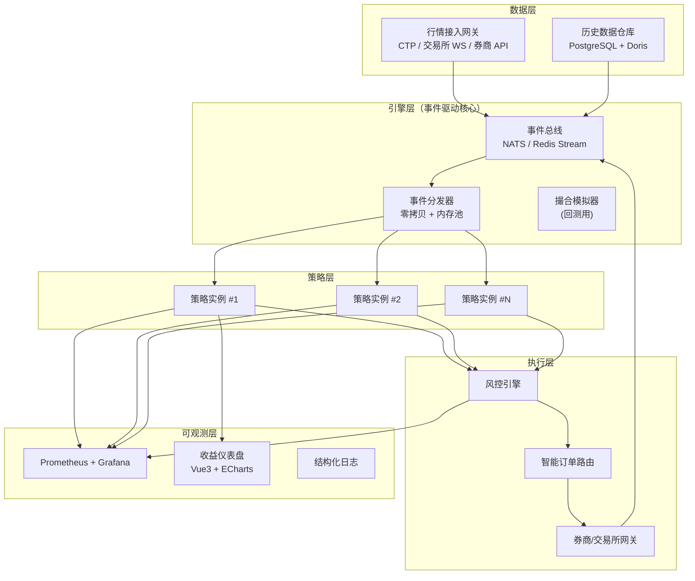
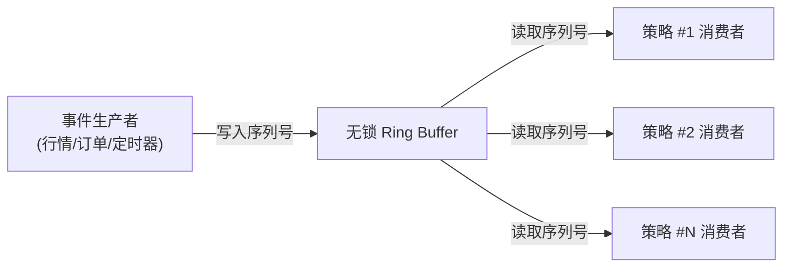
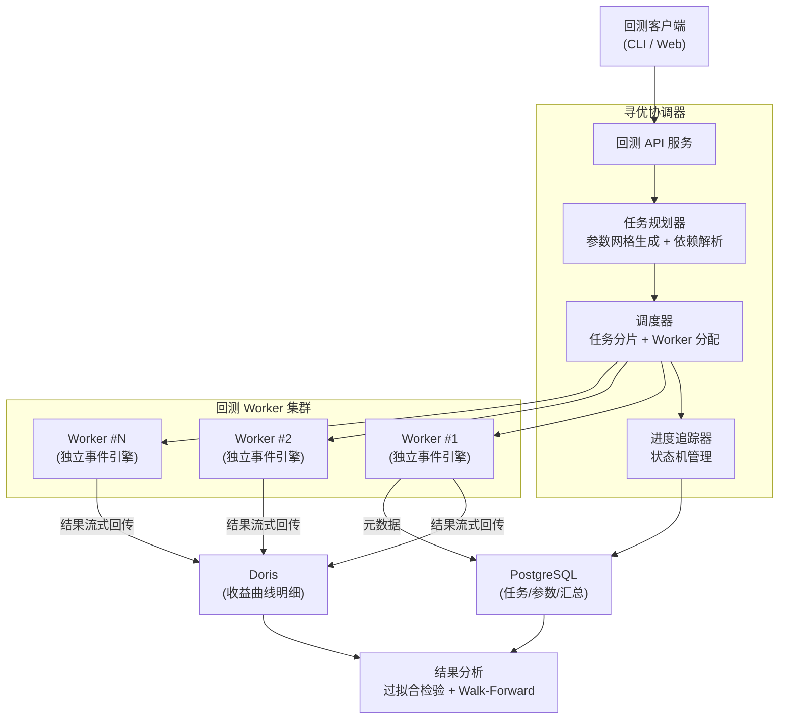
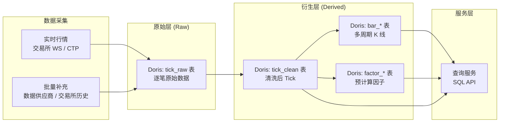
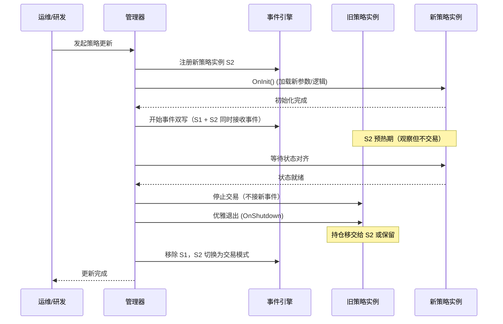

# 技术架构

> 本页面拆解 GoWind Quant 的核心工程实现。所有内容聚焦于架构决策与工程方法，不涉及策略逻辑或业务数据。

## 一、整体架构



架构设计的三个核心原则：

1. **事件驱动** —— 所有组件通过事件总线通信，组件之间无直接调用
2. **回测/实盘同构** —— 策略代码不感知当前是回测还是实盘，差异在引擎层注入
3. **风控前置** —— 任何订单在离开策略层之前必须经过风控引擎检查

## 二、事件驱动引擎

### 为什么用事件驱动

量化交易本质上是**复杂事件处理（CEP）**。一个策略的决策可能依赖于一连串事件的组合：「价格突破 + 成交量放大 + 订单簿不平衡 + 持仓未超限」。这种场景下，事件驱动架构相比请求-响应模型有天然优势。

事件驱动的核心收益：

- **回测/实盘一致** —— 回测只需向总线注入历史事件，策略代码无需改动
- **解耦** —— 策略不关心数据来源，数据源不关心谁在消费
- **可观测** —— 每个事件都有完整链路，便于事后回放与归因

### 事件模型

```go
// 事件类型
type EventType int

const (
    TickEvent EventType = iota      // Tick 行情
    BarEvent                        // K 线
    TradeEvent                      // 成交
    OrderEvent                      // 订单状态变更
    TimerEvent                      // 定时器
    RiskEvent                       // 风控触发
    CustomEvent                     // 策略自定义事件
)

// 事件统一结构
type Event struct {
    Type      EventType
    Timestamp time.Time      // 事件原始时间（交易所时间）
    RecvTime  time.Time      // 引擎接收时间（用于延迟统计）
    Source    string         // 事件来源
    Payload   interface{}    // 类型特定的负载
    TraceID   string         // 全链路追踪 ID
}
```

### 事件分发

事件分发是性能关键路径 —— 做市策略要求从 Tick 到达到策略响应在微秒级完成。

**核心优化手段：**

#### 1. 零拷贝

行情数据（订单簿、Tick）通过**环形缓冲区 + 偏移量引用**传递，避免结构体拷贝：

```go
// 事件分发持有的是 RingBuffer 中的索引
type EventRef struct {
    RingIndex uint64    // 指向 RingBuffer 的槽位
    EventType EventType
}
```

策略从 RingBuffer 读取数据，不产生拷贝。RingBuffer 的容量按品种数 × 每品种最大深度计算，预分配固定大小。

#### 2. 无锁分发

对于单写多读的场景，使用无锁环形缓冲区（类似 LMAX Disruptor）：



每个消费者维护自己的读取游标，互不阻塞。生产者通过 CAS 更新写入游标，消费者通过原子读取游标。

#### 3. 内存池

事件对象本身通过 `sync.Pool` 复用，避免高频分配导致的 GC 压力：

```go
var eventPool = sync.Pool{
    New: func() interface{} {
        return &Event{}
    },
}

func acquireEvent() *Event {
    return eventPool.Get().(*Event)
}

func releaseEvent(e *Event) {
    e.reset()
    eventPool.Put(e)
}
```

### GC 抖动治理

Go 的 GC 是做市策略的天然敌人。我们的治理策略：

| 手段 | 目的 |
|---|---|
| 零拷贝分发 | 减少关键路径上的对象分配 |
| sync.Pool 复用 | 削减高频对象的分配频率 |
| 预分配大 slice | 行情缓冲区、策略状态数据在启动时一次性分配 |
| GOGC 调优 | 关键策略进程适当提高 GOGC 阈值，减少 GC 频率（代价是内存占用上升） |
| 独立进程隔离 | 做市策略运行在独立进程，不与回测/研究任务共享 GC |

## 三、分布式回测引擎

### 架构



### 任务模型

每个回测任务是一个不可变单元：

```go
type BacktestTask struct {
    ID            string            // 任务唯一 ID
    StrategyID    string            // 策略版本
    Params        map[string]float64 // 参数组合
    Symbols       []string           // 交易品种
    StartTime     time.Time
    EndTime       time.Time
    DataResolution Resolution        // Tick / 1s / 1min / Daily
    SlippageModel string             // 滑点模型
    CommissionModel string           // 手续费模型
    InitialCapital float64
    Status        TaskStatus         // PENDING / RUNNING / DONE / FAILED
    WorkerID      string             // 当前执行的 Worker
}
```

任务幂等性：`(StrategyID, Params, Symbols, StartTime, EndTime)` 唯一确定结果。协调器在分派前查询 PostgreSQL，已完成的任务不重复执行。

### Worker 设计

每个 Worker 是一个独立的事件驱动引擎实例，包含完整的策略运行时：

```go
type BacktestWorker struct {
    engine    *EventEngine     // 事件引擎（与实盘同构）
    replay    *DataReplayer    // 历史数据回放器
    matcher   *SimMatcher      // 撮合模拟器
    risk      *RiskEngine      // 风控引擎
    reporter  *ResultReporter  // 结果上报器
}

func (w *BacktestWorker) Run(task BacktestTask) (*BacktestResult, error) {
    // 1. 加载策略
    strategy := loadStrategy(task.StrategyID, task.Params)

    // 2. 初始化引擎组件（注入模拟实现）
    w.replay.Configure(task.Symbols, task.StartTime, task.EndTime)
    w.matcher.Configure(task.SlippageModel, task.CommissionModel)

    // 3. 启动事件循环
    w.engine.AddStrategy(strategy)
    w.replay.Start()  // 按时间顺序注入历史事件

    // 4. 等待回放完成
    <-w.replay.Done()

    // 5. 汇总结果
    return w.reporter.Summarize(), nil
}
```

关键设计：**Worker 与实盘引擎共享同一套事件分发、策略接口、风控接口的代码**，仅在数据来源（回放 vs 实时行情）和撮合（模拟 vs 真实）上有差异。

### 结果流式回传

传统回测在结束时一次性写入所有结果，对于大规模寻优任务会导致内存压力。我们采用流式增量写入：

```
事件 N: 资金曲线点 (timestamp, equity, drawdown)
         │
         ▼
    Doris Stream Load (批量微批写入)
         │
         ▼
    Web 仪表盘实时刷新
```

每个 N 个事件（例如每 1000 个 Tick）将资金曲线增量写入 Doris，协调器可实时监控任意参数组合的回测进展。

## 四、数据管线

### 数据分层



### PostgreSQL vs Doris 的职责划分

| 数据类型 | 存储 | 理由 |
|---|---|---|
| 策略元数据、参数、版本 | PostgreSQL | 关系型，强一致性，事务 |
| 账户、持仓、订单记录 | PostgreSQL | 交易数据，绝对不能丢 |
| 回测任务、寻优结果汇总 | PostgreSQL | 任务调度需要状态机 |
| Tick / K 线 / 因子历史 | Doris | 列存 OLAP，海量范围查询 |
| 资金曲线明细 | Doris | 流式写入 + 实时分析 |
| 风控事件、审计日志 | PostgreSQL | 合规要求，不可删改 |

### Doris Schema 设计要点

时序数据在 Doris 上的 schema 设计直接影响查询性能。关键决策：

**1. 分区与分桶**

```sql
CREATE TABLE tick_clean (
    trade_date   DATE,
    ts           DATETIME,
    symbol       VARCHAR(32),
    price        DOUBLE,
    volume       BIGINT,
    -- ... 其他字段
)
PARTITION BY RANGE(trade_date) (
    -- 按日分区，便于按日期裁剪
)
DISTRIBUTED BY HASH(symbol) BUCKETS 32
-- 按品种哈希分桶，同一品种数据落同一节点，减少 shuffle
PROPERTIES (
    "dynamic_partition.enable" = "true",
    "dynamic_partition.time_unit" = "DAY",
    "dynamic_partition.start" = "-3650",
    "dynamic_partition.end" = "3",
    "dynamic_partition.replication_num" = "2"
);
```

**2. 物化视图预聚合**

```sql
-- 从 tick 自动聚合到 1 分钟 K 线
CREATE MATERIALIZED VIEW bar_1min AS
SELECT
    trade_date,
    DATE_TRUNC(ts, 'minute') AS bar_time,
    symbol,
    FIRST(price) AS open,
    MAX(price) AS high,
    MIN(price) AS low,
    LAST(price) AS close,
    SUM(volume) AS volume
FROM tick_clean
GROUP BY trade_date, DATE_TRUNC(ts, 'minute'), symbol;
```

物化视图让上层策略查询直接读取预聚合的 K 线，无需每次从 Tick 聚合。

### 数据质量

数据质量是量化系统的根基。错误数据会直接污染回测结果，产生虚假 alpha。

**数据质量检查清单：**

| 检查项 | 方法 | 处置 |
|---|---|---|
| 时间戳乱序 | 按 (symbol, ts) 排序后检查 | 丢弃或重排 |
| 价格跳变 | 相邻 Tick 价格变动超过 N 个标准差 | 标记异常，人工审核 |
| 成交量为负 | 字段约束 | 丢弃 |
| 时间段缺失 | 检查交易时段内是否有数据空洞 | 记录缺口，回测时标记为不可成交 |
| 跨源不一致 | 同时段多数据源对比 | 以交易所原始数据为准 |

所有数据质量检查通过独立的**质检 Worker** 异步执行，结果记录到 PostgreSQL 的 `data_quality_log` 表。策略在回测时可配置是否使用通过质检的数据子集。

## 五、策略热更新

### 目标

实盘运行中的策略不停机更新，是量化系统的进阶能力。我们的需求场景：

- 参数微调（不改代码）
- 信号逻辑迭代（改代码）
- 紧急停止并替换为新版本

### 实现方案



**状态序列化**

策略切换的核心是状态移交。策略的内部状态（如趋势判断的中间变量、库存状态）必须可序列化：

```go
type Strategy interface {
    // ...
    Snapshot() ([]byte, error)    // 导出当前状态
    Restore(data []byte) error     // 恢复状态
}
```

新策略启动时，可选择从旧策略的快照恢复（适用于参数微调），或从零开始初始化（适用于逻辑变更）。

### 灰度发布

对于多实例运行的策略，支持按比例灰度：

1. 10% 实例更新到新版本，观察 1 个交易日
2. 如表现正常，逐步扩大到 50%、100%
3. 任何阶段出现异常，回滚到旧版本

灰度状态保存在 PostgreSQL 中，引擎重启后不丢失。

## 六、反哺 GoWind 生态

GoWind Quant 的技术成果并非孤岛，其工程实践已经反哺到 GoWind 生态的其他产品：

| 量化系统的能力 | 反哺到的产品 | 具体收益 |
|---|---|---|
| 事件驱动引擎 | IoT 规则引擎 | 复杂事件检测（CEP）的设计范式 |
| 分布式任务调度 | UBA 批量分析任务 | 大规模用户分群的分片调度器 |
| 零拷贝事件分发 | IM WebSocket 网关 | 百万长连接下的内存优化 |
| Doris 时序 schema | IoT 时序数据存储 | 列存表设计与物化视图预聚合 |
| 热更新与灰度 | 框架层平滑发布 | 插件热加载与配置热更新 |
| 风控前置模式 | Admin 权限引擎 | 操作前的规则拦截机制 |

这种内部技术流转是 GoWind 生态的核心优势之一 —— 每个产品线的工程深度都在反哺其他产品，形成正向循环。

---

- 返回 [GoWind Quant 首页](/quant/intro.md)
- 查看 [策略研究](/quant/strategies.md)
