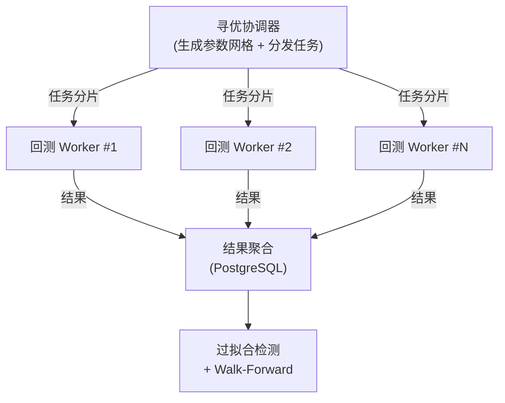

# 策略研究

> **声明**：本页面仅讨论策略的**工程实现范式**，不涉及具体策略参数、信号逻辑或实盘业绩。所有示例代码均为抽象框架示意，非生产代码。

我们在四类策略范式上积累了工程化落地经验。对每一类，下文关注的是「**如何让策略可工程化、可回测、可监控、可热更新**」，而非策略本身的 alpha 来源。

## 一、策略开发框架

### 统一抽象

四类策略差异显著，但工程层面共享相同的基础抽象。我们将策略定义为一组生命周期钩子：

```go
// 策略接口（示意，非生产代码）
type Strategy interface {
    // 初始化：加载参数、订阅品种、注册定时器
    OnInit(ctx StrategyContext) error

    // 事件处理：行情、成对、订单状态、定时器等
    OnEvent(ctx StrategyContext, event Event) error

    // 风控检查：在发单前由风控引擎调用
    OnRiskCheck(ctx StrategyContext, order Order) error

    // 优雅退出：平仓、保存状态、释放资源
    OnShutdown(ctx StrategyContext) error
}
```

这层抽象带来的核心收益：

- **同一套回测/实盘引擎** —— 策略代码在回测与实盘之间零改动切换
- **统一可观测性** —— 所有策略复用同一套日志、指标、追踪体系
- **热更新支持** —— 通过优雅退出 + 状态序列化实现策略不停机迭代

### 策略上下文

策略与引擎解耦的关键是 `StrategyContext`：

```go
type StrategyContext interface {
    // 行情
    Subscribe(symbols []string, dataType DataType)
    History(symbols []string, start, end time.Time) BarSeries

    // 交易
    PlaceOrder(order OrderRequest) (OrderID, error)
    CancelOrder(orderID OrderID) error
    Positions() []Position
    Account() Account

    // 风控
    SetRiskLimit(name string, limit RiskLimit)

    // 可观测性
    Logger() Logger
    Metrics() MetricsRecorder
    EmitCustomMetric(name string, value float64)
}
```

策略通过 context 与外部世界交互，引擎负责注入真实或模拟实现 —— 这是实现**回测/实盘同构**的关键。

## 二、四类策略范式

### 1. 趋势跟随

趋势策略的核心是「**识别方向 + 控制亏损**」。工程难点不在信号本身，而在于：

- **多周期数据同步** —— 日线信号触发后，需在分钟线精确择时进场
- **止损滑点模拟** —— 回测中假设止损价成交的误差，往往让回测与实盘南辕北辙
- **多品种仓位分配** —— 趋势系统通常跑几十到上百个品种，资金分配需要平衡分散度与集中度

我们的工程实践：

| 挑战 | 方案 |
|---|---|
| 多周期数据对齐 | 基于 Doris 的窗口函数预计算多周期 K 线，避免策略运行时重复聚合 |
| 止损模拟 | 回测引擎内置限价单 + 市价单 + 滑点模型，支持按 Tick 级回放 |
| 仓位分配 | 抽象为 `PositionSizer` 接口，支持等权、风险平价、Kelly 等多种分配器 |

### 2. 统计套利

套利策略的关键是「**识别均衡关系 + 监控偏离**」。工程挑战集中在：

- **协整关系的稳定性监控** —— 统计关系会失效，需要实时检测结构性断点
- **多腿订单的同时性** —— 配对交易的两腿下单时差可能让"无风险"套利变成单边暴露
- **高频数据下的计算性能** —— 滚动协整计算在 Tick 级数据上的吞吐压力

工程实践：

```go
// 配对状态机（示意）
type PairStrategy struct {
    legs     [2]string
    coint    CointegrationModel  // 协整模型
    state    PairState           // TRAINING / TRADING / BROKEN
    halfLife float64             // 均值回复半衰期
}

func (s *PairStrategy) OnEvent(ctx StrategyContext, e Event) error {
    switch e.Type {
    case TickEvent:
        spread := s.coint.Spread(e.Prices)
        zScore := s.coint.ZScore(spread)

        // 均值回复触发
        if zScore > s.entryThreshold && s.state == TRADING {
            s.openPair(ctx, SHORT_LEG_A, LONG_LEG_B)
        }

        // 结构性断点检测
        if s.coint.IsBroken(e.Time) {
            s.state = BROKEN
            s.closeAll(ctx)
            s.retrain(ctx)
        }
    }
    return nil
}
```

### 3. 做市策略

做市是所有策略类别中对**工程延迟**要求最高的。关键挑战：

- **订单簿不平衡的特征提取** —— 需要在 Tick 到达后微秒级完成特征计算
- **库存风险管理** —— 库存是做市商的主要风险源，需要动态调整报价偏移
- **撤单延迟** —— 被动单的撤单延迟直接影响风险敞口

工程实践：

| 挑战 | 方案 |
|---|---|
| 订单簿高频更新 | 事件分发采用零拷贝 + 内存池，避免 GC 压力 |
| 微秒级特征 | 关键路径用 Go 的 `sync/atomic` + 无锁环形缓冲 |
| 库存风控 | 独立风控 goroutine 监控库存，触发阈值自动收紧报价 |
| 撤单延迟 | 撤单指令走独立通道，与下单指令物理隔离 |

### 4. 机器学习

机器学习策略的工程挑战在于「**研究工作流与生产引擎的衔接**」：

- **训练 / 推理环境分离** —— Python 训练，Go 推理，模型通过 gRPC 或 ONNX 桥接
- **特征一致性** —— 训练特征与实盘特征必须一致，否则会产生 train-serving skew
- **模型版本管理** —— 模型的发布、灰度、回滚需要工程化机制

工程实践：

```
[Python 训练]                 [Go 推理]
  因子挖掘          gRPC         特征计算（与训练共享逻辑）
  模型训练      ◀─────────▶     模型推理
  Walk-Forward                   信号生成
  过拟合检验                     信号 → 订单
```

**关键工程决策**：特征工程逻辑用 Go 重新实现一份而非调用 Python，确保实盘推理零外部依赖、微秒级响应。这一决策的代价是：每次因子迭代都需要 Go/Python 双写，但我们用代码生成器大幅降低了维护成本。

## 三、回测框架

### 事件驱动 vs 向量化

我们采用**事件驱动**作为核心回测引擎，理由是：

| 维度 | 向量化回测 | 事件驱动回测 |
|---|---|---|
| 速度 | 快（矩阵运算） | 慢（逐事件分发） |
| 拟真度 | 低（难模拟订单簿） | 高（逐 Tick 回放） |
| 实盘一致性 | 差 | 高（与实盘共享引擎） |
| 适用场景 | 快速原型、因子检验 | 最终验证、实盘前回测 |

研究阶段允许向量化快速筛选，最终验证必须走事件驱动。

### 分布式参数寻优

单策略的参数寻优天然是 **Embarrassingly Parallel** —— 不同参数组合之间无依赖。我们的分布式寻优架构：



工程要点：

- **任务幂等** —— 每个 (策略ID, 参数组合, 数据范围) 三元组唯一标识一个回测任务，worker 崩溃后可由协调器重新分派
- **结果流式回传** —— 不等回测完成，每个 Tick 的资金曲线增量流式写入 Doris，便于实时监控寻优进度
- **资源隔离** —— 每个 worker 限制内存与 CPU 配额，避免单个大参数任务拖垮集群

### 过拟合防护

参数寻优最大的陷阱是过拟合。我们的防护机制：

- **Walk-Forward 检验** —— 滚动训练/测试，拒绝只在特定区间有效的参数
- **蒙特卡洛置换检验** —— 打乱信号时序，评估策略收益是否显著区别于随机
- **参数稳定性曲面** —— 最优参数附近的收益曲面应平滑，尖锐的最优通常是过拟合
- **样本外冻结** —— 保留一段时间的数据完全不参与寻优，仅在最终验证时解冻

## 四、实盘对接

### 券商/交易所抽象

不同市场的对接 API 差异巨大，但工程层面可以抽象为统一接口：

```go
type Broker interface {
    // 行情
    Subscribe(symbols []string, types []DataType) (<-chan MarketData, error)

    // 交易
    PlaceOrder(req OrderRequest) (*Order, error)
    CancelOrder(orderID OrderID) error
    QueryPosition() ([]Position, error)
    QueryAccount() (*Account, error)

    // 生命周期
    Connect() error
    Close() error
}
```

各市场的具体实现：

| 市场 | 对接方式 | 工程难点 |
|---|---|---|
| A股 | 券商 REST + TCP 推送 | 涨跌停限制、T+1 结算、集合竞价 |
| 港股 | FIX 协议 / 券商 SDK | 外汇结算、跨市场信息延迟 |
| 美股 | 券商 REST + WebSocket | 盘前盘后流动性、REG NMS |
| 期货 | CTP API（C++ FFI） | CTP 的 C++ 回调模型与 Go 的桥接 |
| 加密货币 | 交易所 REST + WebSocket | 限频、重连、数据乱序 |

### CTP 桥接案例

CTP 是中国期货市场的标准对接 API，基于 C++ 回调模型。在 Go 中通过 cgo 桥接的工程要点：

- **回调线程安全** —— CTP 的回调在 C++ 线程触发，必须通过 channel 传递到 Go 的 goroutine
- **连接保持** —— CTP 的前置机断线重连机制需要封装为对上层透明的自动重连
- **流控** —— CTP 对查询类接口有严格流控，需要在 Broker 实现层做请求合并与限速

### 智能订单路由

对于多市场套利或大型订单，直接市价下单会产生严重冲击。订单路由模块负责：

- **拆单算法** —— TWAP / VWAP / 冰山订单 / 执行落差（IS）最小化
- **路由选择** —— 跨市场（如美股多交易所）选择最优成交 venue
- **冲击成本控制** —— 实时监控订单簿深度，动态调整每笔子单规模

## 五、风险管理

### 实时风控引擎

风控是量化系统的生命线。我们将风控引擎作为独立模块，在订单发出前强制执行检查：

```go
type RiskEngine interface {
    PreTradeCheck(order Order, positions []Position, account Account) error
    PostTradeUpdate(fill Fill)
    StartMonitoring()   // 启动定时巡检
}
```

核心风控规则：

| 规则 | 说明 |
|---|---|
| 单品种持仓上限 | 防止过度集中 |
| 全局资金占用上限 | 防止过度杠杆 |
| 单笔下单数量上限 | 防止胖手指 |
| 日内亏损熔断 | 达到阈值后停止所有策略 |
| 最大回撤熔断 | 累计回撤触发全面平仓 |
| 订单频率限制 | 防止策略 bug 导致刷单 |

### 熔断机制

熔断采用三级触发：

1. **策略级熔断** —— 单策略回撤超阈值，暂停该策略
2. **品种级熔断** —— 单品种亏损超限，停止所有涉及该品种的策略
3. **账户级熔断** —— 全账户回撤超限，停止所有策略、平掉所有仓位

所有熔断状态持久化到 PostgreSQL，重启后不重置 —— 防止通过重启绕过风控。

## 六、可观测性

量化系统的可观测性不同于一般 Web 服务，核心指标集中在：

- **策略层** —— 资金曲线、回撤、夏普比率、胜率、盈亏比
- **执行层** —— 下单延迟、成对延迟、撤单延迟、滑点分布
- **系统层** —— 事件分发延迟、GC 暂停、goroutine 数、内存占用

所有指标通过 Prometheus 采集，Grafana 可视化。策略收益曲线通过独立的 Vue3 + ECharts 仪表盘展示，支持实时更新。

---

- 返回 [GoWind Quant 首页](/quant/intro.md)
- 深入了解 [技术架构](/quant/architecture.md)
