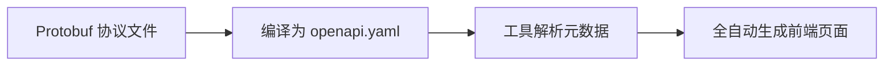

# 前端代码生成

GoWind Toolkit 前端代码生成器基于 OpenAPI 元数据，**全自动**生成完整的中后台管理页面代码，支持 Vue3 (Element Plus / Vben Admin) 和 React (Ant Design Pro) 三套主流模板。

## 核心运行原理

与常规前端代码生成器不同，GoWind Toolkit **不支持手动精细化配置字段与页面功能**，一切页面结构全部由 OpenAPI 元数据自动推导：



**核心理念**：后端定义一切，前端直接消费。

- 后端基于 Protobuf 定义接口、字段类型、入参出参
- 工具自动将 Protobuf 编译为标准 OpenAPI 描述文件
- 前端直接读取 OpenAPI 内置元数据，自动分配表格列、搜索项、表单字段

**核心优势**：全程无需前端手动配置，规避人为配置出错，前后端结构 100% 一致。

## 三套官方内置模板

| 模板                     | 技术栈                           | 适用场景                   |
|------------------------|----------------------------------|--------------------------|
| Vue3 + Element Plus     | Vue Query、ElTable、ElDrawer     | 个人开发、小型后台、初创项目 |
| Vue3 + Vben Admin       | VxeGrid、useVbenDrawer           | 大型复杂系统、企业级首选   |
| React + Ant Design Pro  | React Query、ProTable、DrawerForm | React 技术栈团队         |

### 生成内容对比

每套模板都会生成以下完整代码：

| 生成内容       | Vue3 Element Plus | Vue3 Vben Admin | React Ant Design |
|------------|:-----------------:|:---------------:|:----------------:|
| API 调用层  | ✅                | ✅              | ✅               |
| Query Hooks | ✅ (Vue Query)    | ✅ (Vue Query)  | ✅ (React Query) |
| 列表页      | ✅ (ElTable)      | ✅ (VxeGrid)    | ✅ (ProTable)    |
| 编辑抽屉    | ✅ (ElDrawer)     | ✅ (VbenDrawer) | ✅ (DrawerForm)  |
| 路由配置    | ✅                | ✅              | ✅               |
| i18n 国际化 | ✅                | ✅              | ✅               |

## 前置准备

1. 安装最新版 GoWind Toolkit 桌面客户端
2. 拥有完整 Go 后端项目，并通过 Protobuf 成功导出 **openapi.yaml**
3. 本地安装 Node.js，用于启动和调试生成后的前端工程

::: tip
前端代码生成仅在**桌面客户端**中提供，CLI 不支持。
:::

## 实操流程

### 进入前端代码生成模块


打开客户端，左侧侧边栏点击 **【前端代码生成】**，进入操作面板。

### 载入 OpenAPI 数据源


1. 在页面顶部 OpenAPI 数据源区域，点击导入按钮
2. 选中后端编译完成的 `openapi.yaml` 文件
3. 导入成功后，工具自动解析全部接口、结构体、字段属性

::: warning
工具不支持直连数据库生成前端代码，所有页面全部依赖 OpenAPI 元数据。
:::

### 选择前端模板

在模板下拉菜单内，根据团队技术栈直接选择：Vue3 Element Plus / Vue3 Vben Admin / React Ant Design。

### 填写项目信息

仅需填写输出目录，指定前端工程保存文件夹。路径**禁止**中文、空格、特殊符号。

### 预览生成代码

工具支持预览将要生成的所有代码文件：

**React + Ant Design 页面：**


**Vue3 + Element Plus 页面：**


**Vue3 + Vben Admin 页面：**


**API 调用层：**


**Query Hooks：**


**i18n 国际化：**


### 一键生成代码

确认模板、输出目录无误后，直接点击 **【生成代码】**。等待约 2 秒，自动生成完整前端工程。

生成内容包含：
- 路由配置和侧边栏菜单
- API 请求调用层
- 全套 CRUD 页面（列表、搜索、新增、编辑、删除、导出）
- i18n 国际化文件

## 启动前端项目

进入生成的前端项目根目录，执行：

```bash
# 安装依赖
pnpm install
```

然后根据选择的模板启动：

```bash
# React 版本
cd frontend/admin/react
pnpm dev

# Vue3 Element Plus 版本
cd frontend/admin/vue-element
pnpm dev

# Vue3 Vben Admin 版本
cd frontend/admin/vue-vben
pnpm dev:antd
```

项目启动成功后，所有页面、菜单、搜索条件、弹窗表单、新增/删除/导出功能全部开箱即用，接口自动对接后端 BFF 服务。

## 常见问题

| 问题                  | 解决方案                                          |
|---------------------|-------------------------------------------------|
| 导入 OpenAPI 失败    | 检查 yaml 文件是否损坏，确认后端 Protobuf 已正常编译 |
| 需要调整页面字段      | 去后端修改 Protobuf，重新生成 OpenAPI 即可         |
| 代码生成失败         | 更换纯英文输出路径                                |
| 接口 404             | 修改前端环境配置，指向后端 BFF 服务地址            |
| 依赖安装失败         | 切换镜像源，清除 npm 缓存后重新安装                |

---

**相关文档**：

- [GoWind Toolkit 介绍](/toolkit/intro.md)
- [后端代码生成](/toolkit/backend-code-generation.md)
