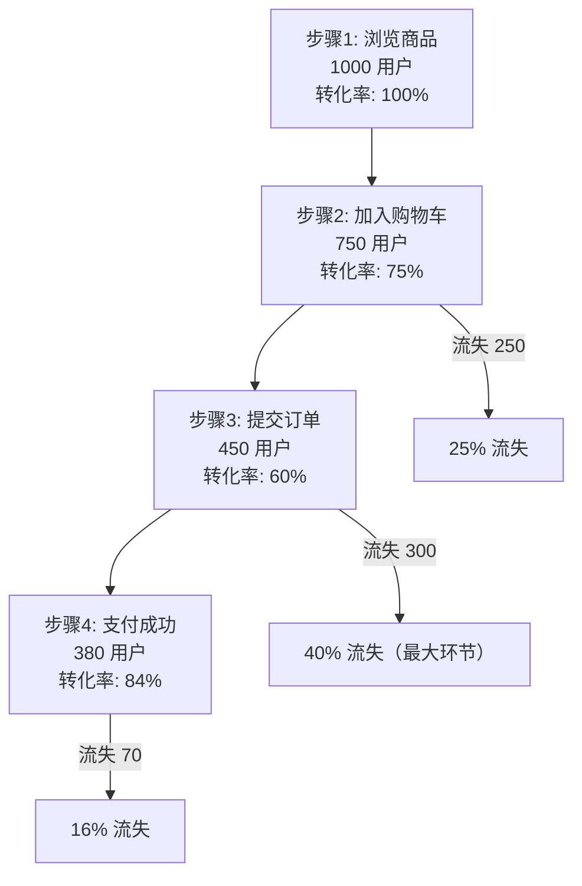

# 漏斗分析

漏斗分析用于衡量用户在关键转化路径中各步骤的**转化率**与**流失率**，是电商、注册、支付等场景的核心分析模型。对应后端 `AnalyticsService.Funnel`。

---

## 一、它能回答什么问题

- 从「浏览商品」到「支付成功」，整体转化率是多少？
- 哪一步流失最严重？
- 不同时间窗口（30 分钟 vs 24 小时）下，转化率差异如何？

---

## 二、漏斗原理



### 关键指标

| 指标 | 含义 |
|------|------|
| 步骤用户数 | 该步骤的唯一用户数（`count(DISTINCT user_id)`） |
| 步骤转化率 | 当前步骤用户数 / 上一步骤用户数 |
| 总体转化率 | 最终步骤用户数 / 第一步骤用户数 |
| 流失率 | 1 − 步骤转化率 |

---

## 三、后端接口

### gRPC：`AnalyticsService.Funnel`

| 字段 | 类型 | 说明 |
|------|------|------|
| `time_range` | `TimeRange` | 分析时间范围 |
| `steps` | `repeated string` | **≥2**，有序事件名，如 `["view_product", "add_to_cart", "submit_order", "payment_success"]` |
| `app_id` | uint32（可选） | 按应用过滤 |
| `window_ms` | int64（可选） | 完成漏斗的时间窗口，默认 **30 分钟** |

响应 `FunnelResponse`：`steps[]`（每个 `FunnelStep` 含 `step_index` / `event_name` / `count` / `conversion_rate` / `overall_rate`）、`completed_users` / `entered_users` / `overall_conversion`。

### HTTP（admin 转发）

```http
POST /admin/v1/analytics/funnel
Content-Type: application/json

{
  "timeRange": { "startMs": 1718169600000, "endMs": 1718774399000 },
  "steps": ["view_product", "add_to_cart", "submit_order", "payment_success"],
  "windowMs": 1800000
}
```

> 后端会校验 `steps` 数量 ≥2，否则返回 `ErrorBadRequest`。

---

## 四、SQL 原理

漏斗核心是「在限定时间窗口内，按用户找连续完成各步骤的最大进度」。

### Doris 实现（近似：按步骤统计唯一用户）

后端 Doris 实现对每个步骤独立统计 `count(DISTINCT user_id)`，再计算相邻步骤的转化率：

```sql
SELECT event_name, count(DISTINCT user_id) AS user_count
FROM events_fact
WHERE event_time BETWEEN :start AND :end
  AND event_name IN ('view_product','add_to_cart','submit_order','payment_success')
GROUP BY event_name;
```

然后在应用层按 `steps` 顺序计算 `conversion_rate`（本步/上步）与 `overall_rate`（本步/首步）。

### ClickHouse 实现（windowFunnel）

ClickHouse 有原生的 `windowFunnel` 函数，可在窗口内严格判断连续步骤：

```sql
WITH funnel_steps AS (
    SELECT
        user_id,
        windowFunnel(1800)(   -- 30 分钟窗口（秒）
            event_ts,
            event_name = 'view_product',
            event_name = 'add_to_cart',
            event_name = 'submit_order',
            event_name = 'payment_success'
        ) AS step_reached
    FROM events_fact
    WHERE event_ts BETWEEN :start_ms AND :end_ms
      AND event_name IN ('view_product','add_to_cart','submit_order','payment_success')
    GROUP BY user_id
)
SELECT
    step_reached,
    count() AS user_count
FROM funnel_steps
GROUP BY step_reached
ORDER BY step_reached;
```

`step_reached = N` 表示该用户连续完成了 N 个步骤。由此可算出每步的留存与转化。

> 当前后端 `analytics_repo.go` 的 Funnel 实现是按步骤独立统计 `count(DISTINCT user_id)`（非严格窗口连续）。需要严格窗口漏斗时，可在 ClickHouse 上用 `windowFunnel` 自行查询。方言差异见 [OLAP 查询手册](./analyst-olap-cookbook.md)。

---

## 五、典型场景

### 电商购买转化漏斗

步骤：`view_product → add_to_cart → submit_order → payment_success`，窗口 30 分钟。找出流失最大的环节（通常是「加购→下单」），针对性优化。

### 新用户注册转化漏斗

步骤：`open_app → view_signup → submit_signup → signup_success`，窗口可放宽到 24 小时（`windowMs = 86400000`）。

### 内容消费漏斗

步骤：`page_view → read_article → share → comment`，衡量内容粘性与互动转化。

---

## 六、注意事项

- **步骤必须 ≥2**，否则接口报错。
- **窗口默认 30 分钟**：长流程（注册、金融）建议调大 `window_ms`。
- **转化率定义**：当前实现按步骤独立统计唯一用户，未做严格「同一用户在窗口内连续完成」的约束。若需严格漏斗，用 ClickHouse `windowFunnel`。
- **跨天漏斗**：用户可能在第一天完成步骤 1、第二天完成步骤 2——只要在 `window_ms` 内即可，注意 `time_range` 要覆盖整个可能跨度。
- **空数据/转化率为 0**：先确认事件已落库（见 [上手指南 · 数据落库现状](./analyst-getting-started.md)）。

---

## 七、相关文档

- [数据分析师上手指南](./analyst-getting-started.md)
- [事件趋势分析](./analyst-event-trend.md)
- [留存分析](./analyst-retention.md)
- [OLAP 查询手册](./analyst-olap-cookbook.md)
- [后端 API 契约](./backend-api.md)
